Petrichor 北京时间 2023-09-14T18:36:37Z 1702270119542415742 邓小平在地图上画个圈，出了一个深圳，那是在国际上对华友好以及港台对中共报以改革开放的信心的氛围里的。

习近平东施效颦，在地图也上画个圈，烂尾了，因为不符合经济规律，误以为举国之力就可以办大事，其实干的不是好事而是坏事、蠢事。现在对华的国际形势是什么样子？习近平心里没数？大国外交和为国际指明方向，还有人信吗？港台人伤透了心。北京无人愿意搬去雄安。一下暴雨就得保雄安而泄洪涿州廊坊等地，民怨沸腾。

蠢政猛于虎，吃人的。 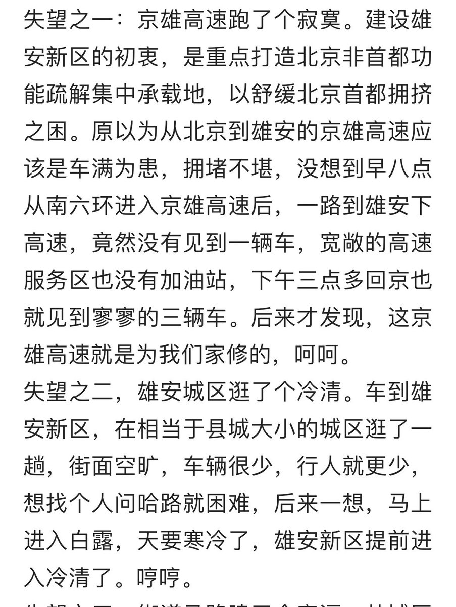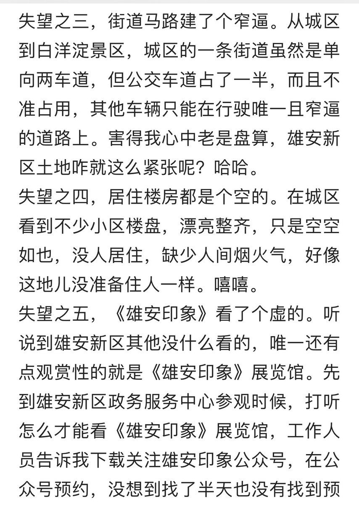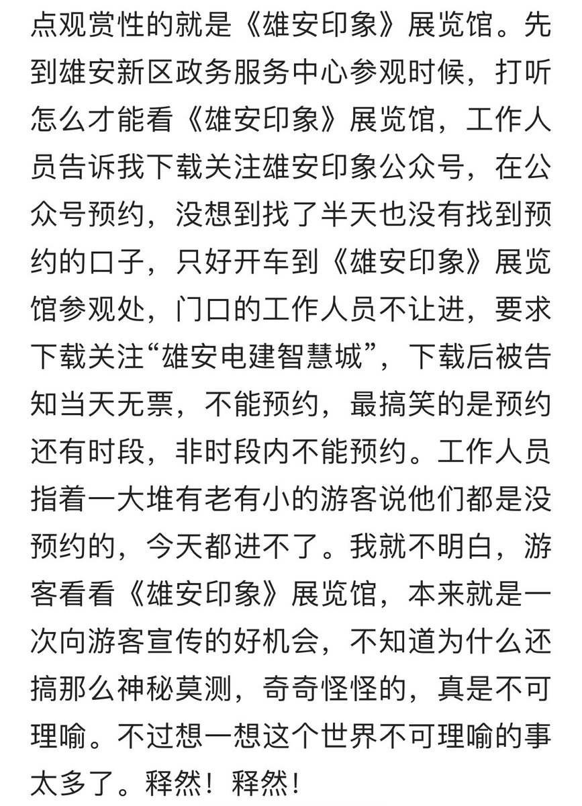  Petrichor 北京时间 2023-09-14T08:38:57Z 1702119711310266667 独裁者总是想捂住人民的眼睛和耳朵，不让他们知道事实和真相，任凭他们吹牛撒谎，愚昧人民，便于统治。因为凭借他们真实的人品才华，他们没有任何吸引力，得不到人民的尊重和拥护。 https://t.co/JBPp1h0yiP 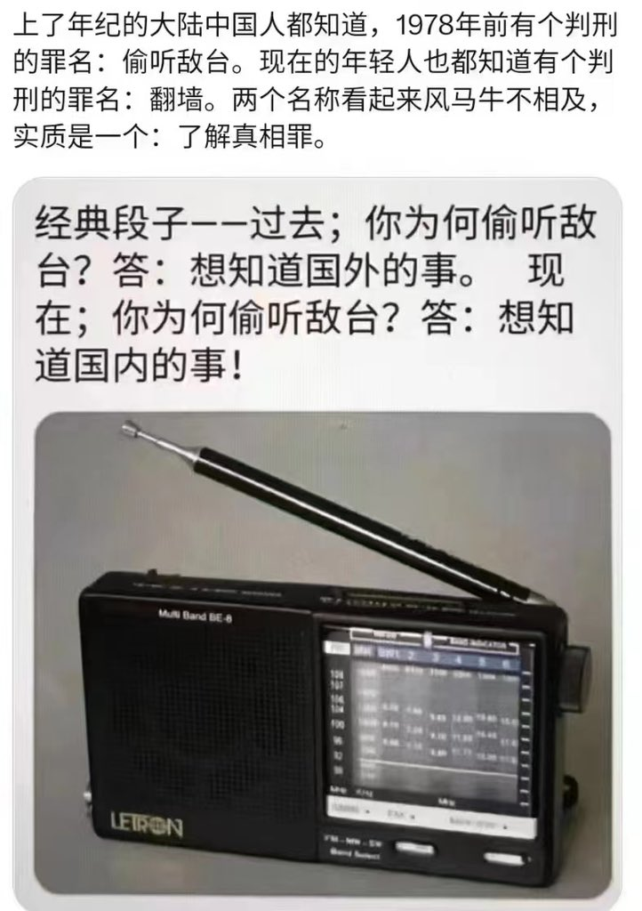  Petrichor 北京时间 2023-09-14T08:43:28Z 1702120848717410541 武大郎养猫头鹰，什么人养什么鸟。独裁者，因为被世界孤立，他们彼此惺惺相惜，相互利用。 https://t.co/7J0isvmZnP 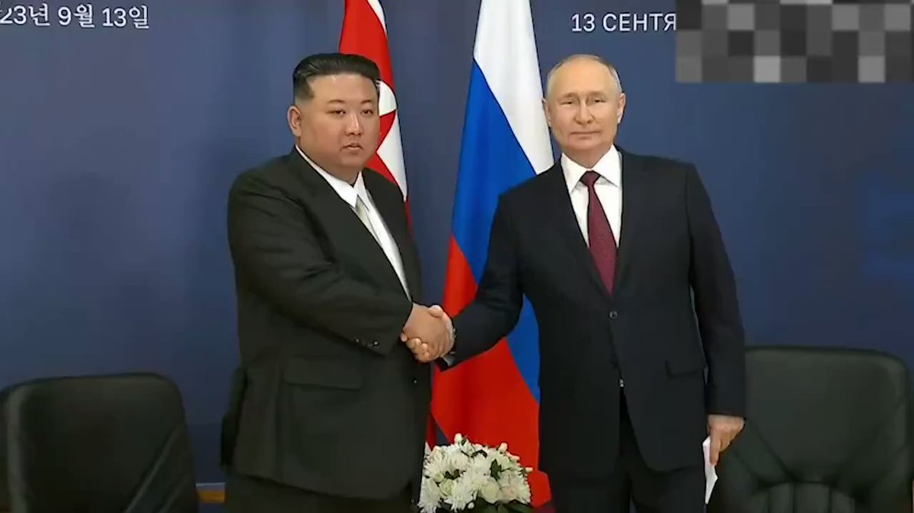  Petrichor 北京时间 2023-09-14T05:30:41Z 1702072332255203560 医院病房和中国官场，有一样事情不一样，见图。 https://t.co/zfC9Md08Qq 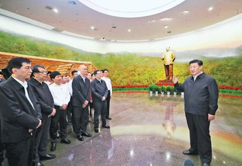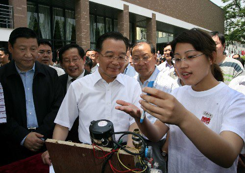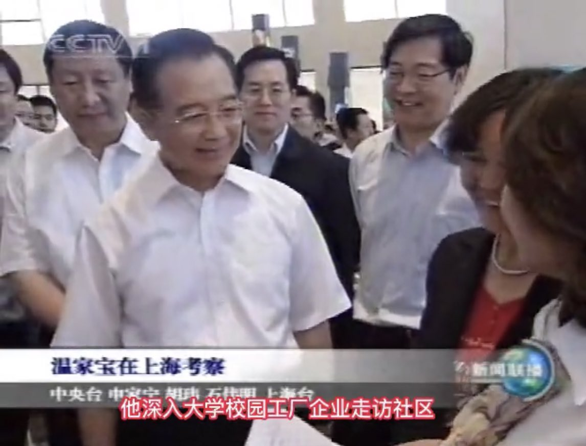  Petrichor 北京时间 2023-09-14T06:01:10Z 1702080003540672771 要说振兴东北，干得最好的还是日本人。日本人统治东北时期，1942年，东北三省城市化率达到23.8%，比1990年中国城市化率高4.84个百分点。根据满洲国政府和中华民国政府的统计数据合计，至1943年秋季，东北三省依靠占中国12%的土地和10%的人口，生产了占中国93%的钢材、66%的水泥、69%的化工品、95%的机械、78%的电力。

1928年，哈尔滨就已经开始出售直接前往欧洲各国的火车票与飞机票，当年，哈尔滨已有外国商业机构1809家，巴黎、纽约均开设与哈尔滨的直接商业往来。1932年，包括德意志银行、巴黎银行、瑞士银行、巴莱克银行、花旗银行、美国银行、摩根大通银行在内的34家外国金融企业在东北三省设立分支机构。1938年，长春开始建设2条地铁线路、7条轻轨线路以及环城高速公路，根据当年统计，即使在大规模征地用于城建的时期，长春人均占有绿地依然达到2272平方米，是华盛顿的2倍、东京的15倍。

1945年，东北三省拥有铁路15479公里，而中华民国全国在1949年拥有铁路才不过22000公里。 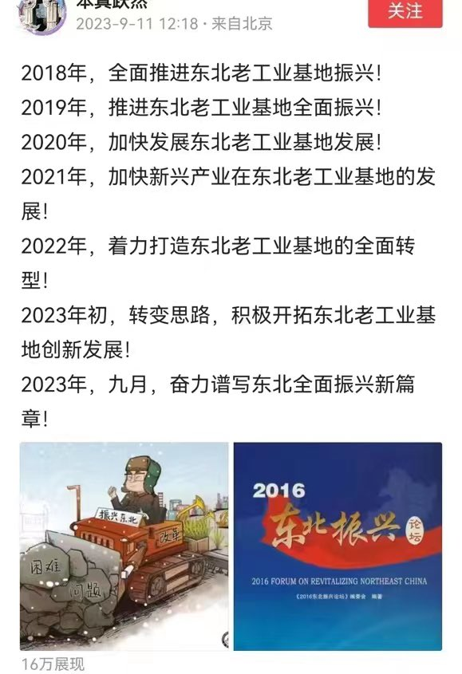  Petrichor 北京时间 2023-09-14T00:05:57Z 1701990611014897774 中纪委怒批中国高校四大官僚主义：
官气十足，衙门做派
门户林立，近亲繁殖
不务正业，攀附结交
好高骛远，贪图虚名。

是中纪委而不是教育部，难道教育部没有意识到中国高校存在的问题吗？985或211高校的领导不都是教育部任命的吗？门户林立，不都是高校院士和实权人物搞的吗？虚名不都是评奖和评院士弄出来的吗？不攀附结交，不搞权学交易，如何得资金、得名得利？一切都是制度使然，问题出在总根子上。只要国家有了民主选举和合理的法治制度，其他事情自然就会理顺。 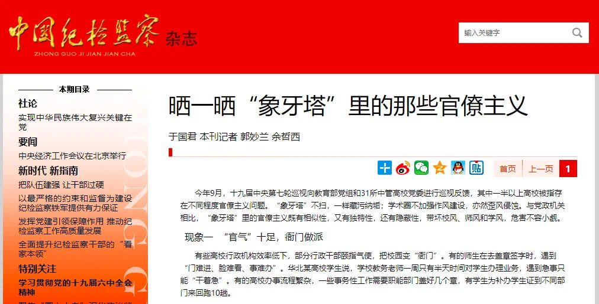  Petrichor 北京时间 2023-09-14T01:59:11Z 1702019103953711489 中国足协官员人数：正处职30个，副处职90个，正科职300个，副科职1000个，足协当官的比全国职业踢球的人都多！太庞大了，加上工作人员、后勤、临时工、保洁人员应该过万了！一个连国内联赛都要混不下去的项目需要这么庞大臃肿的机构来管理吗？散了吧，要成绩没有，花钱第一名，还有保留下来的必要吗？
其实，臃肿的机构只要中国足球协会吗？太多了，中国共产党就没有必要。 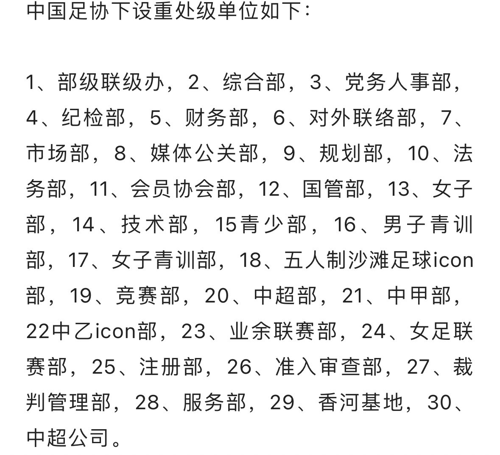  Petrichor 北京时间 2023-09-14T00:18:47Z 1701993840456892704 光看到狗吃肉，没有看见狗挨打。只看他们在台时的风光、不见他们落难时的悲伤。

周永康家，出事的时候连孙子在幼儿园都没人接。

第一任总书记独秀陈，女 儿在60年代绑一油桶，漂流到香港，居美而终。

20大上众目睽睽之下胡锦涛被架离会场。   