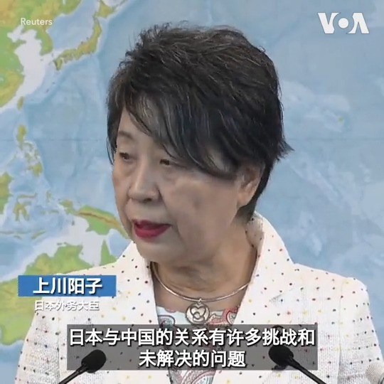
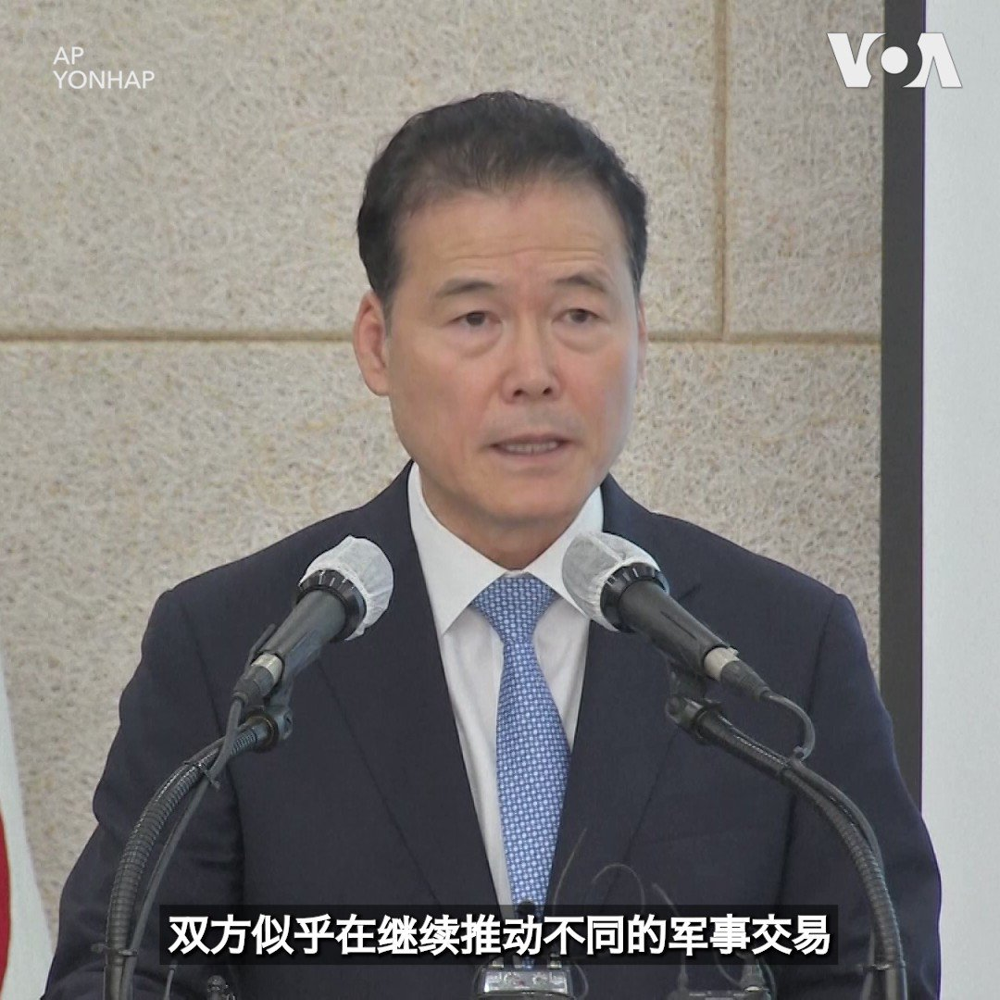
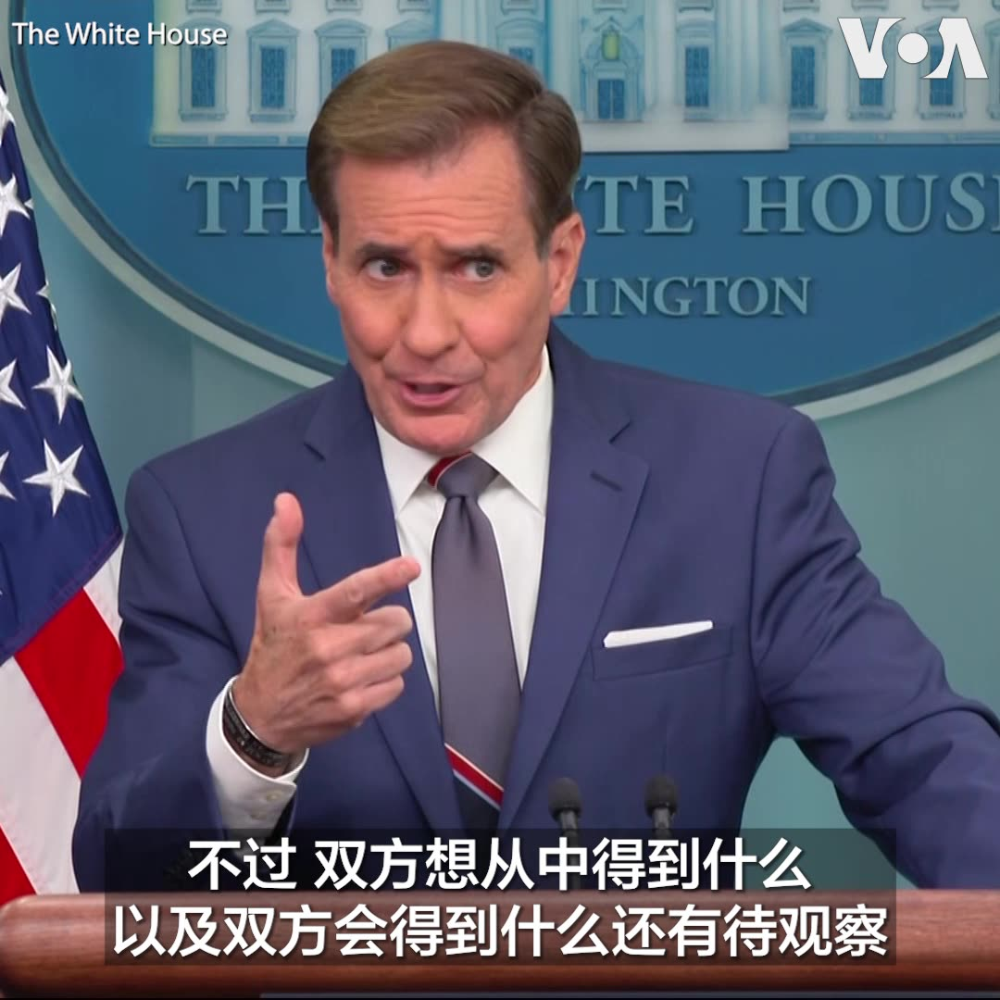
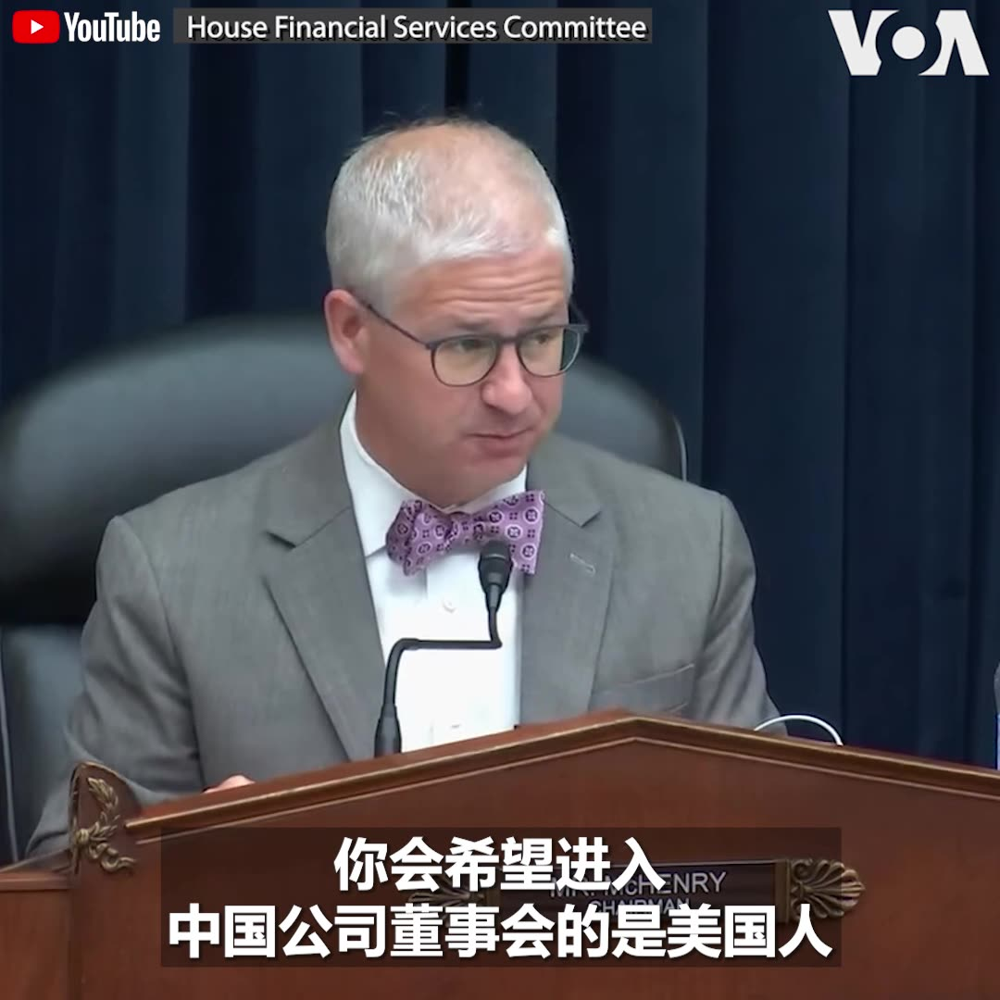
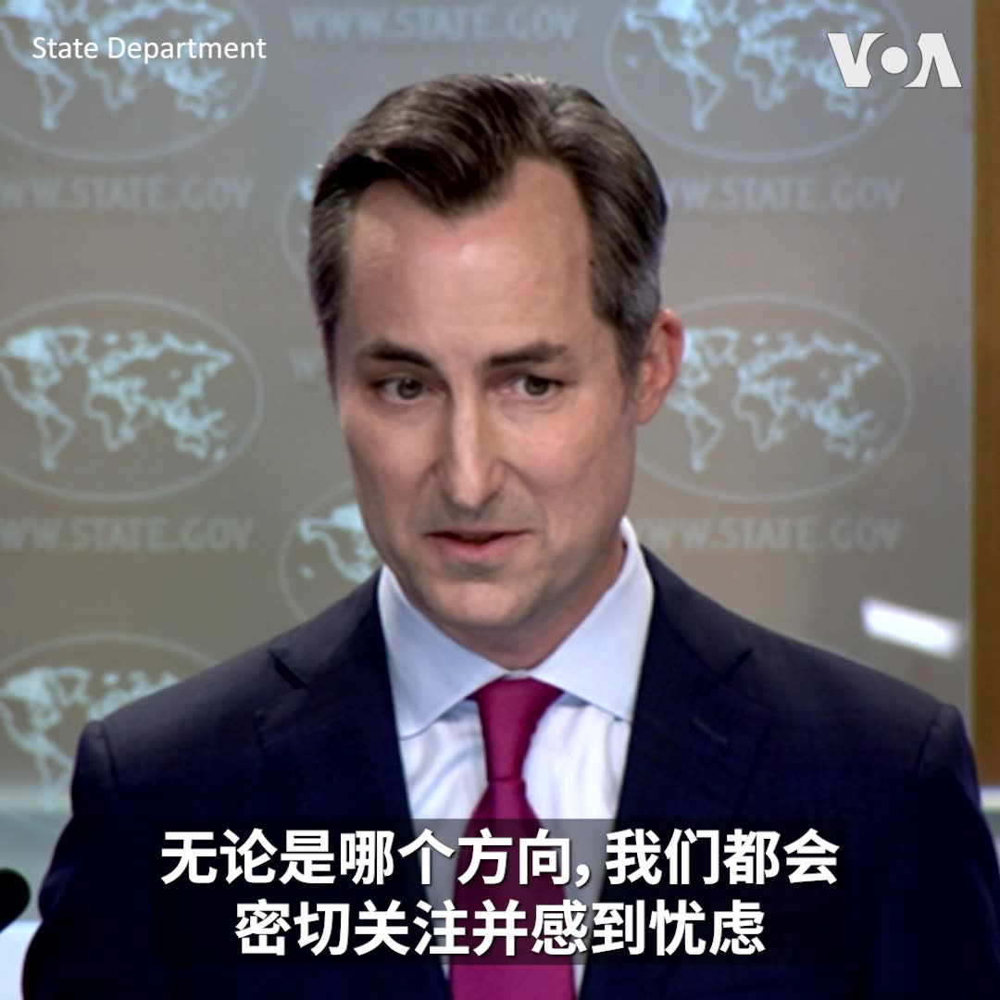
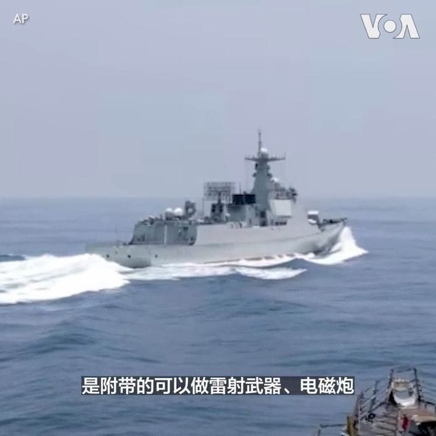
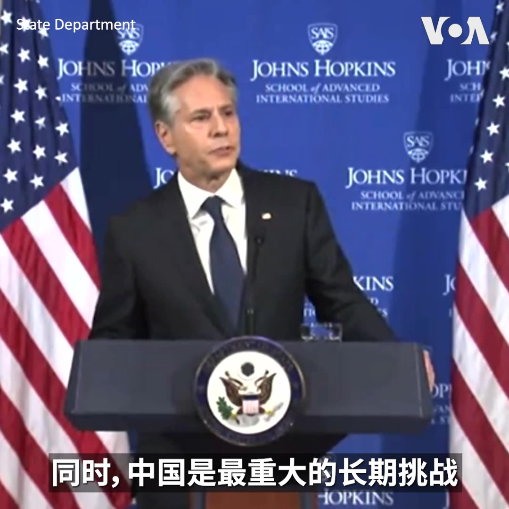
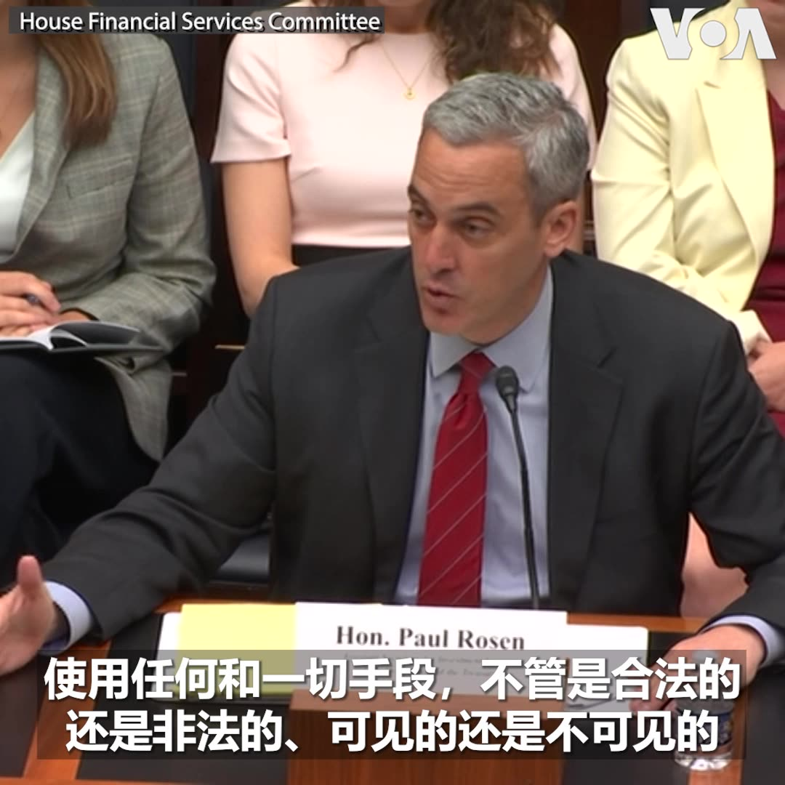
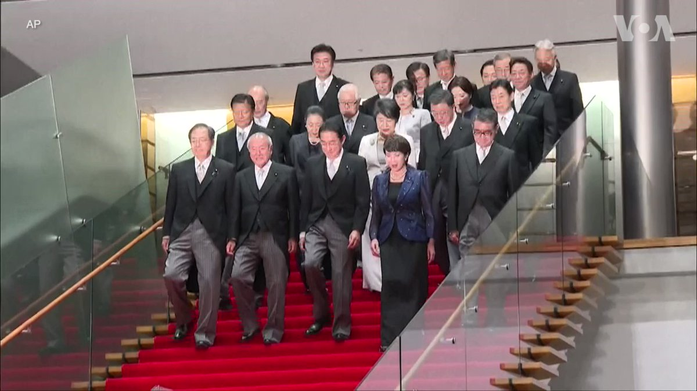
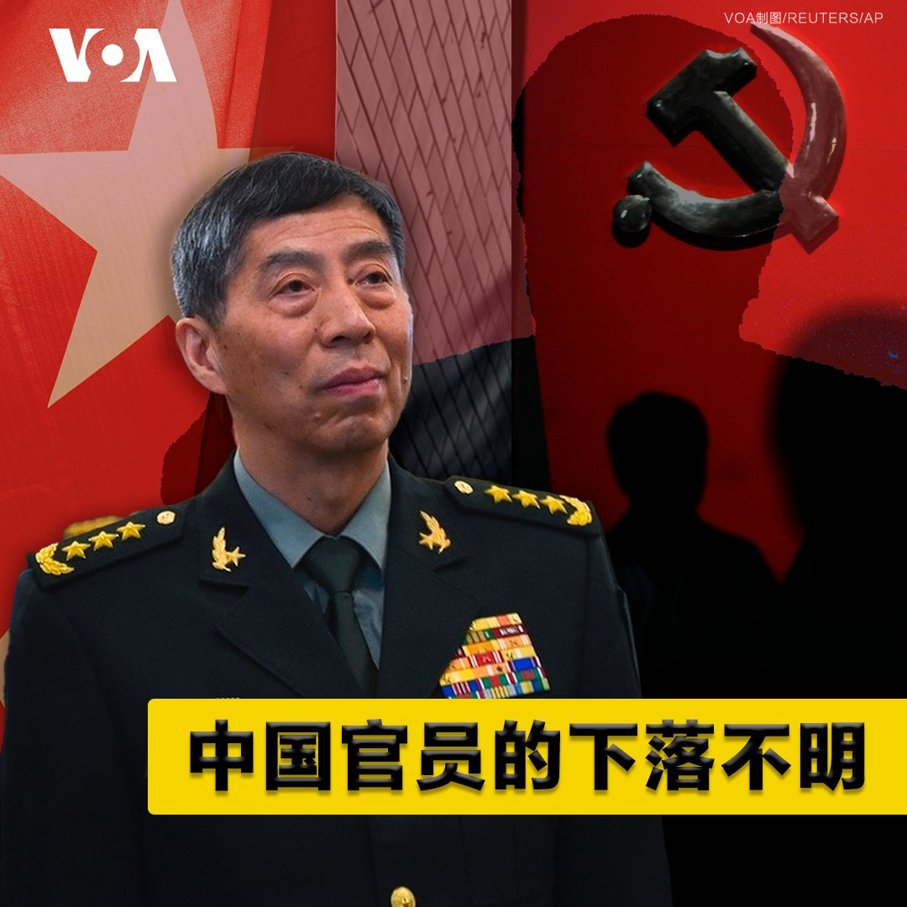

美国之音中文网 北京时间 2023-09-14T21:11:29Z 1702309090838430054 2023年台北国际航太暨国防工业展（TADTE）9月14日拉开帷幕。共有来自10个国家的300多家企业、学术机构和政府单位参展。此次展览以转型、创新、结盟为主题，旨在展现台湾航太及国防产业实力。台湾自主研发的无人机和导弹系统也参加了本次展览。 https://t.co/2UXmZAu5Z4   美国之音中文网 北京时间 2023-09-14T22:21:52Z 1702326803766083824 日本新外务大臣上川阳子14日在她上任后的首次记者会上表示日本将敦促中国采取负责任的行动，同时要保持对话，解决双方共同面对的问题。 https://t.co/31HTGctazQ   美国之音中文网 北京时间 2023-09-14T22:38:10Z 1702330908257530108 英国政府指责：中国针对敏感职位的英国人实施“猎头”行动套取情报 https://t.co/oN5GPet0gI   美国之音中文网 北京时间 2023-09-14T22:57:34Z 1702335787541684540 教宗特使祖皮访华聚焦乌克兰，分析人士认为不会谈到主教任命问题 https://t.co/EZcynPp6Je   美国之音中文网 北京时间 2023-09-14T21:08:13Z 1702308270164357615 韩国统一部部长金英浩14日呼吁俄罗斯与朝鲜不要进行军事交易与合作。 金英浩还表示朝鲜的核武器发展只会引发韩国、美国与日本更强烈的反应。 https://t.co/l2MnsmfQOy   美国之音中文网 北京时间 2023-09-14T21:28:36Z 1702313399361921346 台湾拒绝北京的闽台融合发展计划 称其为吸纳台湾资金的单边政治操作 https://t.co/OEy0hMgzTH   美国之音中文网 北京时间 2023-09-14T21:28:38Z 1702313407339487645 拜登总统星期四将就美国经济发表讲话 https://t.co/8YuSn3XjdK   美国之音中文网 北京时间 2023-09-14T22:10:15Z 1702323879753212410 普京、金正恩“兄弟”情深，令中国赔上现实地缘政治利益？https://t.co/FcPozIIyWC   美国之音中文网 北京时间 2023-09-14T22:35:08Z 1702330141895246302 亚洲最大的金融服务集团之一，总部位于新加坡的星展集团（DBS）首席执行官高博德（PIYUSH GUPTA又译：皮尤什·古普塔）9月14日说，市场对中国经济的悲观情绪并非“过度反应”。高博德说，中国经济目前面临诸多逆风因素，其地产业的库存过剩很难在短期内消化。 https://t.co/Z0kLuIn337   美国之音中文网 北京时间 2023-09-14T23:11:04Z 1702339185611616698 中国央行再降存款准备金率，以期提振疲软经济 https://t.co/GkO6n7XEqa   美国之音中文网 北京时间 2023-09-14T17:08:05Z 1702247839844483173 培训中国飞行员事件后 澳大利亚出台新法规加强禁止训练“某些外国军队” https://t.co/Lox6ZLux42   美国之音中文网 北京时间 2023-09-14T17:26:34Z 1702252491545641097 日本首相任命新外交与国防大臣 如何处理中国关系受注目 https://t.co/fEfOnEP9A3   美国之音中文网 北京时间 2023-09-14T19:26:35Z 1702282693327941648 普京、金正恩“兄弟”情深，令中国陪上现实地缘政治利益？ https://t.co/kq4R56jQjx   美国之音中文网 北京时间 2023-09-14T17:56:06Z 1702259920937320537 金正恩邀请普京到平壤访问 引发美国担忧 https://t.co/jIhlxzLRuk   美国之音中文网 北京时间 2023-09-14T12:42:33Z 1702181015362637971 美越关系升级之际 中国称愿与越南深化政治安全关系 https://t.co/UQ64hUOKNh   美国之音中文网 北京时间 2023-09-14T15:36:05Z 1702224683494707705 中共军机大举逾越海峡中线及延伸线 本周超过百架抵近扰台 https://t.co/Z0ieHgFrNs   美国之音中文网 北京时间 2023-09-14T12:56:04Z 1702184417241039355 郭台铭宣布竞选搭档 演员赖佩霞曾饰演蔡英文化身 https://t.co/xV1y0oRS2E   美国之音中文网 北京时间 2023-09-14T09:00:00Z 1702125006619042111 【家事国事天下事，你有何见解】中国国防部长李尚福两周没有公开露面。外国记者询问，外交部发言人11日表示不解并拒绝说明李尚福的下落。近来如此失踪的中国高官还有前外长秦刚，前火箭军司令员李玉超及政委徐忠波，他们都是下落不明，罪名不明，健康状况不明。中国高层官员近来频频下落不明应做何解？ https://t.co/XRLMuEnh7w   美国之音中文网 北京时间 2023-09-14T09:42:07Z 1702135605097054621 专家：美中角力背景下 泰国新政府寻求保持平衡 https://t.co/yWQRAh6BTI   美国之音中文网 北京时间 2023-09-14T07:00:00Z 1702094809287033000 为了给杭州亚运会制造热度，《人民日报》在官微上竟然登出南宋古诗《题临安邸》，殊不知这首诗是揭露南宋统治者腐败无能。喉舌文化功底差，还是低级红高级黑？高歌《喀秋莎》是“战地玫瑰”还是道德沦丧？小粉红周小平胡锡进互骂，帮忙还是拆台？请看9月14号的【时事大家谈】并留言。 https://t.co/0LgCyHRlik   美国之音中文网 北京时间 2023-09-14T07:54:49Z 1702108603736355283 “世界上任何国家，任何人都不应帮助普京杀害无辜的乌克兰人民，”白宫国安会战略沟通协调员科比(John Kirby)9月13日在白宫例行简报会上谈到朝鲜与俄罗斯可能达成的武器交易时说。他说，朝俄能从对方得到什么有待观察，“他们对彼此没有那么多信任与信心，”科比说。 https://t.co/oDwPXlXrsN   美国之音中文网 北京时间 2023-09-14T08:32:00Z 1702117960247324736 #美中对标 最近中国大学生、研究生纷纷涌入外卖行业，让外卖业竞争更激烈，工资水平下降，工作强度却正在提高。与此相对，在美国外卖小哥的工资水平和待遇又如何？完整版戳：https://t.co/iUGHbti8ju https://t.co/eld7FwtCQS   美国之音中文网 北京时间 2023-09-14T09:24:03Z 1702131060614877562 中共被指恐惧彭立发影响力 妻女据信禁锢齐齐哈尔乡下老家 https://t.co/54dwthW4pN   美国之音中文网 北京时间 2023-09-14T10:14:08Z 1702143662120153154 参议员罗姆尼宣布不再竞选连任 https://t.co/dSMOJqbjkT   美国之音中文网 北京时间 2023-09-14T04:55:10Z 1702063394285601056 “为了在竞争中战胜中国，我们不能变得更像中国共产党，”美众议院金融服务委员会主席麦克亨利周三在一个对美国外国投资委员会(CFIUS)进行监管的听证会上说。他反对拜登政府赋予CFIUS审查美国对外投资的提议。但资深民主党成员沃特斯认为，美国民众需要知道他们的辛苦钱是否在支持中国。 https://t.co/NYV2NDh20U   美国之音中文网 北京时间 2023-09-14T05:36:00Z 1702073668518441107 “当你看到金正恩保证，为俄罗斯所谓的‘神圣斗争’提供无条件支持，”美国务院发言人米勒在周三的例行记者会上说，“那当然是令人担忧的”。他说，美国密切关注普京与金正恩会面的结果和可能进行的武器交易，并会在适当时候毫不犹豫地施加制裁。 https://t.co/W83BKm0o0T   美国之音中文网 北京时间 2023-09-14T06:53:05Z 1702093068323959173 塔利班重掌权力后中国首次任命驻阿富汗大使 https://t.co/xOAOY3zsa8   美国之音中文网 北京时间 2023-09-14T07:24:35Z 1702100995336233020 美驻俄大使探监，与保罗·惠兰见面 https://t.co/gKxbmhokBu   美国之音中文网 北京时间 2023-09-14T08:11:04Z 1702112694877540541 乌克兰再次呼吁盟国提供更多军需以抗击俄军 https://t.co/RWoGk56rXB   美国之音中文网 北京时间 2023-09-14T08:34:46Z 1702118659538190609 中国首艘新型054B型导弹护卫舰日前下水，正式加入中国海军快速扩张的阵队，其反舰、反潜以及海上作战与保障能力预料都会比054A要提升许多。分析人士表示，中国海军发展迅猛是事实，但是还不足以威胁到美国海军。报道：  https://t.co/MTmUZaijfK https://t.co/fGXll6ngfW   美国之音中文网 北京时间 2023-09-14T08:39:33Z 1702119861508575354 尽管存在对艾纳克遗址的担心，塔利班仍然要求开采铜矿 https://t.co/XwUkZtM1kT   美国之音中文网 北京时间 2023-09-14T08:39:35Z 1702119869301542921 金正恩誓言“无条件支持”普京“所有决定”，美再警告朝勿向俄提供弹药用于侵乌战争 https://t.co/OdZoOuzA0b   美国之音中文网 北京时间 2023-09-14T08:54:12Z 1702123546686918805 已婚女性在中国找工作面临歧视 https://t.co/96MdFPqKaV   美国之音中文网 北京时间 2023-09-14T09:02:00Z 1702125510409548113 一键解锁 #美国热搜 榜 1、习近平的帝王术与怪异的人事布局 李强 蔡奇2、地方政府穷疯了开始抢钱3、秦刚之后国防部长李尚福人间蒸发？4、通货膨胀100倍的儿歌5、城管的荒诞执法6、无压力生活的鸡7、医疗反腐烂尾8、警察执法伤害了民族感情... https://t.co/B3psT1YXRQ https://t.co/7zkwjBlUvV   美国之音中文网 北京时间 2023-09-14T02:55:16Z 1702033217824432584 美国国务卿布林肯9月13日在对约翰·霍普金斯大学国际关系学院的学生发表讲话时，阐述了当今国际秩序面临的威胁和挑战。他说，中国与俄罗斯试图改变现行的多边系统，而中国不仅有重塑国际秩序的愿望，也在逐渐积攒力量，对美国构成最重大的长期挑战。 https://t.co/PHYIAFS0ig   美国之音中文网 北京时间 2023-09-14T03:43:04Z 1702045249600897160 中国博士生盼在香港延续六四精神致身陷囹圄 https://t.co/42VMtpWgaV   美国之音中文网 北京时间 2023-09-14T04:28:11Z 1702056601459605715 推特上的中国：马斯克称台湾类似中国的夏威夷，认为美军在台海将难敌北京 https://t.co/3RWLbGMfzr   美国之音中文网 北京时间 2023-09-14T04:58:06Z 1702064130591719642 美国8月份消费者价格上涨 https://t.co/ywQp6FfWju   美国之音中文网 北京时间 2023-09-14T05:57:37Z 1702079111743590735 包括扎克伯格、马斯克和比尔盖茨在内的24位知名美国科技高管9月13日在国会山出席由参议院多数党领袖舒默牵头的人工智能论坛。近几个月来，舒默一直在讨论一项极具挑战的任务，即在明年内通过两党立法，鼓励人工智能快速发展，并减轻其最大的风险。与科技高管的会面是为了探讨国会应如何推进。 https://t.co/Nmvo5HKURZ   美国之音中文网 北京时间 2023-09-14T06:00:01Z 1702079714624770236 负责美国外国投资委员会的助理财政部长罗森(Paul Rosen)9月13日在众议院的一个听证会上被问到中国在美国的投资战略时表示，中国有意图和能力使用任何方式，甚至包括非法手段，来获得美国的关键技术及其他东西。“我们正在非常努力地保持攻势，”他说。 https://t.co/qRt1ROuuKs   美国之音中文网 北京时间 2023-09-14T01:02:34Z 1702004858612760694 中国否认禁苹果手机 但称有安全隐患 https://t.co/xn9ROuQhwM   美国之音中文网 北京时间 2023-09-14T02:44:33Z 1702030523034648751 旅美台湾人关注总统大选，心忧台海安危 https://t.co/ZMj30GKxbj   美国之音中文网 北京时间 2023-09-14T03:27:07Z 1702041234821497343 民主党提施政报告建议吁保持香港独特地位 党主席指9月中公布区选名单 https://t.co/V58kunh7cr   美国之音中文网 北京时间 2023-09-14T04:13:36Z 1702052931921658351 中国航母“福建舰”威胁大 台湾加强与盟国合作应对 https://t.co/ff5PrDFGaD   美国之音中文网 北京时间 2023-09-14T01:13:39Z 1702007648869089713 日本首相岸田文雄9月13日改组内阁，这是日本内阁自去年8月来第二次改组。日本政府公布的名单显示，共有13名内阁成员被更换，内阁官房长官松野博一、财务大臣铃木俊一和经济产业大臣西村康稔等6名内阁成员留任。改组后岸田文雄内阁的女性阁僚人数增至5人。 https://t.co/V6zAwQF6zI   美国之音中文网 北京时间 2023-09-14T01:46:34Z 1702015931688567195 北京“鼓励”台湾人在福建定居买房，但“两岸融合发展新路”难让台湾人释疑 https://t.co/E6D7qGQtZO   美国之音中文网 北京时间 2023-09-14T00:00:06Z 1701989138147192888 【家事国事天下事，你有何见解】中国国防部长李尚福两周没有公开露面。外国记者询问，外交部发言人11日表示不解并拒绝说明李尚福的下落。近来如此失踪的中国高官还有前外长秦刚，前火箭军司令员李玉超及政委徐忠波，他们都是下落不明，罪名不明，健康状况不明。中国高层官员近来频频下落不明应做何解？ https://t.co/GLuoYgzeZr   