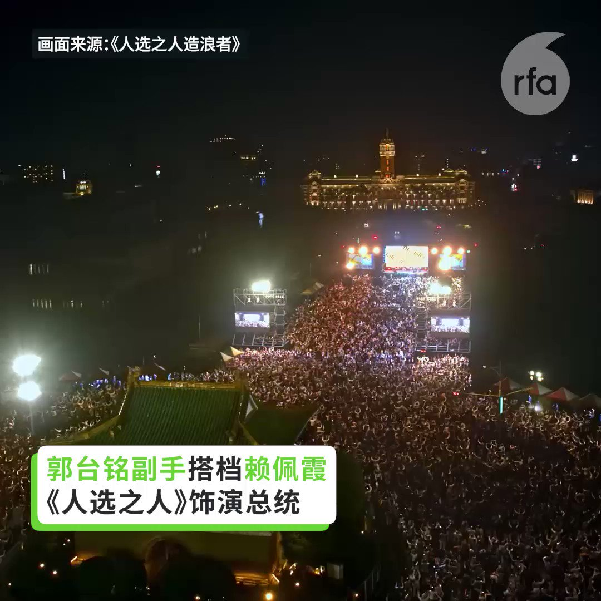
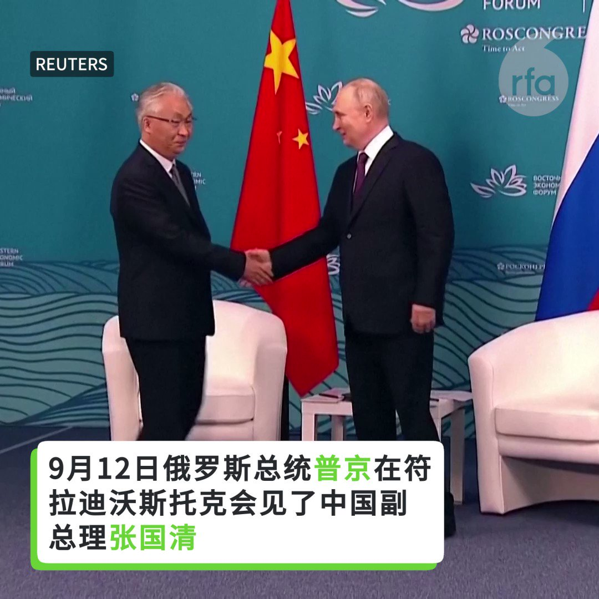
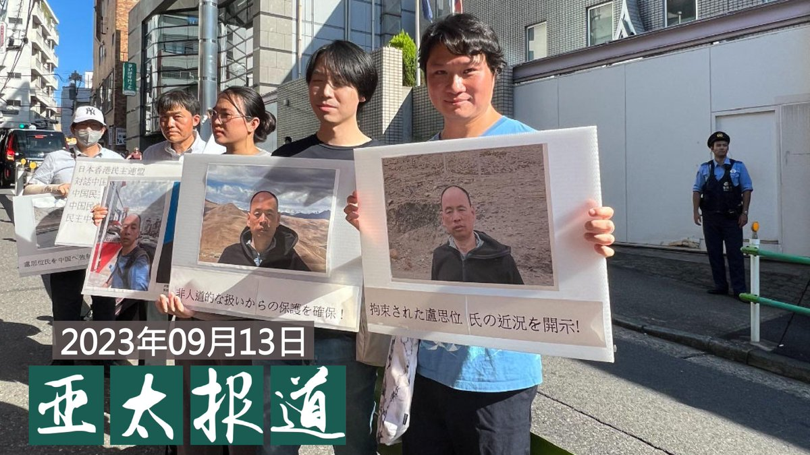
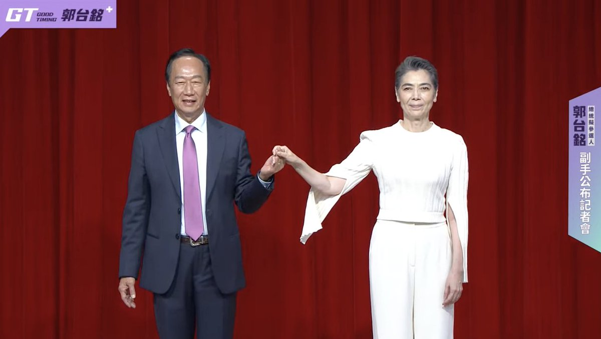
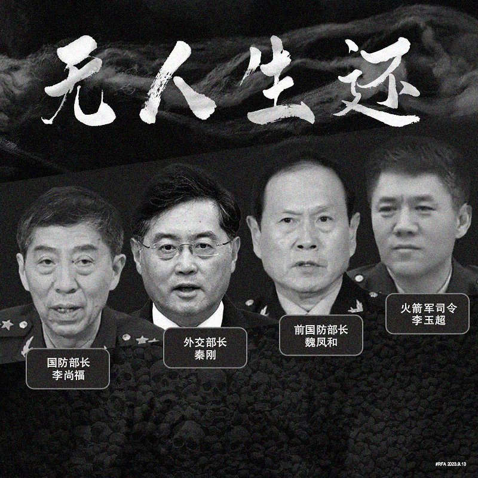

自由亚洲电台 北京时间 2023-09-14T15:23:21Z 1702221482913669243 【郭台铭宣布副手为60岁女艺人赖佩霞】
【赖佩霞饰演总统入围金钟女配角 从政剧情成为现实】
已宣布参选总统的鸿海集团创办人郭台铭14日上午宣布副手人选是60岁的女艺人赖佩霞。她近期在台湾相当火红的政治幕僚职人剧“人选之人-造浪者”饰演总统。巧合的是，14日下午第58届金钟奖入围名单公布，赖佩霞以《人选之人—造浪者》总统参选人林月真一角，入围“迷你剧集（电视电影）女配角奖”。郭台铭说希望借重赖佩霞为台湾打造更公平对等的两性文化。#郭台铭 #赖佩霞   自由亚洲电台 北京时间 2023-09-14T04:17:50Z 1702054000441672137 路透社一项针对经济学家的最新民调显示，专家认为中国今明两年的 #经济增速 将低于此前的预期，且倾向于进一步下调评级。随着中国经济增速放缓、房地产危机、地方政府债务累累，中国能实现今年政府设定的经济增速5%的目标吗？

 https://t.co/TV3oQSGeRg   自由亚洲电台 北京时间 2023-09-14T05:17:39Z 1702069050359394378 【#普京：#俄中关系 达到绝对前所未有的历史水平】
俄罗斯总统普京与中国副总理 #张国i清 会面，并计划在10月第三届“#一带一路”高峰论坛期间访问中国。 https://t.co/iSMwQazKH3   自由亚洲电台 北京时间 2023-09-14T07:00:10Z 1702094850777284825 【#亚太报道（2023-9-13）】
欢迎收听和订阅播客【亚太报道】 https://t.co/MjLNSvVMqc

#卢思位 面临送中 民众东京请愿 / #张海 得见律师并坚称无罪 / 中国经济增速放缓 外界下调经济预期 / #中国民企500强 净利润持续下滑 / 中国以AI散播 #夏威夷山火 阴谋论遭驳斥 https://t.co/nKHCrdKVmw   自由亚洲电台 北京时间 2023-09-14T10:18:06Z 1702144660683296774 【郭台铭宣布副手为台湾艺人赖佩霞】
已宣布参选总统的鸿海集团创办人郭台铭14日宣布副手人选，就是近期在台湾相当火红的政治幕僚职人剧“人选之人-造浪者”饰演总统的演员赖佩霞。赖佩霞早期是歌手出身，近几年转型当演员，并攻读心理学，同时出书并专注在谈判、沟通等领域工作。报道：https://t.co/XMUB1F8kEf
#郭台铭 #赖佩霞   自由亚洲电台 北京时间 2023-09-14T05:02:32Z 1702065249241993351 专栏 | #网络博弈：禁文《从 #福岛核废水 说起：我们在谈科学还是立场》
 https://t.co/dvywCyxcfj   自由亚洲电台 北京时间 2023-09-14T06:30:00Z 1702087261041611196 欧盟委员会主席冯德莱恩周三（9月13日）宣布，将对 #中国电动汽车 启动反补贴调查，但坚称“欧洲对竞争持开放态度”。她强调，中国廉价的电动汽车充斥着全球市场，而这种低价是因为受到了国家的巨额补贴人为压低造成的，这是在扭曲市场。 https://t.co/YnAulT2x8a   自由亚洲电台 北京时间 2023-09-14T07:14:27Z 1702098443735650763 本周二，美国国防部公布了《#2023年网络战略》摘要，这份战略将中国定为美国在网络安全上的头号威胁。该摘要指出，中国将“在网络安全领域中取得优势”视为战略获胜的核心，因此五角大楼面对逐步进逼的挑战。 https://t.co/kJqHlznG18   自由亚洲电台 北京时间 2023-09-14T07:30:01Z 1702102363375591800 专栏 | #纵横大历史：#文革 系列 第六十三讲　#炮打司令部（上）
 https://t.co/OgB4fmAYQB   自由亚洲电台 北京时间 2023-09-14T09:12:39Z 1702128191064752128 #2023台北国际航太暨国防工业展 9月14日开展，台湾国防馆展现 #无人机 国家队能量，从可续航二十小时的"腾云无人机"到能背在身上的机动型"巡飞弹II型无人机"，展现无人机"侦打一体"最新研发成果。此外，新式高教机飞行模拟机、新型侦搜战术轮车等也第一次亮相。
https://t.co/LFqmVzXtup   自由亚洲电台 北京时间 2023-09-14T09:15:17Z 1702128852200268205 RT @RFA_Chinese: 【#亚太报道（2023-9-13）】
欢迎收听和订阅播客【亚太报道】 https://t.co/MjLNSvVMqc

#卢思位 面临送中 民众东京请愿 / #张海 得见律师并坚称无罪 / 中国经济增速放缓 外界下调经济预期 / #中国民企50…   自由亚洲电台 北京时间 2023-09-14T09:16:22Z 1702129125941457160 RT @RFA_Chinese: 【#您怎么看】
“习主席的内阁现在就像是阿加莎·克里斯蒂（Agatha Christie）的小说《#无人生还》。先是外交部长 #秦刚 失踪，然后是 #火箭军 指挥官失踪，现在是国防部长 #李尚福 两周都没有公开露面。这场失业大赛谁会获胜？中国的…   自由亚洲电台 北京时间 2023-09-14T05:04:34Z 1702065759319630273 【#您怎么看】 9月12日，中国教育部颁布《校外培训行政处罚暂行办法》，指出擅自举办校外培训机构举办者最高或面临10万人民币的罚款。该办法将于自2023年10月15日起施行。
2021年7月，中国政府祭出“双减”政策，被指希望降低育儿成本，帮助中国生育率回升。
您认为，现在继续严打校外培训是为什么？ https://t.co/mpgDcXOZti   自由亚洲电台 北京时间 2023-09-14T05:06:57Z 1702066357360037948 美国首家纪念达赖喇嘛的图书馆和学习中心在纽约州北部开放，里面都有啥？ https://t.co/qyrIwQRVp4   自由亚洲电台 北京时间 2023-09-14T05:08:06Z 1702066649669509228 【#您怎么看】
“习主席的内阁现在就像是阿加莎·克里斯蒂（Agatha Christie）的小说《#无人生还》。先是外交部长 #秦刚 失踪，然后是 #火箭军 指挥官失踪，现在是国防部长 #李尚福 两周都没有公开露面。这场失业大赛谁会获胜？中国的年轻人还是习近平的内阁？”
美国驻日大使拉姆·伊曼纽尔（Rahm Emanuel） @USAmbJapan 日前在社交媒体X上的帖子，引起广泛议论。失踪现象扩大到习近平的亲信圈，的确恐怖。您认为，李尚福真出事了吗？下一位会是谁？   自由亚洲电台 北京时间 2023-09-14T05:35:26Z 1702073527330017654 评论 | #魏京生：#金正恩、#普京 和 #习近平
 https://t.co/3INCtA25md   自由亚洲电台 北京时间 2023-09-14T00:45:07Z 1702000467285598661 有网友说，大陆救房市，想割台湾韭菜了。说得对吗？ https://t.co/4nefDnwxAH   自由亚洲电台 北京时间 2023-09-14T01:24:40Z 1702010419756548538 兰德公司的研究人员表示，中国研究人员已在研究如何使用类似于 ＃ChatGPT 的生成式人工智能工具来操纵全球受众，并以此形塑各界对台湾的看法。
“有鉴于人民解放军和中国共产党先前的意图与行动，从逻辑上来看，中国的下一个目标将是 ＃台湾2024年总统选举，” https://t.co/nilo51Hh5h   自由亚洲电台 北京时间 2023-09-14T02:37:18Z 1702028697509757197 加拿大社会饱受中国渗透干预之苦，#加拿大 华裔国会议员 #庄文浩(Michael Chong)受邀到美国国会听证会现身说法。庄文浩呼吁美加两国合作对抗北京。
https://t.co/23HwzDBbWR   自由亚洲电台 北京时间 2023-09-14T03:01:26Z 1702034770379817029 中国政府向 #老挝 当局施压, 寻求遣返人权律师 #卢思位 的消息传出后，日本多个团体在东京老挝驻日本大使馆外请愿，并期望日本发挥外交影响力，促使老挝当局放人。

 https://t.co/m59UYA5OxR   自由亚洲电台 北京时间 2023-09-14T03:17:05Z 1702038709372338348 法新社近日报道，其记者7月份前往新疆南部的叶尔羌县，探访了该地区的四个维吾尔族村庄，试图了解“#再教育中心”在当地运作的情况。记者经历了什么？
 https://t.co/Om93iQ57Pq   自由亚洲电台 北京时间 2023-09-14T03:55:14Z 1702048310075474372 中国在周三（9月13日）成为首个向 #塔利班阿富汗 派出大使的国家。据路透社报道，#塔利班 政权外交部发言人表示，新大使 #赵星 是自2021年8月塔利班接管后首位接任该职务的国家大使，阿富汗现任总统哈桑·阿库恩德接受了新大使的国书。
 https://t.co/Xj2h8IDnEP   自由亚洲电台 北京时间 2023-09-14T02:00:15Z 1702019374272458881 ＃庄文浩　在听证会中说明自己因为曾对中国人权情况作出批评而被北京当局列入针对目标，其手段包括多伦多总领馆官员查找他还在中国的亲属，并通过微信公众号传播抹黑他的文章等。
“这充满了胁迫性，因为　＃微信　在加拿大有超过100万用户，全球有数百万人都看到了假讯息。中国政府把媒体当成武器，透过社交网络和某些中文媒体来发动抹黑攻击。”
https://t.co/VAhJBRiYGM   自由亚洲电台 北京时间 2023-09-14T00:15:49Z 1701993091660407120 #中国民营企业500强 报告显示，去年最大的500家民营企业营业收入总额不足40万亿元，同比增长不到4%，但税后净利润为1.64万亿元，同比减少近5%。
https://t.co/MvN3sUEBky   