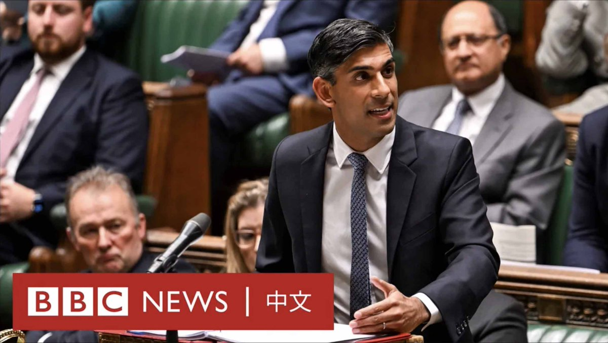
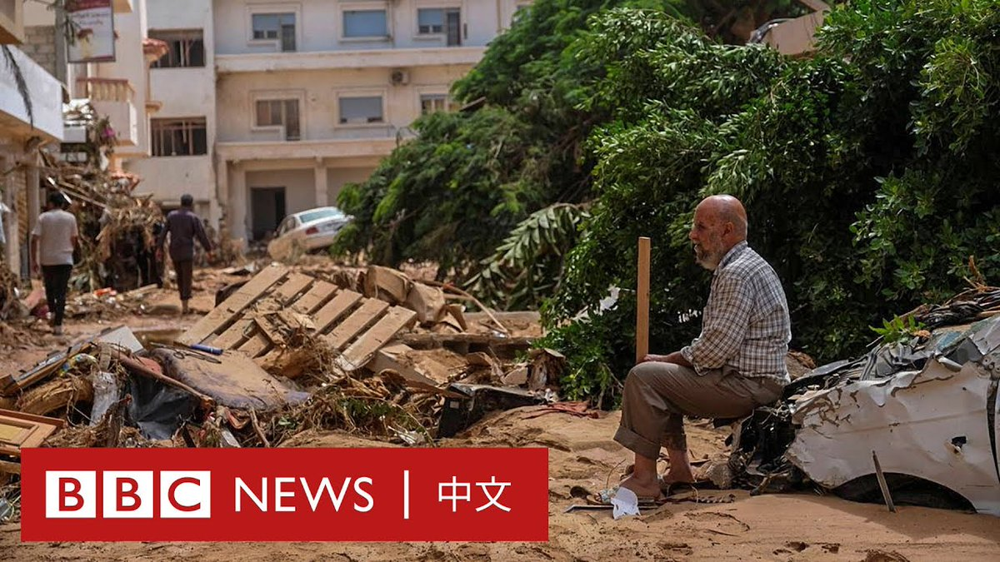
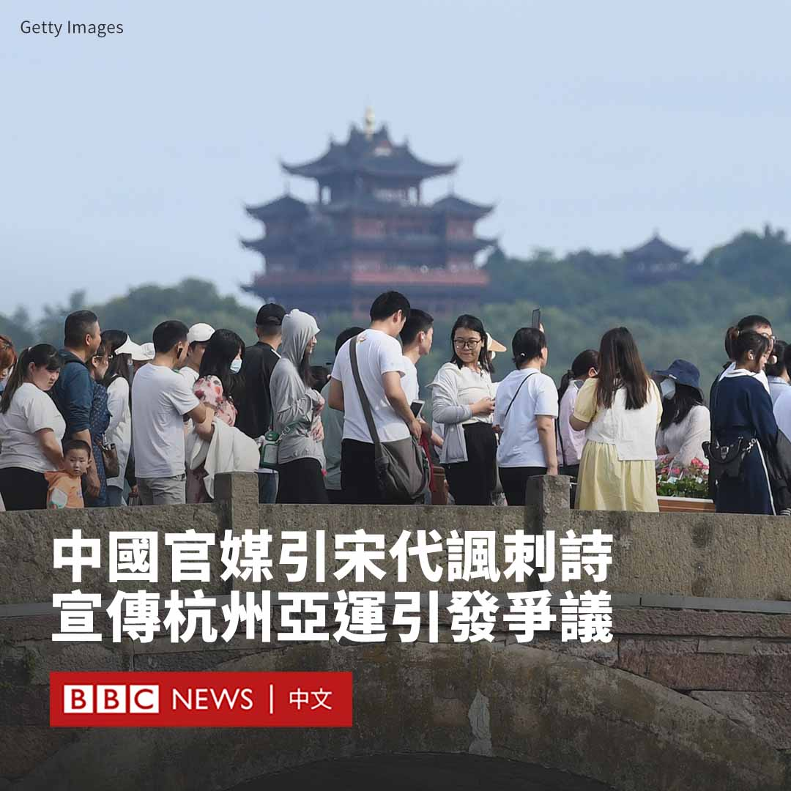

D英国广播公司BBC 北京时间 2023-09-13T20:58:06Z 1701943336280486300 美国总统拜登（Joe Biden）面临国会众议院的弹劾调查。共和党主导的众议院到底要查他什么？为何现在查？ https://t.co/c7ND7P7vET   D英国广播公司BBC 北京时间 2023-09-13T22:04:51Z 1701960134652572012 在国际社会的密切关注下，朝鲜领导人金正恩周三（9月13日）与俄罗斯总统普京在远东卫星基地东方太空发射场会面。

普京带领金正恩参观了该基地的火箭及卫星发射装置。在之后两人举行的会谈中，金正恩称“将优先考虑朝俄关系”，他还表示，俄罗斯军民“定能战胜邪恶势力”。 https://t.co/DUEa4eGmna   D英国广播公司BBC 北京时间 2023-09-13T19:57:48Z 1701928161246945422 在一名英国议会研究员被指控为中国从事间谍活动而被捕后，首相苏纳克（Rishi Sunak）表示，“不会接受”中国干预英国民主。

中国外交部表示间谍指控“纯属无中生有”，而这名涉事研究员也否认了该指控。 https://t.co/krI1E9h7nu   D英国广播公司BBC 北京时间 2023-09-13T17:30:59Z 1701891211525750859 一场飓风引发的毁灭性洪水席卷利比亚东部港口城市德尔纳（Derna），目前已导致5300多人死亡。据报道约有一万人失踪。
 
德尔纳市有两座水坝溃堤，四座桥崩塌，导致大部分地区被洪水淹没，许多家庭跟着住宅被冲入海中。 https://t.co/rQbBCYRcvw   D英国广播公司BBC 北京时间 2023-09-13T18:15:01Z 1701902295963988475 因台风“海葵”引发的洪水，中国南部广东省有70多条鳄鱼在水位上涨期间从养殖场出逃。当地政府部门正在抓捕，同时警告一些居民待在家中。

据多家中国媒体周二（9月12日）报道，在茂名市彭村湖附近，一家养殖场的大量鳄鱼逃出。当地官员称，初步统计显示成年鳄鱼有69条，幼年鳄鱼有6条。

据报道，当地应急管理局、消防、公安及镇政府等部门都在参与抓捕鳄鱼。

当地消防部门表示，其正采用声呐设备搜捕出逃鳄鱼，目前已抓捕到八条，包括七条成年鳄鱼，一条幼年鳄鱼。成年鳄鱼普遍在150斤左右，长度达2米。

当地网友发布的照片显示，有三只被捕获的鳄鱼被用红色的线缆捆住。

负责抓捕工作的人员对《南方日报》表示，出于安全考虑，这些出逃的鳄鱼将被捕杀。《上游新闻》报道称，有的鳄鱼被击毙，有的被电击死亡。

应急部门警告说，由于积水较深导致抓捕工作困难，当局仍建议周边居民尽量不出门。   D英国广播公司BBC 北京时间 2023-09-13T14:38:34Z 1701847823183233422 在中国有着“口红一哥”之称的销售主播李佳琦，近日因在直播时回怼抱怨商品价格贵的网友不够努力，而引发铺天盖地的批评。他随后含泪道歉。

在周日（9月10日）的一场直播活动中，有网友留言质疑李佳琦销售的中国本土品牌眉笔要价人民币79元（11美元）一支，价钱越来越贵，这引起了李佳琦的不满。

“哪里贵了？这么多年都是这个价格好吧。不要睁着眼睛乱说，国货品牌很难的。”他说道。

似乎是余怒未消，他补充说：“有时候找找自己原因，这么多年了工资涨没涨，有没有认真工作？”

这番言论迅速点燃了中国网友的怒火。许多网民抨击他“赚钱之后变得很膨胀”、“挣我们的钱还看不起消费者”。

还有人质疑在中国经济低迷之时，他“有没有了解民生疾苦”。

李佳琦在周一（9月11日）发帖道歉说：“我本就是一个彩妆柜台销售员，深知大家的工作都是辛苦和不容易的。我说的话辜负了你们的期望，真的很抱歉。”

然而，他的道歉并没有让很多网友买账。中国媒体报道说，他的微博粉丝一天之内减少了近100万。

他后来在直播中再次含泪道歉，表示“无论什么时候，我都不应该忘记我来自哪里，更加不能迷失了自己”。

31岁的李佳琦在淘宝直播平台上拥有7600万粉丝，是中国最知名的网红之一。他曾在与阿里巴巴创始人马云的一场销售竞争中，在五分钟内卖出1.5万支口红。   D英国广播公司BBC 北京时间 2023-09-13T16:20:07Z 1701873377986978266 在中国的社交平台微博上，一首写于近一千年前的讽刺诗近日遭到审查。原因是官方媒体意外地将该诗用作杭州亚运会的宣传材料而引发网友嘲讽。

在延期了一年后，2022年亚运会将于9月23日在杭州开幕。为宣传杭州，中国官媒《人民日报》近日在社交平台发布了多条关于杭州的宣传帖子。

该报周一（9月11日）发布的以“跟着课文看杭州，一起感受杭州之美”为题的帖子格外引起网友的注意，因为其中包含了诗句“暖风熏得游人醉，直把杭州作汴州”。

这句诗出自南宋诗人林升的《题临安邸》。在他所处的时代，宋朝曾经的首都汴梁（今河南开封）被女真人所建立的金国所攻陷，两位皇帝被俘虏，而宋朝皇室则逃亡到南方，在杭州建都。

因此，这首知名诗歌长期被解读为一首“讽刺诗”——表面赞美杭州之美，实际上批评朝廷不思进取，只知纵情声色。

尽管《人民日报》很快删除了该帖子，但仍有许多网友转发其截图，并表示“想不通到底是什么样的人在做宣传工作”、“没想到《人民日报》的文化水平这么低”。

还有网友评论说，这首诗是对杭州投入重金办亚运会的“讽刺”。官方媒体报道称，杭州亚运会的场馆建设花费超过100亿元人民币（13.7亿美元）。

在嘲讽声中，微博显然开始对相关帖子进行审查。在该平台检索“直把杭州作汴州”仅有相当有限的几条与该事件不相关的帖子。“跟着课文看杭州”的话题也显示查无结果。   D英国广播公司BBC 北京时间 2023-09-13T12:50:15Z 1701820565747851455 【现场画面】朝鲜领导人金正恩抵达俄罗斯一家太空发射中心。克里姆林宫发布的画面显示，金正恩与俄罗斯总统普京会面并握手。

两人会面的地点在俄罗斯远东阿穆尔州的东方航天发射场，而非此前有人预测的符拉迪沃斯托克（海参崴）。

就在两人的会晤即将开始之际，朝鲜发射了两枚弹道导弹。 https://t.co/4TsRAlHj26   D英国广播公司BBC 北京时间 2023-09-13T11:21:27Z 1701798218890412320 24小时内，九艘偷渡移民艇被拦截……

这或许听起来很多，但对突尼斯的海岸巡逻队来说是常态。数以万计的人们支付高昂的费用以渡海到欧洲。

BBC跟拍了突尼斯海岸巡逻队的一次行动，记录下这些移民试图前往欧洲的冒险旅程。 https://t.co/NUOu4zcPzw   D英国广播公司BBC 北京时间 2023-09-13T09:12:16Z 1701765707652862138 一名英国议会研究员被指控为中国充当间谍一事，使中国在英情报活动，以及英国是否反应迟钝，成为英国舆论关注的焦点。https://t.co/msesIogm5a   D英国广播公司BBC 北京时间 2023-09-13T00:09:45Z 1701629178389610649 在新西兰，一名登山者从600米高的山坡上坠落后“奇迹般”幸存，仅受轻伤。

警方表示，这名男子从新西兰北岛的塔拉纳基山（Mount Taranaki）摔下，幸运的是春天的天气使冰面变软，使他最终落在雪地上。

当地时间9月9日，一组登山队员一起攀登海拔2518米的塔拉纳基山，这名成员不慎从该山的一处山坡摔下。600米的落差相当于广州塔的高度。

警方指，登山队的另一名成员随即下山试图找寻这名失足男子，而碰巧一名救援队队员也刚好在此登山，最后他们成功找到该名坠落者。

警方表示，这名登山者“非常幸运能够活下来”。

根据新西兰山地安全委员会的说法，塔拉纳基山在新西兰被誉为最危险的山脉之一。在2021年，两名登山者曾在相近地点摔死。

塔拉纳基山是一座休眠火山，位于新西兰北岛西海岸相对孤立的地方。

山地安全委员会表示：“它与其他山脉隔绝，靠近海岸线，所处地理位置使其有着新西兰变化最快、最恶劣的天气条件”。

该委员会说：“天气与复杂崎岖的地形相结合，创造了一个非常独特的环境。一不小心就可能导致灾难发生。”   