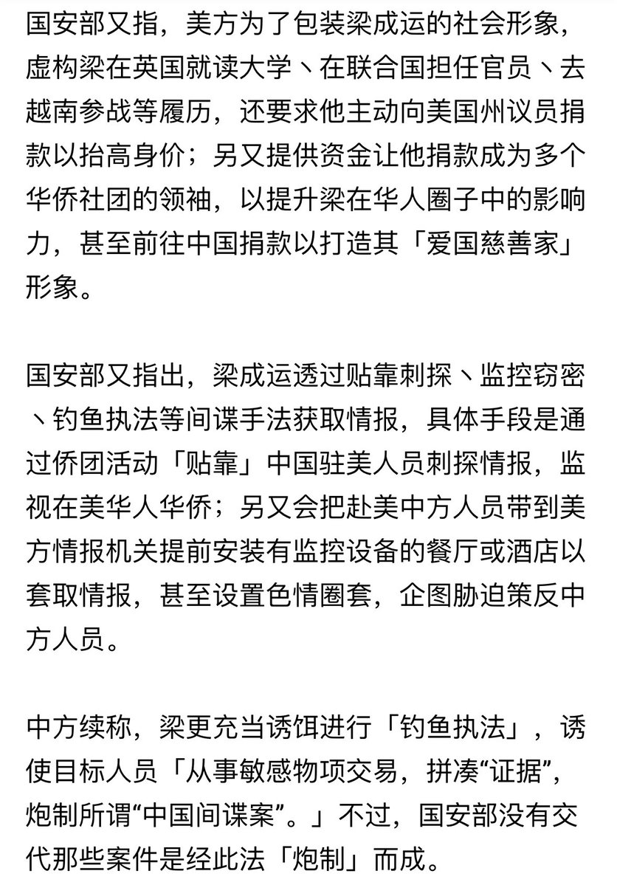
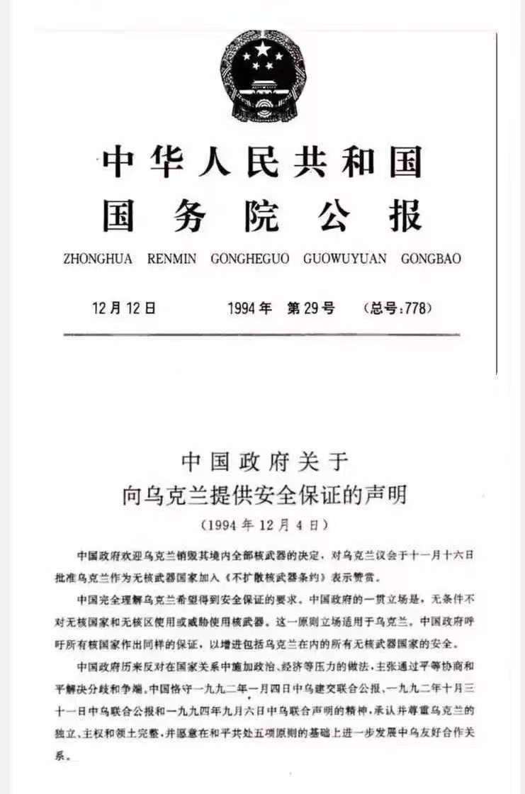
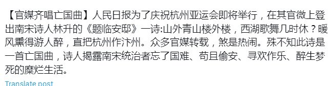
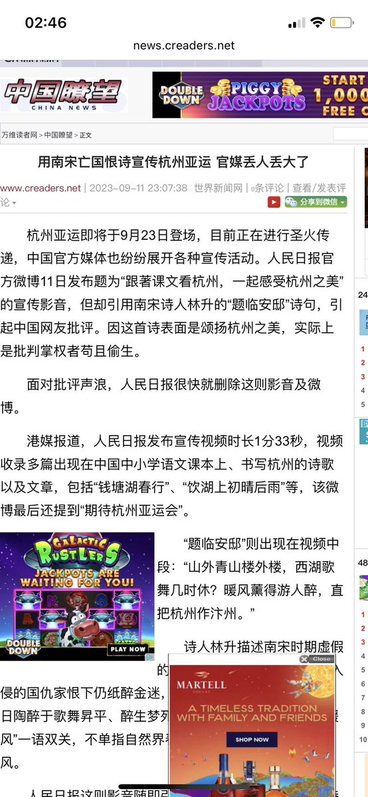
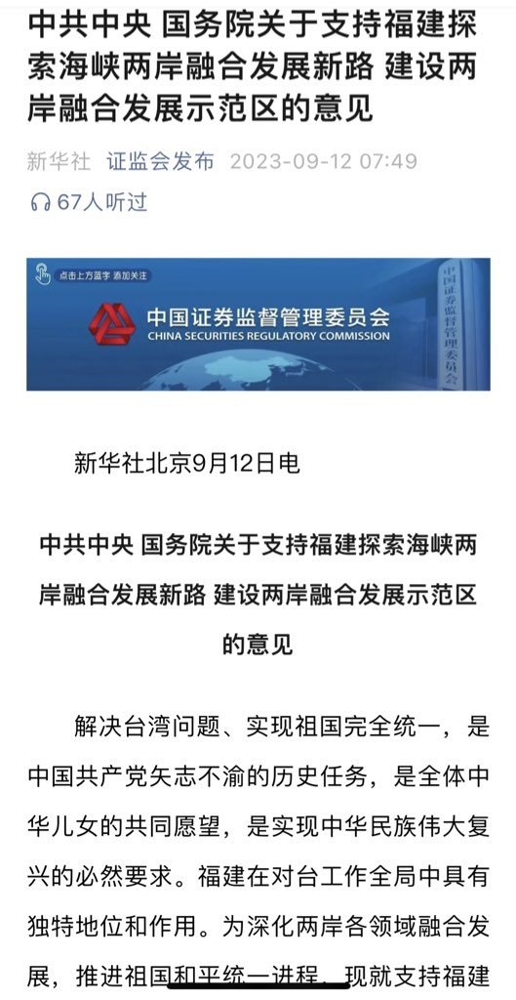
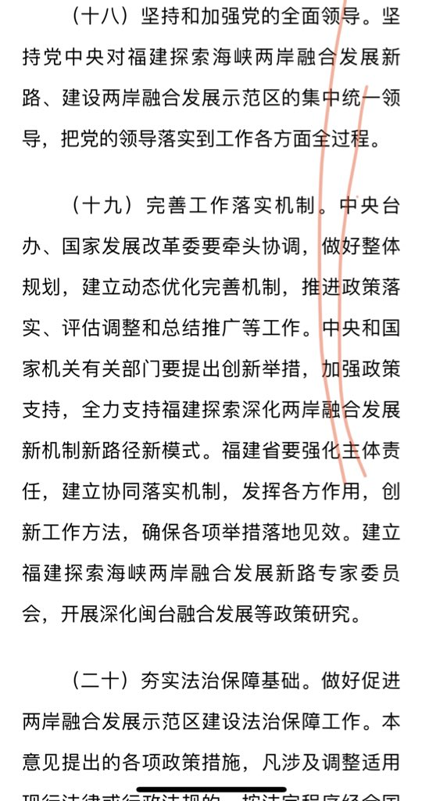

Petrichor 北京时间 2023-09-13T04:24:17Z 1701693235452608884 谁这么傻啊？ https://t.co/PNmIeAxvsj   Petrichor 北京时间 2023-09-13T04:22:50Z 1701692867331125337 习近平搞一带一路，其历史根据是河西走廊通新疆的沙漠丝绸之路和明朝太监郑和船队下西洋。据说郑和船队沿途到过30多个国家，远达波斯湾及非洲东海岸。

明朝的郑和下西洋的目的是什么？不就是朱棣皇帝为了找到并诛杀朱允汶么？前后劳民伤财派了那么多批次,多少人葬身海底,明明是为了保证自己的皇权皇位而追杀竞争者,如此血腥卑鄙,硬是打扮成发展贸易、展示文明。

皇权之争,朱元璋指定的皇帝朱允汶为避被亲叔的杀身之祸,离家出走,有人说他逃到了海外,篡权皇帝朱棣才派人去追杀的,追杀不成就禁海！   Petrichor 北京时间 2023-09-13T05:51:27Z 1701715171410956600 今天和朋友喝咖啡，她说：海外侨领中梁成运那样的“侨领”应该还有不少，他们表面上是为中共服务的侨领，其实是敌对国的间谍。他们刻意巴结中共驻外使领馆官员，与他们吃吃喝喝，伪装成爱国侨领，暗地里收集中共情报，送给所在国情报部门。梁成运做了30多年“侨领”，给中共造成巨大损失。

中国国安部称，美国特务机构将梁成运伪装成”慈善家“，同时要求他监视华人华侨，并为前往美国的中共官员铺设陷阱，令其就范。该部在一份声明中说：“当他得知中国官员计划前往美国执行公务时，就会向美国情报机构报告”，“根据美国人的指令，把这些中共官员带到美国情报机构事先安装了监视设备的餐馆或酒店”。
据同一消息来源称，他随后试图"获取信息，甚至通过诱骗（色情性勒索，法新社注）迫使我们的干部屈服，被招聘为间谍"。   Petrichor 北京时间 2023-09-13T03:29:20Z 1701679404772962449 外交部发言人呢？这是不是历史文件，不再具有现实意义？一个人，言而无信，非人也。一个国，言而无信，亡国灭党。 https://t.co/GcfaeavXBi   Petrichor 北京时间 2023-09-13T00:37:49Z 1701636241194623320 2022年2月4日，冬季奥林匹克运动会在北京冷清开场。开幕式的主题是亡国诗“燕山雪花大如席”。

“燕山雪花大如席，片片吹落轩辕台”，出自唐朝李白所作《北风行》。唐玄宗天宝十一年（752年），李白游历了幽州（今北京大兴县一带），目睹了安禄山挑起战祸，带给百姓的苦难。李白寓情于景，将心中满腔悲愤、伤感和凄凉写出来。

现在杭州亚运会的主题是说“直把杭州作汴梁州”。宋代林升直斥南宋当局的腐败无能，辛辣的讽刺中蕴含着极大的愤怒和无穷的隐忧。面对国难，百姓苦不堪言，思念故国。

这是文人故意这么做的，反正小学生没文化，不懂的。   Petrichor 北京时间 2023-09-13T00:15:05Z 1701630522546356496 中共出台新政策：让福建和台湾进行海峡两岸融合发展。即“小统一”。如何融合？让福建居民与台湾居民享受同样的养老制度、公费医疗、失业金、民主选举领导人、言论和新闻自由、结党结社自由…..
做不到这些，拿什么融合？拿什么发展？做习近平的中国梦？ https://t.co/SSpljanbCq   