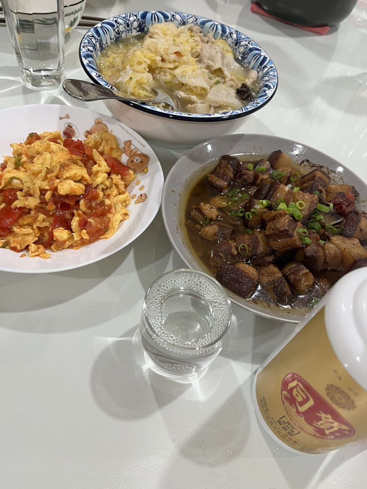
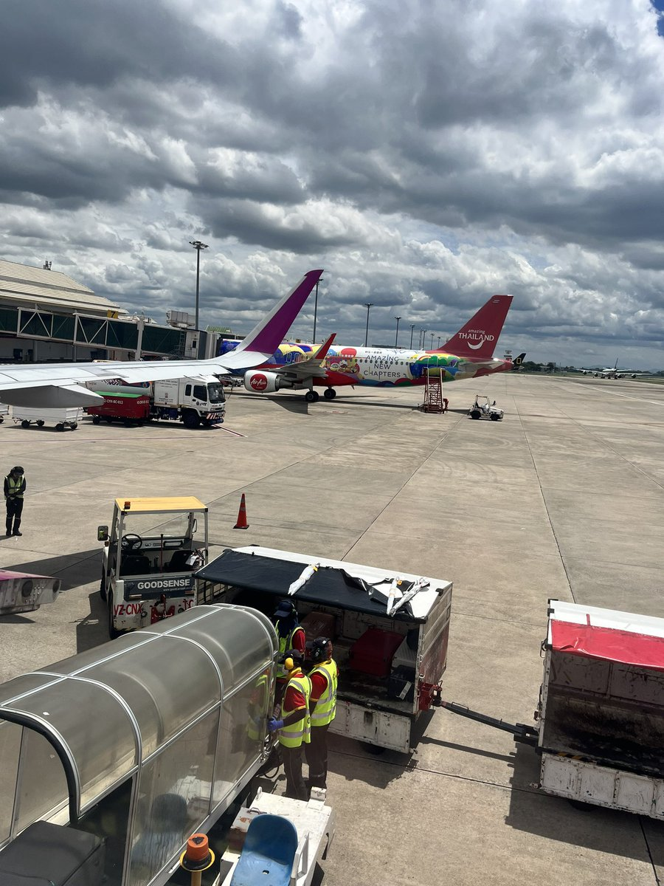

王歪嘴 北京时间 2023-09-13T18:37:22Z 1701907918868844752 回家了，随便吃点儿 https://t.co/REvzjFTLdo   王歪嘴 北京时间 2023-09-13T19:20:32Z 1701918781965250897 其实就是本应从国家纳税里面出钱“降低”医疗的“负担”，转嫁到了医护工作者身上。与让民营企业主担起的“社会责任”一样，纳了稅还要担责。   王歪嘴 北京时间 2023-09-13T20:12:44Z 1701931918403764607 王歪嘴：黄鼠狼下耗子一辈儿不如一辈儿

不想当厨子的作家不是好司机，不想当将军的厨子也肯定不是好司机……泱泱大国巍巍华夏，五千年历史三千年文明，中华民族传统文化遗产项目的代表性成果之一，就是...前面这个逻辑。

跟厨子比写作跟作家比驾驶跟文人比拳头跟武夫拼嘴皮子功夫，无论何时何地何种场合何种情况，总能找到比差的角度和维度聊以自慰聊以自娱聊以自乐聊以自豪！

也才有了著名预言大师王歪嘴那句老话，刨了五千年坟挖开三千年墓，纵然烂透了水晶棺椁，里面的老祖宗依然还能剩下一副好牙口，演绎肉烂嘴不烂的经典。

科技时代了，早已不是比拼农耕时代的耕地工业时代的资源的时候了。更不是奴隶时代比拼人口封建时代比拼版图就能够解决问题获得胜利的时代。科学发展科技创新的唯一途径是“自由思想独立人格”，与之配套的还有“财务自由经济独立”，还奉行“民可使由之 不可使知之”的商鞅法，抱着“师夷洋技以制夷”的心态，刻苦研读《国际法》钻空子找漏洞，就必然沦陷在“天才地才具为奴才”的泥沼里。
落后不一定就会挨打，勇于面对自己的落后积极拥抱文明的日本反而得到全世界的尊重，野蛮一定迎来文明的鞭挞……

连吃过熟肉的原始人都知道吃生肉的古来传统是垃圾是糟粕，看到吃生肉的人想要教他揍他并非因为他们原始落后，而是因为自己被恶心得吐出了黄疸水！

多少年了，大国的外交依旧停留在对内不首先使用周小平煽动蛊惑脑残民粹，对外不首先使用胡锡进扭曲事实荼毒人心，更是绝对不能轻易使用张召忠传播如何用农村老太太争夺宅基地的战略眼光纵观世界风云。

从洋人没有中国的茶叶、大黄就会便秘而死到世界没有华为科技就不能发展，从不购买某国商品就能导致某国经济崩溃到被某国禁售商品后勒紧腰带共克时艰，从为屏蔽了全世界的防火墙感到骄傲与自豪到被文明世界抛弃了之后发出“落后就要挨打”的哀怨。

这头沉睡的雄狮其实早已成为僵尸，纵然被唤醒也只能是个对着身边蝼蚁窝里横的恶鬼。

老王相信少年强则国强，少年独立则国独立。但如今的少年们胸前飘扬着散发血色的枷锁，肚子里装着透露着霉味儿的猪食，脑子里装着的是《弟子规》腐朽，嘴里倒背如流的是《三字经》的糟粕，就只能接过传承百年的东亚病夫名号，演绎具为奴才的民族特色。

当年的全面落后不是偶然，如今的十面受敌也是必然。唯一的差异是那厮这次没有慈禧的勇气对全世界宣战……

文：王歪嘴
2019/05/24   王歪嘴 北京时间 2023-09-13T13:52:55Z 1701836335030714616 亲眼看到他们摔我的箱子 https://t.co/EQC3nishG8   