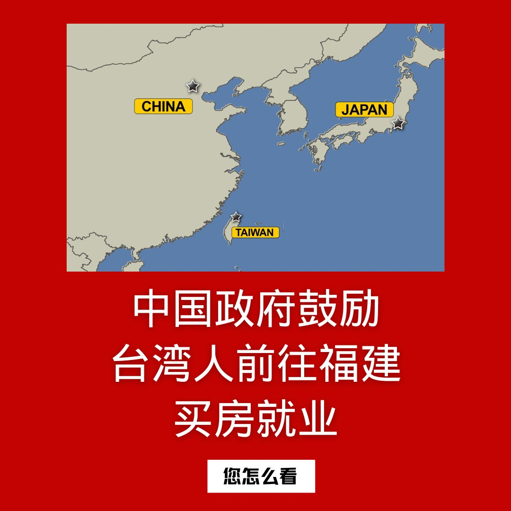
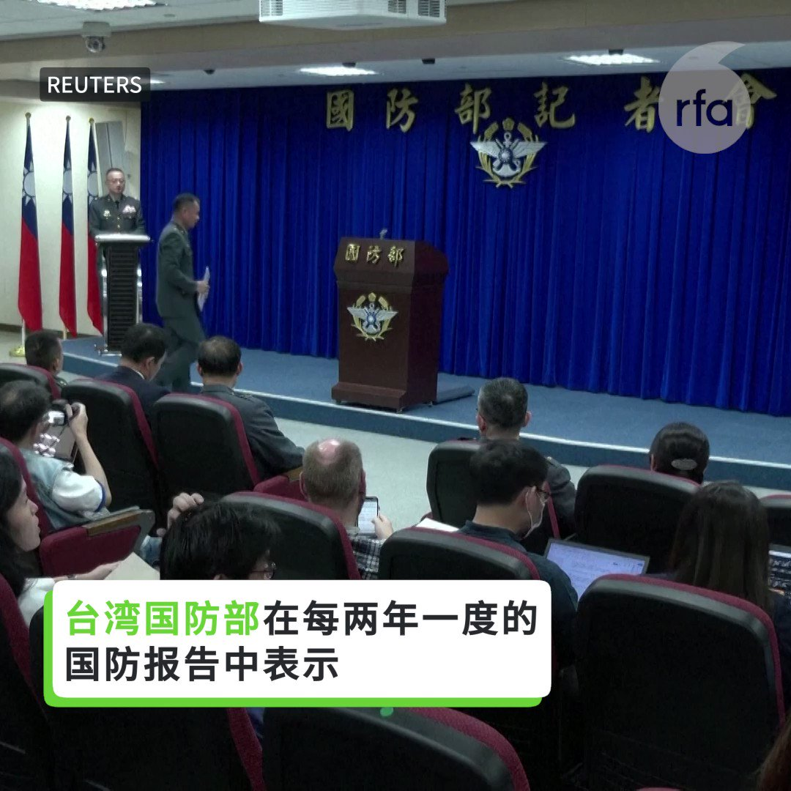
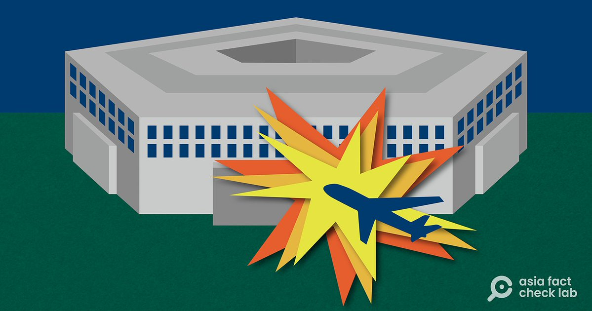

自由亚洲电台 北京时间 2023-09-13T05:15:12Z 1701706045947879596 【普京：#俄中关系 达到了绝对前所未有的历史水平】
俄罗斯总统普京与中国副总理张国庆会面，并计划在10月第三届“一带一路”高峰论坛期间访问中国。 https://t.co/uP1MJDTko7   自由亚洲电台 北京时间 2023-09-13T05:26:08Z 1701708799713968411 中国人权律师 #卢思位 自七月底在老挝被警方抓捕后一直下落不明。周二（9月12日）突然有消息传出，中国政府正向 #老挝 当局施压, 寻求遣返卢思位。
身在美国的卢思位妻子张春晓紧急向外界发出呼吁，希望老挝政府释放其丈夫。

 https://t.co/E4LxpUEhjV   自由亚洲电台 北京时间 2023-09-13T05:41:38Z 1701712699967586595 中共政协委员 #周小平 之妻、歌手 #王芳 近日在俄占区高歌《#喀秋莎》，引发舆论批评。
前《环球时报》总编 #胡锡进 急于切割：“应定义为是他们个人的行为，与国家无关”。
周小平公开还击，大意是骂胡不是人。
网友乐得围观。
同为五毛，相煎何急？有网友LT 視界@ltshijie 指出，从习近平钦点的网络作家周小平挑战体制内既得利益阶层的胡锡进，看到了文革“#保皇派”与“#造反派”决斗的影子。习独裁治下拥习两派之间斗争，预示中国政治生态的发展方向。他说：“文革越來越近了，因为主要演员都到位了。”
【#您怎么看？】   自由亚洲电台 北京时间 2023-09-13T06:09:40Z 1701719756208836735 【#您怎么看】9月12日，中国政府发布《中共中央 国务院关于支持福建探索海峡两岸融合发展新路 建设两岸融合发展示范区的意见》，提出了一系列旨在加强与台湾融合措施。新措施聚焦福建，将福建建设成对台示范区。二十多项“意见”包括鼓励福建企业雇用台湾员工，鼓励台胞在福建购房置业等。
您认为，在大陆提供就业机会、鼓励台湾人前往大陆买房，是否有吸引力？   自由亚洲电台 北京时间 2023-09-13T02:39:58Z 1701666982469460067 伴随美中竞争升级 ，如何应对中国针对 #美国金融 稳定构成的威胁，成为了华尔街和华盛顿的共同议题。本周二，在美国国会举行的听证会上，多位议员与华尔街专家就协调 #国家安全 与 资本投资 的问题发表了看法。

 https://t.co/h8rSeG4R99   自由亚洲电台 北京时间 2023-09-13T04:24:09Z 1701693201537720526 针对中国当局的跨国骚扰行动，9月12日，#美国国会及行政当局中国委员会 举办听证会。共和党籍众议员史密斯（Chris Smith）在会上指出，许多在美国公开发声反对中国当局的人士都曾在美国境内遭遇中国政府胁迫，包括收到炸弹威胁、遭车辆刻意冲撞、被不明身份人士跟踪等。 https://t.co/82P3bUF4cW   自由亚洲电台 北京时间 2023-09-13T05:18:50Z 1701706962864656756 在每年9月15日"#国际民主日"到来之际，一批来自中国、身处洛杉矶的异议人士都会展开行动，号召人们关注那些在中国境内"#被精神病"的异议人士以及中国政府迫害他们的行为。

 https://t.co/PIXNt9TX5B   自由亚洲电台 北京时间 2023-09-13T05:30:23Z 1701709869135675829 【#亚太报道（2023-9-12）】
欢迎收听和订阅播客【亚太报道】 https://t.co/MjLNSvVMqc

中国人权律师 #卢思位 或遭老挝遣返 / #iPhone15 冲上微博热搜 / 江西南昌一幼儿园开学即倒闭; / 中国防长 #李尚福 下落成谜 / 台湾发布《#国防报告书》 https://t.co/Othz3PuuwW   自由亚洲电台 北京时间 2023-09-13T05:37:07Z 1701711562363601290 【大陆厉兵秣马 台湾岂敢懈怠】
台湾国防部在每两年一度的 #国防报告 中称，中国正在通过在扩大的空军基地永久部署新型战斗机和无人机，增强其面向台湾沿海地区的空中力量。 https://t.co/uvAETaxzG7   自由亚洲电台 北京时间 2023-09-13T05:57:24Z 1701716668735725796 据民生观察9月11日消息，陕西 #西安千锋教育 推荐穷学生使用高息小额贷款，参加该公司提供的 #就业前培训服务，学生因还不起贷款而自缢身亡。目前当地警方已介入调查。
 https://t.co/N4fgLkG6WK   自由亚洲电台 北京时间 2023-09-13T06:10:54Z 1701720066201407673 【#您怎么看】
近日，美国总统拜登研判，中国现在不太可能入侵台湾，因为北京正忙于应对中国的经济危机。
不过，美国联邦众议院中国问题特别委员会主席盖拉格则研判，习近平近期屡提韩战，似乎准备打仗；台海处于高度危险时刻，明年1月台湾总统大选投票后局势将格外凶险。
您赞同谁的预判？您预测，中国是否会对台湾动武？   自由亚洲电台 北京时间 2023-09-13T02:47:20Z 1701668835131285594 在 #李尚福 疑似失踪的同一时间段，外界也注意到，中国军机至少有9天的时间停止了绕台行动。据台湾《联合报》报道，从8月底至今，已经连续9天没有中国军机越过台湾海峡中线以及西南和东南空域。
这二者有什么关系吗？ https://t.co/LAnaur1kBm   自由亚洲电台 北京时间 2023-09-13T02:51:51Z 1701669972119019860 近期有中国厦门不法公司以“#台北故宫 文化馆”及“中国台北故宫精品馆”等名义对外宣传招商，台湾的 #国立故宫博物院 12日表示，该公司未获故宫授权，所有网页宣传内容均未经本院同意，属侵权行为。
https://t.co/p6f7AyjJJs https://t.co/eb37w7Y0Gy   自由亚洲电台 北京时间 2023-09-13T00:52:40Z 1701639977866780781 在杭州市中河高架路上，一辆白色 #特斯拉 被警察拦截，禁止车主驶上高架桥，但其他车辆可以通行。视频中，交警回应特斯拉车主提问时说：“是有点搞笑，但你得配合。” https://t.co/ZFJa9pfrxC   自由亚洲电台 北京时间 2023-09-13T01:34:37Z 1701650535177413004 江西南昌一学校教师丁女士对本台说，#幼儿园倒闭潮，至少说明两个问题。其一是出生人口下降，其二是运行多年的管理体制出现问题。她说：“这个问题会一直伴随着这一代人，接下来很可能是退休金、养老金等都会发生很多问题，小学、中学、大学都会出现类似问题..." https://t.co/RbgDh9ejZz   自由亚洲电台 北京时间 2023-09-13T01:52:39Z 1701655073355620784 9月12日，#台湾 的国防部发布2023年版《#国防报告书》，着重关注中国对台武力威胁，并在军事战略方面强化"#区域联防"、"#分散式指管"等。

 https://t.co/AUwR3FZTpT   自由亚洲电台 北京时间 2023-09-13T01:57:10Z 1701656210649539016 【#事实查核 | 美国自导自演 #9·11事件？没有飞机撞上 #五角大楼？】
https://t.co/WLWDrQNFZQ https://t.co/cgVcJwfSfC   自由亚洲电台 北京时间 2023-09-13T00:21:44Z 1701632193976787240 9月11日，北京知名房地产开发商 #石榴集团 董事长 #崔巍 在媒体沟通会上，向多家商业银行及金融机构负责人下跪承诺说：“我以我的生命作担保，如果因为公司实际净资产不足给各金融机构带来损失，我将从公司的石榴中心22楼跳下去！”
https://t.co/mu0VTAQXBU https://t.co/sWIkbed59x   