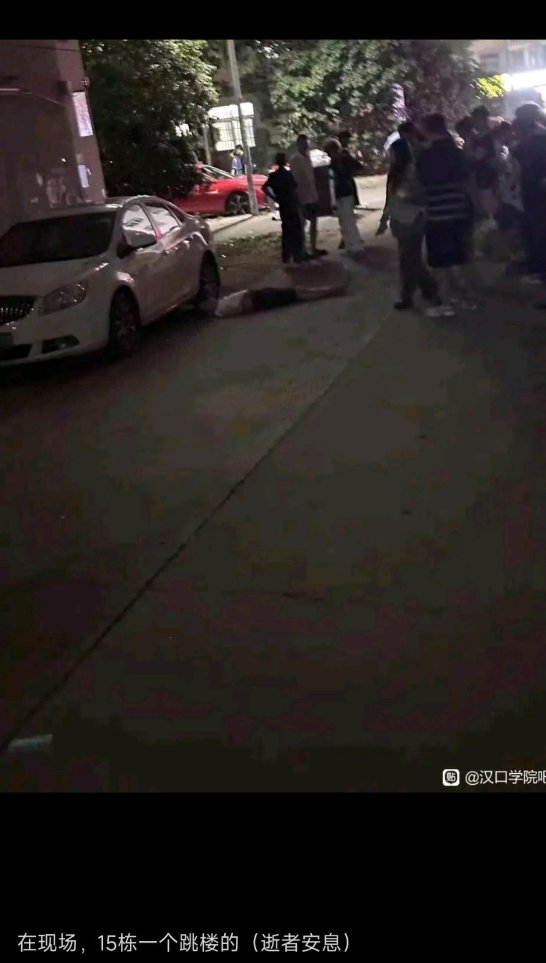
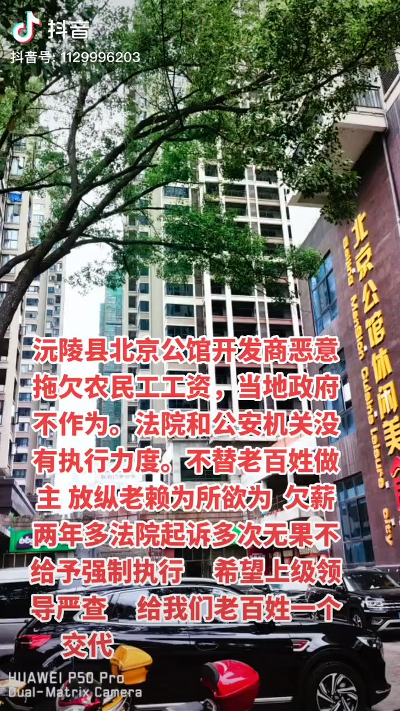
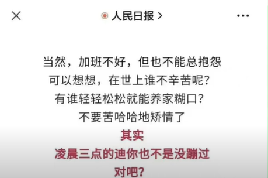
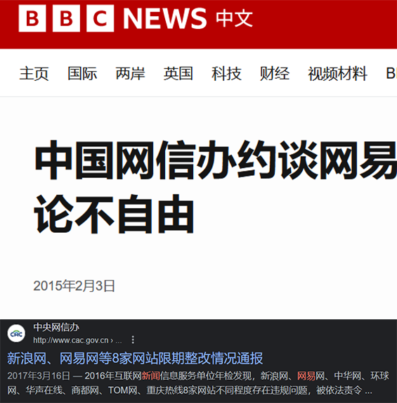
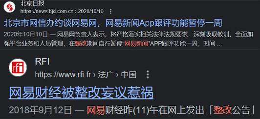
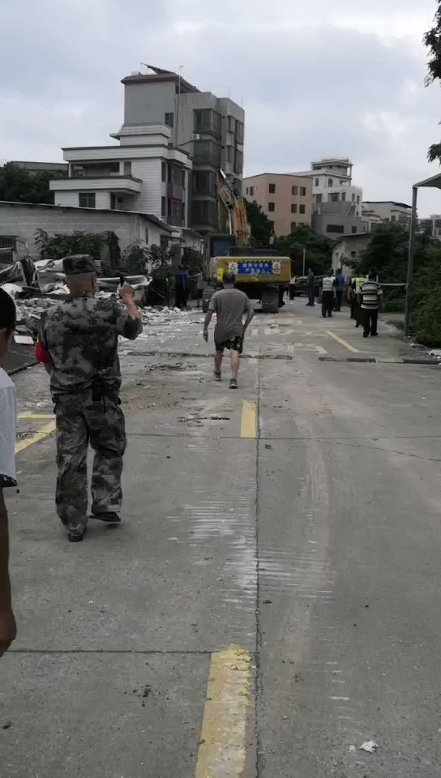
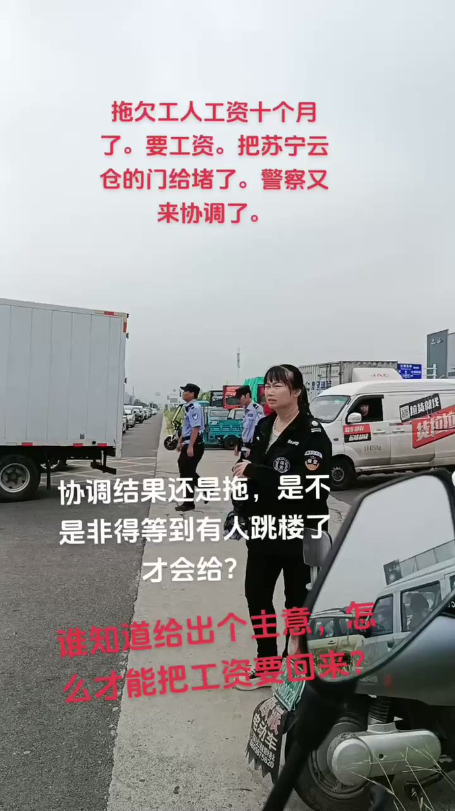
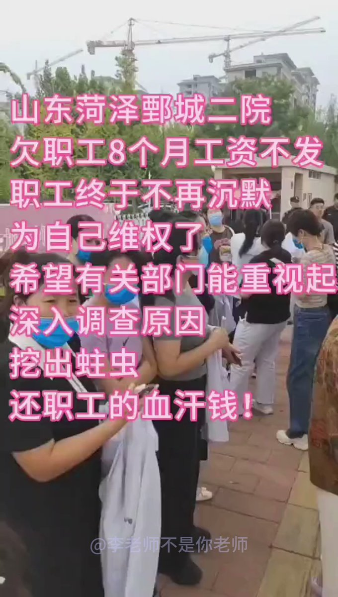
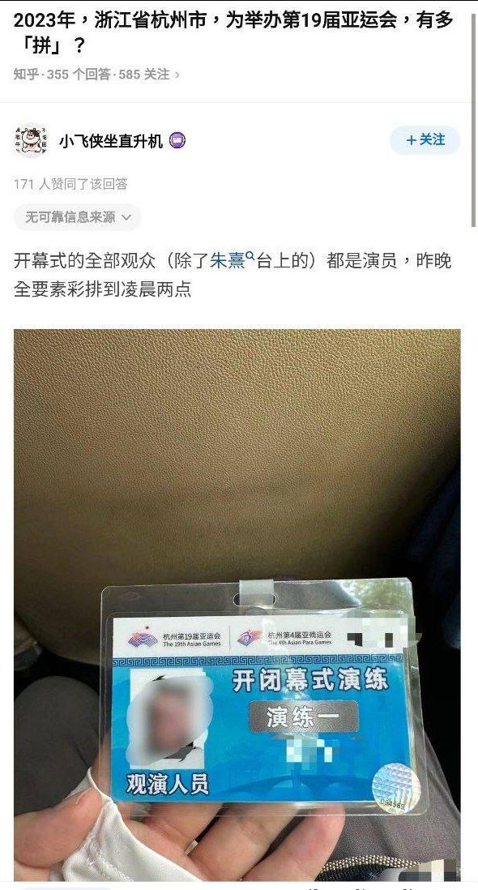

谁将十万横扫三江 北京时间 2023-09-13T18:51:15Z 1701911411256180881 RT @whyyoutouzhele: “我来帮学校改革”🥲
近日，武汉汉口学院，因学校强制大四学生实习但是之后以各种理由不给工资，一名大四学生最终选择从7楼跳下。
这名同学的遗言是：“我来帮学校改革” https://t.co/BGnTOA65D5   谁将十万横扫三江 北京时间 2023-09-13T19:53:08Z 1701926984622997702 湖南省沅陵县，一房产项目拖欠工人工资，走法律程序后无果
时间：2023-09-13

介绍：
【（转自视频作者视频）沅陵县北京公馆开发商恶意拖欠农民工工资，当地政府不作为。法院和公安机关没有执行力度。不替老百姓做主，放纵老赖为所欲为。欠薪两年多法院起诉多次无果，不给予强制执行。希望上级领导严查，给我们老百姓一个交代。】

地点：湖南省怀化市沅陵县辰州中街120号
行业：建筑业/住宅
公司名称：沅陵县京湘房地产开发有限责任公司
承包施工：长沙沅湘建筑装饰有限公司
企业性质：民营企业
项目名称：北京公馆
行动类型：要求劳动司法等机关介入
诉求：欠薪
参与人数：1-100
官方反应：政府不作为
资料来源：
https://t.co/785JVSsQXf
https://t.co/7hj2U1qSsL
https://t.co/ueFTwVuLkd   谁将十万横扫三江 北京时间 2023-09-13T15:25:13Z 1701859561844703445 RT @boiledwater: 9月12日，上海市胸科医院胸外科主任医师谭强回应李佳琦：上个月开了近80台手术，门诊约400多个病人，工资和奖金加起来大概4万出头，平均每台手术收入低于500块钱。

他说他做的食道癌手术，美国医生的费用是几万美金，他是-14000元。因为【医…   谁将十万横扫三江 北京时间 2023-09-13T18:11:52Z 1701901503337013296 RT @whyyoutouzhele: 上海市胸科医院胸外科主任医师发布视频，回应李佳琦这几年的薪资为什么没有涨
他说，自己平均每台手术的收入只有500块钱，比不上上海的高级理发师理一次发的收入。
“我努力了大半生，成为中国最顶级的胸外科医生，这样的手术，美国医生的手术费是几万…   谁将十万横扫三江 北京时间 2023-09-13T15:02:11Z 1701853765786308658 李佳琪的话错在它没有权力，在中国这是头等大事，同样的话如果是人民日报说出来，粉蛆一样会上赶着贴贴，经济这么好你工资不涨，从自身找问题吧。政治上失权还有钱，他如果对普通人感同身受，让你感觉是同路人，对党来说他才危险 https://t.co/2c2tif0rZi   谁将十万横扫三江 北京时间 2023-09-13T15:46:32Z 1701864925709353174 网易新闻，大约的确是死了

现在网易新闻的B站号仅UP关注的账号可评论，避免网友团建

据济南日报新媒体不完全统计，过去三年网易旗下产品至少被各地监管部门点名至少10次，最严一次是在一年前，网易湖南频道被撤销。以下是网易近年部分被点名记录：

——2023年8月，北京市教育委员会在其官微通报，北京网易有道计算机系统有限公司，暑期在“有道精品课”APP上开展学科培训，涉嫌无资质变相开展线上学科培训行为。市级“双减”专班已责令有关机构立即整改。

——2023年7月，针对快手、百度、网易等网络平台履行主体责任不力，对其用户发布的信息未尽管理义务，造成淫秽色情、封建迷信、诱导充值、为劣迹艺人辩护等有害信息在网上传播问题，国家网信办指导属地网信办分别依法约谈相关网站负责人，责令其限期整改，处置相关账号，从严处理责任人，并分别给予罚款行政处罚。

——2023年3月，北京网信办就网红虚构患“肝癌晚期”约谈相关平台，对网易网、凤凰网等属地重点网站平台清理违规信息48.5万余条，处置违规账号7.6万余个。

——2023年1月，据网信浙江消息，近期，浙江省网信办依据《个人信息保护法》《App违法违规收集使用个人信息行为认定方法》等法律法规规定，依法查处173款违法违规App。违法违规App名单包括网易邮箱、网易严选、网易云音乐、网易账号管家等。

——2022年9月，湖南省互联网信息办公室决定撤销网易湖南频道。该频道多次出现主要负责人变更不报备、总编辑制度不落实、内容管理不到位、违规外包代理给民营公司或个人、市州私设频道等问题。湖南省网信办认为其已不具备继续开设地方频道的相关基本条件，决定撤销该频道。

——2022年7月，据网信中国消息，针对网易花田、百合网、世纪佳缘等8家婚恋平台存在低俗色情信息破坏网络生态的问题，北京市、上海市、广东省、重庆市网信办分别对8家平台予以约谈，责令其全面清理排查违法违规信息，并分别予以罚款的行政处罚。

——2021年9月，中央宣传部、国家新闻出版署有关负责人会同中央网信办、文化和旅游部等部门，对网易、腾讯等重点网络游戏企业和游戏账号租售平台、游戏直播平台进行约谈。网易回应称，将认真学习并贯彻约谈精神。

——2021年3月，据网信中国消息，针对近期未履行安全评估程序的语音社交软件和涉“深度伪造”技术的应用，喜马拉雅、网易云音乐等11家企业被约谈。

——2021年2月，浙江省网信办依法依规约谈“丁香园”“同花顺”“网易云音乐”等网站。

——2020年10月，北京市互联网信息办公室针对“网易新闻”App、网易网“网易新闻”频道、“网易号”跟评环节多次传播违法违规信息等问题严肃约谈网易网负责人，责令其立即自查自纠、全面深入整改，严肃处理相关责任人。同时，北京市互联网信息办公室依法对网易网实施罚款等行政处罚。网易网负责人表示，在整改期间自行暂停“网易新闻”App跟评功能一周。   谁将十万横扫三江 北京时间 2023-09-13T09:34:29Z 1701771299000054070 亨漖村村民阻挠施工单位开工

2023年9月11日，广东省佛山市南海区大沥镇盐步东秀亨漖村上演“中国特色社会主义拆迁”。在回迁条件未谈妥、征地款和拆迁款未给的情况下，大沥镇政府公然让施工单位进驻亨漖村，进行开拆。果不其然激起民愤！更可悲的是，对政府进村拆迁事宜，亨漖村村长叶永南一问三不知，完全就是内应外合，沆瀣一气！   谁将十万横扫三江 北京时间 2023-09-13T12:20:06Z 1701812977715032394 9月12日郑州，苏宁云仓拖欠工人10个月的工资，工人把仓库的门给堵了 https://t.co/3131ScIJxz   谁将十万横扫三江 北京时间 2023-09-13T07:12:41Z 1701735611705799115 RT @whyyoutouzhele: 9月12日，山东菏泽市鄄城第二人民医院拖欠职工8个月工资，职工前往市委组织部，鄄城县人民政府讨薪。 https://t.co/wLTtKq6eu9   谁将十万横扫三江 北京时间 2023-09-13T09:11:21Z 1701765475976577373 湖北随县“特校校长性侵案”再起波澜：律师依法阅卷，被法院关入羁押室

编者按：
湖北随县“特校校长性侵案”，自新京报今年6月发布《湖北随县博爱特校性侵案调查》报道以来，持续引发社会公众关注。

据新京报此前报道，2018年9月至2022年5月期间，湖北随县博爱特校校长刘爱业涉嫌性侵多名残障女孩。2022年12月，随县法院一审判决，被告人刘爱业犯强制猥亵罪，判处有期徒刑三年六个月；禁止从事密切接触未成年人的工作。

据受害者陈思思（化名）亲属介绍，报警后，陈思思第一时间向警方告知了自己曾被“强奸”的情况，在第二次做笔录时，陈思思详细陈述自己被“强奸”的经历，但未得到法院的认定。

一审法院的判决认定事实是否清楚、罪名是否准确、量刑是否适当，引发了公众质疑。
随后，6月17日，随县人民法院发布通报称：近日，网上发布了关于随县博爱特校刘某某强制猥亵案的相关信息，我院高度重视，第一时间成立工作专班，正对该案件进行全案审查，最新情况将及时向社会公布。

8月29日，新京报再发报道称，此案将于9月4日再审开庭，案由为“强奸罪”。
9月11日，该案再起波澜。被害女生的委托律师，四川鼎尺律师事务所律师万淼焱、邹林衫，今日
在随县法院阅卷时，遭到法院工作人员粗暴对待；万淼焱律师介绍，在依法阅卷时，

她与同事被强行关进法院的临时羁押室达2个小时之久，且手机至今被扣押。
万淼焱律师表示，就随县法院严重侵犯律师权益的行为，已向四川省司法厅、成都市司法局汇报。
以下为万淼焱律师对此次事件的详细陈述。
‍
《实名举报湖北随县特校校长性侵案中存在徇私枉法或玩忽职守，并刘爱业存故意杀人嫌疑，及随县法院院长李承、副院长刘芳铭指使法警将被害人律师关进犯罪人羁押室并扣押手机的重大违法犯罪线索》

中央政法委、最高法、最高检、司法部、全国律协：
我是四川鼎尺律师事务所万淼焱律师，律师执业证号：15101201011959178，今年8月30日事务所接受随县博爱特教学校校长性侵案两个智力障碍未成年被害人周晓若、张阳阳（均系新京报首发报道时的化名）监护人委托，指派我和同事邹林杉律师一起免费援助。
我现实名举报在刘爱业强奸、强制猥亵案中，当地公检法存在徇私枉法或者玩忽职守嫌疑，并且有知晓刘爱业性侵事实的12岁未成年人离奇死亡的案中案，并湖北省随县法院院长李承、副院长刘芳铭在今天指使法警（有至少三个执法记录仪和法院档案室监控摄下，法警们说是院长的命令）将我和邹林杉律师

关押在地下羁押室近两个小时、非法扣押我们手机的情况。
8月31日我们事务所向随县检察院提交全套委托手续。9月6日到达随州，9月7日上午9时从监护人手里接过周晓若和张阳阳，陪同看博物馆玩旋转木马，带着吃饭一起住酒店。朝夕相处下来，我们发现两名女孩有作证能力，对刘爱业的多次强奸行为可以用动作演示，而这些动作演示非亲身经历不可能表现。所以，我们在9月8号又向随县公安局和法院提交了委托材料，并向随县公安局提交了《对刘爱业强奸、强制猥亵案补充部分证据的申请》，旨在请求公安机关在补充侦查中保障不再对两名存在智力障碍的未成年被害人造成继续伤害，同时也保证到侦查活动的合法性和有效性。
但我们提出的复制对刘爱业以强制猥亵罪判3年半有期徒刑的审判正卷，以及检察院对已经以强奸漏罪补充起诉且于9月4日开庭的案卷的正当合法要求，却一直在被推诿。
一、本案还有案中案，望司法高层予以彻查
在周六（9月9日），我们又见到了三名被害人中年纪最大的全盲女孩陈思思（系新京报报道时的化名，现年19岁）。陈思思向我们讲述了两件与本案密切相关的重要事情：
（1）在博爱特校交由她管教的多动症女孩巧巧（系之前的媒体化名），因录制刘爱业猥亵陈思思视频，浑身是伤后被迫离开学校，且回家不久后离奇掉进池塘淹死，殁年12周岁。
巧巧只是好动调皮，但智力正常、身体也健康，没有任何残疾，但在博爱特校里却被搞得浑身是伤。巧巧爷爷还曾带着巧巧到随县教育局、随州市教育局去反映过情况。
据陈思思报案笔录，巧巧也遭受过刘爱业猥亵。巧巧用陈思思手机多次拍下陈思思被性侵的视频，刘爱业多次把陈思思手机抢过去删除并恢复出厂设置。在2021年秋，巧巧曾把陈思思被猥亵的视频当着刘爱业的面播放。没过多久，巧巧因浑身是伤被爷爷接回家。2022年正月27，巧巧离奇地在家附近的池塘里淹死。寒假结束，陈思思和周晓若一到学校，就被刘爱业告知巧巧已经死亡。
巧巧生下来妈妈就难产而死，爸爸是哑巴，据说现在洗车场洗车。带着巧巧去教育局的爷爷在巧巧淹死之后，也气病而亡。
我们认为，巧巧的离奇死亡，无法排除是刘爱业害怕性侵罪行败露而为的故意杀人。因为刘爱业曾经对陈思思、周晓若都说过：“你们就算报案了，警察在来的路上，我打一个电话回去，他们也会掉头走。”
据我们目前所看到的部分案卷材料中反映，随县公安局是以刘爱业强奸、强制猥亵案（审查起诉意见书中，报请事实为陈思思、周晓若、张阳阳遭受猥亵，陈思思被多次强奸）移送审查起诉，而到了提起公诉时却改变为仅是指控刘爱业犯强制猥亵罪，随县法院也按检察院的量刑建议，判刘爱业犯强制猥亵罪，判处有期徒刑三年。
（2）陈思思哥哥曾经交给随县公安局两个曾经录制刘爱业强奸猥亵她的视频的手机，还有一个录音手表，请求恢复其中的数据进行取证。但在刘爱业强制猥亵案判下来后，公安局返还了一个手机，另一个手机和录音手表，都说搞丢了，各赔了一个新的！
我们看到的案卷中，根本没有对陈思思提供的两个手机、一个录音手表的的扣押清单。
由此，现公开实名举报刘爱业有故意杀人重大嫌疑，以及随县公检法在办理刘爱业强奸、强制猥亵案中存在徇私枉法或者玩忽职守之犯罪线索。

二、在我们要求阅卷，被各种推诿后，法院院长命令法警把我们关进羁押室
我们在周五便向随县公检法分别提交了全套代理手续，也向检察院和法院提交了查阅复制案卷介绍信。
随县行政机关、司法机关均是下午17时30分下班。周五下午17时27分我们到达法院诉讼服务中心，就已经关灯，大厅里只有一个已经换上便装的女工作人员赶我们走，说她要去乘交通车，而且振振有词：“我们5点半下班，可是现在我赶不上公交车，谁负责！”，经过争执，该女工作人员收下我们的材料。
今天早上我们9点多便到随县法院，继续按要求依刑诉法规定查阅复制刘爱业强制猥亵案的副卷以外的全部案卷。窗口给了前后两个承办法官的电话均听了几句就挂断后，到了中午11时许，周五收我们材料的女工作人员又跟出来，说猥亵犯罪事实部分已经审结归档，让我们到档案室复制审理正卷。
到了档案室，又被两名女工作人员刁难。经过反复据理力争，我们终于在11时45分看到了刘爱业强制猥亵案的公诉案卷。公诉卷一共两本，加起来不超过200页，且没有任何随案移送的物证。（但目前是随县检察院以漏罪方式对陈思思遭受强奸部分补充提起了公诉，仍然是同一个案件，强奸事实部分尚在继续审理中）。
档案室答应把案卷打印给我们，却称打印机坏了不能打印，于是邹律师用我们的便携高拍仪扫瞄仅60多页的案卷，我则查阅厚的案卷。
不到12点，档案室工作人员便称要吃午休吃饭要求我们离开，我们说明被害孩子们尚在酒店等我们。且已跟检察院和公安局约好要在今天下午对两名智力障碍被害女孩进行现场模拟指认式的一站式询问，检察院说好我们应当在场，而且我们也没吃饭，希望继续扫瞄复制案卷。
档案室工作人员一通汇报电话后，12时15分左右，六七个法警忽然闯进来，要求查看我们的手机，声称我们违反了法院的规定擅自录音录像。
事实是，我们当然没有录音录像。
一名胖法警夺过我的手机进行查看，翻完整个9月的全部照片已经查看到我8月份时的所拍的照片相册中，（要点开我其他案件的法律文书），我要求返还。该男法警仍然猛力指骂我，在其手已经接近我的胸部的情形下，我大声斥责“滚，你们这是违法行为！”。男法警要求我道歉，连数三声我仍然不道歉。胖男法警出去很快回来，丢给我一份《最高人民法院关于依法维护人民法院申诉信访秩序的意见》，上面还在第七条处有黑笔勾划。我当即指出：“我们不是申诉信访，是依法行使律师阅卷权。”胖男法警一声令下，一众男法警冲上来强行抢走我们的手机，要把我和正在扫瞄案卷的邹律师带走。我问是谁命令的，胖男法警称是院长。
因他们已经准备要扑倒我们给戴手铐，我和邹律师没有做反抗，仅是邹律师要求自己走，但仍被两名法警一边一个地如同抓捕嫌犯一样反扣，左手被法警向后强拽造成淤伤。

我在12时28分，被带往地下室的楼梯上，赶紧发出了一条微信朋友圈：“随县法院法警诬陷我们录音，想要抓我们”。
之后，我们被一人一间地关进了法院对刑事案件犯罪人候审羁押时的临时羁押室！
被关进羁押室后，我便要求给予司法拘留决定书，胖法警得意地说：“正在制作，马上会给你。”我大喊：“要司法拘留请给文书，并立即通知到我所属的律师协会！”
大约中午13时15分，有法警来问邹律师：”你不是要复制案卷吗，你马上去复制吧“，邹律师要求把非法扣押的手机先还回来，我也索要司法拘留决定书，再问是谁同意他们这样做的，得到的回答仍然是院长。
大约13时30分，来了一名穿便装的男子，于是把我们从小间的羁押室放出来，但羁押室的大门仍然由几个法警把守着。该男子自称是副院长，姓刘，要跟我们对话。我们仍然要求先还把非法扣押的手机带回来。副院长忽悠不到位，很快离去。
很快，近下午14时许，换了另一个穿便装的胖男人来，一来就自我介绍“我叫李承，是院长兼党组书记”，院长再次拿出《最高人民法院关于依法维护人民法院申诉信访秩序的意见》，我仍然直接指出：“这是申诉信访的规定，我们是律师依法阅卷！”

（这就是院长把我们当在审罪犯关羁押室的“法律依据”）
仍然称要同我们“对话”。我要求先还回手机，于是我的手机被人拿了过来。我接过手机大声说：“这里是羁押室，你们非法羁押我们，我会向最高法、最高检、中央政法委报告，你们包庇刘爱业、枉法裁判今天又把我们当在审罪犯关押，你们会承担责任！”这时，我的手机正好有打电话过来，我正要接听，手机又被抢走。
再后来，院长带着一众人员自行离开。数分钟后，我和邹律师自行走出地下羁押室，到法院外面没有手机连车都打不到，在路边拦下一辆过路的小车载我们回到酒店。
下午14时30分，回到酒店，三名被害孩子仍在等着我们。
张阳阳爸爸上午以为下午要给女儿做场景式模拟指认询问而赶到随县。而自16时起，周晓若伯母（指定监护人）一直接到从村上、镇上到县上的几十个电话，说查问她为什么要请律师，而且“案子都还没有判完，你就请律师干什么呀？”
以上内容，句句皆实。随县法院内发生的一切，至少有十个以上摄像头、五六个法警身上的执法记录仪摄录。
我和邹律师的手机，至今仍被随县法院非法扣押着。
此公开实名举报，我和同事邹林杉律师愿意承担一切法律后果。恳请国家级司法层面和各新闻媒体关注。
四川鼎尺律师事务所万淼焱律师

2023年9月11日‍‍   谁将十万横扫三江 北京时间 2023-09-13T09:54:16Z 1701776278381281409 杭州亚运会开幕式全员演员，彩排到凌晨 https://t.co/qarn0wVi3I   