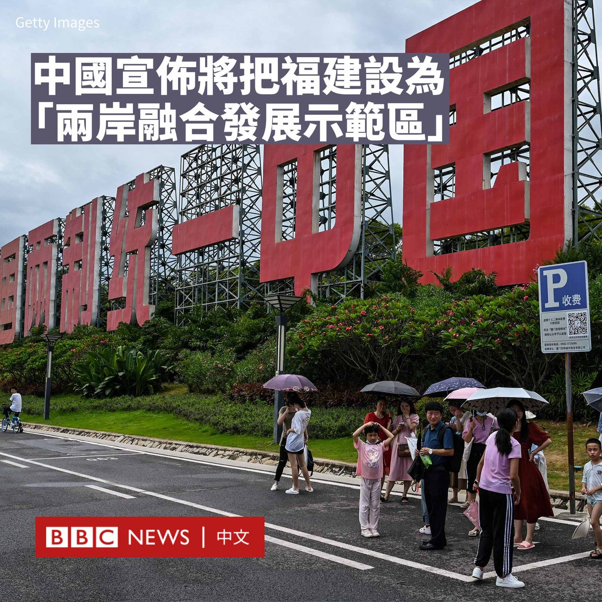
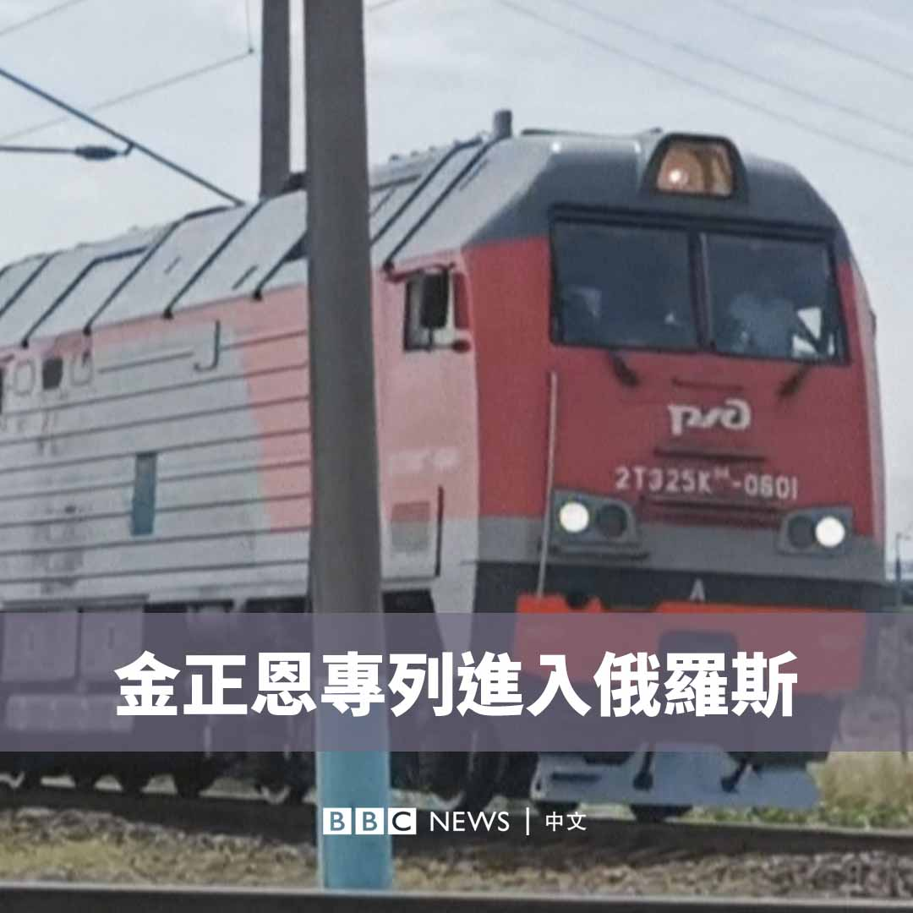
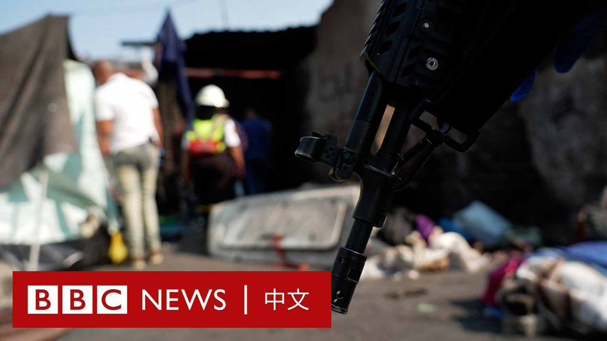
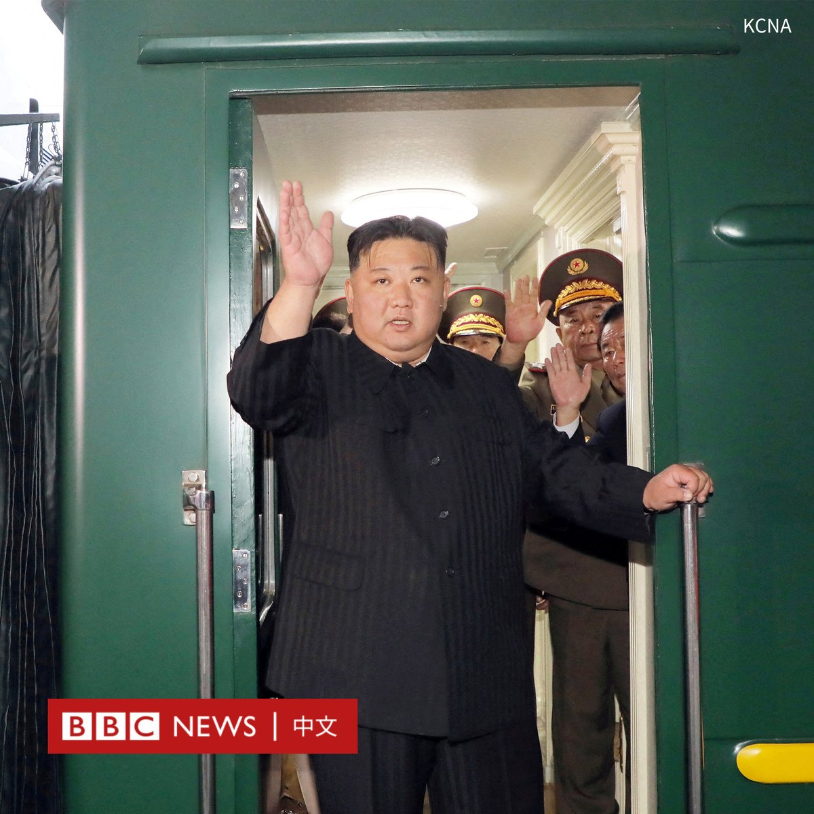
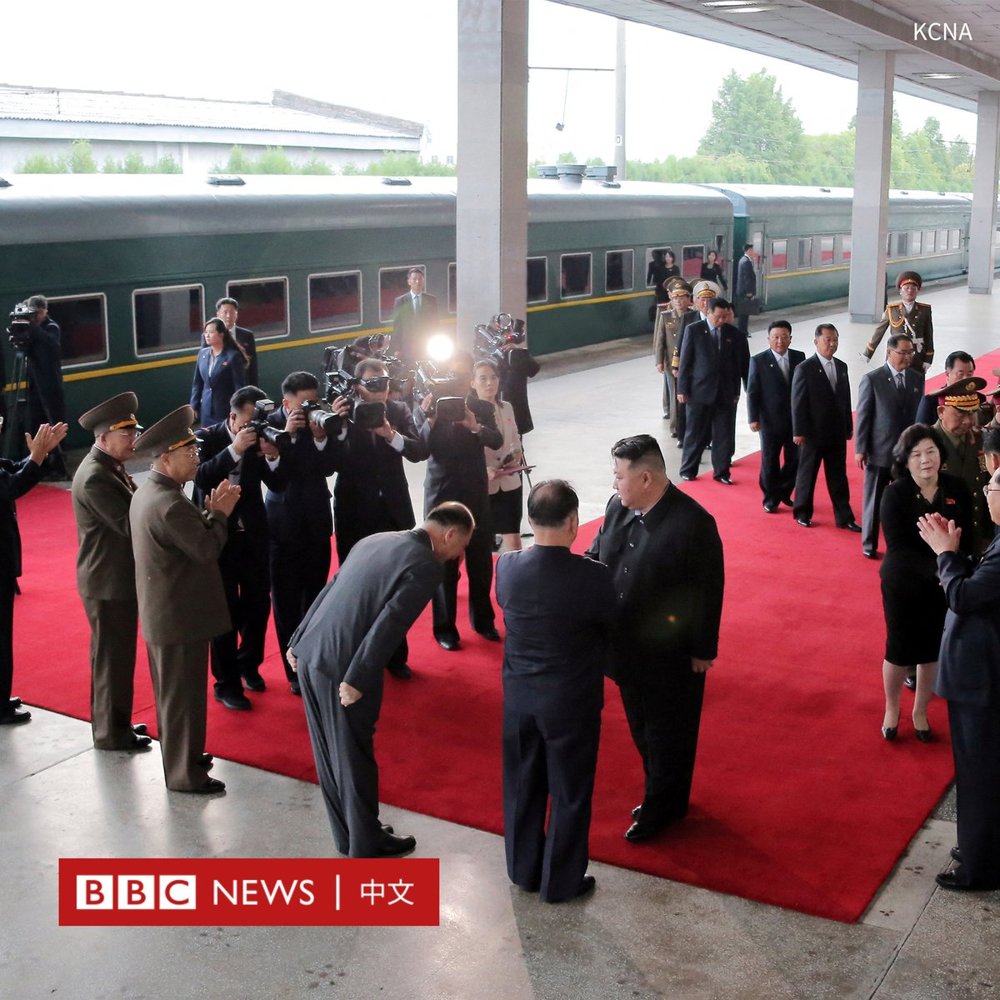
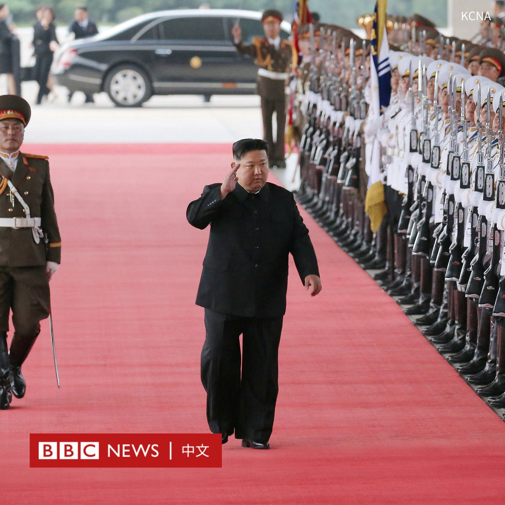
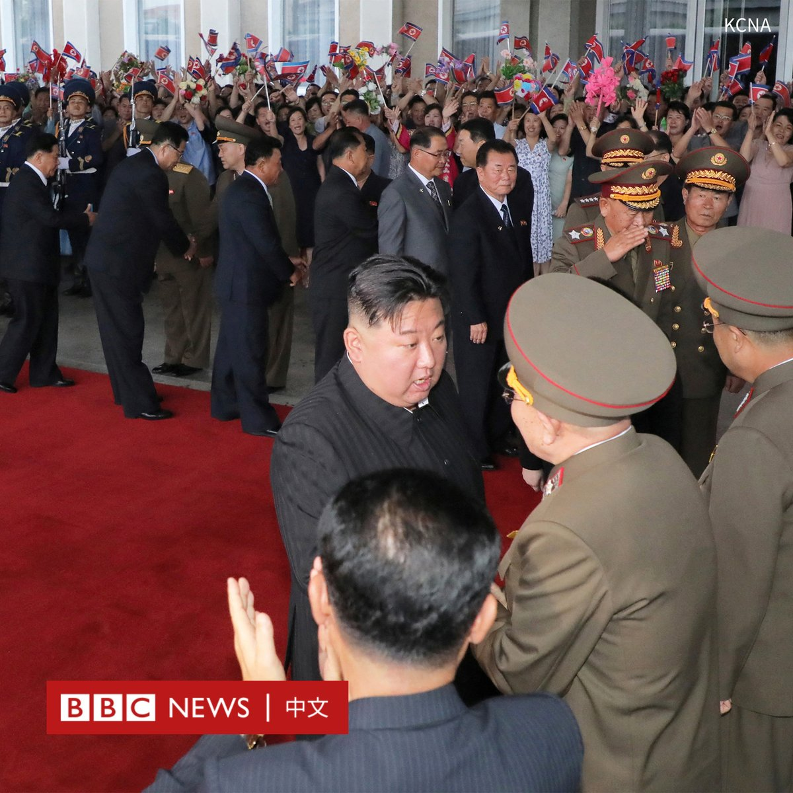
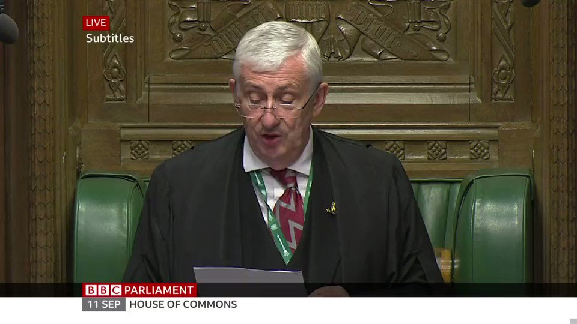

D英国广播公司BBC 北京时间 2023-09-12T20:13:41Z 1701569770943066475 中国宣布在与台湾隔海相望的福建省建设“两岸融合发展示范区”。这是在两岸关系紧张之际，北京进一步表明其将谋求实现“统一”台湾的信号。

官方新华社周二（9月12日）刊发了这份署名中共中央和国务院的“意见”，其中提及将鼓励台湾人来福建就业、学习与落户等。

当局还表示将推动厦门与金门、福州与马祖的“融合发展”。金门和马祖是台湾当局管辖下，距离中国大陆最近的两个离岛地区，也长期是两岸之间军事对抗的最前线。

文件写道，将打造厦金和福马“同城生活圈”，实施金门和马祖居民分别在厦门和福州享受当地居民待遇，推进厦门与金门以及福州与马祖“通电、通气、通桥”。

2021年，中国当局首次在国家规划中提到“两岸融合发展示范区”一词，但此次首次公布了具体措施。

文件称，拥有4000万人口的福建省在对台工作全局中“具有独特地位和作用”，要努力将福建建设为“台胞台企登陆第一家园”。

台湾陆委会此前就“两岸融合发展示范区”计划回应称，中国的宣传不符台湾民意期待、矮化台湾的统战与政治主张，“此举毫无意义，也徒劳无功”。   D英国广播公司BBC 北京时间 2023-09-12T17:25:14Z 1701527378554482918 华为在美国商务部长雷蒙多访华之际无预警地发售Mate 60 Pro手机，其搭载的晶片似乎是迄今为止中国本土技术的最先进版本，这在中国掀起抢购热潮。

许多中国网民将雷蒙多戏称为华为手机的“代言人”，指这款手机证明了中国半导体不会被美国的封锁打垮。https://t.co/BmfP3O2toa   D英国广播公司BBC 北京时间 2023-09-12T12:52:22Z 1701458708180369544 两国领导人的会晤预计最早将于当地时间周二进行——不过克里姆林宫的声明指，会面也有可能在“今后几天”内进行。
https://t.co/ymByops2xa   D英国广播公司BBC 北京时间 2023-09-12T15:52:41Z 1701504085839773947 俄罗斯官方通讯社俄新社发布了据信载有朝鲜领导人金正恩的专列，行驶在俄罗斯远东滨海边疆区的画面。 https://t.co/JOAtrwWk4e   D英国广播公司BBC 北京时间 2023-09-12T14:07:25Z 1701477597543301134 上月底，南非最大城市约翰内斯堡的一栋建筑起火，造成至少76人死亡。

这栋建筑在当地被称为遭“劫持”的住宅，意为该建筑是被帮派非法控制和出租。这在约翰内斯堡并不罕见，数十座房屋都出现了类似情况。

BBC来到紧邻火灾现场的另一座被“劫持”建筑，了解其内部的情况。 https://t.co/a9iP1P36Y7   D英国广播公司BBC 北京时间 2023-09-12T11:25:40Z 1701436888337526913 【最新消息】据俄新社报道，朝鲜领导人金正恩已抵达俄罗斯边境城镇哈桑（Khasan）。俄方在这个位于滨海边疆区的车站为金正恩举行了欢迎仪式。

俄罗斯记者发布的画面显示，金正恩的专列由带有俄罗斯铁路标志的机车牵引。

据估计，从哈桑到符拉迪沃斯托克（海参崴）可能还需要五、六个小时。

在金正恩执政的12年里，他仅有七次外访记录，包括四次前往中国，另外三次前往俄罗斯、越南和新加坡。   D英国广播公司BBC 北京时间 2023-09-12T08:56:36Z 1701399376227369202 俄罗斯和朝鲜当局周一（9月11日）证实，朝鲜领导人金正恩将对俄罗斯进行访问。

官方通讯社朝中社周二报道称，金正恩在周日下午从平壤启程。一些朝鲜高级官员前往送别。

据韩联社引述韩国政府官员称，与2019年4月金正恩访俄时相同，金正恩的绿色“太阳”号专列朝向东北的符拉迪沃斯托克（海参崴）方向行驶。

金正恩的火车时速被限制在约每小时60公里，因此前往符拉迪沃斯托克可能耗时二十多个小时。

这是金正恩在四年多来首次进行国际访问，他预计将与俄罗斯总统普京（Vladimir Putin）会面。

美国官员早些时候表示，两位领导人可能会讨论朝鲜向俄罗斯提供武器以支持其在乌克兰战争的可能性。   D英国广播公司BBC 北京时间 2023-09-12T00:20:32Z 1701269503592849867 【现场画面】英国下议院议长林赛·霍伊尔爵士（Sir Lindsay Hoyle）就媒体报道有英国议会研究员因涉嫌为中国从事间谍活动而被捕一事发表声明。

他表示媒体报道提出的问题“正在得到解决”，并补充说：“我们随时审查我们的安全安排，以应对不断变化的威胁”。

“这是一项正在进行的敏感调查，议员们应当明白公开讨论是完全不合适的。”他说道。

此前，这名研究员通过律师发表声明回应称，他感到在“被迫回应”媒体的指控，并表示自己“完全无辜”。   