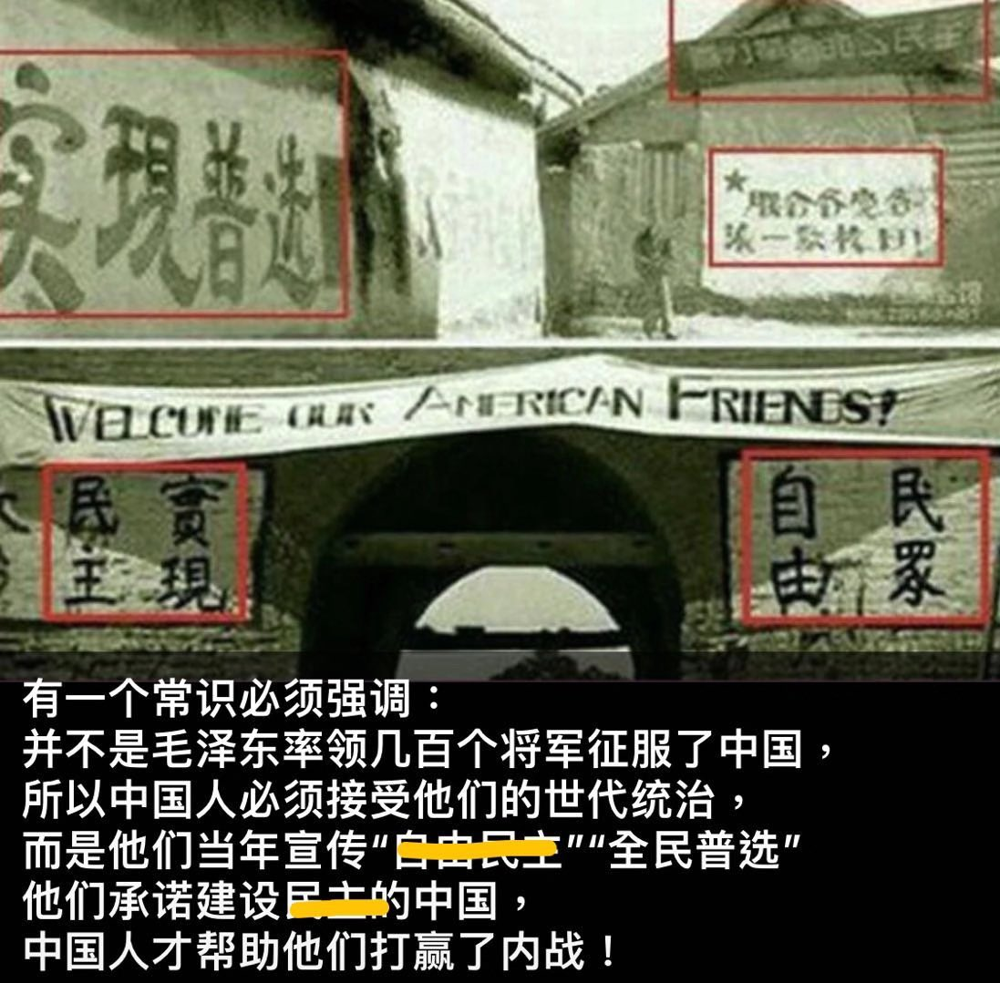
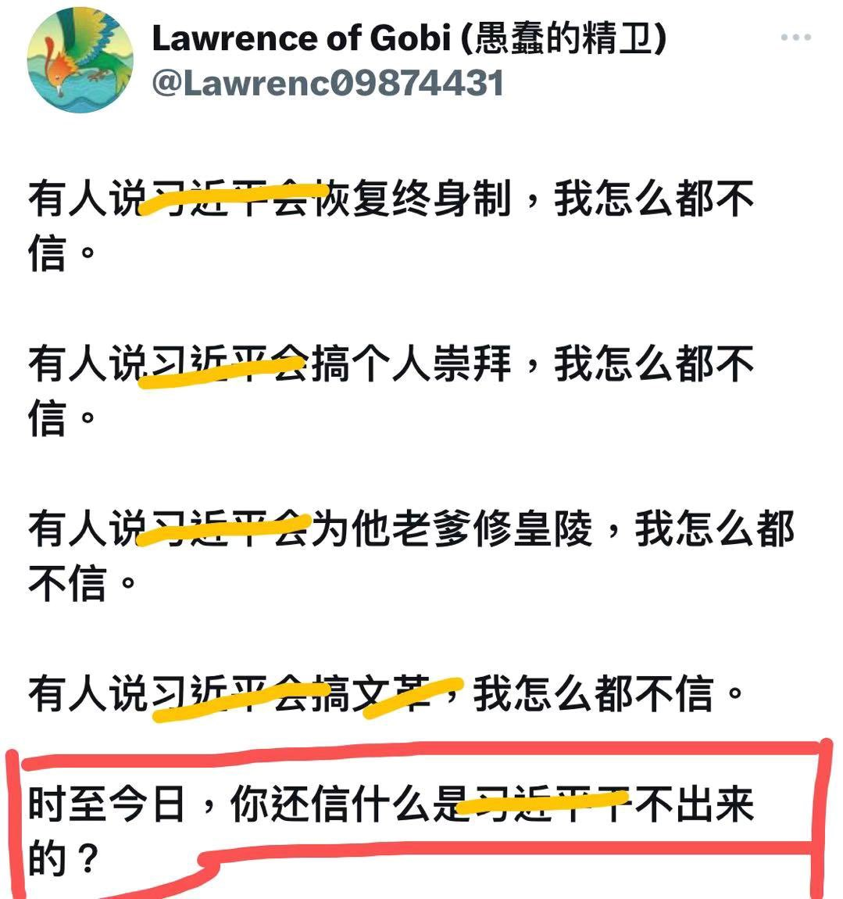
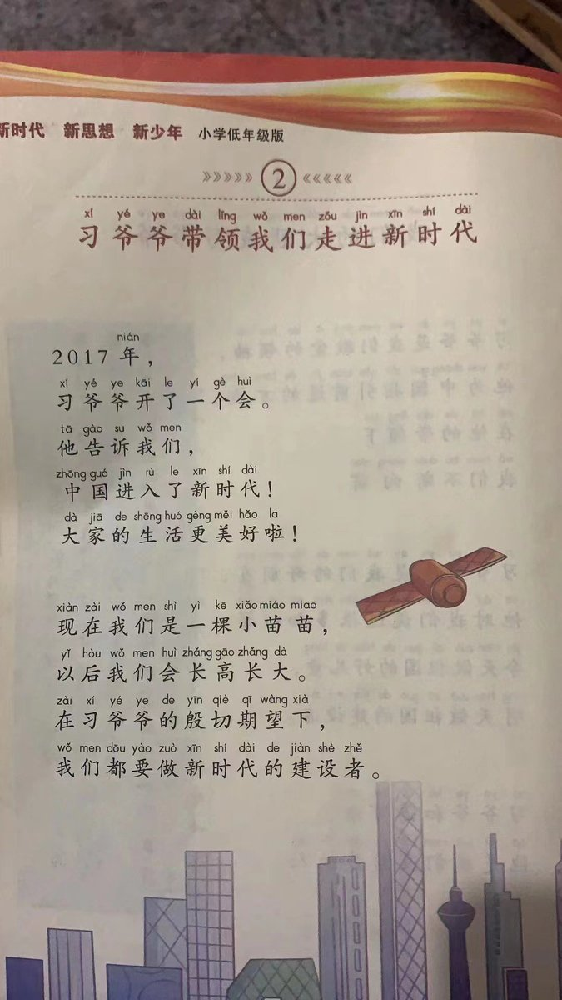
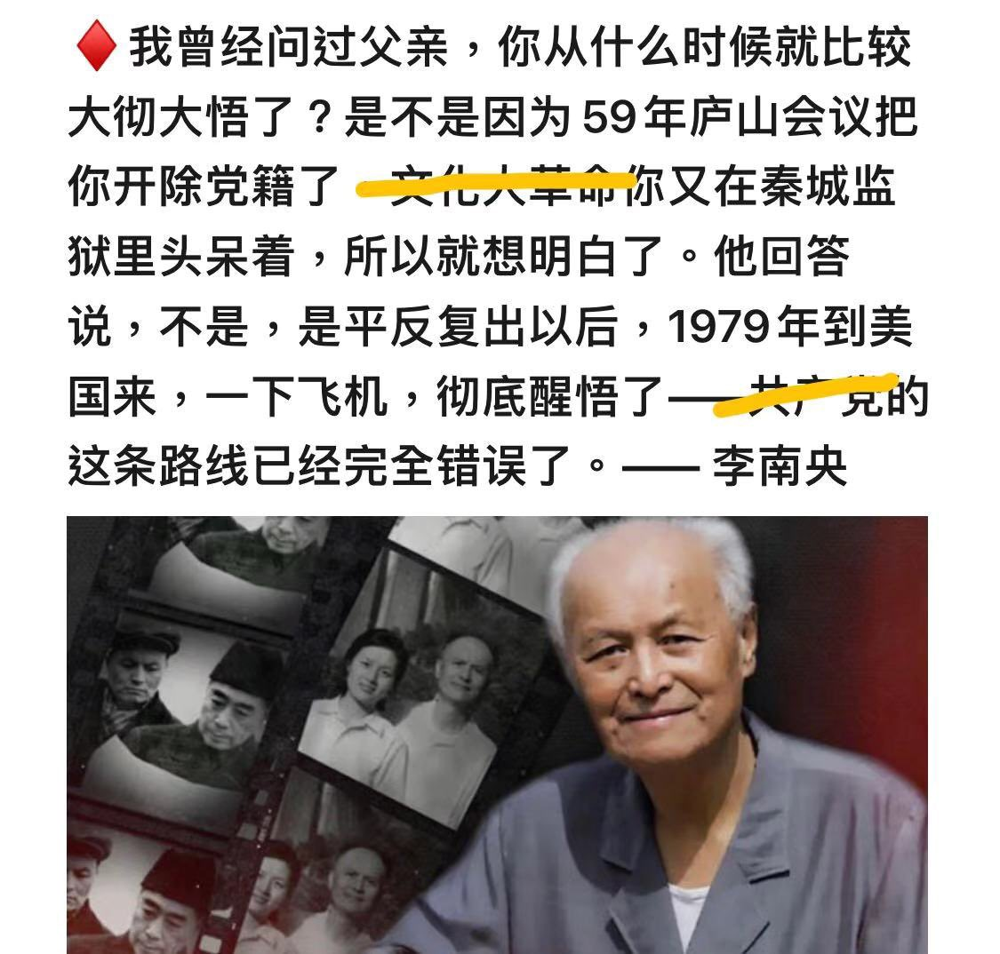
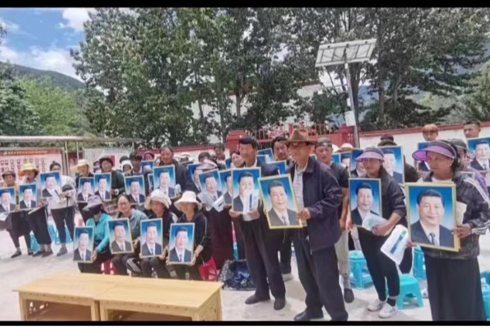
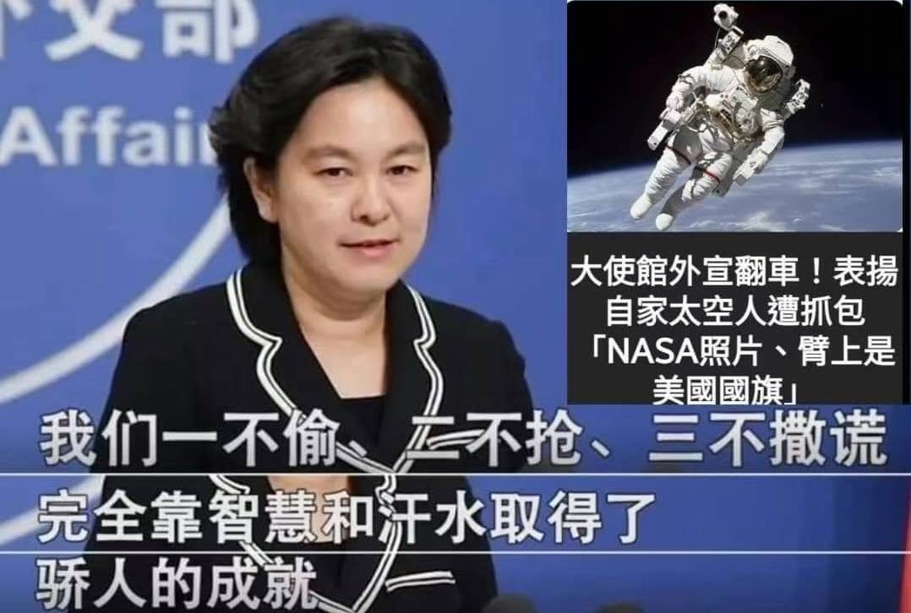

Petrichor 北京时间 2023-09-12T04:35:43Z 1701333722203599048 言而无信，就是骗子。
窃国大盗，上去下不来。 https://t.co/xRXMJPxZku   Petrichor 北京时间 2023-09-12T04:50:13Z 1701337371642404919 信不信，那是大脑好不好使的问题。
等吃不饱饭和失去人身自由之时，醒悟就晚了。 https://t.co/Utm0LFMMHC   Petrichor 北京时间 2023-09-12T00:13:43Z 1701267787769921580 在习近平东升西降的外交政策下，美国对美中力量对比的判断已经发生了根本变化，美国完成了外交上对中共的围堵，军事上第一岛链固若金汤，经济科技上碾压中共而中共正面临建政以来最严重的执政危机。正如布林肯说的，美国凭实力与中共打交道，若中共不守规矩，美国不再对中共客气。

几乎与此同时，英国下议院在一份报告中称：“台湾已经是一个独立的国家，名称为中华民国。”更说“台湾拥有一个国家的所有品质，包括常住人口、确定的领土、政府以及与其他国家建立关系的能力；它所需要的只是更多的国际承认。”这比美国又更进一步，直接承认中华民国为主权独立的国家。

美英对中共的空前挑衅，中共只作了口头反应。今非昔比，习近平治国无能，已经无力反击，无形中鼓励更多国家仿效。打不得，和不成，越发威信扫地。他主动下台，中国或许还有救，否则中国进入落后挨打的新时代。   