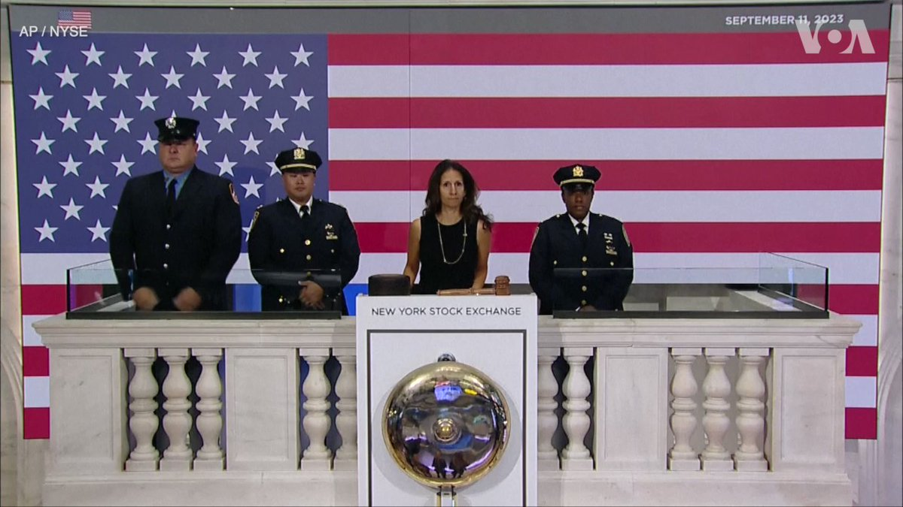
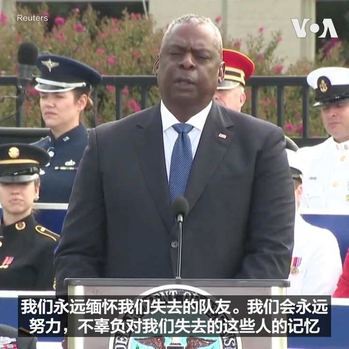

美国之音中文网 北京时间 2023-09-12T02:51:15Z 1701307432742559833 9月10日，中国直播带货主李佳琦在网友抱怨产品太贵时回怼：“这么多年工资涨没涨，有没有认真工作？”引爆网友怒潮，李佳琦已发微博道歉，评论区内涌进许多打工人不易的声音，称工资低是“大环境如此”。去年6月李佳琦因为展示一个坦克冰淇凌蛋糕，碰触六四红线而被消失三个月。您怎么看李佳琦最新事件？ https://t.co/Ey1IDhAftL   美国之音中文网 北京时间 2023-09-12T02:54:55Z 1701308356731007329 【家事国事天下事，你有何见解】
纽约时报报道：中国恶化的经济前景和营商环境使跨国企业高管们的立场日益转向谨慎。但撤离可能意味着在未来的全球竞争中失去优势，因此跨国企业仍难以离开。这一报道凸显出在中国经商的跨国企业所面临的伦理道德和商业筹谋的纠结。这种纠结是否有解？有怎样的解？ https://t.co/zl2tzRR4v2   美国之音中文网 北京时间 2023-09-12T03:49:19Z 1701322046071046245 【家事国事天下事，你有何见解】
该流不流，扒房牵牛；流下来，打下来，就是不能生下来...。在人们对严酷的计划生育政策及做法仍记忆新鲜时，中共领袖习近平发令鼓励军队人员多生孩子，北京也号召年轻人多生娃。中共在下一盘什么大棋？考验中国人的记忆力？考验他们的基本智商？或者是考验……？ https://t.co/fPd95h3XwW   美国之音中文网 北京时间 2023-09-12T00:31:34Z 1701272279978835989 勿忘伤痛，美国纪念911恐怖袭击22周年 https://t.co/Q1fOYKviqQ   美国之音中文网 北京时间 2023-09-12T00:52:24Z 1701277524603576588 纽约证券交易所（NYSE）9月11日早间开盘后，交易大厅内全体人员肃立默哀，纪念9/11事件22周年。当天，位于世贸中心遗址的纽约9/11国家纪念博物馆也举行活动，悼念死于9/11恐怖袭击的近3千名遇难者。报道：https://t.co/qJj3HKyT0t https://t.co/HzBzh0ogjQ   美国之音中文网 北京时间 2023-09-12T01:14:34Z 1701283101023019280 乌克兰反攻战果：乌军夺回克里米亚附近几个海上油气钻井平台 https://t.co/uxNw5QXeTf   美国之音中文网 北京时间 2023-09-12T01:28:09Z 1701286519624048732 那些不为人知的被关押在中国的美国公民 https://t.co/HiAM87Iyil   美国之音中文网 北京时间 2023-09-12T01:44:09Z 1701290545354776870 中国足球界反腐不断，腐败不止 https://t.co/i2RsTrqlFx   美国之音中文网 北京时间 2023-09-12T01:57:06Z 1701293805440475270 香港世纪暴雨后多区严重山泥倾泻 豪宅被揭僭建各界质疑执法双重标准 https://t.co/f6zBfbyYOI   美国之音中文网 北京时间 2023-09-12T02:11:32Z 1701297438836007295 “911提醒我们美国精神历经考验依然闪耀“，美国国防部长奥斯汀11日在五角大楼的911纪念活动上说。2001年9月11日，被恐怖分子劫持的美国航空公司77号班机撞击五角大楼，机上的64人和五角大楼的125人死亡。在纽约世贸中心遗址的911纪念馆以及美联航93号航班坠毁的宾州尚克斯维尔等地今天也举行纪念活动。 https://t.co/flobIj2C68   