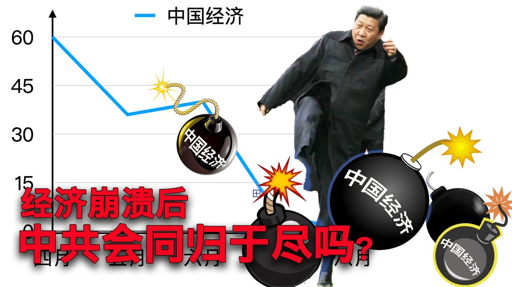
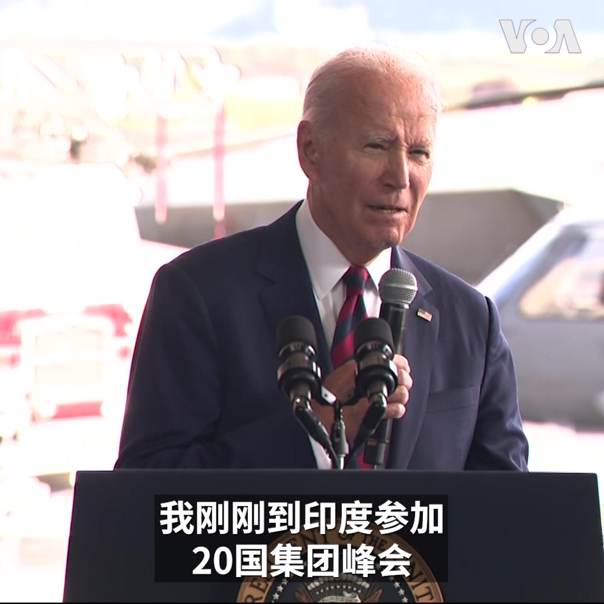

美国之音中文网 北京时间 2023-09-12T18:07:34Z 1701538033298968702 碧桂园股价飙升 消息人士称因境内债展期通过 https://t.co/xvXe09vyiH   美国之音中文网 北京时间 2023-09-12T15:12:05Z 1701493871031828543 金正恩抵达俄罗斯 韩国总统再呼吁中国负责任遏制朝鲜 https://t.co/9mLTj3AfDx   美国之音中文网 北京时间 2023-09-12T14:11:34Z 1701478641472000218 承诺强化美日同盟 美国海军陆战队副司令访日 称中国导弹威胁重大 https://t.co/k6vnVYDrf6   美国之音中文网 北京时间 2023-09-12T07:00:32Z 1701370165907366342 美越建立“全面战略合作伙伴关系”，昔日宿敌变战略伙伴，美中则从战略伙伴转为劲敌，美中越关系翻转对中国有何影响？金正恩与普京会晤，传出以砲弹换核武，金普会各取所需，背后有无中共默许？如何牵动美中博弈与乌克兰战局？美东时间周二上午9点时事大家谈欢迎留言参加讨论。 https://t.co/wnCjkmAQOR   美国之音中文网 北京时间 2023-09-12T08:27:05Z 1701391947787862206 美国纪念9/11事件22周年,拜登呼吁全国团结守护民主 https://t.co/Qu1c4Wj9xG   美国之音中文网 北京时间 2023-09-12T10:28:34Z 1701422520635895812 9/11恐袭周年之际，美国称阿富汗境内“基地”组织几乎覆灭 https://t.co/bPdWIPL73e   美国之音中文网 北京时间 2023-09-12T10:47:31Z 1701427291673485475 一键解锁 #美国热搜 榜 1、经济崩溃后中共会同归于尽吗？2、习近平解决青年失业的终极手段是暴力镇压3、周小平开撕胡锡进，王芳事件继续发酵4、天津公交没钱发工资 5、小学生进校门需要安检6、中学生强制留短发7、军队文工团跳新时代忠字舞8、湖北景区伤害了中国人民感情 https://t.co/6LpgGGCkjr https://t.co/cGQAGcD7EL   美国之音中文网 北京时间 2023-09-12T06:44:05Z 1701366029249843598 美国: 预计布林肯将在年底前接待中国外长王毅 https://t.co/hiF6M6qNkQ   美国之音中文网 北京时间 2023-09-12T07:47:41Z 1701382033665306660 “永远不要忘记，”美国总统拜登9月11日在阿拉斯加州安克雷奇的一个军事基地和当地美军共同纪念911恐怖袭击事件22周年时说。他对在场军人表示，他刚参加G20峰会并对越南进行历史性访问，这些访问将帮助确保美国身边有最广泛的盟友及伙伴，遏阻对美国安全的任何威胁。 https://t.co/LUKtCv82je   美国之音中文网 北京时间 2023-09-12T09:00:00Z 1701400232431358364 一键解锁#美国热搜 榜 1、经济崩溃后中共会同归于尽吗？2、习近平解决青年失业的终极手段是暴力镇压3、周小平开撕胡锡进，王芳事件继续发酵4、天津公交没钱发工资 5、小学生进校门需要安检6、中学生强制留短发7、军队文工团跳新时代忠字舞8、湖北景区伤害了中国人民感情 https://t.co/6LpgGGBMtT https://t.co/D4Vn3sd0Ip   美国之音中文网 北京时间 2023-09-12T09:24:34Z 1701406416165335528 一名外国学生因间谍嫌疑在挪威被捕，当局尚未透露其姓名与国籍 https://t.co/PiDhTPUTRC   美国之音中文网 北京时间 2023-09-12T09:39:34Z 1701410190724354224 为换囚铺平道路，美国解冻60亿美元伊朗资金 https://t.co/v31tDg1bRt   美国之音中文网 北京时间 2023-09-12T09:55:09Z 1701414110431506564 呼之欲出:华盛顿正考虑向乌提供陆军战术导弹系统 https://t.co/VvVrqkk5kW   美国之音中文网 北京时间 2023-09-12T05:44:10Z 1701350949720346841 内蒙学校禁止使用蒙古语，书店禁止出售蒙古历史书籍 https://t.co/BdmPjLEK4R   美国之音中文网 北京时间 2023-09-12T06:44:10Z 1701366047885115721 实地观察：与中国的紧张局势让冲绳居民改变对美军基地看法 https://t.co/txbMCF5fXG   美国之音中文网 北京时间 2023-09-12T06:58:23Z 1701369626813448384 美国对华政策的目标是什么？是新冷战，遏制还是缓和？众议院美国与中共战略竞争特设委员会主席加拉格尔11日在外交关系协会的一场对话中表示，美国的近期目标是防止两国因台湾问题而爆发战争。与拜登总统看法不同的是，他认为中国经济放缓可能使习近平更加铤而走险，“并做出很愚蠢的事”。 https://t.co/8szWPM6NmI   美国之音中文网 北京时间 2023-09-12T07:21:51Z 1701375533349818674 【普京与金正恩即将会晤，美国怎么看？】美国国务院发言人米勒周一在例行记者会上表示，普京带着复兴俄罗斯帝国荣耀的梦想对乌克兰进行全面侵略，现在显示已经失败。他指出，在拜登总统与各国领导人在G20会晤时，普京不仅无处可寻，还要向金正恩乞求军援。米勒说，美国会密切关注会谈结果。 https://t.co/Ao1DDdzY9Z   美国之音中文网 北京时间 2023-09-12T07:50:04Z 1701382631668236436 印度主办的G20领导人峰会落下帷幕，包括美国总统拜登、英国首相苏纳克等多国领袖出席，要妥善接待这些世界领导人，除了料理好其食衣住行，也要考虑如果这些领导人在访问期间身体不适，该怎么办？美国之音白宫记者黄耀毅在新德里访问了一所为此次峰会领导人提供医疗的专属医院，带您一块去看看。 https://t.co/VEKzwR8HO1   美国之音中文网 北京时间 2023-09-12T07:59:09Z 1701384918386028586 消息人士：中国央行将审查大宗美元的购买 https://t.co/vUBu0V1Mb9   美国之音中文网 北京时间 2023-09-12T08:27:09Z 1701391964267261983 智利总统在1973年政变50周年纪念日发表捍卫民主的演讲 https://t.co/a4YcFBlTJw   美国之音中文网 北京时间 2023-09-12T09:00:01Z 1701400234436305366 【家事国事天下事，你有何见解】
纽约时报报道：中国恶化的经济前景和营商环境使跨国企业高管们的立场日益转向谨慎。但撤离可能意味着在未来的全球竞争中失去优势，因此跨国企业仍难以离开。这一报道凸显出在中国经商的跨国企业所面临的伦理道德和商业筹谋的纠结。这种纠结是否有解？有怎样的解？ https://t.co/sGql4NH1B2   美国之音中文网 北京时间 2023-09-12T09:12:09Z 1701403291228495899 英国国会安全审查过程因涉嫌中国间谍被捕而备受关注 https://t.co/BeyzTwht4S   美国之音中文网 北京时间 2023-09-12T09:12:11Z 1701403298807562618 俄罗斯拉朝鲜入伙 专家：北京有顾虑 https://t.co/RZKkq0T6yh   美国之音中文网 北京时间 2023-09-12T09:15:00Z 1701404006029934648 【家事国事天下事，你有何见解】
该流不流，扒房牵牛；流下来，打下来，就是不能生下来...。在人们对严酷的计划生育政策及做法仍记忆新鲜时，中共领袖习近平发令鼓励军队人员多生孩子，北京也号召年轻人多生娃。中共在下一盘什么大棋？考验中国人的记忆力？考验他们的基本智商？或者是考验……？ https://t.co/0AJxGsA4j9   美国之音中文网 北京时间 2023-09-12T02:34:59Z 1701303337612877923 德国政府9月11日承诺将持续向乌克兰提供军事援助。正在基辅访问的德国外长安娜莱娜·贝尔伯克当天在与乌克兰总统弗拉基米尔·泽连斯基会唔时宣布了了这个决定。她还承诺德国将支持乌克兰加入欧盟的努力。泽连斯基对德国的援助表示感谢，并强调乌军迫切需要加强防空能力。 https://t.co/zQGOlrNzzb   美国之音中文网 北京时间 2023-09-12T04:58:05Z 1701339351882646001 美国批准更新新冠疫苗，以加强今秋保护力度 https://t.co/ko8QbseqVp   美国之音中文网 北京时间 2023-09-12T05:44:07Z 1701350936432808280 据称一名中国间谍在英议会工作，英国拒绝将中国列为“威胁” https://t.co/EwRQJj0N8y   美国之音中文网 北京时间 2023-09-12T06:16:05Z 1701358979497230576 推特上的中国：中国国防部长也失踪了？美驻日大使称堪比悬疑小说 https://t.co/1UIAAsDzhd   美国之音中文网 北京时间 2023-09-12T00:44:02Z 1701275418811310142 英国会研究员疑为中国间谍 自称“完全无辜” 对华政策圈子批其误导与分裂议员 https://t.co/WCDzUlxvRk   美国之音中文网 北京时间 2023-09-12T00:54:30Z 1701278050099589330 “我就问政府，为什么没通知我们，我们被水淹了，难道是活该吗？”广东东莞居民温春发(音译) 对政府泄洪没有及时通知民众感到不满。在东莞经营家族五金生意的陈晓肯(音译)9日告诉路透社暴雨和洪水导致他们的货物遭受了重大损失，他感叹“现在很无奈”，他说他们的生意需要三年才能恢复到原先的状况。 https://t.co/dOUj3kp2hc   美国之音中文网 北京时间 2023-09-12T02:51:15Z 1701307432742559833 9月10日，中国直播带货主李佳琦在网友抱怨产品太贵时回怼：“这么多年工资涨没涨，有没有认真工作？”引爆网友怒潮，李佳琦已发微博道歉，评论区内涌进许多打工人不易的声音，称工资低是“大环境如此”。去年6月李佳琦因为展示一个坦克冰淇凌蛋糕，碰触六四红线而被消失三个月。您怎么看李佳琦最新事件？ https://t.co/Ey1IDhAftL   美国之音中文网 北京时间 2023-09-12T02:54:55Z 1701308356731007329 【家事国事天下事，你有何见解】
纽约时报报道：中国恶化的经济前景和营商环境使跨国企业高管们的立场日益转向谨慎。但撤离可能意味着在未来的全球竞争中失去优势，因此跨国企业仍难以离开。这一报道凸显出在中国经商的跨国企业所面临的伦理道德和商业筹谋的纠结。这种纠结是否有解？有怎样的解？ https://t.co/zl2tzRR4v2   美国之音中文网 北京时间 2023-09-12T03:49:19Z 1701322046071046245 【家事国事天下事，你有何见解】
该流不流，扒房牵牛；流下来，打下来，就是不能生下来...。在人们对严酷的计划生育政策及做法仍记忆新鲜时，中共领袖习近平发令鼓励军队人员多生孩子，北京也号召年轻人多生娃。中共在下一盘什么大棋？考验中国人的记忆力？考验他们的基本智商？或者是考验……？ https://t.co/fPd95h3XwW   美国之音中文网 北京时间 2023-09-12T00:31:34Z 1701272279978835989 勿忘伤痛，美国纪念911恐怖袭击22周年 https://t.co/Q1fOYKviqQ   美国之音中文网 北京时间 2023-09-12T00:52:24Z 1701277524603576588 纽约证券交易所（NYSE）9月11日早间开盘后，交易大厅内全体人员肃立默哀，纪念9/11事件22周年。当天，位于世贸中心遗址的纽约9/11国家纪念博物馆也举行活动，悼念死于9/11恐怖袭击的近3千名遇难者。报道：https://t.co/qJj3HKyT0t https://t.co/HzBzh0ogjQ   美国之音中文网 北京时间 2023-09-12T01:14:34Z 1701283101023019280 乌克兰反攻战果：乌军夺回克里米亚附近几个海上油气钻井平台 https://t.co/uxNw5QXeTf   美国之音中文网 北京时间 2023-09-12T01:28:09Z 1701286519624048732 那些不为人知的被关押在中国的美国公民 https://t.co/HiAM87Iyil   美国之音中文网 北京时间 2023-09-12T01:44:09Z 1701290545354776870 中国足球界反腐不断，腐败不止 https://t.co/i2RsTrqlFx   美国之音中文网 北京时间 2023-09-12T01:57:06Z 1701293805440475270 香港世纪暴雨后多区严重山泥倾泻 豪宅被揭僭建各界质疑执法双重标准 https://t.co/f6zBfbyYOI   美国之音中文网 北京时间 2023-09-12T02:11:32Z 1701297438836007295 “911提醒我们美国精神历经考验依然闪耀“，美国国防部长奥斯汀11日在五角大楼的911纪念活动上说。2001年9月11日，被恐怖分子劫持的美国航空公司77号班机撞击五角大楼，机上的64人和五角大楼的125人死亡。在纽约世贸中心遗址的911纪念馆以及美联航93号航班坠毁的宾州尚克斯维尔等地今天也举行纪念活动。 https://t.co/flobIj2C68   