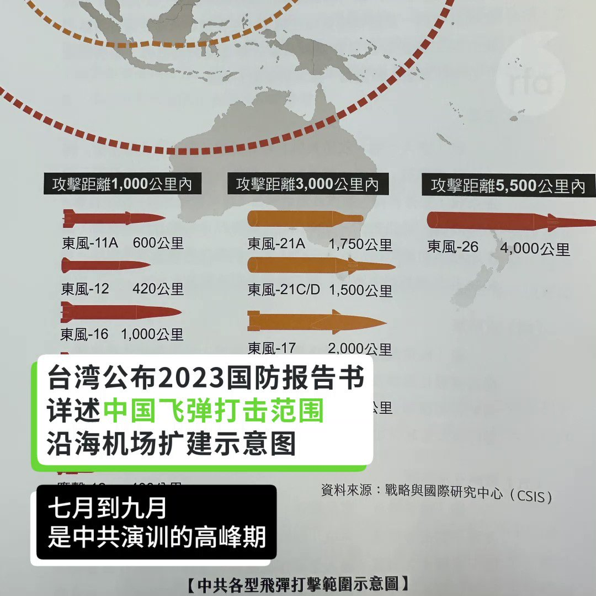
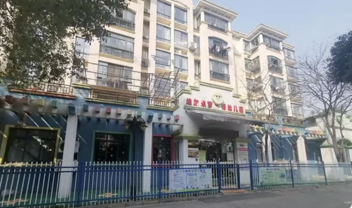
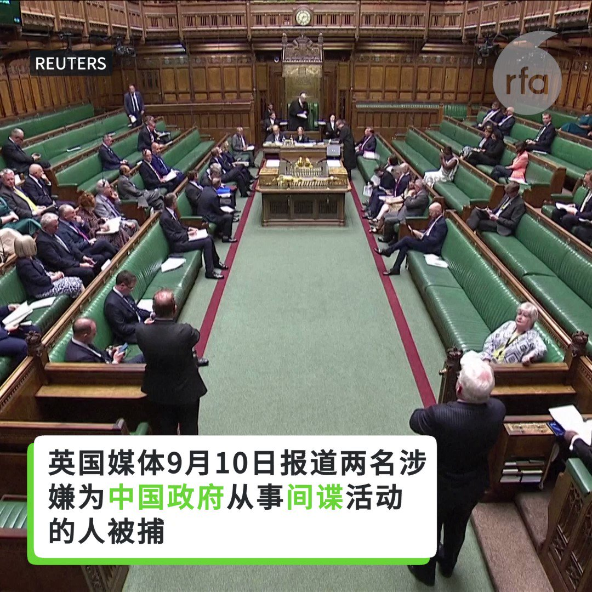
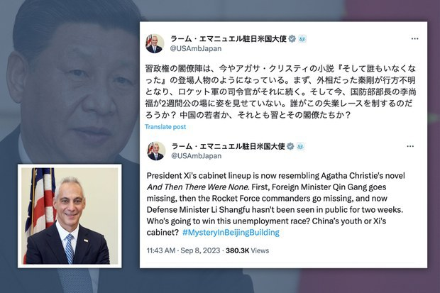
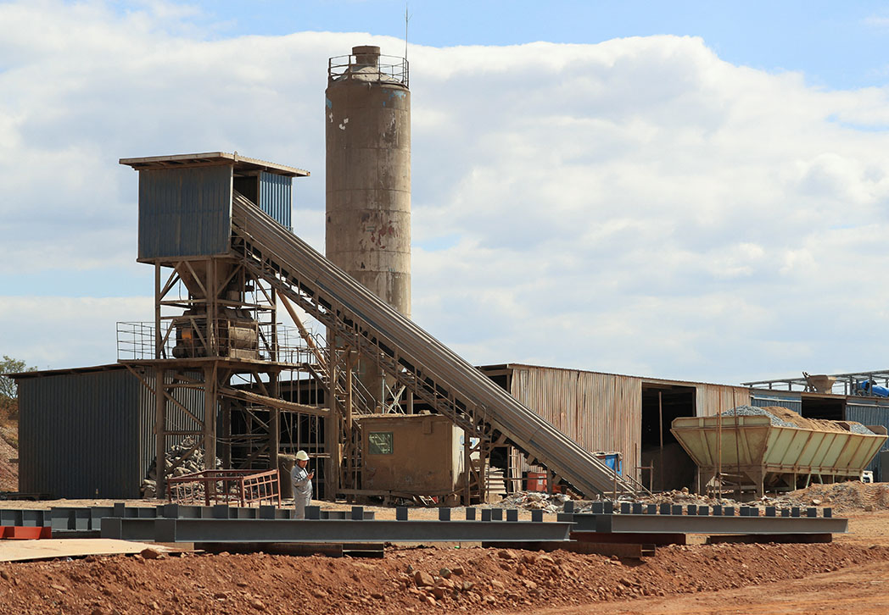
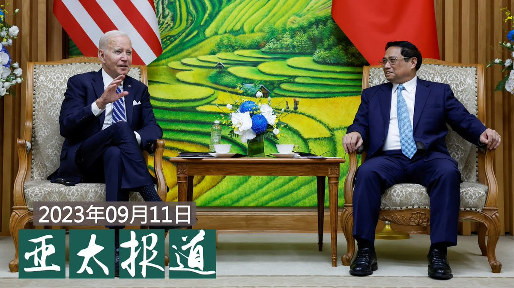
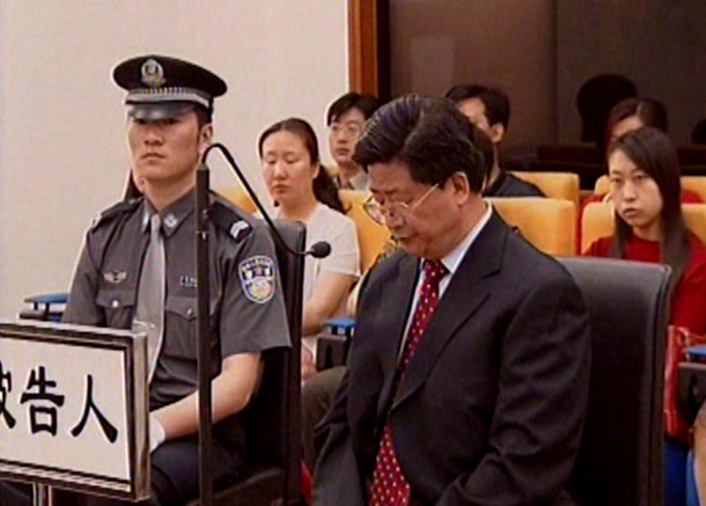
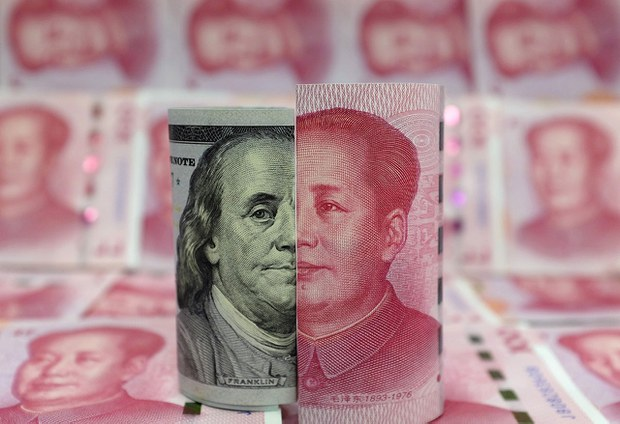
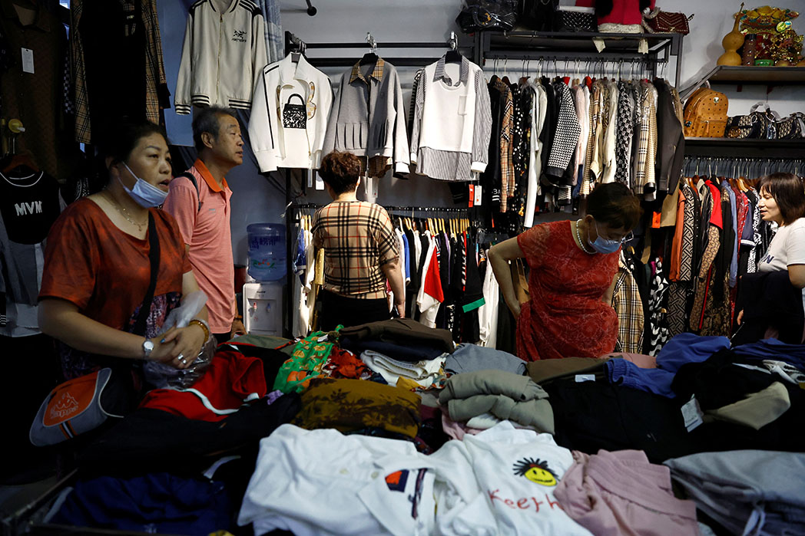
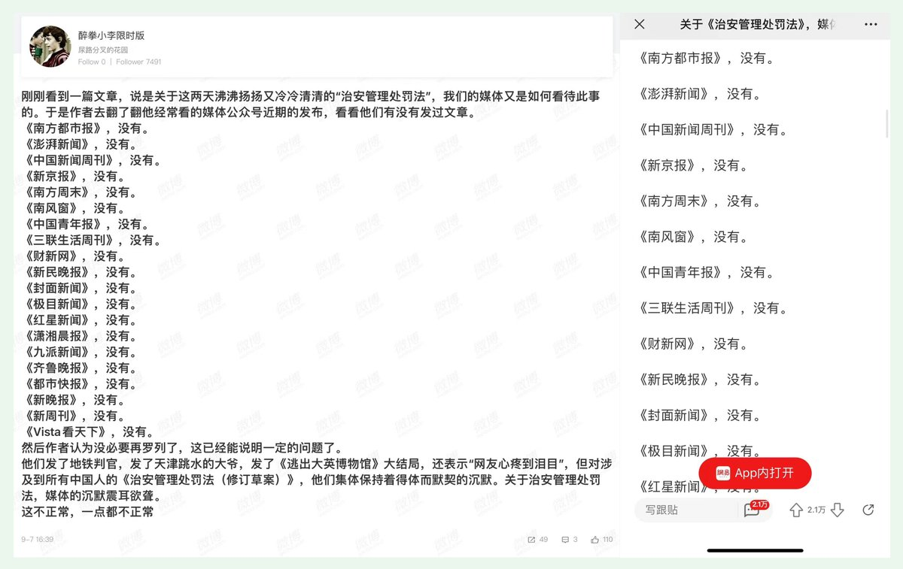

自由亚洲电台 北京时间 2023-09-12T23:02:07Z 1701612157719523747 RT @RFA_Chinese: 【#国航 飞新加坡航班 #客舱烟雾】
【着陆后紧急撤离 9人轻伤
9月10日从成都天府机场飞往新加坡樟宜机场的 #CA403 航班，机型为A320neo。机上旅客146名、机组人员9名。飞机在着陆前出现客舱… https://t.co/v1oY…   自由亚洲电台 北京时间 2023-09-12T23:41:25Z 1701622049058545933 #苹果公司 将在北京时间13日凌晨1点，推出新一代 #iPhone 15(i15)系列。新浪微博视频号12日发消息预测新机型变化，并上传一部国外博主谈论i15 Pro Max的15项重大改进短视频。相关话题在微博吸引逾2亿阅读量。
标记“#iPhone15你们会买哪款？”的相关话题也有近6千万人点击。 https://t.co/3nXX3VU2pC   自由亚洲电台 北京时间 2023-09-12T20:25:52Z 1701572836911903214 RT @RFA_Chinese: 【曾喊“打倒李鹏” 转发新冠疫情信息】
【大学退休教师陈兆志被囚三年半获释】
【脑退化遭全天候监控】
北京科技大学退休教师陈兆志涉嫌寻衅滋事案，判囚三年六个月后获释，他脑退化身体虚弱，透过视频报平安说: “我活着回来了。”… https://t…   自由亚洲电台 北京时间 2023-09-12T17:05:54Z 1701522512474263995 【台国防部发布国防报告书 重视中国犯台威胁】
【台海周遭出现破纪录解放军舰】
【经济变坏不会犯台？ 台称不会放松戒备】
#台湾国防部 12日发布《112年 #国防报告书》，其中花更多篇篇幅解释中国对台威胁现况。与此同时，#解放军 #山东号 航舰编队，11日于鹅銮鼻东南60浬朝东航行，进入西太平洋航训。截至12日清晨6时，台湾共侦获20艘军舰在台海周遭活动。台湾军方人士研判，应该是与山东号会合进行海上编组演训，这也是台海周遭有史以来第一次侦获最多中国军舰。
另外美国总统拜登指出，中国经济动荡，北京恐已无力入侵台湾，因为中国国家主席习近平“已经 #手忙脚乱”。但台湾国防部表示，中国的国防预算、军备还是持续且高比例成长，因此台湾的军队还是要做好最完整准备。   自由亚洲电台 北京时间 2023-09-12T15:47:16Z 1701502722531606851 【#生育率 下降致幼儿园倒闭潮】
【 南昌幼儿园刚开学随即关闭】
#江西南昌 一 #幼儿园 9月1日开学刚5天就宣布关闭，近三十名已支付学费的家长赶到幼儿园要求退款，但幼儿园称，因 #生源不足 导致资金链断裂，无力偿还。今年上半年，中国各地许多幼儿园纷纷关闭。https://t.co/UylY6XE0dD https://t.co/SwXsAT8t1N   自由亚洲电台 北京时间 2023-09-12T06:50:00Z 1701367518034899288 【英国议会里也有中国间谍？】
英国媒体9月10日报道，两名涉嫌为北京从事间谍活动的人被捕，其中一人被确认为曾在中国任教的议会研究员。
中国政府9月11日驳斥了关于 #中国 在英国议会有 #间谍 的指控，称其为“恶意诽谤”。 https://t.co/ABYLtWwtAV   自由亚洲电台 北京时间 2023-09-12T10:34:43Z 1701424069860573641 RT @RFA_Chinese: #于建嵘：“设不设 #教师节，并不重要。如果学生可以举报教师而且受到鼓励；如果官员可以高高在上训斥教师，天天是教师节，也是没有用的。”

 https://t.co/K0hke37c5s   自由亚洲电台 北京时间 2023-09-12T04:39:32Z 1701334682884059152 在被问及是否担心 #中国经济放缓 可能促使北京对台湾采取军事行动或经济封锁时，#萧美琴 表示，台湾政府正仔细思考所有可能的情况，包括“最坏的情况”。她说，任何胁迫或军事侵略的迹象对商业都不利，“这是我们的理解，当然希望北京领导人也能理解”。

 https://t.co/vLVnznW1Dc   自由亚洲电台 北京时间 2023-09-12T05:56:23Z 1701354021682811305 【像英国小说：#习近平 的团队“无人生还”？】
今年三月才上任的中国国防部长 #李尚福 已经有两周时间没有露面，这一现象引起了外界的广泛关注。
据本台粤语部报道，美国驻日本大使伊曼纽尔（Rahm Emanuel）上周四（9月8日）在社交媒体平台X（原推特）上发文质疑说，在中国，#秦刚、#火箭军司令员 以及 #国防部长 先后失踪， “究竟谁会赢得这场失业竞赛？”
他还说，习近平的班底就像英国侦探小说家克里斯蒂的小说《无人生还》（And Then There Were None）一样，先有外长秦刚失踪，接着是火箭军司令员（李玉超）失踪，连国防部长李尚福也已有两周没有露面。
他还在文末的hashtag写上“#北京大楼里的神秘事件”，极具讽刺意味。
报道指出，伊曼纽尔针对中国的立场一向比较鲜明，上月底他访问日本福岛，品尝当地海产之余，更明言支持日本向世界贸易组织，投诉中国全面禁止日本水产进口；他还斥责中国对日本的骚扰电话和假消息，直指是“中国自导自演的政治手段”。   自由亚洲电台 北京时间 2023-09-12T08:00:01Z 1701385137089622395 评论 | 王丹 @wangdan1989：中国有真正的 #民族主义 吗？ https://t.co/DFmJLkWTbq   自由亚洲电台 北京时间 2023-09-12T09:29:24Z 1701407629291950175 RT @RFA_Chinese: 【欢迎加入自由亚洲电台电报群】https://t.co/UkKZmFSRkG https://t.co/Qid2LNZxJn   自由亚洲电台 北京时间 2023-09-12T05:23:02Z 1701345628670853228 【#您怎么看】
近日，有“口红一哥”之称的 #李佳琦 在直播间带货国货眉笔时遭网友质疑眉笔涨价，李佳琦回复说："这么多年了工资涨没涨，要找自己的问题，有没有认真工作……"此言一出，直播间内外一片哗然。有网友指出，在中国青年失业率达21.3%的当下，年轻人并非不想挣钱，而是缺少就业机会。详见https://t.co/aM3RN6zAPj
去年，李佳琦因网红直播间出现坦克冰激淋蛋糕遭到中国全面封杀。您如何看待李佳琦带货怼网友的言论？   自由亚洲电台 北京时间 2023-09-12T06:01:16Z 1701355250626527411 据美国《华尔街日报》报道，美国政府正在与 #沙特阿拉伯 谈判，共同确保能源转型所需的非洲金属资源，以遏制中国在 #电动汽车供应链 中的主导地位。
报道指出，美国主要是想与中国争夺钴、锂和其他金属等资源，这些金属是加工电动汽车、笔记本电脑和智能手机所需锂离子电池的基本金属。目前中国公司提炼了全球四分之三的钴供应，生产全球约70%的锂离子电池，让西方担忧对中国形成依赖。
据知道内情的人透露，一个有政府背景的沙特企业计划购买刚果民主共和国、几内亚和纳米比亚等非洲国家的矿业资产股份，美国随后将购买沙特的部分产量。
与美国合作，将使得沙特进军矿产领域，在国内开采矿产和金属，同时又进军全球其他地方的矿产项目。   自由亚洲电台 北京时间 2023-09-12T06:54:42Z 1701368699272544317 【#亚太报道（2023-9-11）】
欢迎收听和订阅播客【亚太报道】 https://t.co/MjLNSvVMqc

美国总统拜登点名中国不会侵台 / 英国会一研究员涉嫌充当 #中方间谍 被捕 / 乌克兰谴责中方“#喀秋莎”事件 / 学者 #于建嵘 发表“#教师节”感言 / 北京科技大学退休教师 #陈兆志 遭判刑 https://t.co/mN33v8hpGy   自由亚洲电台 北京时间 2023-09-12T08:46:39Z 1701396870852161913 9月10日，美国总统 #拜登到访越南 并在出席记者会时谈到台湾问题。拜登表示，他不认为中国目前的经济危机会导致入侵台湾。
此外，继日前美国和加拿大海军联合通过 #台湾海峡 后，中国的 #山东舰 也经台湾南部海域进入西太平洋训练。

 https://t.co/CLbEz58gf3   自由亚洲电台 北京时间 2023-09-12T03:18:46Z 1701314359606325460 【美越互动忙 中国有点酸？】
美国总统 #拜登 9月11日在河内会见了 #越南 总统，两国签署了一项历史性协议。毛宁说：“中国是越对外交往的头等优先。” https://t.co/jldkvMvK5k   自由亚洲电台 北京时间 2023-09-12T05:40:57Z 1701350141352157218 专栏 | #夜话中南海：历任 #贵州省委书记 里贪官多，党和国家领导人更多
https://t.co/Ycb7lGOgJC https://t.co/b4PkGahTCn   自由亚洲电台 北京时间 2023-09-12T05:44:09Z 1701350945060503974 继在岸 #人民币汇率 日前跌至十六年新低后，本周一，#中国人民银行 出手救市，并以公布八月份强劲金融数据拉动市场。

 https://t.co/15erzBhQsp https://t.co/W3p00Q2VpO   自由亚洲电台 北京时间 2023-09-12T05:58:55Z 1701354659372298323 据美国《华尔街日报》报道，虽然 #中国经济下行 迹象明显，中国政府官员也忧心忡忡，但据知情人士透露的情况以及 #习近平  的公开言论，习近平本人并无意支持推出更多的经济刺激措施。
报道指出，中国负责经济的高层官员近来频繁开会，讨论如何应对不断恶化的经济形势；经济学家也建议采取更大的行动，但习近平一直没有作出更明确的指示去提振经济。在这种情况下，地方政府官员也担心政策失误而被追责，对经济也坐视不管。
有知情人士认为，习近平不愿意采取刺激经济的措施，部分原因是他在意识形态上倾向于紧缩政策。
美国克莱蒙特·麦肯纳学院(Claremont McKenna College)的华裔教授裴敏欣认为，要让人们重新对中国的前景充满希望，习近平需要像自邓小平以来的那些中国领导人那样，放权给那些懂经济的官员来制定政策。   自由亚洲电台 北京时间 2023-09-12T06:02:46Z 1701355628298645700 评论 | #何清涟 @HeQinglian：中国近万亿 #村债 是如何炼成的？
 https://t.co/tePGmcjGDO   自由亚洲电台 北京时间 2023-09-12T00:42:51Z 1701275118864048632 有微博网民发现，从9月5日中国人大发表《#治安管理处罚法》征求意见稿以来，中国主要媒体集体对此沉默。众多网民登陆人大网对此提交意见，截至本周一，已提交超过十万条。
除了 #第三十四条， 《治安管理处罚法》还有哪些值得关注的问题？
详见 https://t.co/ygojxWAeXN https://t.co/yqRY6jSQ6p   自由亚洲电台 北京时间 2023-09-12T02:29:53Z 1701302054973743406 周一（9 月 11 日）中国陕西省西安市发生洪水，路透社获得的视频显示汹涌的大水将两人冲走。 https://t.co/93MTCKTcTd   自由亚洲电台 北京时间 2023-09-12T02:41:17Z 1701304924926275807 英国《星期日泰晤士报》周末报道，两名男子今年3月涉嫌为 #中国 从事 #间谍 活动被捕，消息震动 #英国 朝野。其中一名被捕者是英国国会研究员，曾接触多名英国保守党国会议员，包括保安事务国务大臣Tom Tugendhat，以及下议院外交事务委员会主席Alicia Kearns 。

 https://t.co/3pSJO5hWMV   自由亚洲电台 北京时间 2023-09-12T04:01:58Z 1701325228415320160 #于建嵘：“设不设 #教师节，并不重要。如果学生可以举报教师而且受到鼓励；如果官员可以高高在上训斥教师，天天是教师节，也是没有用的。”

 https://t.co/K0hke37c5s   自由亚洲电台 北京时间 2023-09-12T01:29:52Z 1701286951217930499 获释后，#陈兆志 透过视频报平安。陈兆志一名基于安全考量要求匿名的亲戚表示，表面上，陈兆志一切正常，但实际上他深受脑退化影响，与羁押前比较已判若两人。

 https://t.co/Xc56XFKZbr   自由亚洲电台 北京时间 2023-09-12T00:11:49Z 1701267308726153314 中共前领导人 #毛泽东逝世47周年 之际，中国多地出现官方带头的纪念活动。
有学者认为，借纪念毛泽东鼓动政治宣传，这对 #习近平 来说并非有利可图。

 https://t.co/ns2X4kC8UQ   