谁将十万横扫三江 北京时间 2023-09-12T21:49:58Z 1701594000007008398 网友投稿，中国移动公司不告知危害导致工伤，严重影响生活 https://t.co/XerGHvarCF   谁将十万横扫三江 北京时间 2023-09-12T16:42:46Z 1701516691346457054 刑讯逼供的警察为什么不直接编一份笔录让嫌疑人签字? https://t.co/FDqpdSeheG 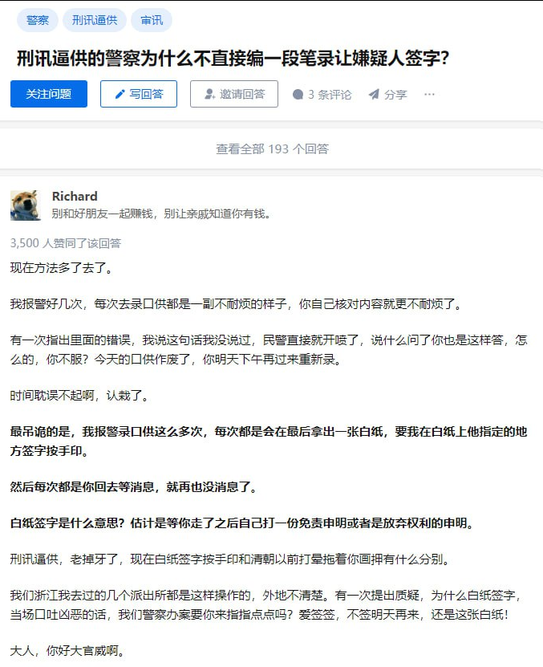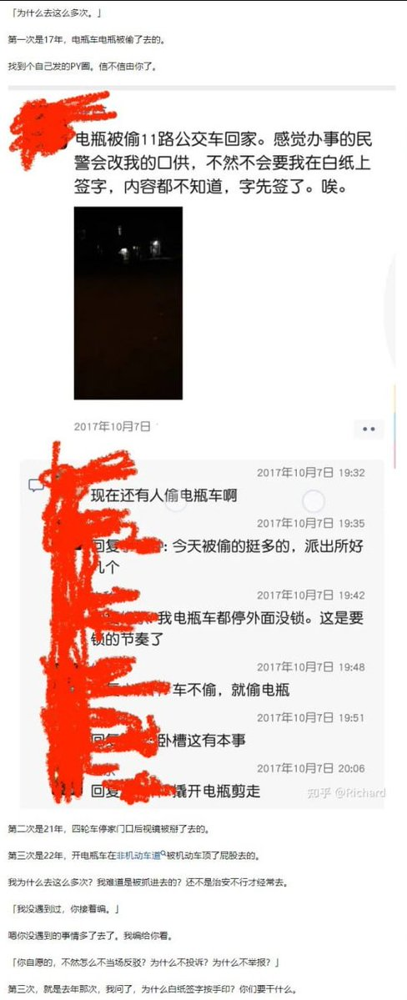  谁将十万横扫三江 北京时间 2023-09-12T18:32:30Z 1701544307667419340 福建省厦门市，一文化传媒公司拖欠员工工资，员工讨薪
时间：2023-09-11
介绍：
【（转自作者图片描述）厦门好生意文化传媒有限公司，拖欠员工2023年6月份到7月中旬的工资没发，拖欠人数将近80，金额超过50万，从7月中旬到如今9月中旬一分钱都没发，法院开庭的时候，当事人并没有到场，一点消息都没有，目前公司法人以及实际控股人，临时把公司地址更改，将场地出租，有钱不还，设法躲避劳动仲裁，如今两个人微信不回，电话不接装死，血汗钱无处可寻，希望政府部门以及劳动监管大队能抓到这个不法分子，还我们的血汗钱！】
地点：福建省厦门市
行业：文化娱乐产业
公司名称：厦门好生意文化传媒有限公司
企业性质：民营企业
行动类型：要求劳动司法等机关介入
诉求：欠薪
参与人数：1-100
官方反应：劳动仲裁
资料来源：
https://t.co/kPeEf6Dhvy
https://t.co/2Afyzj8osS 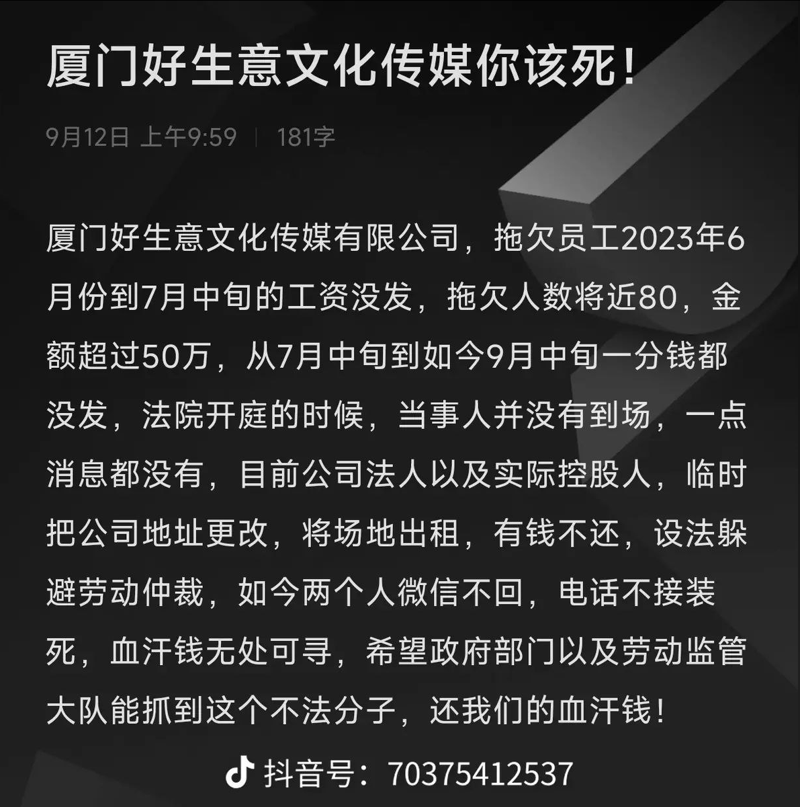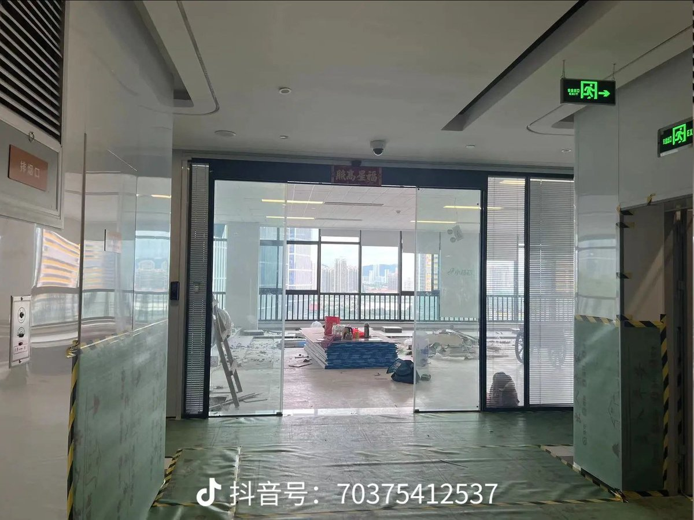  谁将十万横扫三江 北京时间 2023-09-12T19:11:14Z 1701554055959769471 汉杰汝衣厂欠了我们300多万的工资，大家看到招聘信息千万不要去。没有欠薪，何来讨薪！没有恶意欠薪哪来的恶意讨薪？难道老板公司欠薪是善意的？我们要的只是血汗钱，工厂实拍视频 https://t.co/PIcBTqjGHF   谁将十万横扫三江 北京时间 2023-09-12T19:50:08Z 1701563842810319032 广东省佛山市，一酒店工程拖欠工人工资，工人威胁跳楼讨薪
时间：2023-09-12
地点：广东省-佛山市-三水区-大塘镇大布沙大兴大道中98号万豪大厦【丽枫酒店（佛山三水大塘政府店）】
行业：建筑业
公司名称：锦江国际（集团）有限公司
企业性质：国有企业
第二企业名称：锦江酒店（中国区）
第二企业性质：国有企业
行动类型：静坐/要求劳动司法等机关介入/威胁跳楼
诉求：欠薪
参与人数：1-100
官方反应：警察出动
资料来源：
https://t.co/BUxqmX7yGf
https://t.co/bJEG2Tm05l
https://t.co/yf8OsuDiSC
https://t.co/arW8Ri61lZ
https://t.co/fAQmaYTm7S
https://t.co/a8f1B3KTEJ
https://t.co/fvjzj0mcCm 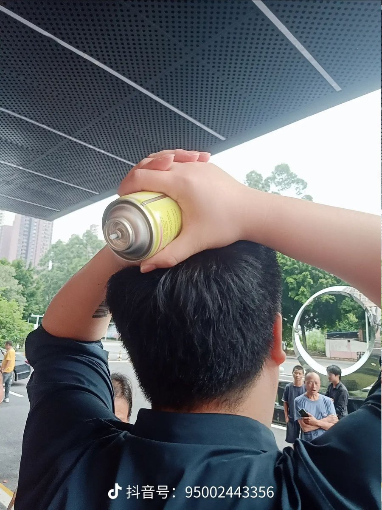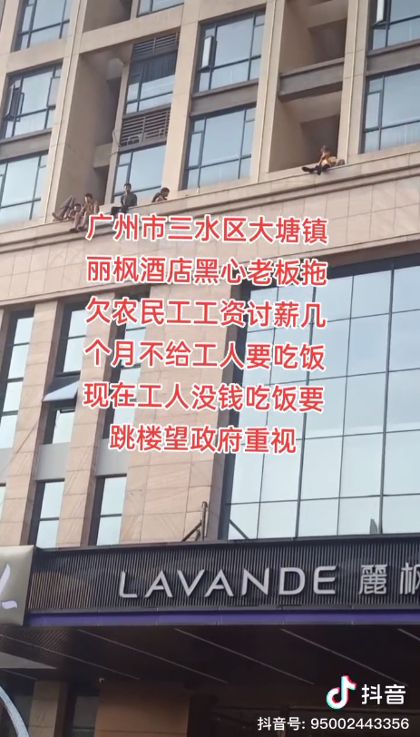  谁将十万横扫三江 北京时间 2023-09-12T20:29:59Z 1701573870330036465 常州武进疑为增加办案收入钓鱼执法

尊敬的社会各界贤达：

我们是江苏省常州市武进区法院在审的贾晓田涉嫌诈骗案的家属，我们怀疑这是一起由武进区有关部门为了增加财政收入而钓鱼执法制造的冤假错案，我们认为案件在武进区审理不能保证公平公正，我们强烈要求案件提级到更高级别人民法院审理。

检察机关指控2021年1月以来，贾晓田、赵睿与于江飞等人，在河北省张家口市以宏德泰盛（北京）教育科技有限公司（2022年8月更名为北京宏德优学教育科技服务有限公司）的名义，通过抖音、快手、今日头条等网络途径发布各类办证广告，被害人通过网络途径留下个人信息后，由公司业务员与被害人取得联系，随后采用夸大各类证书作用、承诺包通过包拿证、包兼职挂靠获取收益等多种手段取得被害人的信任，骗取被害人报考相关培训课程，后为进一步推销课程，谎称全职或兼职企业需要更多证书、多证书可以多增加收入等进一步骗取被害人的信任报考更多培训课程。2021年1月至2022年7月，共计骗取被害人2000余人共计人民币2100多万元。

在法庭做最后审判之前，我们不想对起诉书的内容做过多评论。但是，我们对此案的缘起抱有十万分的怀疑。

公司在几年的经营过程中，也曾遇到过一些对学习不满意，通过交涉，公司退还其款项。正常情况下，学员遇到问题，都会直接与公司沟通，现在公司还保留很多类似的沟通电话记录。但是在公司开业几年来，从未有报名后稍微学了几天课程就去公安机关报案的事情。

令我们感到奇怪的是，常州市武进区这位报案人在报名学习后，没有与公司进行任何沟通，比如对课程不满、或者觉得教师不好、或者学了以后考不成证书要求退学退款之类的，就直接向武进区公安分局报案声称遭受诈骗。

正常情况下，有人遇到所谓的“诈骗”这样的刑事案件，一般都是打110，由110指定报案人到属地派出所去报案，或者当事人直接到属地派出所报案，但是武进区的这个报案人却是直接到分局报案。

武进区这个报案人的行为非常不符合正常的逻辑，我们怀疑，这个报案人是有关部门的找的人，目的就是制造案件，办财政案。

我们强烈要求江苏省、常州市纪检监察部门、政法委员会对该案件进行彻底的调查！

贾晓田家属

2023年9月12日 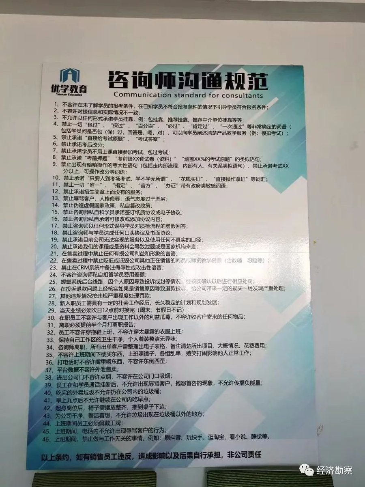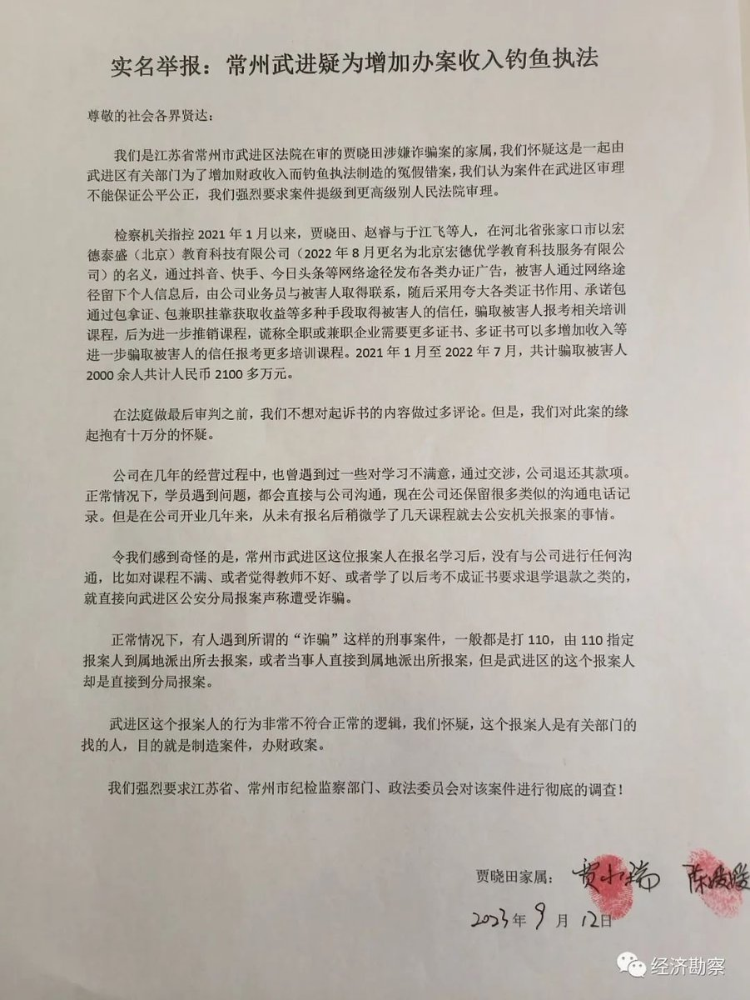  谁将十万横扫三江 北京时间 2023-09-12T16:31:08Z 1701513761646145887 RT @jike_collection: 其中95后和90后最多，占比达到78.1%；接近六成人是普通职员；95.7%的人都加过班，金融、IT和房地产是加班重灾区。

其中，超过9成人要面对隐性加班，6成人经常隐性加班。   谁将十万横扫三江 北京时间 2023-09-12T16:45:40Z 1701517421226676651 2023年5月，刘建因涉嫌寻衅滋事罪、非法经营罪、非法持有国家机密资料罪，在安徽宁国人民法院开庭审理，目前网络上没有任何关于审理之后的信息 https://t.co/iOTFMU6EZV 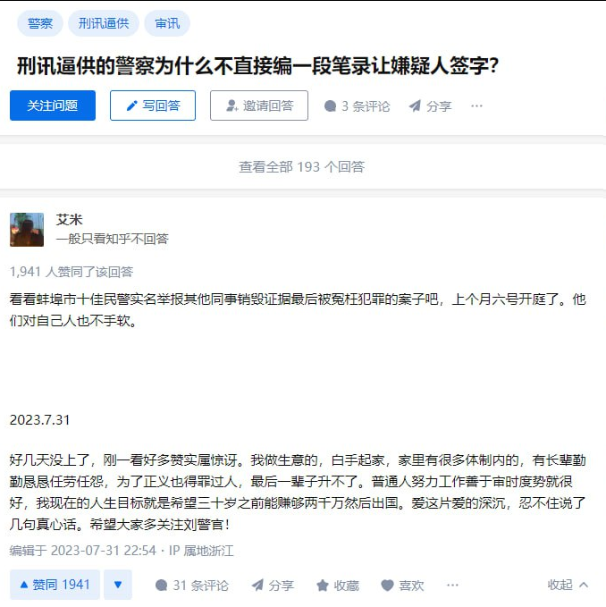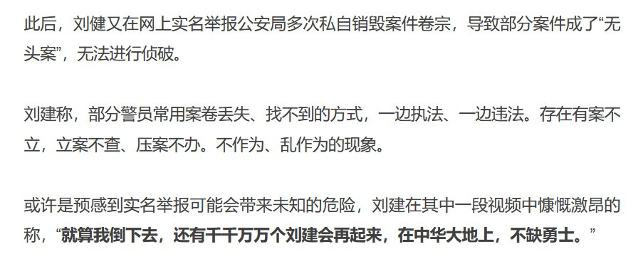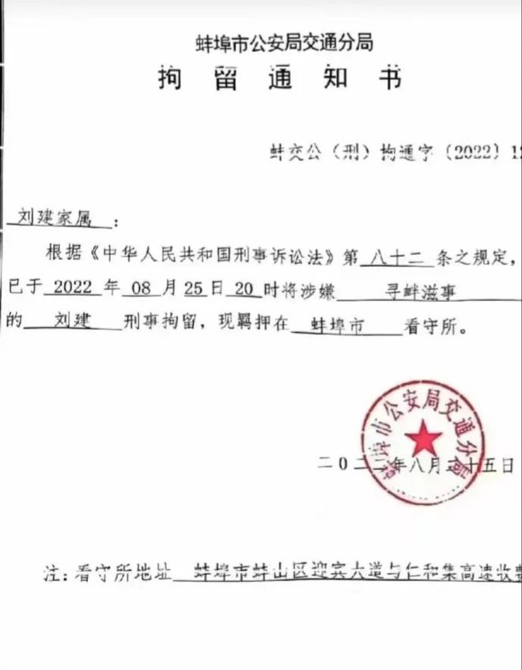  谁将十万横扫三江 北京时间 2023-09-12T16:50:12Z 1701518563054698617 RT @xiaojingcanxue: 历史文件：2001年中国入世承诺表。 https://t.co/9V3fL7X8G2 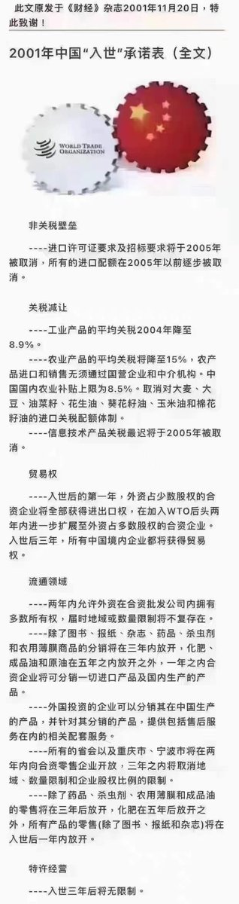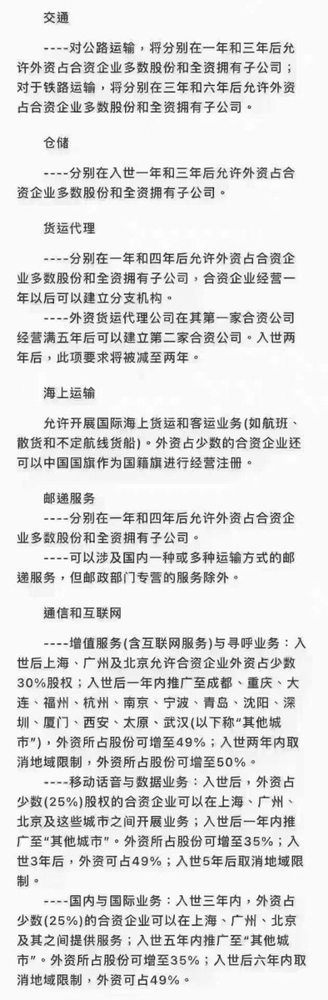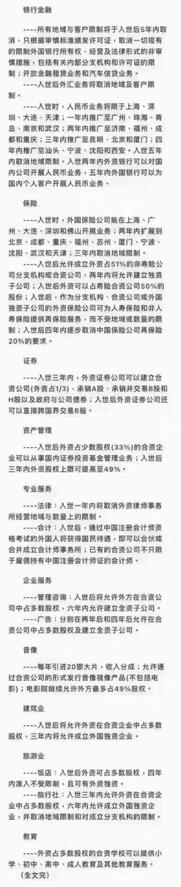  谁将十万横扫三江 北京时间 2023-09-12T15:46:20Z 1701502489869390257 贵州省安顺市，一住宅建设项目拖欠工人工资，工人讨薪
时间：2023-09-11
介绍：
【魏兰兰，王兴军2022年10月份进入貴州省安顺市西秀区安顺经济技术开发区的宽泰左岸香颂1号楼2号楼做外墙漆工作，现欠工资73000元，至今未支付。公司是贵州宏浩建设有限责任公司；老板：许义军，余铁。不支付我们的工资，望有关部门帮忙处理为谢！工人联系电话 19391393451】
地点：贵州省安顺市西秀区星火路和经四路交叉口
行业：建筑业/住宅
公司名称：贵州宏浩建设工程有限责任公司
企业性质：民营企业
项目名称:   安顺经济技术开发区宽泰·左岸香颂建设项目
建设单位:   安顺市宽泰房地产开发有限公司
企业性质：民营企业
行动类型：要求劳动司法等机关介入
诉求：欠薪
参与人数：1-100
资料来源：https://t.co/xD76STs4gz
https://t.co/d3ESWiP2CM 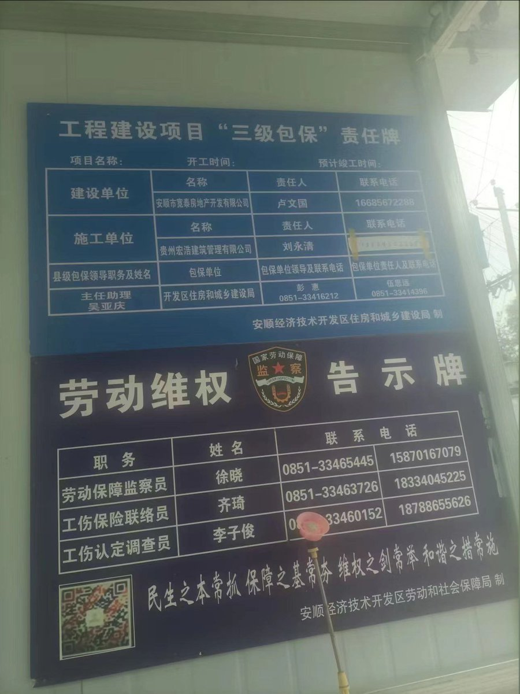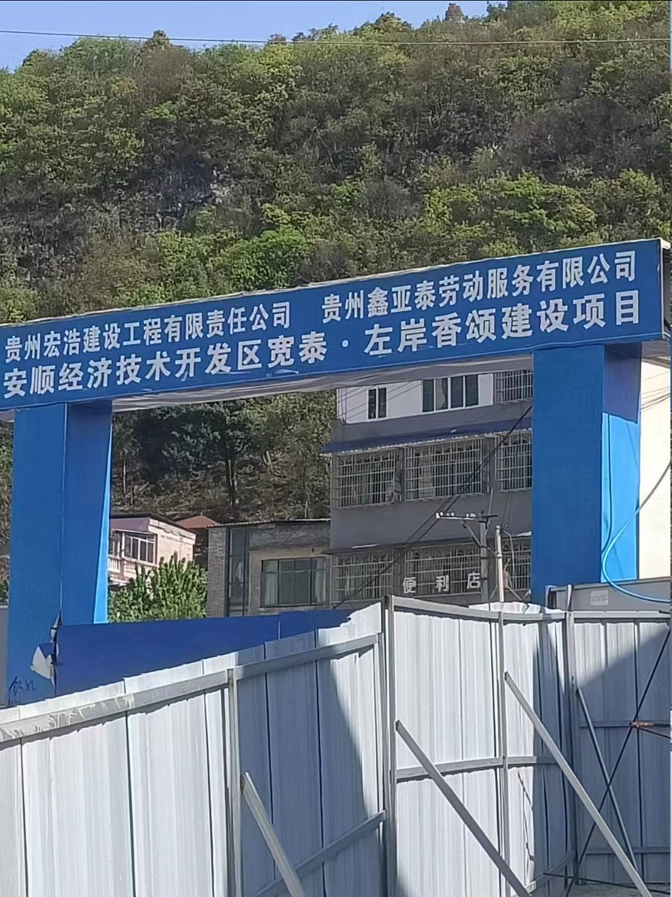  谁将十万横扫三江 北京时间 2023-09-12T15:58:59Z 1701505671693500749 海南省海口市，一房产项目拖欠工人工资，工人拉横幅讨薪
时间：2023-09-09
地点：海南省海口市秀英区椰海大道100号长影环球100文化旅游度假区
行业：建筑业
公司名称：上海嘉展建筑装潢工程有限公司
企业性质：民营企业
行动类型：要求劳动司法等机关介入
诉求：欠薪
参与人数：1-100
资料来源：
https://t.co/3JiElgAqpi
https://t.co/EKUBCUW7gv 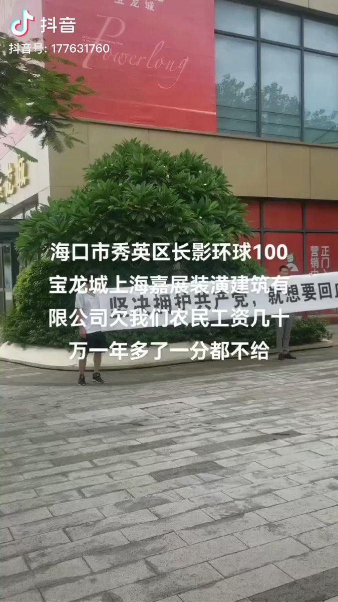  谁将十万横扫三江 北京时间 2023-09-12T08:42:52Z 1701395920355741918 网友投稿9月11日山东淄博八大局一男子街头伤人，目前尚不知冲突原因 https://t.co/cUI9Ss9JVl   谁将十万横扫三江 北京时间 2023-09-12T09:07:05Z 1701402015799341258 日前，有多家新闻媒体报道了甘肃陇西一菜贩在菜市场与人发生冲突后，被出警的警察抓到派出所，殴打致“脊髓震荡”，住院两个月、花费十余万元的遭遇。最新消息显示，因为有了舆论监督，当地纪委监委和公安督察均已介入，承认派出所民警在执法过程中确实存在违纪违法的情况，表态会继续调查。当事人反映的问题正在解决当中。但是与此同时，最早报道此事的红星新闻记者却遭到了当事人的“反水”投诉。
据红星新闻记者陈xx在一个媒体线索群里透露，她最早是在8月29日19时28分，看到有张泽斌律师在这个群里发布消息说：“甘肃陇西这边一个派出所6月27日把人打成了脊髓震荡，双下肢无力不能站立行走，目前还在医院治疗。有能帮忙曝光一下的吗?”于是才开始了解此事。
该记者表示，“作为媒体，对公权力的监督，是我们的职责所在，而且大家都在这群体里，尽管职业不一样，我依然相信我们有相似的信仰和追求，都渴望公平和正义。出于职业的要求，也出于对律师朋友请求的无偿帮忙，我介入采访报道。”
但是令她始料未及的是，在她第一时间报道，并且有了众多媒体同行的跟进，当事人反映的问题得到有关部门重视之后，却突然“画风大变”。原来一直反映是在派出所被打受伤，但是现在却反说自己受伤和“出警人员殴打致胸部脊髓震荡”没有充分的依据支撑和支持。并写“投诉信”指控记者报道内容不属实，侵犯他个人信息和隐私权，侵犯他的名誉权。
当事人从求助到“反水”让这位年轻记者十分受伤。
她认为，这件事不仅仅伤害了她，还伤害了她的同事和领导。从当事人指控她的行文和措辞看，不像是自己所写，应是有律师帮忙写的。当然她是很不愿意、也不敢相信，会是最早在微信群里代当事人求助的张xx律师写的。但还是在群里@了张律师，希望张律师能利用自身和当事人可能比较熟悉的关系，帮忙打听一下，那投诉信究竟是出自何人？也顺便提醒张xx律师，以后再与这样的求助人打交道的时候，也要给自己留一个心眼。
这名记者最后感叹，“像当事人这样伤害的不只是我个人，而且是伤害了所有为民请命的记者和包括但不限于绝大多数律师同行的义举，同时也恶化了我们以友善为基础，以正义追求为依归的社会秩序，这些行为破坏了原本共情和正义就稀薄的报道生态，令人心寒，让人唾弃，子子孙孙都羞于与之为伍。” 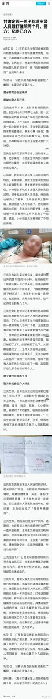  