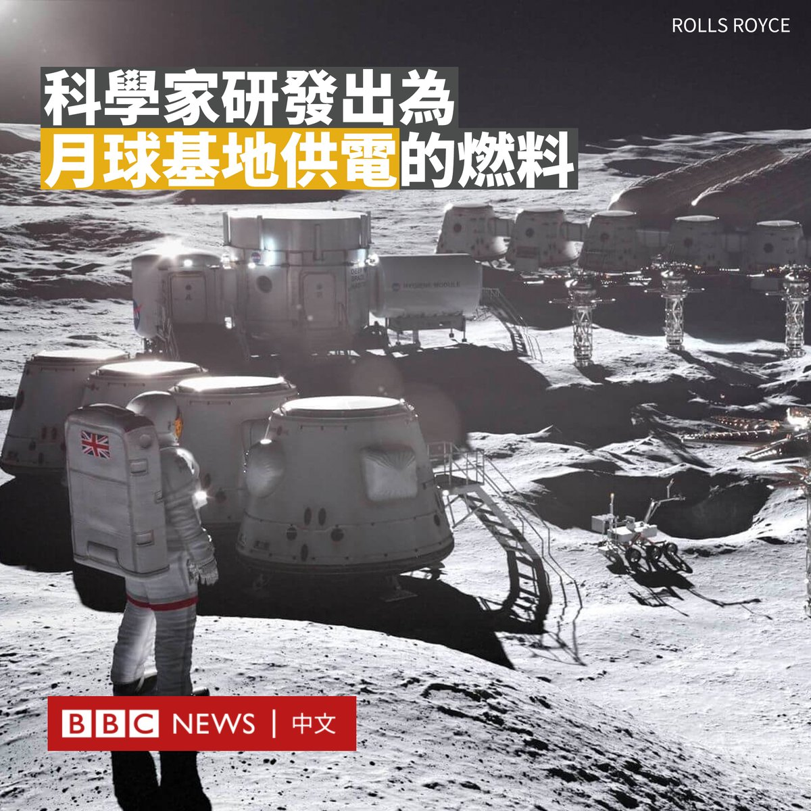
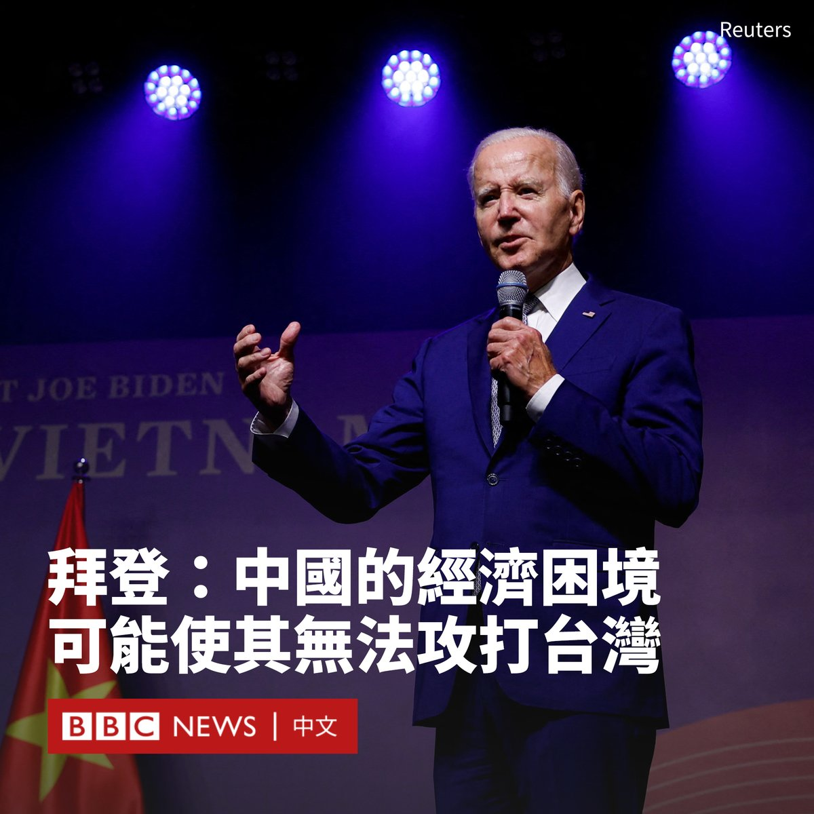
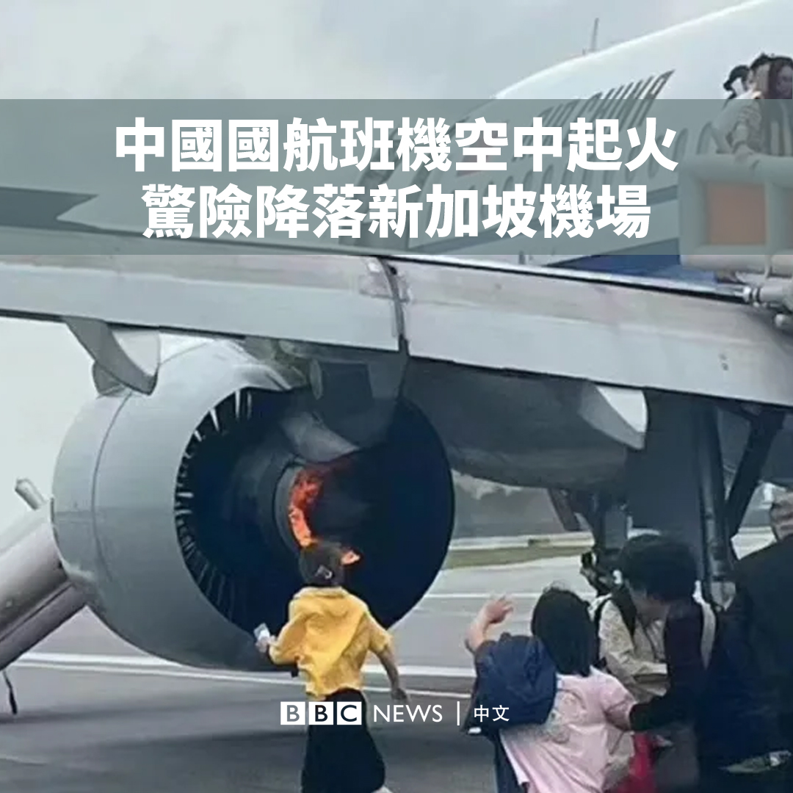

D英国广播公司BBC 北京时间 2023-09-11T17:09:39Z 1701161067999600985 拜登声称要放下“冷战思维”，但是美国与越南成为更紧密的朋友，无疑会引起中国的警惕。https://t.co/Vm8oZVaWG1   D英国广播公司BBC 北京时间 2023-09-11T15:49:17Z 1701140843757977838 科学家们已经开发出一种能源，可能足以让宇航员在月球上长时间生活。

美国宇航局（NASA）领导的阿尔忒弥斯计划（Artemis）希望于2030年左右在月球上建立一个基地。

威尔士班戈大学（Bangor University）的团队设计了一款罂粟籽大小（长度通常少于1毫米）的核燃料电池，以产生维持登月生命所需的能量。

该校核未来研究所（Nuclear Futures Institute）的西蒙·米德尔堡（Simon Middleburgh）教授表示，该团队希望在“未来几个月”对核燃料进行全面测试。

在月球部分地区，由于没有大气层来保持温度，月表温度有时会骤降到惊人的-248°C。此时该电池将为宇航员在月球上生活提供能量和热量。

这种名为“Trisofuel”的核燃料电池可以为罗尔斯·罗伊斯（Rolls-Royce）制造的微型核反应堆提供动力，后者的大小与一辆小型汽车相当。米德尔堡说，它“可以粘在火箭上”。

该技术现在将被全面测试，并置于类似发射到太空所要经历的环境中，为2030年的月球基地做准备。

“你可以全力将它们发射到太空……当它们被送上月球时，它们仍然会非常安全地运行。”米德尔堡说。

该大学希望这款微型电池也能在地球上使用，比如在停电的灾区。   D英国广播公司BBC 北京时间 2023-09-11T13:15:54Z 1701102244433936714 美国总统拜登（Joe Biden）表示，他认为中国最近的经济放缓可能会削弱北京攻打台湾的能力，并称中国领导人因经济问题“忙得不可开交”。

在印度召开的G20峰会周日（9月10日）闭幕后，拜登马不停蹄地前往越南访问。他对媒体说，他与中国总理李强在G20峰会上进行了会晤，谈及了稳定和全球南方的变革问题。

中国国家主席习近平缺席了此次G20峰会，但北京没有解释原因。这是习近平2013年担任国家主席以来首次缺席该会议。

拜登将中国现在的经济形势形容为一场“危机”，并列举了房地产债务危机和青年高失业率等问题。

“他的计划中的一个主要经济原则现在根本行不通。”拜登在谈及习近平时说道，他没有详细解释。“我并不为此感到高兴，但这是行不通的……他现在忙得不可开交。”

“我不认为这（经济困难）会导致中国入侵台湾。”拜登说道。“事实恰恰相反，它的能力可能不比以前。”

但他表示，华盛顿无意与中国“脱钩”或“伤害”中国，科技禁令是为了防止中国“从事与大多数人认为该地区积极发展相悖的防务活动”。

“我不想遏制中国。我只想确保我们与中国的关系是诚实可靠的、井井有条的，每个人都知道这是怎么回事。”   D英国广播公司BBC 北京时间 2023-09-11T10:38:36Z 1701062659708445096 一架从中国成都飞往新加坡的中国国际航空CA403班机，周日（9月10日）在飞行途中起火，烟雾漫进机舱，飞机最后成功降落樟宜机场。

社交媒体上的画面显示，这架空客A320neo飞机的左发动机冒出火焰，乘客沿逃生梯疏散。

樟宜机场表示，该航班共有146名乘客和9名机组人员，其在空中报告了前货舱和洗手间出现烟雾，宣布紧急状态并要求优先降落。

机场称，所有乘客和机组人员都安全撤离，有九名乘客在疏散过程中因吸入烟雾和擦伤而受轻伤。   D英国广播公司BBC 北京时间 2023-09-11T09:02:06Z 1701038370997039365 十年前，很少人能预估到中国领导人提出的“一带一路”这个崭新的计划会给这个世界带来多少改变，又伴随着多少争议。

在中国国内经济不断放缓、地缘政治局势不断紧张的今天，北京还会继续雄心勃勃地推进这一计划吗？https://t.co/qCp7CmZ6Et   