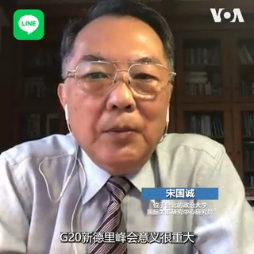
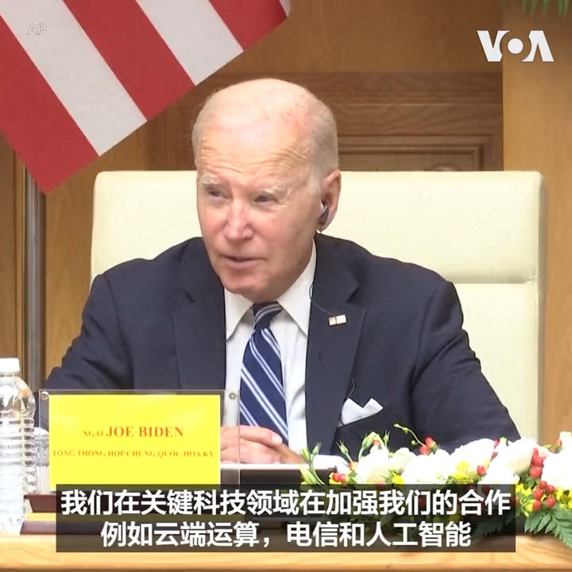
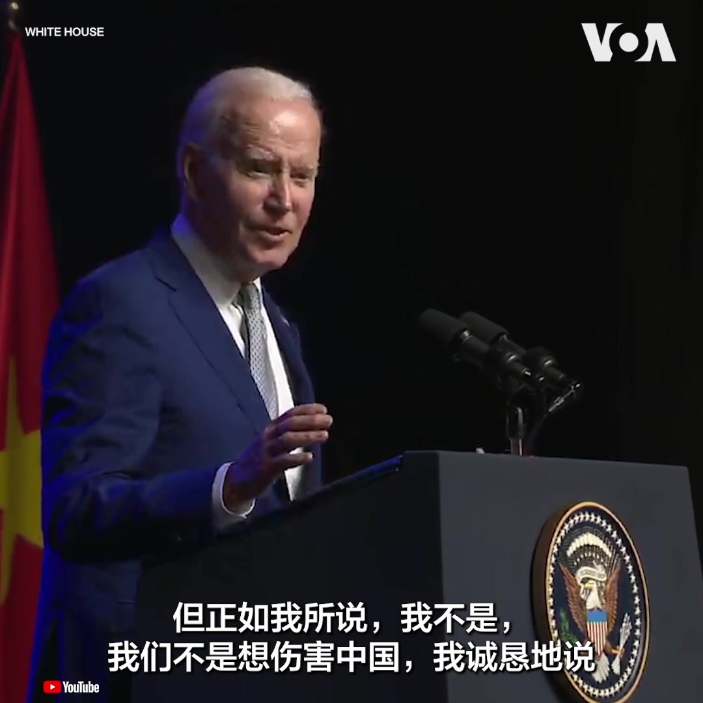

美国之音中文网 北京时间 2023-09-11T19:02:45Z 1701189530639028287 二十国集团(G20)峰会9月10日顺利闭幕并达成多项攸关国际政治和经贸合作的共识。多位分析人士认为，此次峰会在推动全球治理上取得相当的成果，其中有六大后续看点，包括在中国和俄罗斯两国领导人的缺席下，此次峰会丝毫没有因此失色，反而催化国际重塑“朋友圈”。
报道:https://t.co/BZnumQy9l4 https://t.co/KuLlKHjDin   美国之音中文网 北京时间 2023-09-11T20:16:33Z 1701208105009475726 美国总统拜登11日在访问越南的最后一天呼吁两国加强合作，包括在半导体等关键科技领域。拜登会晤了越南总理范明政，两人此前参加了一个商业领导人会议。 白宫宣布的这次访问达成的主要协议包括越南购买价值约75亿美元的波音飞机，以及美国阿姆科尔科技计划投入16亿美元在越南北宁省建造工厂。 https://t.co/kcCYeW5qC0   美国之音中文网 北京时间 2023-09-11T16:52:37Z 1701156780531982488 中共山东号航母航经台湾南端海域 入西太平洋演训 https://t.co/fTDerKvyBE   美国之音中文网 北京时间 2023-09-11T17:53:35Z 1701172123698680015 地缘政治论坛台北开议 约瑟夫・奈伊：中国难以取代美国 https://t.co/NdBXr8qYVU   美国之音中文网 北京时间 2023-09-11T18:08:07Z 1701175781769216210 报道：金正恩已出发乘专列前往俄罗斯与普京会面 https://t.co/zetk0w19mR   美国之音中文网 北京时间 2023-09-11T15:07:16Z 1701130268424491112 拜登：不寻求孤立或围堵中国 经济困境削弱其入侵台湾能力 https://t.co/BA7ksvt9FQ   美国之音中文网 北京时间 2023-09-11T12:55:06Z 1701097007606268359 新德里峰会重塑国际“朋友圈” G20闭幕后的六大看点 https://t.co/eug54huyWM   美国之音中文网 北京时间 2023-09-11T13:41:11Z 1701108608363270374 北京指控梁成运为美刺探情报逾30年 设置色情圈套 获颁功绩奖牌 https://t.co/vmbo8HNHFH   美国之音中文网 北京时间 2023-09-11T13:41:15Z 1701108624339431849 拜登访越宣布双边关系升至最高级 两国立即启动芯片供应与科技合作 https://t.co/C5fRSnpppq   美国之音中文网 北京时间 2023-09-11T09:33:13Z 1701046203415441893 因习近平和普京的缺席而由美印主导的G20峰会推出了对抗中国一带一路的铁路航运走廊的规划，但却没有明确谴责俄罗斯侵略乌克兰。美欧与中俄为首的东西方对抗愈演愈烈？“中国跌倒，印度吃饱”，有分析说，今天的印度已具备当年中国崛起时的全部条件。印度会不会成为下一个中国？请看9月11日时事大家谈。 https://t.co/3gPhTZ93qS   美国之音中文网 北京时间 2023-09-11T11:41:34Z 1701078504929128905 梅洛尼告知李强计划退出一带一路 战略伙伴关系将成意中关系主轴 https://t.co/wYnTGXuLGe   美国之音中文网 北京时间 2023-09-11T06:36:06Z 1701001632610476328 英国首相苏纳克在有报道称英国议会工作人员涉嫌为北京间谍后谴责中国 https://t.co/5zJWh5pOtP   美国之音中文网 北京时间 2023-09-11T09:46:33Z 1701049559357804873 医生：苏丹部队与敌方军队在首都作战期间无人机袭击造成至少43人死亡 https://t.co/myOruDlQl3   美国之音中文网 北京时间 2023-09-11T07:06:07Z 1701009186107388400 被停职的西班牙足协主席鲁维亚莱斯因女足世界杯强吻丑闻辞职 https://t.co/3dg7765mTS   美国之音中文网 北京时间 2023-09-11T09:04:06Z 1701038876276724222 乌克兰人：王芳在死难者的骨堆上为凶手唱赞歌 https://t.co/mUoy8t9Q6k   美国之音中文网 北京时间 2023-09-11T00:58:40Z 1700916710822277423 美国总统拜登9月10日在河内举行的记者会上表示，美国近来不断加强与盟友及印度、越南等国的关系是为了维持稳定，不是为了遏制中国。“美国不想伤害中国，”他说。
与此同时，拜登并不认为中国目前的经济困境会导致它入侵台湾。 https://t.co/isD2TLonEg   美国之音中文网 北京时间 2023-09-11T03:21:20Z 1700952617180914128 救援人员10日表示他们有信心能够营救出在土耳其被困洞穴深处的美国洞穴探险者马克·迪基 Mark Dickey 。40岁的迪基数天前在土耳其的莫尔卡洞穴探险时出现肠胃道出血，被困在约1千米的深处。救援人员目前已将他转移到了离地面500米的地方，预计两、三天内能将他救出地面。 https://t.co/ydyl0AoKeZ   美国之音中文网 北京时间 2023-09-11T04:13:33Z 1700965758610903367 拜登在印度举行的G20峰会期间会见中国总理 https://t.co/C8v6X1buNi   美国之音中文网 北京时间 2023-09-11T01:21:15Z 1700922394720755761 俄罗斯当局在去年吞并的乌克兰顿涅茨克、赫尔松、卢甘斯克和扎波罗热地区举行地方选举。在马里乌波尔，民众10日来到一所学校设立的投票站投票。乌克兰与西方国家谴责在这些被占领地区的投票是虚假的，并且违反了国际法。 https://t.co/Bz4ezwRZuC   美国之音中文网 北京时间 2023-09-11T02:01:06Z 1700932423792709946 “伤害民族感情”如何界定？中国公众担忧会这将导致纵容滥用公权力 https://t.co/I5Hbzl8uJ3   美国之音中文网 北京时间 2023-09-11T02:13:42Z 1700935594007011434 拜登总统周日在河内记者会上回答美国之音提问时表示，虽然他最近未和中国国家主席习近平进行直接对话，但两国官员仍不断进行会晤，“事实上，我今天在印度会见了他的二把手”。拜登认为，习现在需处理很多事情，包括失业问题、经济政策不起作用等，“我猜测他正试图找出应对这个特定危机的方法，”他说。 https://t.co/9MK1rQA8NO   