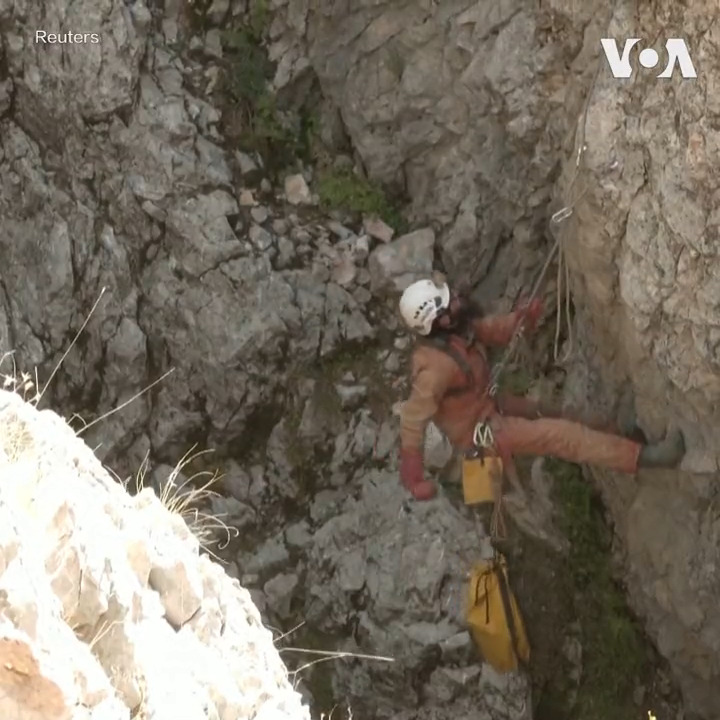
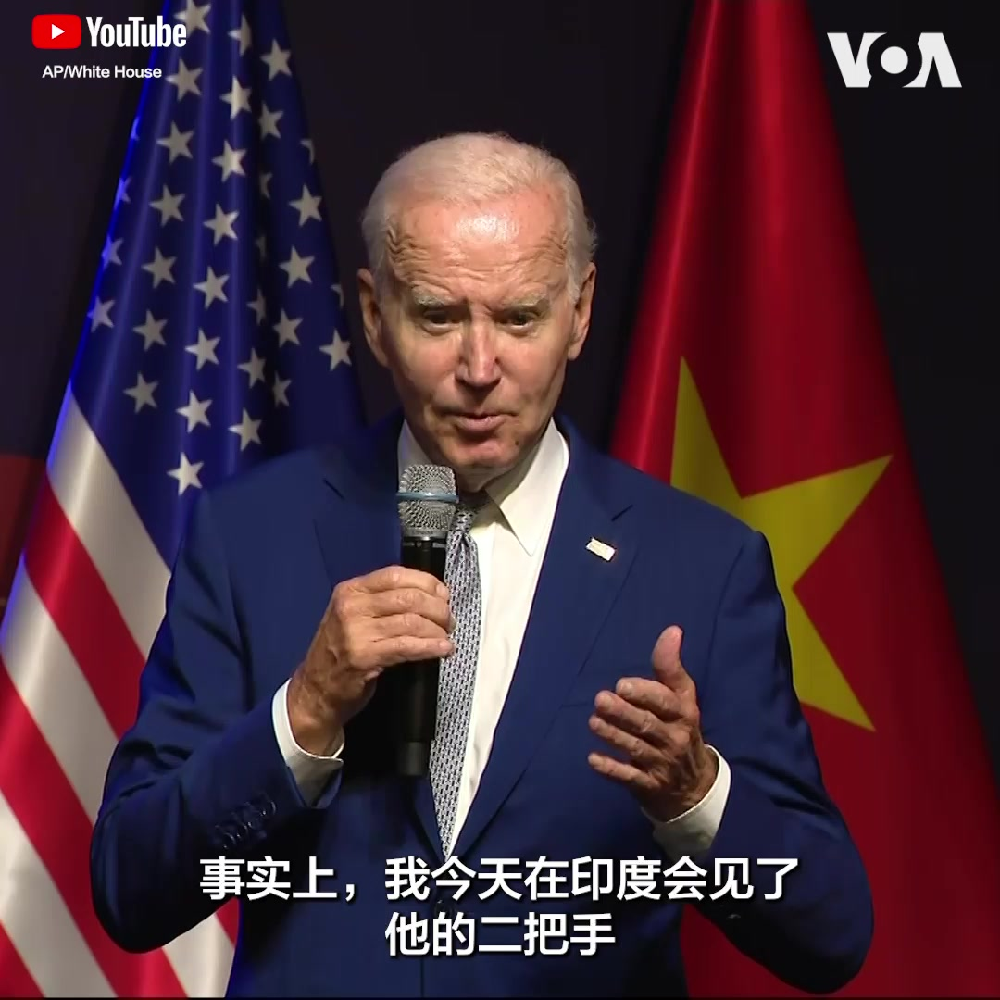

美国之音中文网 北京时间 2023-09-11T03:21:20Z 1700952617180914128 救援人员10日表示他们有信心能够营救出在土耳其被困洞穴深处的美国洞穴探险者马克·迪基 Mark Dickey 。40岁的迪基数天前在土耳其的莫尔卡洞穴探险时出现肠胃道出血，被困在约1千米的深处。救援人员目前已将他转移到了离地面500米的地方，预计两、三天内能将他救出地面。 https://t.co/ydyl0AoKeZ   美国之音中文网 北京时间 2023-09-11T04:13:33Z 1700965758610903367 拜登在印度举行的G20峰会期间会见中国总理 https://t.co/C8v6X1buNi   美国之音中文网 北京时间 2023-09-11T01:21:15Z 1700922394720755761 俄罗斯当局在去年吞并的乌克兰顿涅茨克、赫尔松、卢甘斯克和扎波罗热地区举行地方选举。在马里乌波尔，民众10日来到一所学校设立的投票站投票。乌克兰与西方国家谴责在这些被占领地区的投票是虚假的，并且违反了国际法。 https://t.co/Bz4ezwRZuC   美国之音中文网 北京时间 2023-09-11T02:01:06Z 1700932423792709946 “伤害民族感情”如何界定？中国公众担忧会这将导致纵容滥用公权力 https://t.co/I5Hbzl8uJ3   美国之音中文网 北京时间 2023-09-11T02:13:42Z 1700935594007011434 拜登总统周日在河内记者会上回答美国之音提问时表示，虽然他最近未和中国国家主席习近平进行直接对话，但两国官员仍不断进行会晤，“事实上，我今天在印度会见了他的二把手”。拜登认为，习现在需处理很多事情，包括失业问题、经济政策不起作用等，“我猜测他正试图找出应对这个特定危机的方法，”他说。 https://t.co/9MK1rQA8NO   