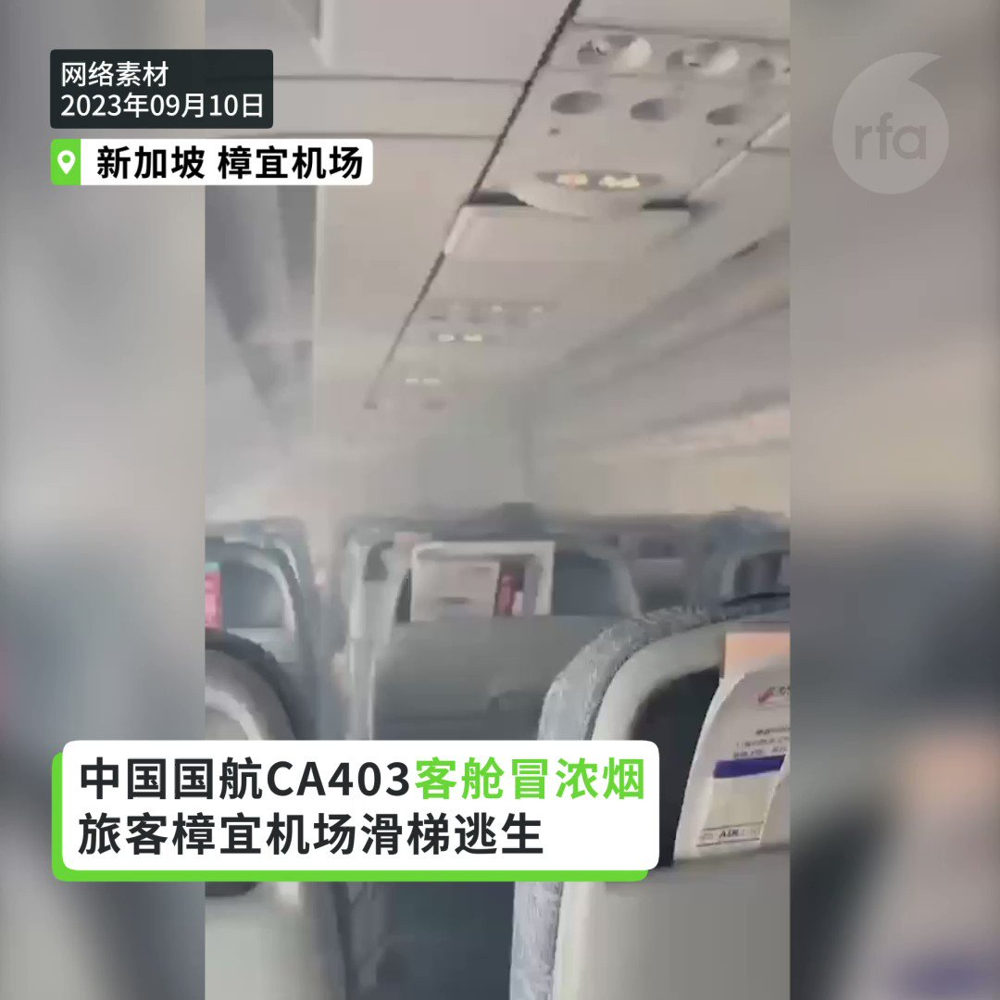
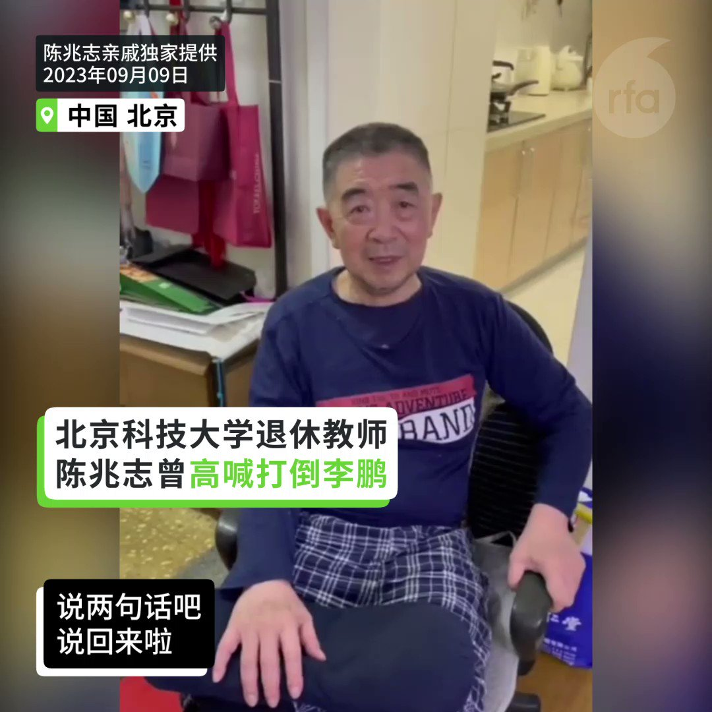
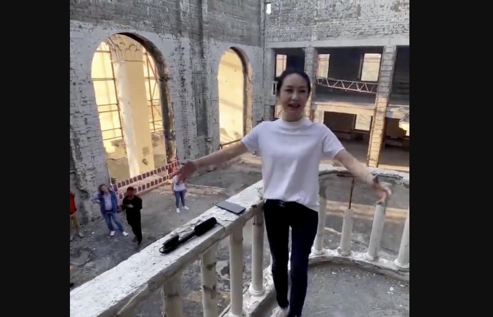

自由亚洲电台 北京时间 2023-09-11T23:02:05Z 1701249762626879563 专栏 | #有问有答：人权律师 #卢思位 老挝被抓，目前依然在押
 https://t.co/B0pNpxdFwE   自由亚洲电台 北京时间 2023-09-11T21:46:56Z 1701230850107757038 近日，第78届联合国大会在纽约联合国总部开幕。美国北加州十个台湾侨团于9月9日下午在湾区城市米尔皮塔斯召开记者会，声援 #台湾加入联合国。

 https://t.co/ryqr1lkDbn   自由亚洲电台 北京时间 2023-09-11T14:55:41Z 1701127356520534063 【#国航 飞新加坡航班 #客舱烟雾】
【着陆后紧急撤离 9人轻伤
9月10日从成都天府机场飞往新加坡樟宜机场的 #CA403 航班，机型为A320neo。机上旅客146名、机组人员9名。飞机在着陆前出现客舱 #烟雾，在降落新加坡樟宜机场后紧急撤离，之后扑灭飞机左侧发动机的火源。樟宜机场表示9名乘客在撤离过程中因吸入烟雾或擦伤而受轻伤。   自由亚洲电台 北京时间 2023-09-11T16:35:00Z 1701152347710484676 【曾喊“打倒李鹏” 转发新冠疫情信息】
【大学退休教师陈兆志被囚三年半获释】
【脑退化遭全天候监控】
北京科技大学退休教师陈兆志涉嫌寻衅滋事案，判囚三年六个月后获释，他脑退化身体虚弱，透过视频报平安说: “我活着回来了。” 陈兆志友人说，陈兆志被指控寻衅滋事，除了曾转发新冠疫情信息，也可能与2019年中国前总理李鹏逝世后，他在八宝山公墓喊“打倒李鹏”有关 。
#陈兆志
#寻衅滋事
#李鹏   自由亚洲电台 北京时间 2023-09-11T14:46:28Z 1701125037061783807 RT @RFA_Chinese: 美国总统 #拜登 9月10日抵达 #越南 首都河内访问，并受到挥舞两国旗帜的当地民众及越共总书记 #阮富仲 的欢迎。 https://t.co/CgguhM2Vgw   自由亚洲电台 北京时间 2023-09-11T15:38:21Z 1701138090772054278 【中国歌手俄占区唱喀秋莎】
【乌克兰外交部谴责 民间舆论汹涌】
中国政协委员 #周小平 的妻子，歌手 #王芳，近期在 #乌克兰 领土 #马里乌波尔剧院 演唱一曲《#喀秋莎》，遭乌克兰政府谴责“#道德沦丧”，要求中国政府作出解释。对此，中国民间舆论汹涌，纷纷指责王芳，并敦促中国政协罢免周小平委员资格。
https://t.co/aKDJ8Pv1PM   自由亚洲电台 北京时间 2023-09-11T10:29:02Z 1701060249329762714 RT @RFA_Chinese: 九月九，#毛泽东 祭日。
在死去47年之后，他真的走远了吗？
【#您怎么看？】 https://t.co/f1Xtf42NJk   自由亚洲电台 北京时间 2023-09-11T10:29:11Z 1701060288026431816 RT @RFA_Chinese: 【又翻车！#中国驻法使馆 用 #NASA 照片赞自家太空人 遭群嘲】
中国驻法大使馆日前在X（前身为推特）上的推文写道：“神舟15号团队3位 #太空人 周四（7日）因对中国太空计划的服务而获奖”，并配上一名太空人照片。… https://t.c…   自由亚洲电台 北京时间 2023-09-11T10:29:25Z 1701060347208081593 RT @RFA_Chinese: 【#您怎么看】中国官方近期发布了2023年新版地图。此前协议由中俄分治的黑瞎子岛这次完全被划入中国版图。美国《新闻周刊》指出，克里姆林宫对中国声称拥有俄罗斯部分领土的地图保持沉默。而有评论则说，俄罗斯的平静回应彰显了中俄两国的睦邻友好关系。……   自由亚洲电台 北京时间 2023-09-11T10:29:30Z 1701060367315526083 RT @RFA_Chinese: 真不懂还是装不懂？
#大英博物馆 共有近三万件中国藏品，绝大部分来自于百年来的公私捐赠。
影片《#逃出大英博物馆》的主角“#中华缠枝纹薄胎玉壶”，是苏州玉雕大师俞挺在2011年制作的现代艺术品，送交大英博物馆收藏和展出。“混淆文物与工艺品，赚取…   自由亚洲电台 北京时间 2023-09-11T10:29:41Z 1701060415256416267 RT @RFA_Chinese: 中国总理 #李强 在第26次中国—东盟领导人会议上发表讲话称：未来3年，中方将在东盟国家建设10所“中国—东盟现代工匠学院”，继续开展“未来之桥”中国—东盟青年领导人研修计划，还将启动“#万人研修研讨计划”，为东盟国家培养1万名 #治国理政、#…   自由亚洲电台 北京时间 2023-09-11T10:30:02Z 1701060503768846680 RT @RFA_Chinese: 【9月8日 刑满出狱 耿潇男能得到真自由吗？】… https://t.co/LbsL02vDoY   自由亚洲电台 北京时间 2023-09-11T12:04:59Z 1701084396915179991 RT @RFA_Chinese: 【#您怎么看】… https://t.co/zCCSX44tUa   自由亚洲电台 北京时间 2023-09-11T07:00:36Z 1701007795221651515 近日，第78届 #联合国大会 在纽约联合国总部开幕。美国北加州十个台湾侨团于9月9日下午在湾区城市米尔皮塔斯召开记者会，声援 #台湾加入联合国。 https://t.co/ryqr1lkDbn   自由亚洲电台 北京时间 2023-09-11T07:01:30Z 1701008022586393038 正在越南河内访问的美国总统 #拜登 本周日表示，他在印度新德里出席二十国集团（G20）峰会期间曾与中国总理李强讨论有关地区“稳定”议题，而 #中国 的 #经济 动荡不会导致入侵 #台湾。 https://t.co/gb8nLZEm8D   自由亚洲电台 北京时间 2023-09-11T01:32:33Z 1700925237842342050 RT @RFA_Chinese: “爱国大V” #周小平 的妻子 #王芳，在乌克兰 #马里乌波尔剧院 高唱苏联名曲“喀秋莎”，她是“道德沦丧”，还是“战地玫瑰”？
 https://t.co/U0QQRF3ps9   自由亚洲电台 北京时间 2023-09-11T07:03:26Z 1701008507682828584 据路透社9月10日报道，英国首相 #苏纳克（Rishi Sunak）当天在印度新德里举行的二十国集团（G20）峰会期间与中国总理 #李强 会面，并针对中国干预英国议会民主的行为表达了“深切担忧”。 https://t.co/zuXGwmopIQ   自由亚洲电台 北京时间 2023-09-11T07:03:56Z 1701008633868517694 美国总统 #拜登 9月10日抵达 #越南 首都河内访问，并受到挥舞两国旗帜的当地民众及越共总书记 #阮富仲 的欢迎。 https://t.co/CgguhM2Vgw   自由亚洲电台 北京时间 2023-09-11T02:41:38Z 1700942624956252430 RT @RFA_Chinese: 美国总统 #拜登 10日将访问 #越南，据路透社的独家报道引述多名知情人士说，谷歌（Google）、英特尔（Intel）、半导体封测大厂艾克尔（Amkor）、美满（Marvell）、格罗方德（GlobalFoundries）以及波音（Boein…   自由亚洲电台 北京时间 2023-09-11T01:05:12Z 1700918354976931885 RT @RFA_Chinese: 【#华为 引爆中国科技民族主义 小粉红过度自嗨？】
【用粗笔画工笔画 华为用中芯7纳米芯片有价格竞争力？】
【中国半导体发展挫折 体制造就烂尾】
【中美科技冷战 政府主导抄袭vs自由经济创新】
详见最新一期 #亚洲很想聊 https://t.c…   自由亚洲电台 北京时间 2023-09-11T02:42:53Z 1700942938853851522 RT @RFA_Chinese: 【#亚太报道（2023-9-8）】
欢迎收听和订阅播客【亚太报道】 https://t.co/MjLNSvVMqc

广东珠三角遭遇 #世纪雨灾 / 女权工作者 #叶海燕 向社会求助 / 北京媒体人 #耿潇男 服刑期满 / 中国人大计划针对 #…   自由亚洲电台 北京时间 2023-09-11T01:32:56Z 1700925334403555404 RT @RFA_Chinese: 【又翻车！#中国驻法使馆 用 #NASA 照片赞自家太空人 遭群嘲】
中国驻法大使馆日前在X（前身为推特）上的推文写道：“神舟15号团队3位 #太空人 周四（7日）因对中国太空计划的服务而获奖”，并配上一名太空人照片。… https://t.c…   