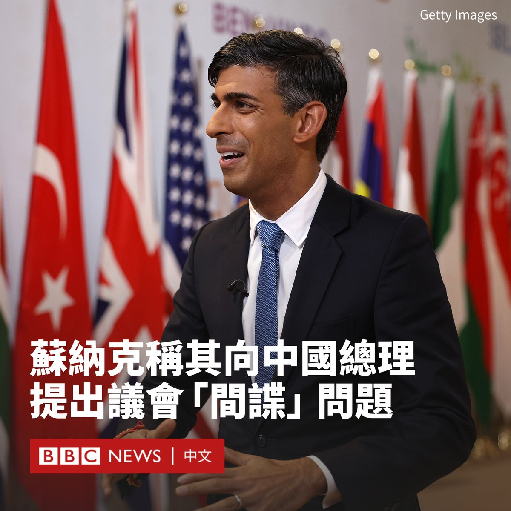
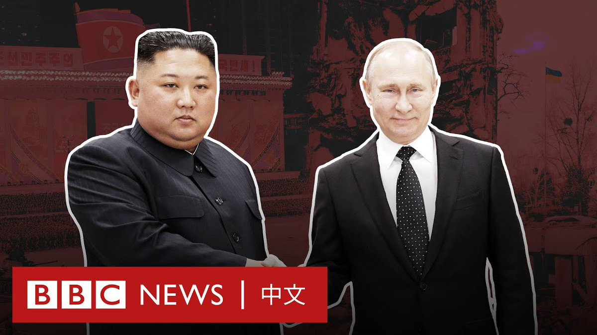

D英国广播公司BBC 北京时间 2023-09-10T19:50:59Z 1700839280950534253 为期两天的G20峰会在印度德里落幕。峰会通过的首脑宣言在乌克兰战争问题上谴责武力夺取领土的行为，但没有直接批评俄罗斯。

与去年的巴厘岛峰会首脑宣言相比，此次宣言措辞语气较弱，乌克兰政府表示这个结果“没有什么值得骄傲”。https://t.co/cmn32RaNK9   D英国广播公司BBC 北京时间 2023-09-10T17:24:27Z 1700802405242400774 英国首相苏纳克（Rishi Sunak）和中国总理李强在德里举行的G20峰会期间会晤。

唐宁街发言人表示，苏纳克向李强表达了“对中国干涉英国议会民主的严重关切”。

英国警方周六表示，他们以违反《官方保密法》为由拘捕两人，《星期日泰晤士报》报道称，其中一人是英国议会的一名研究员，涉嫌为中国从事间谍工作。

苏纳克表示，他提出了存在分歧的领域，但会晤表明“在有意义的地方”进行接触的战略的价值。

“我认为正确的做法是抓住机会接触，具体地提出担忧，而不仅仅是在场外大喊大叫。”他说道。

中国官方新华社报道，李强对苏纳克说，双方应当妥善处理分歧问题，秉持包容互鉴精神，尊重对方的核心利益和重大关切。

他称，北京愿同伦敦深化贸易、投资、绿色发展、人文科技等领域合作，共同支持和促进全球可持续发展。   D英国广播公司BBC 北京时间 2023-09-10T16:17:14Z 1700785487966048659 美国和韩国官员近日称，朝鲜领导人金正恩即将前往俄罗斯，展开新冠疫情后的首次外访。

作为世界上最封闭的国家之一，朝鲜的领导人历次出访总会吸引人们的眼球。金正恩是否会再次乘坐他特别的装甲专列出发？与普京会晤又有何目的？ https://t.co/Kge8zdeblx   