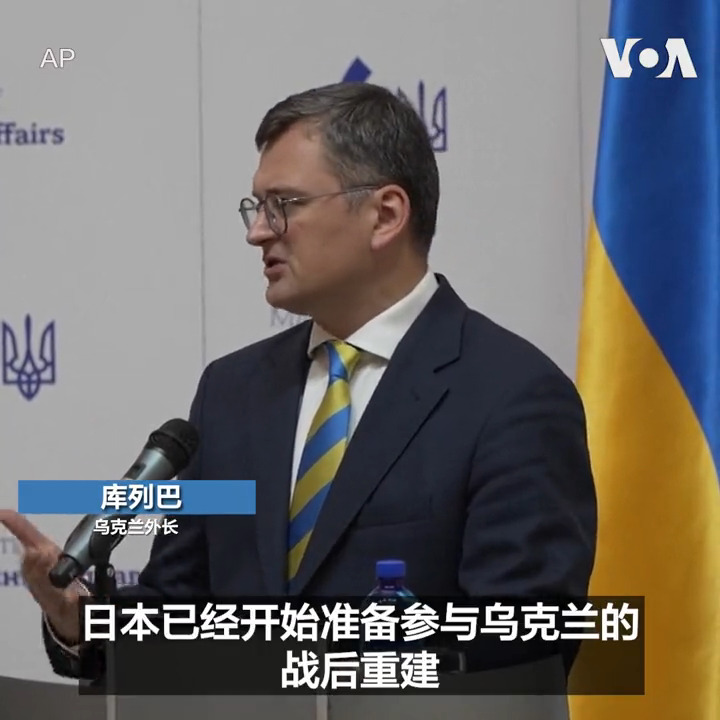
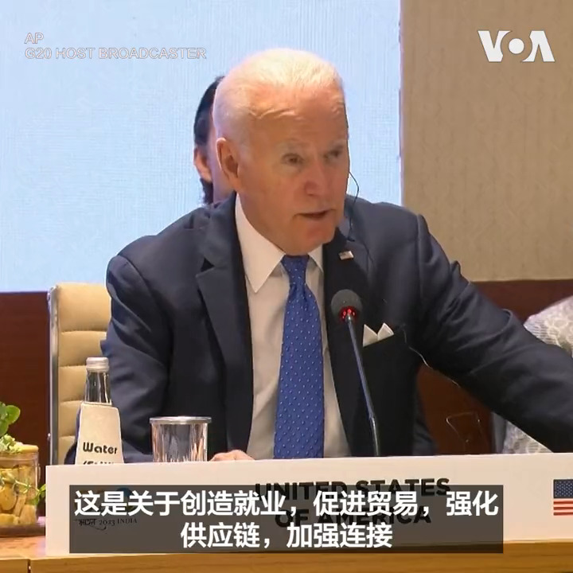

美国之音中文网 北京时间 2023-09-10T06:50:05Z 1700642763610681480 北约成员国罗马尼亚发现疑似俄罗斯无人机残骸 https://t.co/IEcfK42vBF   美国之音中文网 北京时间 2023-09-10T12:03:06Z 1700721533503545611 退出一带一路先摆一边 中意总理会晤 誓言巩固深化双边关系 https://t.co/oq0WeYY84L   美国之音中文网 北京时间 2023-09-10T08:36:09Z 1700669452826931394 英国警方：英国议会研究员因中国间谍活动被捕 https://t.co/KFuTSMCqI5   美国之音中文网 北京时间 2023-09-10T09:42:13Z 1700686082625446045 #美中对标 中国热点对标美国论据，用一杯咖啡的时间聊聊中国热点的美国冷思考。最近中国大学生研究生纷纷加入外卖行业，让这个原本托底的行业竞争更加激烈。在美国疫情期间也有不少人当起兼职外卖员，他们的收入待遇怎么样？https://t.co/8USB4vUowS https://t.co/7e5Rrn5ziO   美国之音中文网 北京时间 2023-09-10T10:06:06Z 1700692090152513776 美国、印度、沙特与欧盟在20国集团峰会间隙宣布铁路港口协议 https://t.co/3VRS9yoDj4   美国之音中文网 北京时间 2023-09-10T10:06:09Z 1700692104517935218 岸田欲在G20说明核处理水排放安全 专家:中国将科学议题政治化 https://t.co/X0DUS6aFQ5   美国之音中文网 北京时间 2023-09-10T08:51:04Z 1700673209442648177 官员们说，乌克兰反攻冬季不会停止 https://t.co/Rv9kCGkhkp   美国之音中文网 北京时间 2023-09-10T04:49:33Z 1700612429527613674 美国加拿大军舰再次联合穿越台湾海峡 https://t.co/hDLB5Ympel   美国之音中文网 北京时间 2023-09-10T05:07:10Z 1700616861497569417 身居“三寸黄泥地”，屡经磨难终不悔 -- 高瑜发自中国的呐喊 https://t.co/dSllMalyMU   美国之音中文网 北京时间 2023-09-10T05:22:06Z 1700620619778494853 马尔代夫总统竞选可能进入第二轮 亲中的挑战者穆伊祖领先 https://t.co/oGGujMSCu4   美国之音中文网 北京时间 2023-09-10T01:09:25Z 1700557029478191179 摩洛哥8日晚遭受强烈地震，被联合国教科文组织(UNESCO) 列为世界文化遗产的马拉喀什老城的许多建筑被损坏。据报道死亡人数已超过1千。 https://t.co/dzT3u59ZVG   美国之音中文网 北京时间 2023-09-10T02:32:21Z 1700577899680522687 日本外务大臣林芳正9日访问乌克兰，与乌克兰外交部长库列巴举行了会晤，他表示日本会坚定地支持乌克兰“直到和平重返这片美丽的土地”。 https://t.co/nIwPqUAzO6   美国之音中文网 北京时间 2023-09-10T03:23:24Z 1700590749899968633 美国总统拜登与参加新德里二十国集团G20峰会的领导人9日宣布计划，打造连接印度、中东和欧洲的铁路和航运走廊。 https://t.co/X9FwGy0Gxo   美国之音中文网 北京时间 2023-09-10T04:05:04Z 1700601235894915098 摩洛哥发生强烈地震，造成 1000 多人死亡，马拉喀什的历史建筑受损 https://t.co/hNIyI77Oc9   美国之音中文网 北京时间 2023-09-10T00:54:35Z 1700553295985786941 习近平第三任期内解决台湾问题？分析：有意愿但没能力 https://t.co/8gn6yH7Kh1   美国之音中文网 北京时间 2023-09-10T01:25:06Z 1700560978579210486 中国CPI八月微弱回升，是向通缩告别还是暴风雨前的短暂安宁？ https://t.co/pD6Cm7YZbp   美国之音中文网 北京时间 2023-09-10T01:58:59Z 1700569502260560325 中国领导人习近平缺席此次在印度举行的G20峰会，由中国总理李强代为出席。拜登总统会与李强会晤吗？印度正在考虑对中国入侵台湾采取可能的应对措施，拜登总统是否会在峰会上与各国领导人讨论台湾议题？美国之音记者在新德里专访白宫国安会战略沟通协调员科比，听听他怎么说。 https://t.co/fhgHa4Q1Uo   