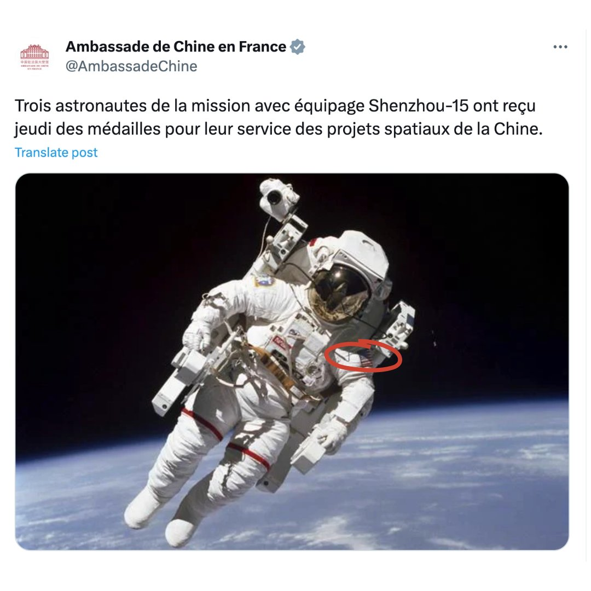

自由亚洲电台 北京时间 2023-09-10T09:12:39Z 1700678640865022384 中国外交部8日宣布，#赞比亚 总统希奇莱马将于9月10日至16日对中国展开访问。期间将与中国国家主席习近平会谈。舆论关注赞比亚总统此行会否与中方签署谅解备忘录，以便敲定今年6月包括中国在内的债权人在巴黎达成的 #赞比亚债务重组 协议。

 https://t.co/MBfawCv3eM   自由亚洲电台 北京时间 2023-09-10T08:36:20Z 1700669500775924214 【又翻车！#中国驻法使馆 用 #NASA 照片赞自家太空人 遭群嘲】
中国驻法大使馆日前在X（前身为推特）上的推文写道：“神舟15号团队3位 #太空人 周四（7日）因对中国太空计划的服务而获奖”，并配上一名太空人照片。

然而这个回馈仅获72个喜欢的文章，却意外引发风波与大量回覆。不少眼尖的网友发现，照片中的太空人并非中国太空人，而是配戴美国国旗臂章的美国太空人，并纷纷在下方放大美国国旗，并留言嘲讽中国 #大外宣 再度失败，弄巧成拙。

据中央社报道，网友@Jojo99275148找到照片出处，是来自于美国国家航空暨太空总署（NASA），图中之人为太空人麦肯雷斯（Bruce McCandless），照片为他1984年人类史上首次没系安全带的太空漫步，堪称经典。

学者与前记者史密斯（Charles R. Smith）写道：“这实在是非常糟糕的外宣”，这个留言的获赞数甚至高于驻法使馆的贴文。

许多网友也引用贴文，其中澳洲华裔异议艺术家巴丢草转发并搭配美国臂章放大图，问道：“这是中国国旗吗？”

更多人则是嘲讽中国宣传反效果，连大外宣工作人员都不想努力了。   自由亚洲电台 北京时间 2023-09-10T09:16:19Z 1700679562328416420 “爱国大V” #周小平 的妻子 #王芳，在乌克兰 #马里乌波尔剧院 高唱苏联名曲“喀秋莎”，她是“道德沦丧”，还是“战地玫瑰”？
 https://t.co/U0QQRF3ps9   自由亚洲电台 北京时间 2023-09-10T02:08:50Z 1700571983786999830 美印联合声明：支持 #印度入常 推动印度成为维修美海军资产中心 https://t.co/yGjZTIYGmq   自由亚洲电台 北京时间 2023-09-10T02:12:28Z 1700572898606407797 RT @RFA_Chinese: 【水淹珠三角 深圳火车站现瀑布】
【广东多地宣布停课】… https://t.co/lXkiwFJepV   自由亚洲电台 北京时间 2023-09-10T02:56:14Z 1700583912991310043 RT @RFA_Chinese: 评论 | 何清涟 @HeQinglian：#习近平缺席G20，真正原因并非"皇帝"心态
 https://t.co/kbDnKo9NQ4   自由亚洲电台 北京时间 2023-09-10T04:08:09Z 1700602011916361922 RT @RFA_Chinese: 专栏 | #中国透视：#中国地下公民社会——#毛泽东去世四十七周年 回首
 https://t.co/Q8NtqjmeDS   自由亚洲电台 北京时间 2023-09-10T01:57:36Z 1700569156616061430 RT @RFA_Chinese: 【#华为 引爆中国科技民族主义 小粉红过度自嗨？】
【用粗笔画工笔画 华为用中芯7纳米芯片有价格竞争力？】
【中国半导体发展挫折 体制造就烂尾】
【中美科技冷战 政府主导抄袭vs自由经济创新】
详见最新一期 #亚洲很想聊 https://t.c…   自由亚洲电台 北京时间 2023-09-10T02:09:54Z 1700572249479340187 中国政协委员、“爱国大V” #周小平 的妻子，中国歌手 #王芳，在 #乌克兰 马里乌波尔剧院高唱苏联名曲“ #喀秋莎”，遭乌克兰政府指责“道德沦丧”，要求中国政府作出解释。 https://t.co/U0QQRF3ps9   自由亚洲电台 北京时间 2023-09-10T02:11:00Z 1700572527687614552 美国总统 #拜登 10日将访问 #越南，据路透社的独家报道引述多名知情人士说，谷歌（Google）、英特尔（Intel）、半导体封测大厂艾克尔（Amkor）、美满（Marvell）、格罗方德（GlobalFoundries）以及波音（Boeing）的高管，10日将在河内出席一场论坛。 https://t.co/a1dAdcEpBr   自由亚洲电台 北京时间 2023-09-10T02:12:18Z 1700572856445194594 RT @RFA_Chinese: 【#亚太报道（2023-9-8）】
欢迎收听和订阅播客【亚太报道】 https://t.co/MjLNSvVMqc

广东珠三角遭遇 #世纪雨灾 / 女权工作者 #叶海燕 向社会求助 / 北京媒体人 #耿潇男 服刑期满 / 中国人大计划针对 #…   自由亚洲电台 北京时间 2023-09-10T02:12:21Z 1700572866494832645 RT @RFA_Chinese: 《环球时报》这样洗，能洗白吗？
#美籍华人被指控充当中国政府代理人案细节  #跨国镇压 https://t.co/xVICjr7RL1   自由亚洲电台 北京时间 2023-09-10T02:12:53Z 1700573001157066761 RT @RFA_Chinese: 【多地公务员及慈善机构被欠薪】
 【天津区政府向寺院借钱】
中国政府财政吃紧，南京、天津以及山东等地的政府公务员，继去年被 #降薪 之后，又被 #拖薪。吉林就连退休金也被停发。甚至有政府向寺院借钱，武汉有慈善机构人员披露，上级叫他们做好自谋出路…   