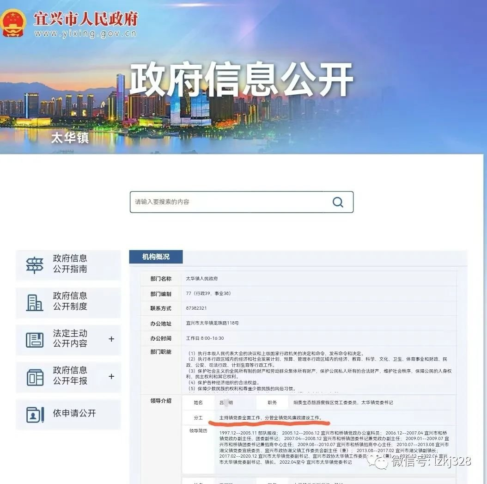
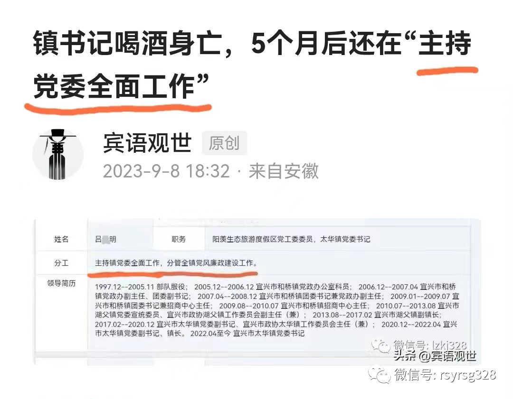
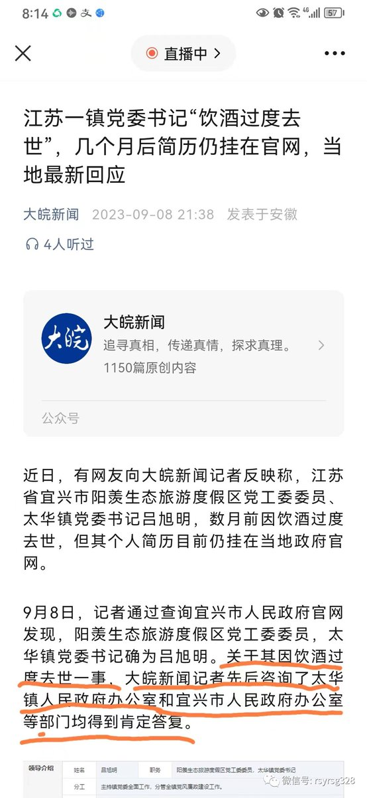
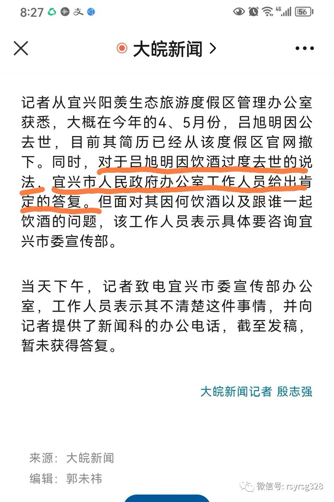
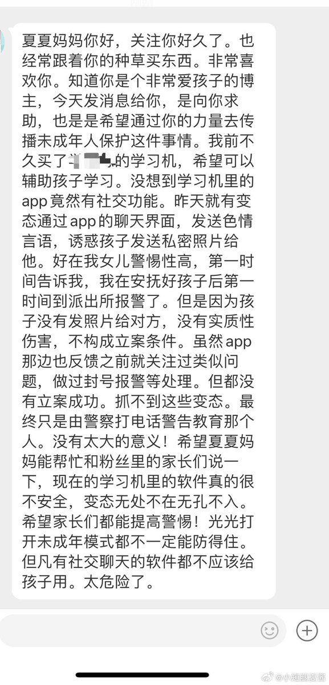
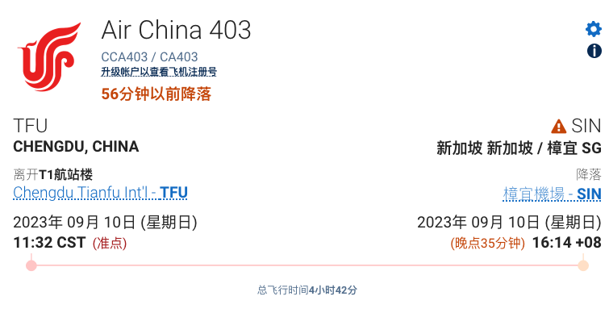
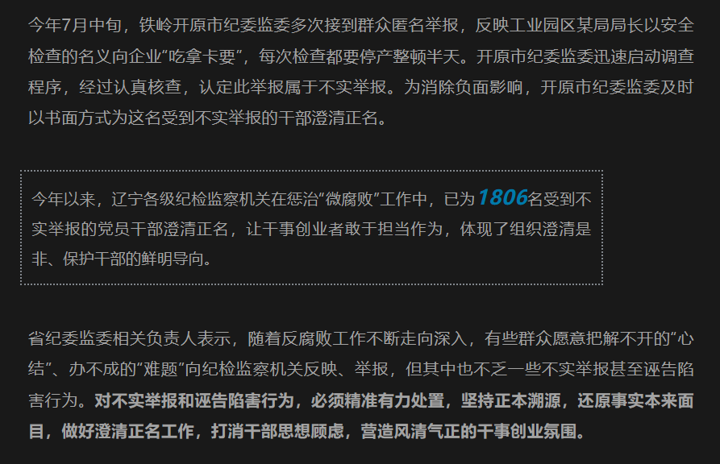
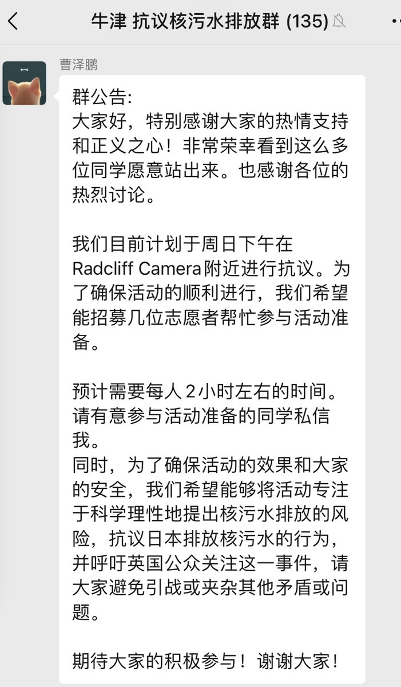
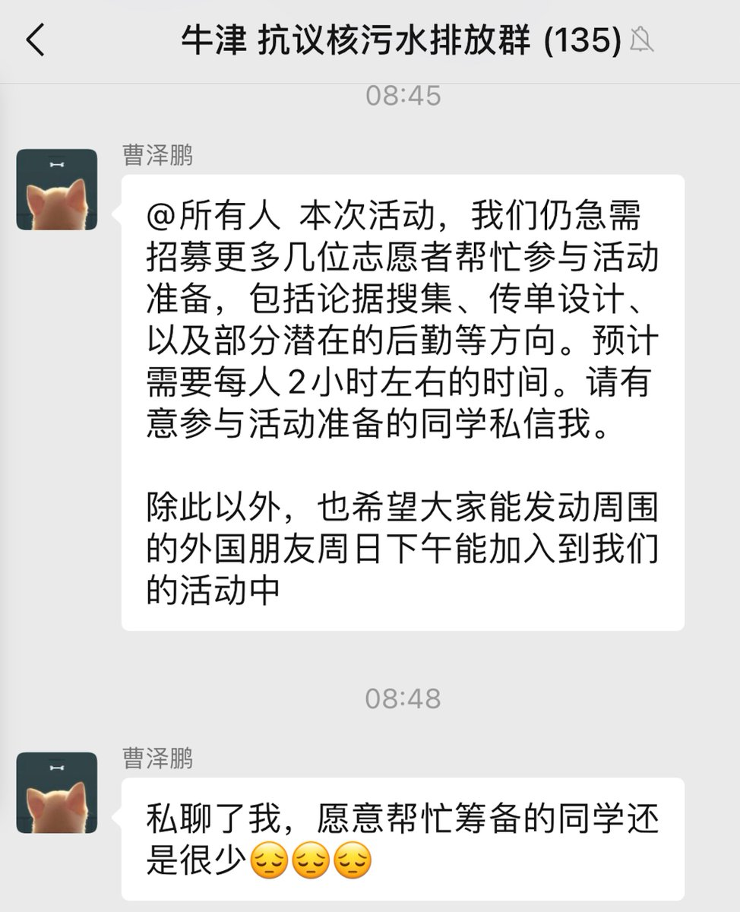

谁将十万横扫三江 北京时间 2023-09-10T23:10:41Z 1700889538414182902 因发布宜兴市阳羡生态旅游度假区党工委委员、太华镇党委书记吕某明去世5个多月，还挂在当地的政府官网上，分工是“主持党委全面工作，分管全镇党风廉政建设工作”，刚刚，9月10日下午，我被自称宜兴宣传部、公安的人跨省“传唤”。

9月8日，宾曰语云独家披露，今年4月6日晚上，宜兴市阳羡生态旅游度假区党工委委员、太华镇党委书记吕某明值班期间饮酒后去世，时间过去5个多月了，名字、职务还挂在当地的政府官网上，分工是“主持党委全面工作，分管全镇党风廉政建设工作”。（详情点击：镇书记喝酒身亡，5个月后还在“主持党委全面工作”）

9月10日下午，我被自称宜兴宣传部、公安的人跨省“传唤”。

今天下午3点多钟，宾曰语云接到安徽某市一派出所杨警官电话，让我去派出所，说是配合宣传部门了解情况，说不是他们了解，是其他部门了解。不是他们找我，是其他部门找你的。

宾曰语云：市里什么部门？

杨警官：是市里宣传部门。

宾曰语云：市里宣传部门我认识，宣传部门哪位？

杨警官：上面打电话，让我们帮着协查一下。

宾曰语云：什么事？

杨警官：我们具体不知道什么事，宣传部门让我们配合一下子，给你联系下子。

宾曰语云：宣传部门谁，请告诉我姓什么，叫什么，什么职务。

杨警官：你这样具体问我，因为上面领导安排的。

宾曰语云：你都不知道谁，找我了解什么呢？

杨警官：这个没事，你可以到我们派出所来，问问具体情况。

宾曰语云：我干嘛要去呢？你没告诉我具体情况，让我去干什么？

杨警官：我们可以当面，宣传部门人也到了，他们具体跟你了解情况。

宾曰语云：到了让接电话。

宜兴某人：我是江苏宜兴宣传的。

宾曰语云：江苏宜兴宣传的，为什么讲是安徽宣传部门的？

宜兴某人：我跟你说，跟你了解一下情况，具体情况呢，怕你不相信是派出所的，所以让这边派出所跟你联系的。所以，你过来，我们有一个情况，想跟你了解一下，你可以到这边派出所来吧？

宾曰语云：我干嘛要去呢？你宣传部门（重复听录音发现是自称宜兴那边派出所的假冒宣传部门，也许有宣传部门的人陪同？）动用公权力干什么呢？

宜兴某人：这不是叫动用公权力，因为你发的帖子是一个谣言。【难怪跨省传唤我，他们已经认定我发的《镇书记喝酒身亡，5个月后还在“主持党委全面工作”》是谣言了。】

宾曰语云：我对我发的帖子负责的，什么谣言？

宜兴某人：首先我问你，你是不是发了一个叫镇党委书记死亡五个月之后还在主持工作？

宾曰语云：对呀，这是事实呀，这是什么谣言呢？

宜兴某人：那我首先问你，一个人如果假设死亡之后他能主持工作吗？

宾曰语云：讲什么？

宜兴某人：一个人，我们正常理解，一个人假设死亡之后他能主持工作吗？

宾曰语云：死亡之后为什么官网上还在主持工作呢，你说，你告诉我。
宾曰语云：官网是干嘛呢，网络时代每天都要更新的，为什么死了五个多月了，还喝酒死亡的，是不是？为什么不把他名字下掉呢？

宜兴某人：首先，有没有喝酒死亡，这个也是我们要调查的内容。

宾曰语云：不是你调查，是镇里面、大皖新闻记者采访时也核实啦，报到啦。

宜兴某人：你有没有跟大皖新闻核实过呢？发之前你有没有核实过相关情况。

宾曰语云：我当然核实啦，不核实我发什么？

宜兴某人：你向谁核实的，让你过来，就是要了解这个情况。

宾曰语云：你贵姓，你什么身份？

宜兴某人：我刚才不是跟你说了吗，宣传的。

宾曰语云：宜兴宣传部的是吧？

宜兴某人：对。

宾曰语云：做什么的，什么职务？

宜兴某人：我就是个职工。

宾曰语云：你贵姓？

宜兴某人：免贵姓赵。

宾曰语云：姓赵是吧？那我吧我俩的对话发到网上可以吧，让大家来评判。

宜兴赵某人：可以啊。但是我告诉你，不能掐头去尾，不能以吸引人的方式去把这个内容去改变。

宾曰语云：不需要你来教我怎么做，好不好？

宜兴赵某人：你现在发的内容的标题，就已经引起人家的误解了。

宾曰语云：没有引起误解，我文章发过之后，他们是不是下掉了？

宜兴赵某人：你听我说，官网网站他是有人去操作的，对吧？他有人去操作就有可能更新不及时，但你发的内容叫，我们正常人死亡之后他能主持工作吗？

宾曰语云：网站上写的就是主持全面工作啊，这是政府官网发的。
宜兴某人：但是你这个标题你有没有看到过人家留言的情形？
宜兴赵某人：我刚刚不是跟你说过了吗，主持工作你有没有去核实过，他是不是在主持工作？

宾曰语云：你们官网讲他在主持工作呀，对不对，要不还要官网干什么？

宜兴赵某人：网上是网上。

宾曰语云：请你解释下，什么是官网？你们官网网站讲，他在主持全面工作，对不对？

宜兴赵某人：我刚才不是跟你说了吗，网上他有可能更新不及时。

宾曰语云：更新不及时是不是理由？

宜兴赵某人：但是你不能因此去断定他在主持工作，对吧？

宾曰语云：你们网上讲他在主持工作呀，不对吗？

宜兴赵某人：我问一下，你方便过来吗？

宾曰语云：我不方便，不让我过去我就过去？

宜兴赵某人：……

后经了解，这个所谓的宜兴宣传部赵某人，是出示了警官证、带着立案手续来到安徽要求我去派出所“调查”的。

一个小时后，后来，自称江苏宜兴公安局的万姓警官打来电话，说接到一个报警，关于太华镇吕某明的帖子，死者家属报警了，他们也向家属做了解释工作，说通过舆论监督政府工作，本身是无可厚非的。但家属的意思，我发布的东西有点失实，对她死去的丈夫名誉上有点不负责任了。

万警官说，死者家属昨天报警的，他们也看了相关帖子和报道，包括大皖新闻，省里宣传与安徽宣传方面沟通过了，这个东西确实是失实的，大皖新闻已经删除了。【事实上，知道我发这篇文章前，大皖新闻的文章还在】
万警官说，他们找我也是为了我好，怕我被一些有心人利用，在炒作这个事情。找我是想了解爆料人的情况，怕我被一些人利用。我说我20年前就在江苏的扬子晚报和金陵晚报等媒体经常发整版的文章，我能被谁利用。

万警官说，明天（周一）约个地方和我见个面，政府机关、公安机关都可以，因为家属毕竟是报了案了，情绪一直比较激动。

宾曰语云：“报了案这个事是真的是假的，您心里其实比我有数，对吧？作为当地人，又是当地公安的，这个事您不可能不知道。他在值班期间陪人喝酒，喝酒之后回单位洗澡，然后人出事了。”

万警官说：我知道您可能有相关的您自己觉得靠谱的调查的事实，但是我们作为公安机关来说，人家有人报案，我们也是作为一个调查，一个询问。

宾曰语云：“你询问的法律依据是什么呢？”

万警官：依据就是您这边的帖子对她的丈夫报道是失实的，然后有一些侮辱诽谤的情节在里面。

宾曰语云：您看了文章后，认为哪一句是侮辱的？

万警官：我也知道您肯定是经过了调查的，是您觉得调查的是真实的您才发的，对吧，您不可能去捏造一些东西，编造一些东西，我是知道的，但是您也应该理解一下作为公安机关来说，人家报了案，我们受案以后询问一下当事人，对吧？我们并不是说有什么，相当于一个调查的过程一样。

宾曰语云：调查不要调查我，你们首先应该在镇政府对当天值班的相关人员、与谁在一起喝酒进行调查，在镇政府调查完之后确认他不是酒后死亡，那么你们可以确定我的文章是谣言，现在源头应该在镇政府。

万警官：政府没有公开的具体的一个事情的通告发布的这些东西，我们跟政府的相关部门给我们的答复就是这篇东西是失实的。

宾曰语云：政府哪个部门？

万警官：他们说事因病离世，没有说是喝酒去世的。

宾曰语云：政府哪个部门告诉你的？

万警官：政府哪个部门我肯定不会跟你讲。您也理解我一下。

宾曰语云：我尊重您，我也希望你们尊重别人。今天下午你们一个姓赵的人，冒充我们这边市委宣传部，他说话很不礼貌，他就在电话里认定我发的文章是谣言，你们已经定性我的文章是谣言了，还找我做什么？

万警官：我想明天跟您见个面，您看方便不？

宾曰语云：你们想知道谁给我爆料的，我不会说的。这个是最起码的职业底线。你们认为失实，只要他家人不昧着良心，说没有喝酒，让他家人出具不喝酒的证据，如果他们提起刑事自诉，我会把所有的证据拿出来，我证明他喝酒了。如果他没喝酒，值班时间，用脚趾头想一想，他没喝酒，值班时间死亡了，肯定是因公殉职呀，你看到官方发布讣告了吗？官方为什么一个字没发，是“因为不太方便”呀，只是在镇里自己的工作软件上发了一个通知，连追悼会都不敢大张旗鼓的开，当地哪个人不知道呀？万先生，您说您是真不知道还是假不知道？

万警官：您说的肯定是有您的道理的，但是我呢作为公安对于我们调查过的事情也没办法跟您说什么脚指头都能想到的事情，我也没办法表达我的观点。如果有人恐吓您，我虽然不能代表谁，作为宜兴的，我给您说声抱歉。我还是希望您能配合我们了解一些情况。

宾曰语云：我写过上万篇文章，没有义务配合任何人，好不好？我对我文章的真实性负责，其他我没有义务配合。好不好？

万警官：当事人也是有配合我们公安机关的义务。

宾曰语云：我不是当事人。她认为有问题的话，可以通过法院起诉，好吧？如果你们认为是刑事案子，就立案，好不好？立案后再说。

万警官：我们已经受理初查了，是否立案我们要找您了解了情况以后，再定。

宾曰语云：你刑事立案以后再讲，好不好？

万警官：我们现在也是初查，也没有办法判定您说的一定是……

宾曰语云：我没有义务配合，好不好？

万警官：话也不能这么讲吧？

宾曰语云：我就这样讲了。

万警官：我们抛开之前的，咱们心平气和的。

宾曰语云：我不要抛开之前的，好吧？你们现在也不能跨地区办案吧？你们通过我们当地公安，好吧？

万警官：如果我们去跟你见面，肯定会通过当地公安的。

宾曰语云：通过我们当地公安，好。

万警官：我们也不是传唤不是什么的，所以想跟你联系好以后，确定了时间、地方，我们自然去找你之前肯定会和当地公安先配合以后，先交接一下我们要写作的手续以后我们肯定才……

宾曰语云：好，到时候你办好手续再讲，好不好？好吧？谢谢！

万警官在问过我在哪里后，说：行，好好。

大皖新闻9月8日报道（链接：《江苏一镇党委书记“饮酒过度去世”，几个月后简历仍挂在官网，当地最新回应》）：关于其因饮酒过度去世一事，大皖新闻记者先后咨询了太华镇人民政府办公室和宜兴市人民政府办公室等部门均得到肯定答复。

记者殷志强从宜兴阳羡生态旅游度假区管理办公室获悉，对于吕旭明因饮酒过度去世的说法，宜兴市人民政府办公室工作人员给出肯定的答复。（作者：宾语）（宾曰语云微信公众号：lzkj328）   谁将十万横扫三江 北京时间 2023-09-10T20:39:20Z 1700851448811343896 RT @whyyoutouzhele: 9月10日，一则李佳琦在直播间怒怼观众的视频在墙内爆火，视频中有网友质疑其出售的国产某眉笔品牌价格越来越贵时，李佳琦突然开怼：
“国货品牌很难的，这么多年都是79块钱，哪里贵了？有的时候找找自己原因，这么多年工资涨没涨，有没有认真工作，好…   谁将十万横扫三江 北京时间 2023-09-10T20:54:16Z 1700855205565509916 RT @whyyoutouzhele: 今天这期节目我想聊一聊“政治性抑郁”这个话题
我们中国人的政治性抑郁与其说是抑郁，不如说是一种对于自身政治权利的绝望。是我们面对发生在自己身上的事情的那种无力感。
在我看来，在我政治性抑郁最严重而痛苦的时期，是彭载舟给了我力量。我没有想到…   谁将十万横扫三江 北京时间 2023-09-10T21:06:35Z 1700858308364743103 RT @boiledwater: 女儿在某品牌学习机的app里被索要内裤照片。

家长报警后——

“因为没有实质性伤害，不构成立案条件”。 https://t.co/B8Az8J9tfC   谁将十万横扫三江 北京时间 2023-09-10T18:46:30Z 1700823055201919117 RT @myfxtrader: 网传今天成都天府-新加坡樟宜的CA403航班在即将抵达新加坡之时挂出7700（紧急情况）。网友提供图片显示飞机已降落，左发动机起火。 https://t.co/hSuJJUqMI7   谁将十万横扫三江 北京时间 2023-09-10T10:25:20Z 1700696932505866748 没考上高中的孩子最后都去哪里了？ https://t.co/ZLhJOrUP4L   谁将十万横扫三江 北京时间 2023-09-10T09:28:58Z 1700682747587768593 投稿 难道这也有错？ 省纪委监委负责人表示"有些群众愿意把解不开的“心结”、办不成的“难题”向纪检监察机关反映、举报"。今年5月，辽宁省委制定出台《关于惩治诬告陷害行为做好澄清正名工作的实施意见》，亮明为担当者担当、为负责者负责的鲜明态度。全省各级纪检监察机关加强与公安机关、检察机关、审判机关联动协调协作，充分运用信息化、大数据等技术进行查办，精准甄别不实举报特别是涉嫌诬告陷害行为，在追究诬告陷害实施者的同时，追究隐匿幕后的组织者、操纵者，以“零容忍”的态度一案双查，一查到底。

不久前，朝阳凌源市纪委监委查明被匿名举报的公安系统某干部“受贿、违反生活纪律等问题”不实，对捏造事实、指使他人举报的两名诬告陷害人严肃处理，给予两人留党察看、政务撤职处分，并为被诬告的干部澄清正名。   谁将十万横扫三江 北京时间 2023-09-10T10:08:30Z 1700692695793213632 RT @torontobigface: 网友投稿，牛津大学学联
组织在校中国人抗议日本核污水事件。、
但是貌似没有什么人响应。
这种学联组织一般都是受到中国政府资助的。 https://t.co/tKRxJ3tipv   