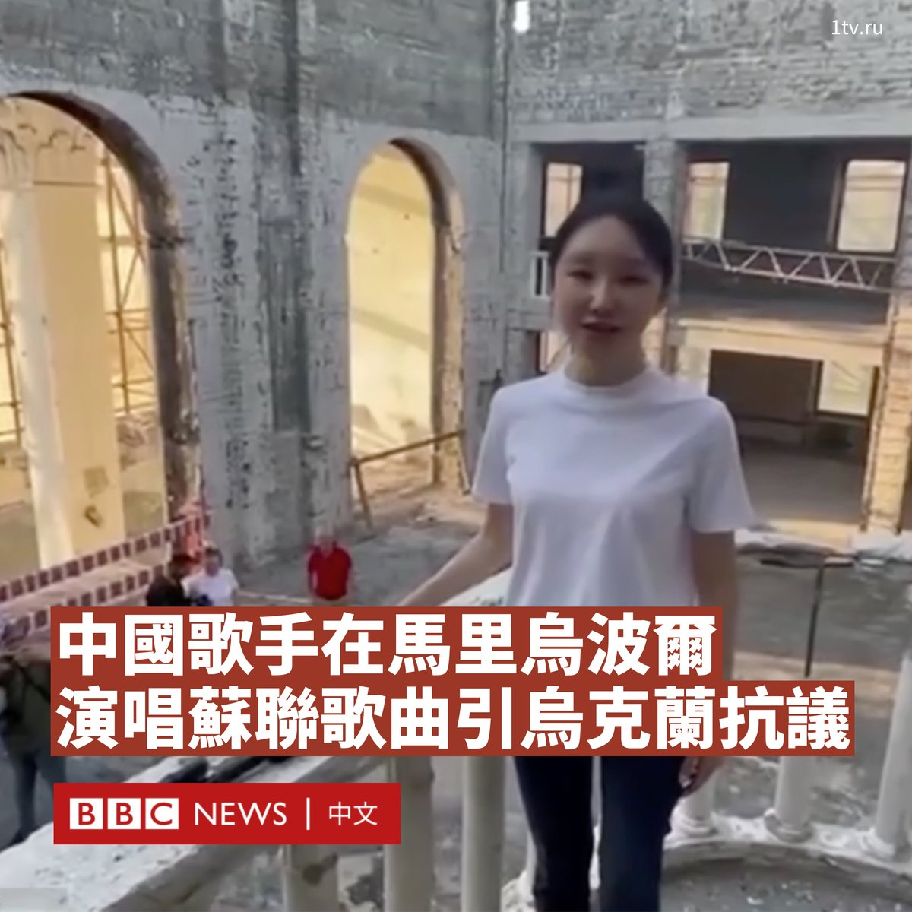

D英国广播公司BBC 北京时间 2023-09-09T00:10:20Z 1700179772398305588 一名中国歌手在俄罗斯占领的马里乌波尔演唱苏联歌曲《喀秋莎》（Katyusha）后，引发乌克兰的抗议。

乌克兰外交部发言人奥列格·尼科连科（Oleg Nikolenko）周五（9月8日）表示，中国歌手王芳在马里乌波尔剧院废墟上表演《喀秋莎》，是“道德沦丧的案例”，因为俄军在那里“杀害了600多名无辜者”。

“根据现有信息，一群中国博主抵达了这座被临时占领的城市。他们的到来是非法的。”他在社交媒体上的一份声明中写道。

此前，俄罗斯第一频道等多家媒体报道说，王芳在正在修复的剧院阳台上“即兴演唱”了这首俄罗斯卫国战争中的著名歌曲。

社交媒体上的影片显示，身穿白色T恤衫的王芳用普通话高声演唱了该歌曲，她手边放置着一个手机和一个麦克风，而她身后则有几人在拍照和交谈，其中一人带着相机。

2022年3月，俄罗斯对被用作平民避难所的马里乌波尔剧院发动空袭。乌克兰官员称袭击估计导致300人死亡。

联合国人权官员称，该空袭是俄罗斯“对平民造成伤害的最致命和最典型的例子之一”，当时有数百名平民躲在剧院里面，从空中可以看到明显标有“儿童”的标志。

后来，俄罗斯和乌克兰军队在这里进行了残酷的围城战。乌克兰总统泽连斯基（Volodymyr Zelensky）在当年4月称马里乌波尔已“被彻底摧毁”。5月后该地区被俄军完全占领至今。联合国人权高专办在当年6月核实马里乌波尔有1348名平民直接死于敌对行动，其中包括70名儿童。

“乌方尊重中国领土完整，希望中方解释中国公民在马里乌波尔停留的目的以及进入被临时占领的乌克兰城市的途径。”尼科连科写道。

他补充说，乌克兰外交部正采取措施禁止这些中国访客入境乌克兰。

38岁的王芳是中国民族唱法歌手，曾在2014年登上中国中央電視台春节联欢晚会的舞台。她也曾在多档电视节目中演唱红色歌曲。她的丈夫是被中国当局宣传为“正能量”网络作家、在今年履新全国政协委员的周小平。

王芳尚未对此事进行回应，但周小平在微博发帖称其妻子的演唱让当地居民“表示深受鼓舞”，因为他们“一直都在努力抵抗北约雇佣军和乌军的各种袭击”。

他称，王芳还会见了杰尼斯·普希林（Denis Pushilin）。普希林是克里姆林宫控制下的“顿涅茨克人民共和国”领导人。   