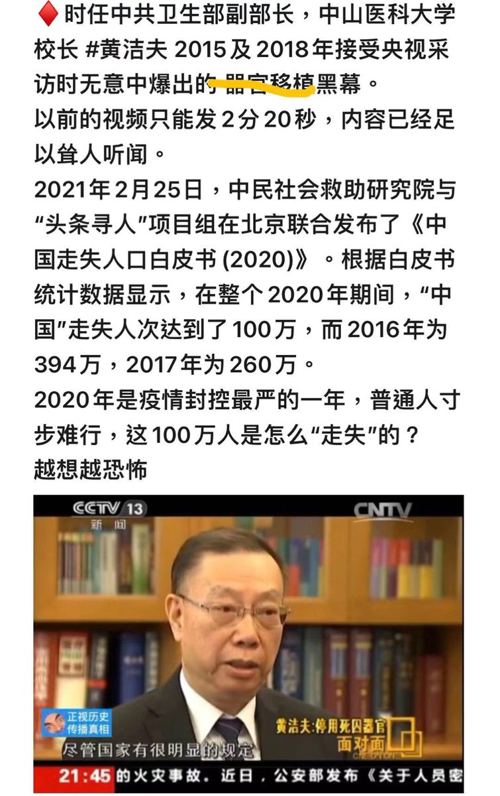

Petrichor 北京时间 2023-09-09T11:03:56Z 1700344259163857179 今年新版地图引起周边国家的不安。现在专家出来洗地了。听他说完。 https://t.co/Qd8SMwEon9   Petrichor 北京时间 2023-09-09T07:48:20Z 1700295035114193097 欧美社会也有许多不公平的事情，包括貌似象牙塔的大学里，黑暗有时也会撩过。但是，至少院长不会因为对新生讲几句人生哲理和鼓励学生独立思考的话，就会被校方处分，批评其政治不正确。

华人，屈居海外，不是因为他们喜欢外国，而是因为自己的祖国的统治者并不争气，他们对自己公民更加不好。如果自己祖国是个民主自由、安全稳定、法治平等、繁荣富强的国家，谁愿意客居他乡呢？例如，日本人移民外国的就非常少。   Petrichor 北京时间 2023-09-09T00:57:21Z 1700191604215099513 有些年轻人死了，器官移植进权贵老人的身体，让他们继续活。这就是不平等。 https://t.co/GYeOK8kkhy   