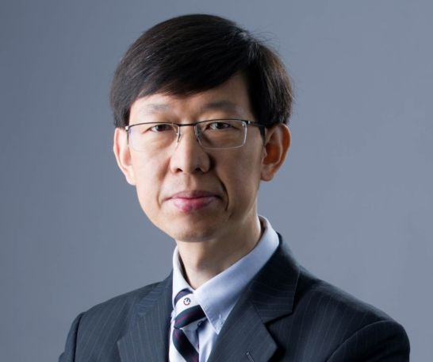
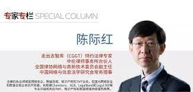
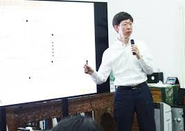

拆墙运动公号 北京时间 2023-09-09T23:41:12Z 1700534830461505634 #2259专案组  互联网防火墙55号嫌犯
姓名：#陈际红 
性　　别：男。1970年9月26日出生
身份证：410621197009263011
民　　族：汉族
政治面貌：党员
入党时间：1995年6月5日
籍贯：河南省浚县
学历：硕士
电 话：13701134607
邮 箱：chenjihong@zhonglun.com
专业资格： 11101199810998745
微博ID: 1106359664
所学专业：本科：理工/研究生：理工/LLM：比较法
电话：010-68281369
电话：86-10-59572288
传真：86-10-65681022/1838
住址：三里河一区1楼3门2号
办公地址：北京市朝阳区建国门外大街甲6号SK大厦31层
职务:北京市中伦律师事务所合伙人 
全国律协网络与高新技术委员会副主任
所在律所： 北京市中伦律师事务所

擅长网络加密和监控控制
#拆墙运动 #BanGFW #反人类罪 

个人简历
所在律所： 北京市中伦律师事务所 
专业资格： 11101199810998745
职 务： 合伙人 执业年限： 20-25年
电 话：13701134607 地 址：北京市朝阳区建国门外大街甲6号SK大厦31
层
邮 箱：chenjihong@zhonglun.com 
学 位：硕士
毕业院校：Chicago-Kent College of Law/清华大学/西安
交通大学
所学专业：本科：理工/研究生：理工/LLM：比较法
性 别：男
民 族：汉族
政治面貌：党员
详细资料见：#BanGFW拆墙运动建墙罪犯录（#ban_greatwall）https://t.co/GzFervBMkT   拆墙运动公号 北京时间 2023-09-09T15:34:40Z 1700412388913086720 邀请各国加入 #拆墙运动 ！
每天向各国大使馆发送邀请邮件，9月4日得到芬兰大使馆的回复！
感谢🙏芬兰大使馆的支持！
拆倒中共 #互连网防火墙 靠我们大家的共同努力！
感谢🙏每一个协助与支持 #拆墙运动 的朋友！ https://t.co/zJDySMW8Db   拆墙运动公号 北京时间 2023-09-09T04:59:41Z 1700252589668131153 #拆墙运动 每天都向世界各国发送邀请80亿人来帮助中国人拆除中共 #互连网防火墙 的邀请！
请全世界一起早日拆除中共罪恶的 #防火墙！ https://t.co/I20BsKne6v   