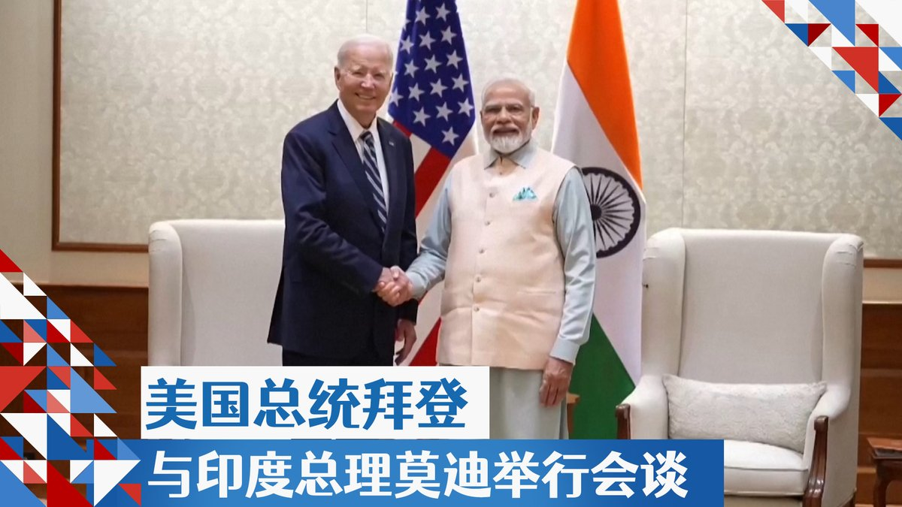
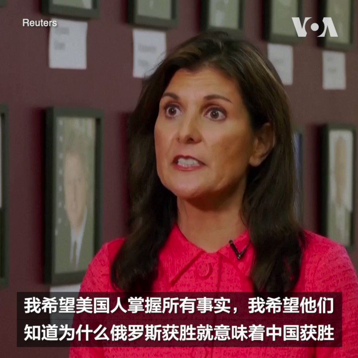
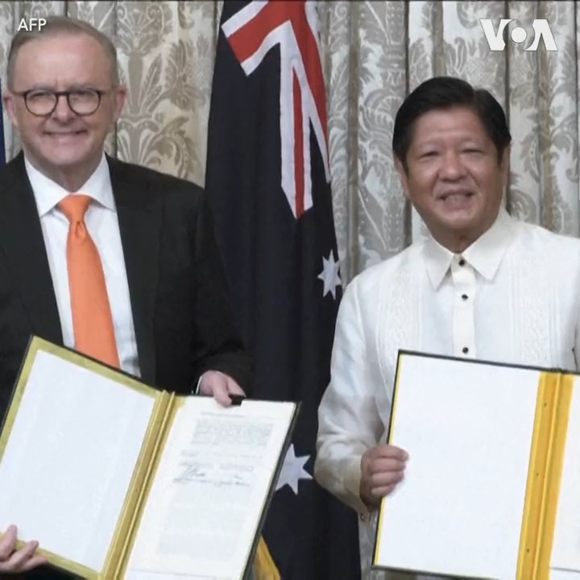
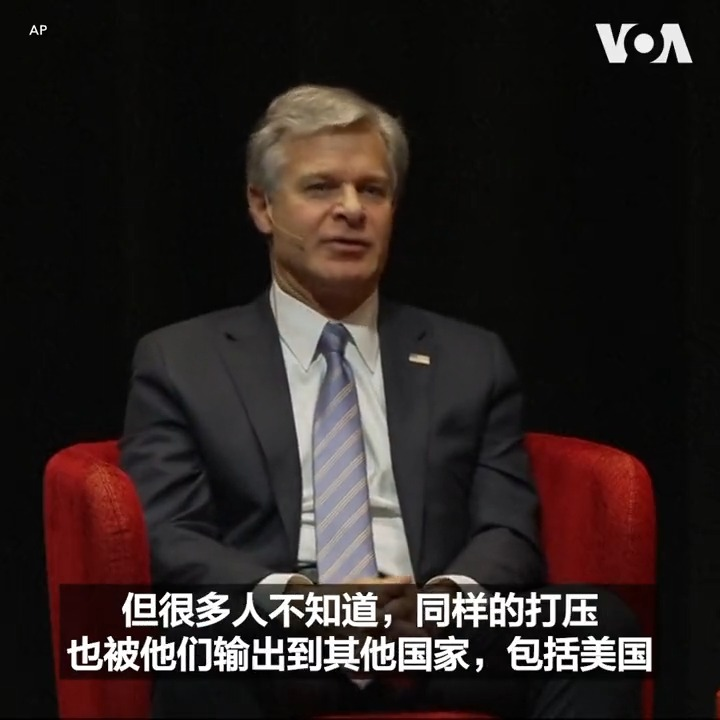

美国之音中文网 北京时间 2023-09-09T02:59:34Z 1700222364422909986 中国房市危机缓解 分析: 抢救楼市“组合拳”恐酿恶性循环 https://t.co/rWnHA37FqG   美国之音中文网 北京时间 2023-09-09T03:14:06Z 1700226021713391865 香港末代通识科学生谈一个时代的终结 如何面对大专院校国安教育 https://t.co/pJUGR2jv5T   美国之音中文网 北京时间 2023-09-09T03:30:11Z 1700230067765281103 美国总统拜登周五在抵达新德里后随即与印度总理莫迪举行会谈。美国财政部长耶伦、白宫国安顾问沙利文、印度外交部长苏杰生和印度国安顾问多瓦尔都参加了会面。双方在会后发表了进一步深化两国战略伙伴关系的联合声明。详细报道：https://t.co/I2iUB9fjql https://t.co/oRyC3LHM2v   美国之音中文网 北京时间 2023-09-09T00:23:57Z 1700183198452351151 曾在特朗普总统任内担任美国常驻联合国代表的前南卡罗莱纳州州长妮基·黑利9月7日说，乌克兰取得对俄罗斯的胜利将有助于对中国形成震慑，使其不敢武力犯台。黑利是在新罕布什尔州曼彻斯特市参加竞选期间说这番话的。她正在角逐明年美国总统选举共和党的候选人提名。 https://t.co/UYbjcHHEH6   美国之音中文网 北京时间 2023-09-09T00:26:34Z 1700183857134449046 中共扼杀公民自由愈演愈烈：从控制言论自由到控制穿衣自由 https://t.co/nyRCrTdkEy   美国之音中文网 北京时间 2023-09-09T00:57:11Z 1700191563199156460 人民币贬值压力巨大，兑美元汇率已跌至16年最低点 https://t.co/x6u1VTbFiS   美国之音中文网 北京时间 2023-09-09T01:21:29Z 1700197678821376192 拜登提前一天抵达新德里参加G20峰会，美印进一步加强双边关系https://t.co/sRff01KOj2   美国之音中文网 北京时间 2023-09-09T02:20:09Z 1700212442637197421 菲律宾和澳大利亚9月8日签署战略协议，提升双方的安全与经济关系。协议由访问马尼拉的澳大利亚总理阿尔巴尼斯与菲律宾总统马科斯签署。 https://t.co/oddiTRQmOk   美国之音中文网 北京时间 2023-09-09T00:14:11Z 1700180741521396134 “中国的打压和侵犯人权行为也被他们输出到其他国家，包括美国”，美国联邦调查局局长克里斯托弗·雷7日在华盛顿间谍博物馆的一场活动上说。他表示，中国海外镇压活动的主要目标是对中共政权持批评态度的华人。他说美方会尽一切所能为那些在美国受到中共骚扰的人士提供帮助。 https://t.co/1R5HkVbbgp   