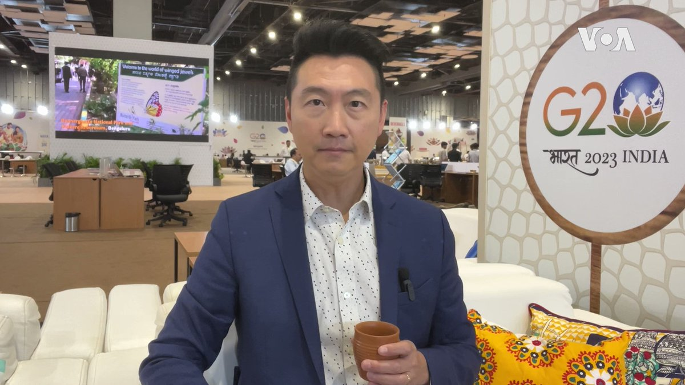

美国之音中文网 北京时间 2023-09-09T05:08:34Z 1700254826754674803 【家事国事天下事，你有何见解】中国国家主席、军委主席习近平发布《军队实施〈中华人民共和国人口与计划生育法〉办法》，鼓励和奖励军人多生多育。先前已有人批评说，中共/习当局明显以繁衍猪的思路谋划提升人口增长。这种超级计划生育是创举还是荒诞剧？ https://t.co/jt4ak2ko2x   美国之音中文网 北京时间 2023-09-09T06:26:35Z 1700274459611951441 联合国秘书长：全球大家庭“功能失调” https://t.co/xKVHHFuHUH   美国之音中文网 北京时间 2023-09-09T06:42:35Z 1700278486026613007 联合国：俄罗斯在乌克兰被占领区的“选举”没有“法律依据” https://t.co/FxGoddzZ5C   美国之音中文网 北京时间 2023-09-09T07:00:02Z 1700282876825112857 中国著名记者高瑜在中国高压政治环境里坚持报道实情，获得包括联合国教科文组织世界新闻自由奖等多项国际褒奖，却也为此付出了代价。 如今年近8旬的高瑜仍然笔耕不辍，以一位专业记者的敏锐嗅觉，观察、审视和评论身边发生的时政新闻。请看9月9日《#纵深视角》，许波专访人在北京的高瑜。 https://t.co/777H0vqrBK   美国之音中文网 北京时间 2023-09-09T08:08:06Z 1700300005599519038 印度在G20峰会上受到国际高光瞩目 https://t.co/3REUleJg2J   美国之音中文网 北京时间 2023-09-09T08:23:12Z 1700303808440795566 联合国为俄罗斯重返黑海谷物协议提出激励措施 https://t.co/HRSCyJcuX2   美国之音中文网 北京时间 2023-09-09T09:06:34Z 1700314721432580367 台湾总统选举竞逐者多,美智库分析选情变化对美台利益的影响 https://t.co/LnsX0iPr4R   美国之音中文网 北京时间 2023-09-09T02:59:36Z 1700222372773769648 拜登与莫迪会谈后发表联合声明，美支持印度入常 https://t.co/dXpnHPX3xt   美国之音中文网 北京时间 2023-09-09T05:30:35Z 1700260368415863111 拥有中国崛起的几乎所有条件，印度会成为下一个“中国”吗？ https://t.co/Rp9sGrIP6Y   美国之音中文网 北京时间 2023-09-09T05:30:37Z 1700260376137650580 美印首脑发表联合声明,拜登欢迎印度正式求购美国MQ-9B无人机 https://t.co/PsGnsHvH9X   美国之音中文网 北京时间 2023-09-09T05:58:33Z 1700267406583816632 分析人士：中国下调房贷利率仍难提振消费  https://t.co/AK9iJ16lyn   美国之音中文网 北京时间 2023-09-09T00:43:05Z 1700188014935421067 中国打压苹果iPhone助攻华为，欧商感寒蝉效应 https://t.co/qDsjSZ0qXy   美国之音中文网 北京时间 2023-09-09T01:13:49Z 1700195748845916563 #G20 印度政府为举办本届G20峰会煞费苦心，向世界展现印度最美好的一面，然而严格的维安让当地商家与市民生活受到影响。各国代表团在美轮美奂的会场中，也无法听见封锁线外抗议群众的声音，场内场外两个世界，严密的安保也让记者采访工作备受挑战。美国之音记者黄耀毅@VOAYYH发自新德里的报道。 https://t.co/odUdYoEhJb   美国之音中文网 北京时间 2023-09-09T01:38:06Z 1700201861092168053 朝鲜自称建成首艘核武攻击潜艇，但外界对其性能表示怀疑 https://t.co/kTR2UsNBmE   美国之音中文网 北京时间 2023-09-09T02:59:34Z 1700222364422909986 中国房市危机缓解 分析: 抢救楼市“组合拳”恐酿恶性循环 https://t.co/rWnHA37FqG   美国之音中文网 北京时间 2023-09-09T03:14:06Z 1700226021713391865 香港末代通识科学生谈一个时代的终结 如何面对大专院校国安教育 https://t.co/pJUGR2jv5T   美国之音中文网 北京时间 2023-09-09T03:30:11Z 1700230067765281103 美国总统拜登周五在抵达新德里后随即与印度总理莫迪举行会谈。美国财政部长耶伦、白宫国安顾问沙利文、印度外交部长苏杰生和印度国安顾问多瓦尔都参加了会面。双方在会后发表了进一步深化两国战略伙伴关系的联合声明。详细报道：https://t.co/I2iUB9fjql https://t.co/oRyC3LHM2v   美国之音中文网 北京时间 2023-09-09T00:23:57Z 1700183198452351151 曾在特朗普总统任内担任美国常驻联合国代表的前南卡罗莱纳州州长妮基·黑利9月7日说，乌克兰取得对俄罗斯的胜利将有助于对中国形成震慑，使其不敢武力犯台。黑利是在新罕布什尔州曼彻斯特市参加竞选期间说这番话的。她正在角逐明年美国总统选举共和党的候选人提名。 https://t.co/UYbjcHHEH6   美国之音中文网 北京时间 2023-09-09T00:26:34Z 1700183857134449046 中共扼杀公民自由愈演愈烈：从控制言论自由到控制穿衣自由 https://t.co/nyRCrTdkEy   美国之音中文网 北京时间 2023-09-09T00:57:11Z 1700191563199156460 人民币贬值压力巨大，兑美元汇率已跌至16年最低点 https://t.co/x6u1VTbFiS   美国之音中文网 北京时间 2023-09-09T01:21:29Z 1700197678821376192 拜登提前一天抵达新德里参加G20峰会，美印进一步加强双边关系https://t.co/sRff01KOj2   美国之音中文网 北京时间 2023-09-09T02:20:09Z 1700212442637197421 菲律宾和澳大利亚9月8日签署战略协议，提升双方的安全与经济关系。协议由访问马尼拉的澳大利亚总理阿尔巴尼斯与菲律宾总统马科斯签署。 https://t.co/oddiTRQmOk   美国之音中文网 北京时间 2023-09-09T00:14:11Z 1700180741521396134 “中国的打压和侵犯人权行为也被他们输出到其他国家，包括美国”，美国联邦调查局局长克里斯托弗·雷7日在华盛顿间谍博物馆的一场活动上说。他表示，中国海外镇压活动的主要目标是对中共政权持批评态度的华人。他说美方会尽一切所能为那些在美国受到中共骚扰的人士提供帮助。 https://t.co/1R5HkVbbgp   