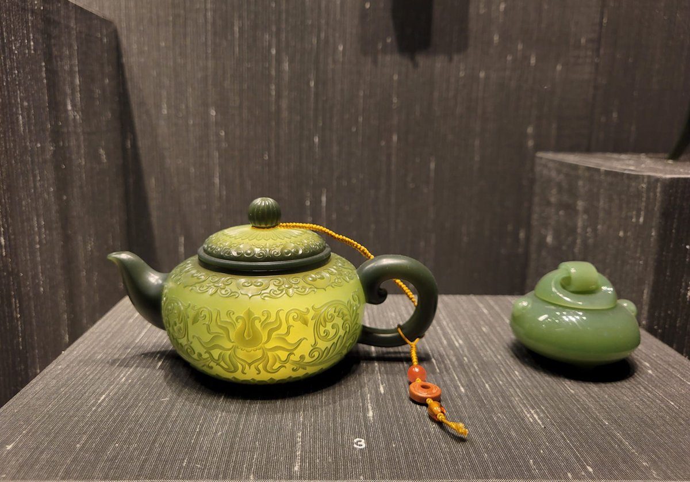
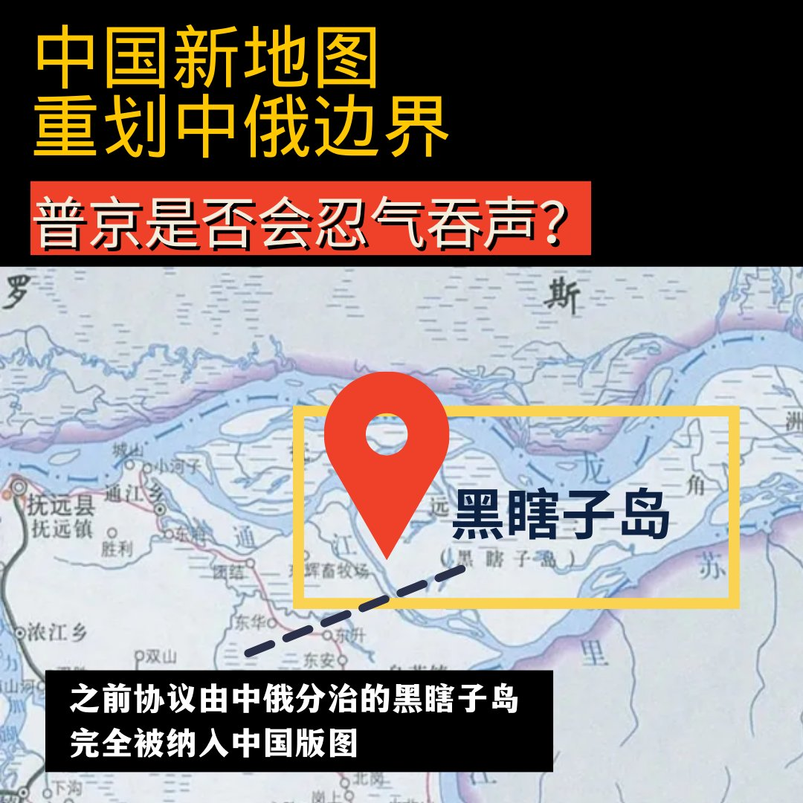
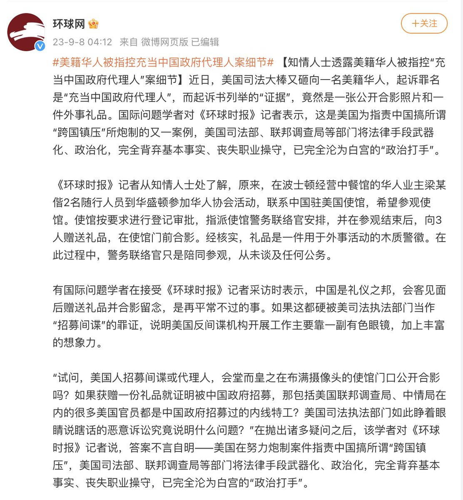
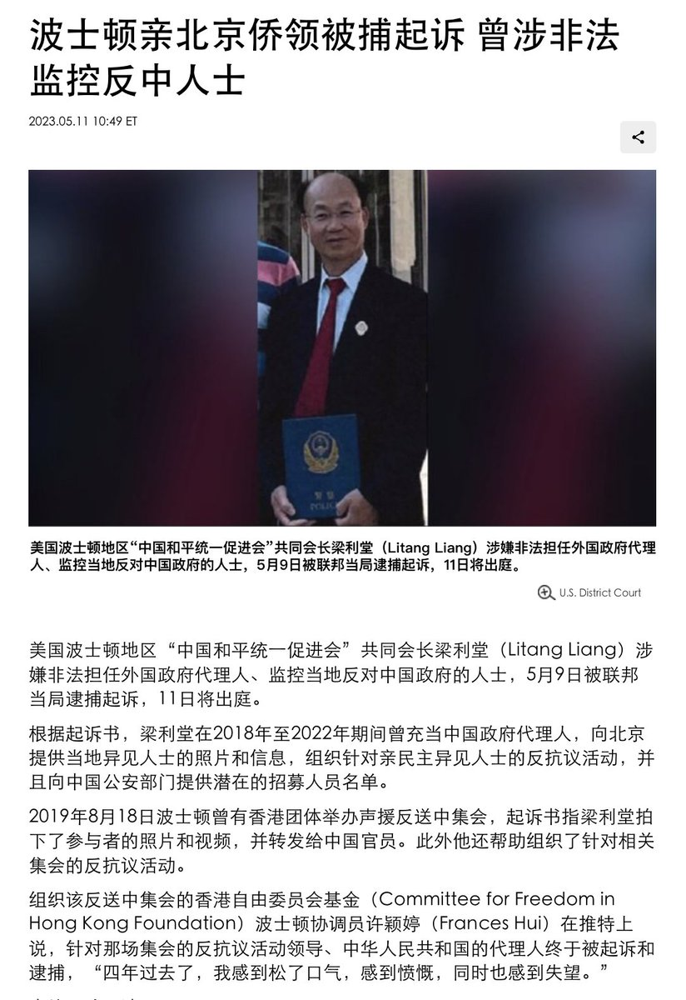
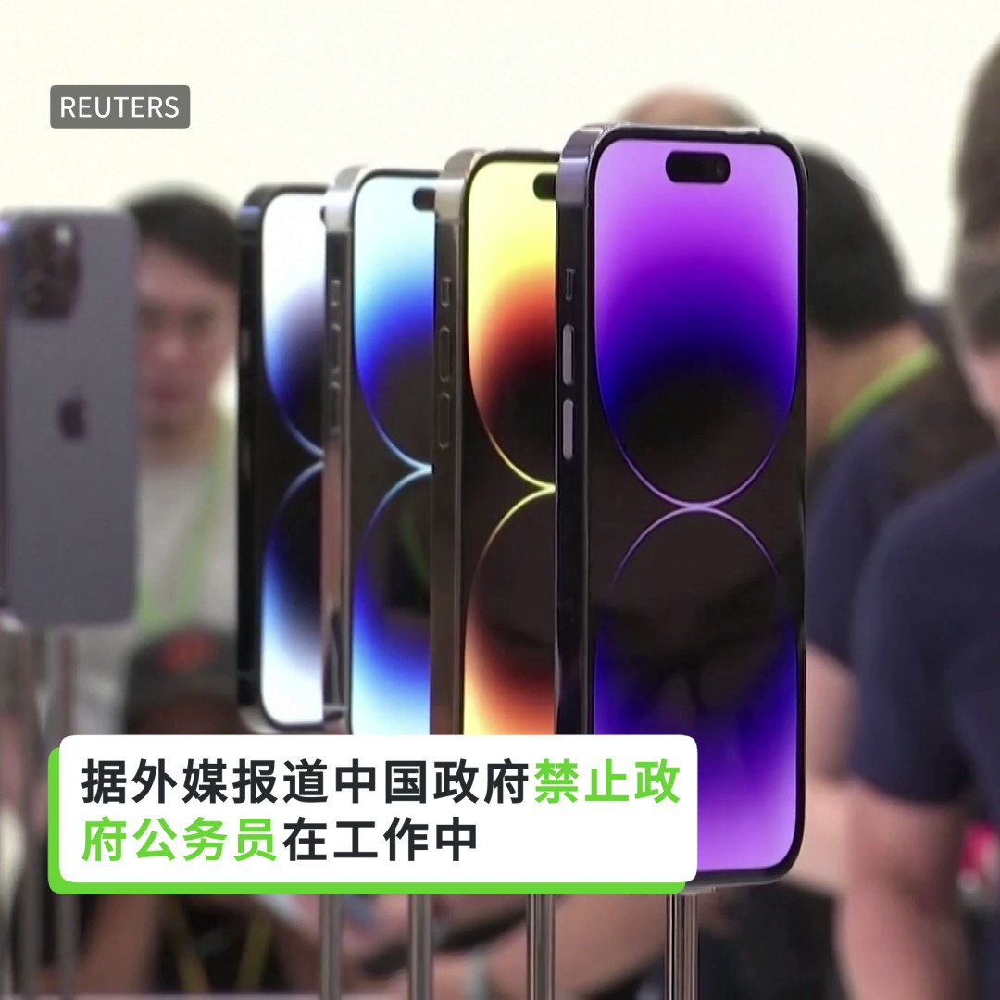

自由亚洲电台 北京时间 2023-09-09T04:29:20Z 1700244953719263624 真不懂还是装不懂？
#大英博物馆 共有近三万件中国藏品，绝大部分来自于百年来的公私捐赠。
影片《#逃出大英博物馆》的主角“#中华缠枝纹薄胎玉壶”，是苏州玉雕大师俞挺在2011年制作的现代艺术品，送交大英博物馆收藏和展出。“混淆文物与工艺品，赚取爱国流量，真的好吗？”
文物要归还给谁？清朝的皇家文物，是否该还给爱新觉罗后人？
大英博物馆并非英国政府机构，而是法人组织，英国政府以什么权利要求大英博物馆交出文物？具体如何操作？
......
官方无意深究这些问题，只在乎以文物作为民族主义利剑，胡乱挥舞。
详见 https://t.co/ANJsmoLHOV   自由亚洲电台 北京时间 2023-09-09T05:08:09Z 1700254723238940970 【#您怎么看】中国官方近期发布了2023年新版地图。此前协议由中俄分治的黑瞎子岛这次完全被划入中国版图。美国《新闻周刊》指出，克里姆林宫对中国声称拥有俄罗斯部分领土的地图保持沉默。而有评论则说，俄罗斯的平静回应彰显了中俄两国的睦邻友好关系。
您预测，此次中国新地图重划中俄边界，普京将来是否会忍气吞声？   自由亚洲电台 北京时间 2023-09-09T05:42:39Z 1700263403984716051 《环球时报》这样洗，能洗白吗？
#美籍华人被指控充当中国政府代理人案细节  #跨国镇压 https://t.co/xVICjr7RL1   自由亚洲电台 北京时间 2023-09-09T01:35:40Z 1700201250506387941 正在亚洲访问的 #特鲁多 周四接受彭博社访问，被问起是否会与中国实现政治和解。他说：“和解？不，当然不是在这个时刻。中国在过去几年中做出的决定让事情变得更加困难，不仅是对 #加拿大，对其他国家来说都是，很难与中国交往。”

 https://t.co/ZdyJu1rh8V   自由亚洲电台 北京时间 2023-09-09T03:17:18Z 1700226826742935845 中国禁止公务员在工作中使用iPhone及其它外国电子设备，美国议员称中国此举旨在限制美国企业，看毛宁如何回应。 https://t.co/3vrAq0kPBz   自由亚洲电台 北京时间 2023-09-09T00:58:32Z 1700191901838881182 #华为 逆袭惊动华府，制裁升级，#中芯 止步7纳米？ https://t.co/PDA7M97f7I   自由亚洲电台 北京时间 2023-09-09T02:02:08Z 1700207909752418460 外界注意到，《#金融稳定法》的重点落在了维持金融机构的稳定，在如何保护利益受损的投资人、储户等债权人方面却着墨不多。 https://t.co/XDyeGLJaoU   