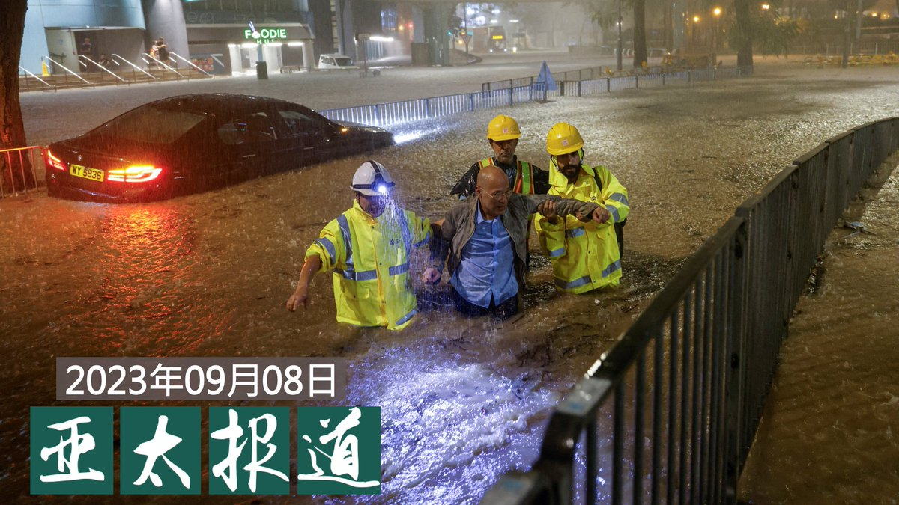

自由亚洲电台 北京时间 2023-09-09T20:00:00Z 1700479164124709307 专栏 | #周嘉有话说：“你吃几碗干饭”？
#周孝正 
 https://t.co/QEP39keawC   自由亚洲电台 北京时间 2023-09-09T02:38:56Z 1700217168208736657 美国华盛顿智库史汀生中心（Stimson Center）东南亚项目主任布莱恩·艾勒（Brian Eyler）在接受本台采访时表示，#拜登 选择在G20峰会结束后拜访 #越南，显示美国希望透过活跃双边关系遏止中国在印太地区的扩张。

 https://t.co/JqkMYlUi9u   自由亚洲电台 北京时间 2023-09-09T07:41:18Z 1700293265105514965 专栏 | #夜话中南海：前腐后继的 #贵州 省委书记们
 https://t.co/tBBAz4YWZE   自由亚洲电台 北京时间 2023-09-09T07:51:55Z 1700295935098765434 评论 | 何清涟 @HeQinglian：#习近平缺席G20，真正原因并非"皇帝"心态
 https://t.co/kbDnKo9NQ4   自由亚洲电台 北京时间 2023-09-09T08:11:45Z 1700300926882623920 据彭博社报道，两名印度官员透露，印度国防参谋长乔汉（Anil Chauhan）六周前委托开展一项研究，如果 #台海 发生战争，#印度 应该如何应对。美国此前在多个场合曾经提过这个问题，这引起了印度方面的重视。
 https://t.co/7XJtRUAE4A   自由亚洲电台 北京时间 2023-09-09T04:51:58Z 1700250650507198970 #事实图解：中国借 #2023年官版地图"扩张领土"？
 https://t.co/MjPlNE5Hod   自由亚洲电台 北京时间 2023-09-09T07:23:58Z 1700288899522937115 【#亚太报道（2023-9-8）】
欢迎收听和订阅播客【亚太报道】 https://t.co/MjLNSvVMqc

广东珠三角遭遇 #世纪雨灾 / 女权工作者 #叶海燕 向社会求助 / 北京媒体人 #耿潇男 服刑期满 / 中国人大计划针对 #金融稳定立法 / #华为新手机 引发爱国浪潮 https://t.co/WusVr44xNW   自由亚洲电台 北京时间 2023-09-09T07:45:21Z 1700294284128420107 深度报道 ｜#台湾 有事 震醒了 #日本 西南岛屿
 https://t.co/qbB0ftjRfo   自由亚洲电台 北京时间 2023-09-09T07:50:08Z 1700295484534030405 【#变态辣椒：还有三架马车】
台湾首富 #郭台铭 已参加2024年总统大选，投入与另两位参选人及执政党参选人的四方角逐。亲中的"#蓝营“选票已被国民党参选人 #候友宜 和民众党参选人 #柯文哲 所瓜分。分析人士称，郭的加入只会更有利于当政的民进党参选人 #赖清德，而民进党抗拒北京对台湾自治的威胁。 https://t.co/nDHKKykUJj   自由亚洲电台 北京时间 2023-09-09T07:53:26Z 1700296318105899225 评论 | #余杰：今天的敦刻尔克撤退，是为明天 #光复香港 的诺曼底登陆做准备
 https://t.co/2LMKYs09zn   自由亚洲电台 北京时间 2023-09-09T08:18:13Z 1700302555073401342 RT @RFA_Chinese: 中国总理 #李强 在第26次中国—东盟领导人会议上发表讲话称：未来3年，中方将在东盟国家建设10所“中国—东盟现代工匠学院”，继续开展“未来之桥”中国—东盟青年领导人研修计划，还将启动“#万人研修研讨计划”，为东盟国家培养1万名 #治国理政、#…   自由亚洲电台 北京时间 2023-09-09T00:33:26Z 1700185587842691199 季风：“按照法律程序，（#耿潇男）肯定是走出了看守所（监狱），因为看守所一般不会留，每个单位部门的责任不一样。由国保去接，接了带到别的地方，旅游一个星期甚至更长时间再回家。（估计）是秦真去接她，还有其他家人，因为秦真是跟她离婚后又复婚的...”

 https://t.co/t8A4md5vRB   自由亚洲电台 北京时间 2023-09-09T04:29:20Z 1700244953719263624 真不懂还是装不懂？
#大英博物馆 共有近三万件中国藏品，绝大部分来自于百年来的公私捐赠。
影片《#逃出大英博物馆》的主角“#中华缠枝纹薄胎玉壶”，是苏州玉雕大师俞挺在2011年制作的现代艺术品，送交大英博物馆收藏和展出。“混淆文物与工艺品，赚取爱国流量，真的好吗？”
文物要归还给谁？清朝的皇家文物，是否该还给爱新觉罗后人？
大英博物馆并非英国政府机构，而是法人组织，英国政府以什么权利要求大英博物馆交出文物？具体如何操作？
......
官方无意深究这些问题，只在乎以文物作为民族主义利剑，胡乱挥舞。
详见 https://t.co/ANJsmoLHOV   自由亚洲电台 北京时间 2023-09-09T05:08:09Z 1700254723238940970 【#您怎么看】中国官方近期发布了2023年新版地图。此前协议由中俄分治的黑瞎子岛这次完全被划入中国版图。美国《新闻周刊》指出，克里姆林宫对中国声称拥有俄罗斯部分领土的地图保持沉默。而有评论则说，俄罗斯的平静回应彰显了中俄两国的睦邻友好关系。
您预测，此次中国新地图重划中俄边界，普京将来是否会忍气吞声？   自由亚洲电台 北京时间 2023-09-09T05:42:39Z 1700263403984716051 《环球时报》这样洗，能洗白吗？
#美籍华人被指控充当中国政府代理人案细节  #跨国镇压 https://t.co/xVICjr7RL1   自由亚洲电台 北京时间 2023-09-09T01:35:40Z 1700201250506387941 正在亚洲访问的 #特鲁多 周四接受彭博社访问，被问起是否会与中国实现政治和解。他说：“和解？不，当然不是在这个时刻。中国在过去几年中做出的决定让事情变得更加困难，不仅是对 #加拿大，对其他国家来说都是，很难与中国交往。”

 https://t.co/ZdyJu1rh8V   自由亚洲电台 北京时间 2023-09-09T03:17:18Z 1700226826742935845 中国禁止公务员在工作中使用iPhone及其它外国电子设备，美国议员称中国此举旨在限制美国企业，看毛宁如何回应。 https://t.co/3vrAq0kPBz   自由亚洲电台 北京时间 2023-09-09T00:58:32Z 1700191901838881182 #华为 逆袭惊动华府，制裁升级，#中芯 止步7纳米？ https://t.co/PDA7M97f7I   自由亚洲电台 北京时间 2023-09-09T02:02:08Z 1700207909752418460 外界注意到，《#金融稳定法》的重点落在了维持金融机构的稳定，在如何保护利益受损的投资人、储户等债权人方面却着墨不多。 https://t.co/XDyeGLJaoU   