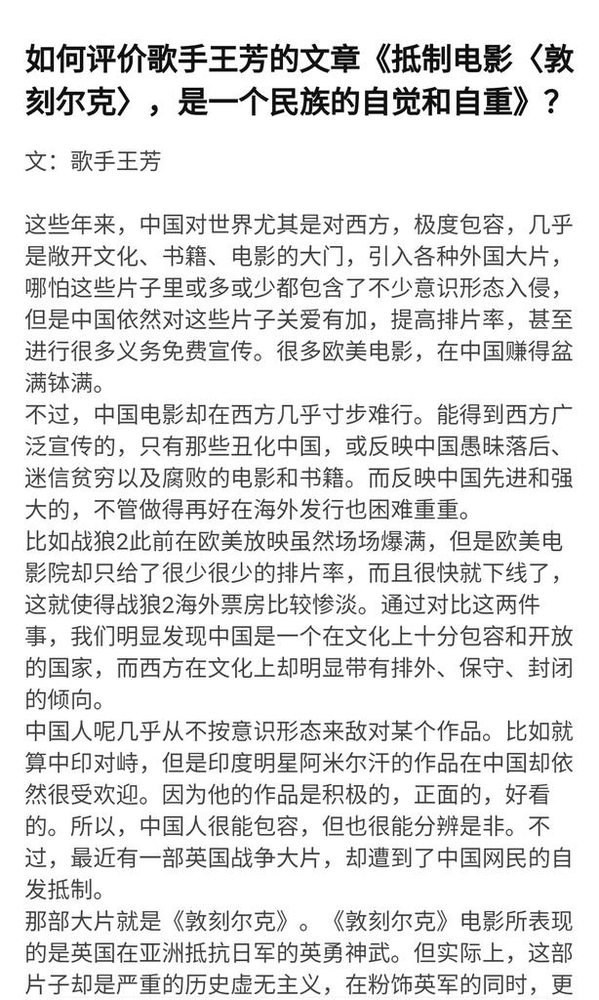

谁将十万横扫三江 北京时间 2023-09-09T07:22:20Z 1700288488678007043 RT @whyyoutouzhele: 9月8日晚，西安理工大学军训 
为迎接领导检查，从六点开始把学生集中道操场排练 “首长好 同学们好 同学们辛苦了 ”的整齐度直至深夜十一点。
期间一边排练一边有救护车过来拉体力不支晕倒的学生，形成了世界名画。 https://t.co/0…   谁将十万横扫三江 北京时间 2023-09-09T07:06:00Z 1700284378771825045 那个在马里乌波尔惨案发生地唱俄国军歌的王芳，17年写过一篇民族主义雷人社论，《抵制电影敦刻尔克，是中华民族的自觉和自重》理由竟是"英国人没有在敦刻尔克战役中提及中国远征军的抗日贡献"，因为该文过于缺乏逻辑和历史常识，遭受全网嘲讽 https://t.co/UulUx80JqG   谁将十万横扫三江 北京时间 2023-09-09T07:46:51Z 1700294660541866137 西安千锋教育推荐穷学生使用高息小额贷款参加该公司提供的就业前培训服务，因还不起贷款自缢身亡 https://t.co/FfPyurz7QS   