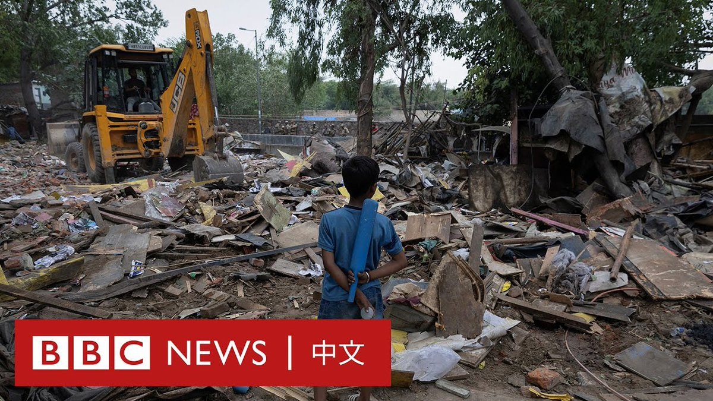
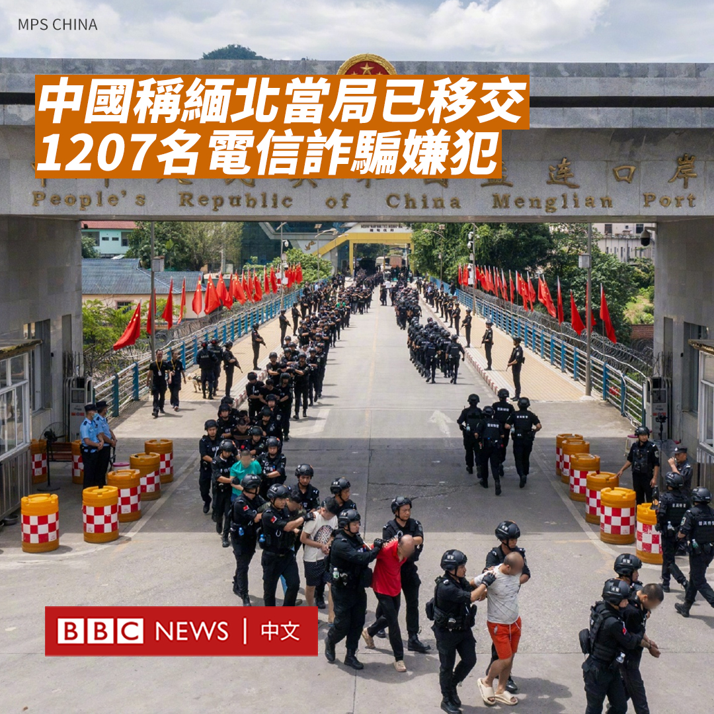
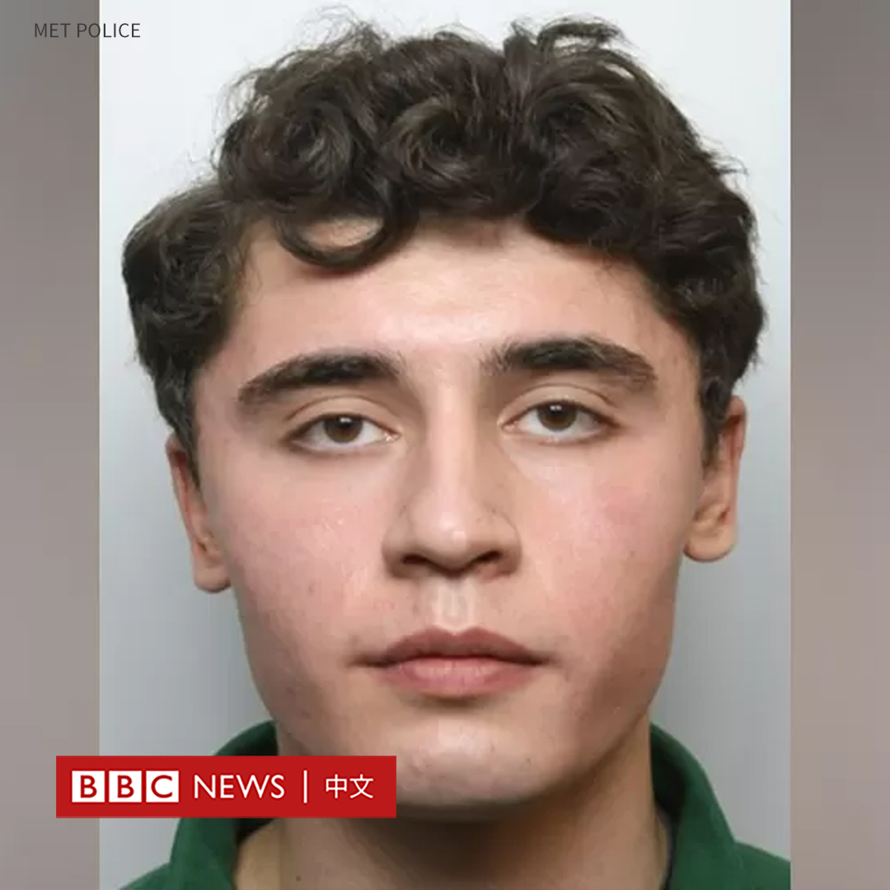
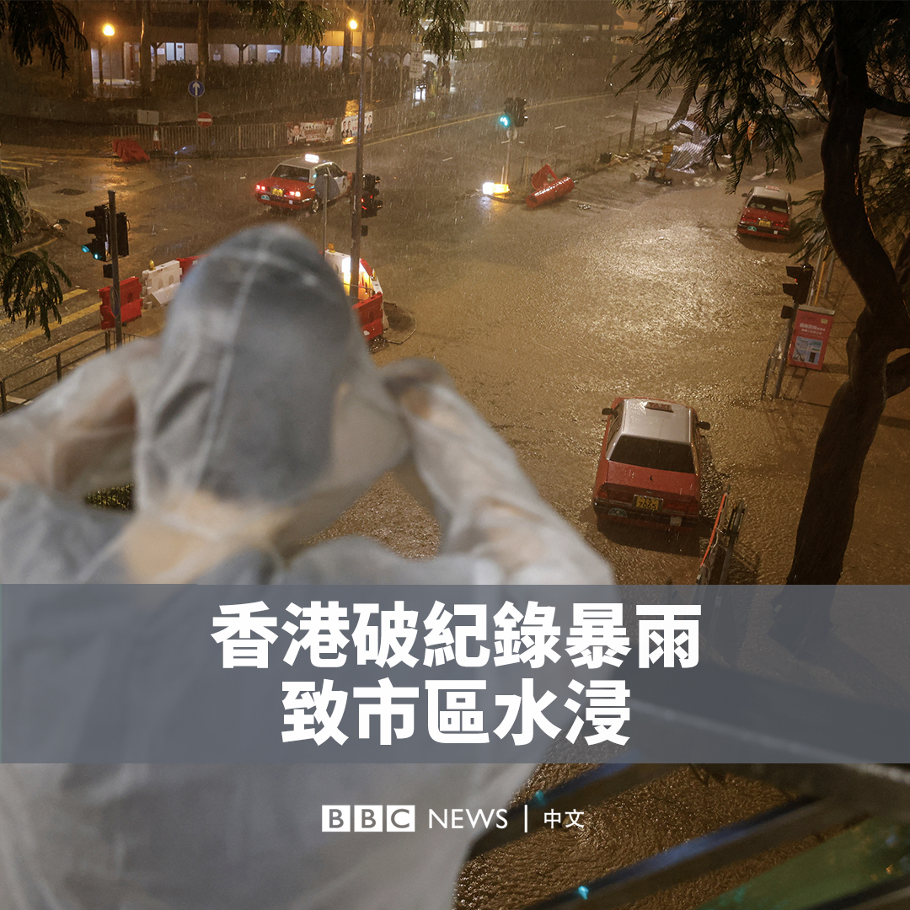

D英国广播公司BBC 北京时间 2023-09-08T14:29:48Z 1700033677630325005 “我们在这里住了25到30年，现在我们的房子被拆了，我们要去哪里？”

G20峰会即将在印度召开，但对于首都德里贫民窟的居民来说，这并不是一个好消息。

当局开展日益频繁的拆除行动，指贫民窟本是非法建筑，而居民则表示已落足于此多年，政府此举只是为了“美化”市容。 https://t.co/iZT0by6TOR   D英国广播公司BBC 北京时间 2023-09-08T16:00:04Z 1700056391954903341 在刚刚过去的夏季转会窗，很多国家的足球俱乐部球员转会费都打破纪录。他们的转会费和薪酬是否应设定一个上限？ https://t.co/qPxQCmmUqg   D英国广播公司BBC 北京时间 2023-09-08T12:59:50Z 1700011035967778996 中国表示，缅甸北部地方当局周三（9月6日）已向中方移交1200多名涉嫌参与诈骗犯罪的嫌疑人。

中国公安部在周五发布的一份声明中称，云南省公安部门近日持续与缅甸相关地方执法部门开展联合行动。在中国通报诈骗窝点和人员线索后，缅方开展抓捕行动，抓获1207名嫌犯，以及电脑、手机、手机卡、银行卡等一大批作案工具。

“这是继前期抓获269名缅北涉诈犯罪嫌疑人之后，打击行动取得的又一重大战果。”声明写道。

中国公安部表示，公安部门正对这些嫌犯开展调查，诈骗和偷越国境的违法犯罪人员将被严惩。

官方通讯社新华社发布的图片显示，有大批男子在孟连口岸被警方列队押解回国。另一张图片显示他们在警方的看管下，蹲在地上。

孟连口岸连接中国云南与缅甸北部掸邦的边境城镇邦康，后者属于实际独立于缅甸中央政府的佤邦控制。

佤邦当局曾在本月初发布文件称，将把打击电信诈骗犯罪作为“佤邦在今后一定时期内的一项重要工作任务”。   D英国广播公司BBC 北京时间 2023-09-08T10:27:32Z 1699972707591606681 英国一名涉嫌恐怖主义犯罪的前士兵丹尼尔·阿贝德·卡莱夫（Daniel Abed Khalife）成功越狱，警方展开全国大规模搜捕。

周三（9月6日）早上，21岁的卡莱夫在伦敦旺兹沃思监狱（HMP Wandsworth）逃脱。据信，他把自己绑在食品运输车的底部，从监狱的厨房中逃出。

卡莱夫此前被控在军事基地放置假炸弹，本应在旺兹沃思监狱等待审判。

警方表示，他身高1.88米，最后一次被目击时穿着监狱提供的厨师制服，包括一件白色T恤、红白相间的格子长裤和棕色钢头工靴。

警方认为卡莱夫对公众构成“低风险”，但呼吁人们如果见到，不要接近他，而是报警。

据报道，机场和港口已被要求采取额外的安全措施，导致多地报告延误。

狱政局正在与伦敦警察厅合作，“紧急调查”卡莱夫的逃脱方式。虽然搜捕行动夜以继日进行，但警方尚未取得突破性的迹象，搜捕行动已扩大至全国范围。

卡莱夫于2019年入伍，他因涉嫌恐怖主义和违反《官方机密法》而被羁押候审，包括筹备恐怖行动和收集对敌方有用的情报。   D英国广播公司BBC 北京时间 2023-09-08T09:49:03Z 1699963025950982295 香港在周四（9月7日）晚突遭暴雨侵袭。洪水在街道倾泻，并冲入地铁站。

香港天文台当晚发布了最高级别的“黑色暴雨信号”，称暴雨是台风“海葵”的残余影响所致。

天文台表示，其录得一小时雨量达158.1毫米，为1884年有记录以来最高。 https://t.co/xg8So9ZZH5   