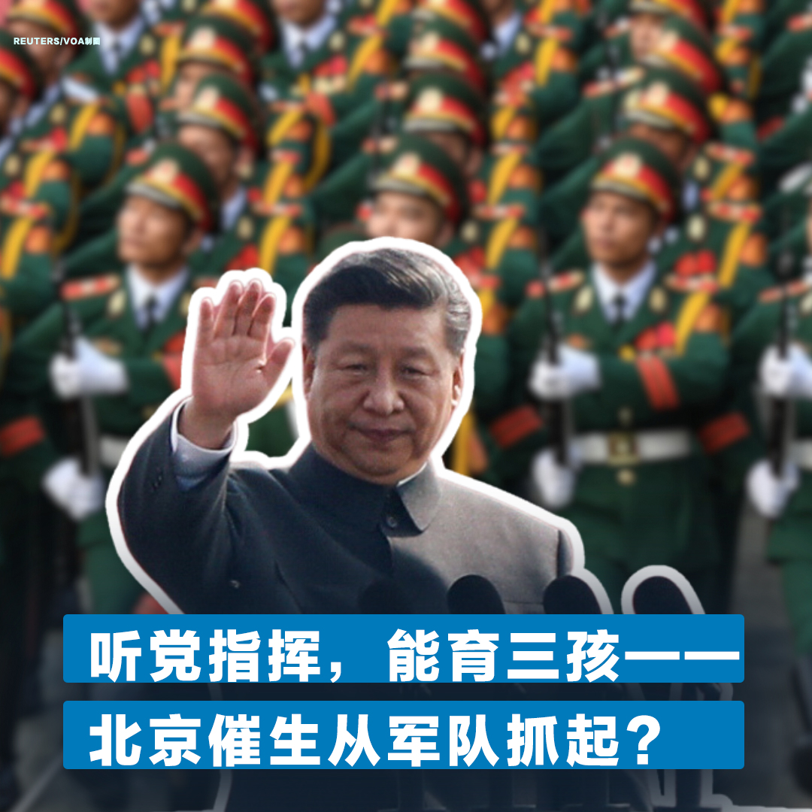

美国之音中文网 北京时间 2023-09-08T02:08:43Z 1699847178842186227 两名环保活动人士7日在布鲁塞尔的欧洲联盟总部外向瑞安航空公司Ryanair执行总裁奥莱瑞Michael O'Leary 扔奶油蛋糕，抗议航空旅行对气候变化的影响。奥莱瑞当时是到欧盟向欧盟委员会主席冯德莱恩递交请愿书，要求在空中交通管制罢工时保护飞行。奥莱瑞受到奶油蛋糕袭击后仍继续对媒体发表了评论。 https://t.co/yqfZZNUB2g   美国之音中文网 北京时间 2023-09-08T03:17:04Z 1699864380710822072 “有百害而无一益”- TikTok等社媒在吉尔吉斯斯坦恐被查禁 https://t.co/NOF9KJCNqq   美国之音中文网 北京时间 2023-09-08T03:21:34Z 1699865511054516609 北欧和波罗的海各国外长9月7日在拉脱维亚首都里加召开会议，讨论如何合作加强对乌克兰的军事和其他援助。瑞典外长托比亚斯·比尔斯特朗姆说，为乌克兰飞行员提供的F-16战斗机培训已经启动。 https://t.co/Etg41ic3fj   美国之音中文网 北京时间 2023-09-08T04:23:51Z 1699881183746675114 多家媒体报道，北京开始禁止政府官员工作时使用iPhone，且该禁令已延伸至国企，苹果公司股价应声下跌。有人担忧禁令引发骨牌效应，波及更多部门；有人认为禁令是为帮助刚取得芯片突破的华为新手机；还有人士质疑，中国不是鼓励外资吗？苹果禁令肯定要吓跑更多外资。您怎么看？https://t.co/VYjLcHxyBF https://t.co/6dG2J2ipmi   美国之音中文网 北京时间 2023-09-08T05:33:05Z 1699898607879754081 微软报告：中国利用人工智能来扰乱美国选民 https://t.co/peTfKIDaZc   美国之音中文网 北京时间 2023-09-08T05:45:00Z 1699901606240854183 中国领导人习近平近日签发《军队实施〈中华人民共和国人口与计划生育法〉办法》，鼓励军队人员适龄婚育，一对夫妻可育三孩，并加强育儿福利。因生育率大幅下跌，中国人口面临严峻形势。北京不断鼓励生育，但见效甚微。有人观察道，是不是因为社会面推不动，就先从听党指挥的军队入手？您怎么看？ https://t.co/ly5NVh9H5s   美国之音中文网 北京时间 2023-09-08T06:05:05Z 1699906661937479975 布林肯参观曾发生俄军酷刑折磨人质事件的乌克兰学校 https://t.co/OXXcq6gi8y   美国之音中文网 北京时间 2023-09-08T06:05:10Z 1699906680400883932 中国媒体试图主导中亚舆论 https://t.co/k2uf4haQyj   