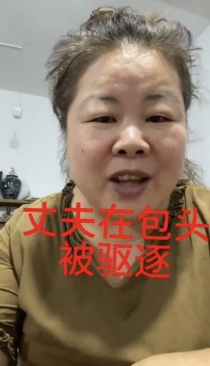
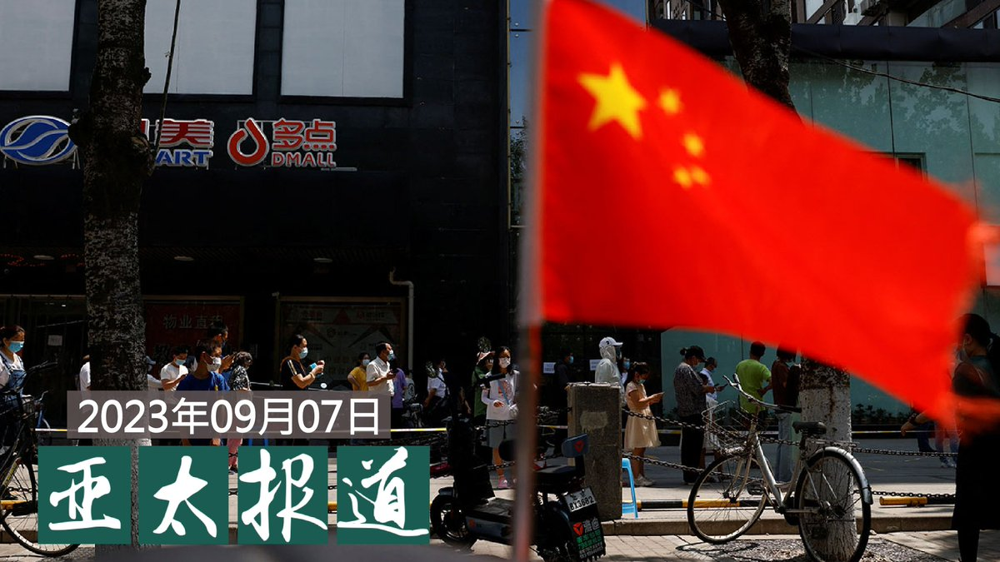
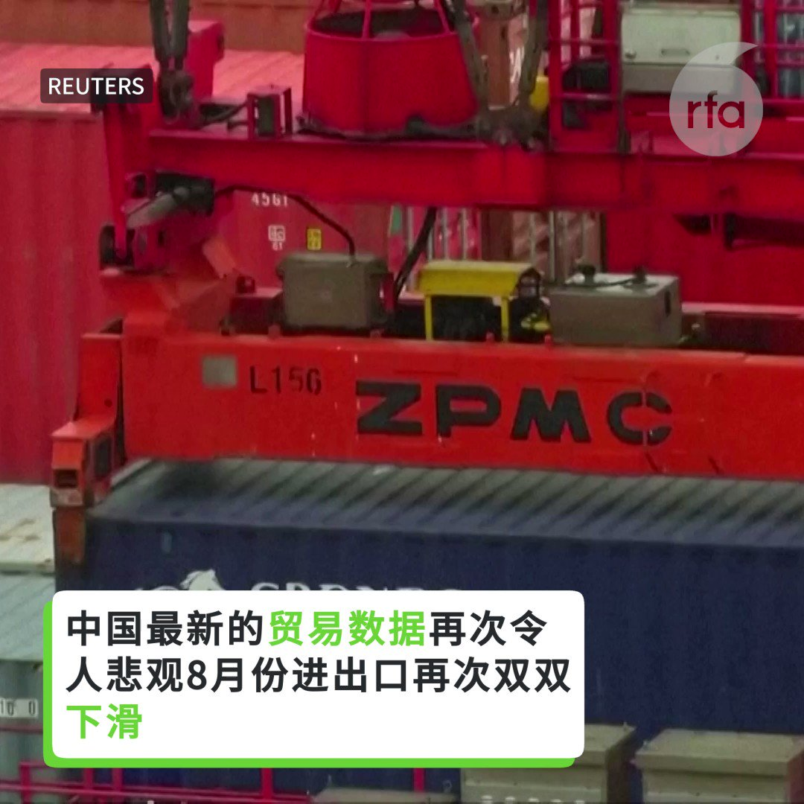

自由亚洲电台 北京时间 2023-09-08T15:36:57Z 1700050575243849812 【水淹珠三角 深圳火车站现瀑布】
【广东多地宣布停课】
香港多区一夜间变成“水都”，在中国深圳也同样面对特大暴雨。据深圳罗湖区区委微博“罗湖发布”指，周四（7日）至周五，深圳市暴雨红色预警讯号仍在生效中，罗湖区多个路段有较深积水，因此罗湖停工一天。据“深圳交通”最新消息，深圳市罗湖区、盐田区、宝安区等都有道路暂时封闭。网上影片可见，几个与香港接连的口岸都严重淹水；深圳火车站（罗湖）地下一层站口被淹；另外莲塘口岸、文锦渡口岸地下设备间淹水，部分设施设备受损。
深圳市发布公告，周五全市中小学、幼儿园停课；多条地铁线暂停。
#广东暴雨   自由亚洲电台 北京时间 2023-09-08T12:47:07Z 1700007835084763590 【退出女权运动10年 警仍如影随形】
【#叶海燕 遭当局刁难求关注】
曾是中国女权工作者的叶海燕，在退出女权运动十年后的今天，警察却仍如影随形骚扰她的生活。叶海燕向社会发出求助。详细报道：https://t.co/zqtooxTu4c #流氓燕 https://t.co/WKXN5I5yZE   自由亚洲电台 北京时间 2023-09-08T11:50:35Z 1699993609423188198 【#香港暴雨】
【港股交易所暂停买卖】
香港7日晚上起出现暴雨，导致多地淹水，香港天文台7日23时发出黑色暴雨警告。天文台总部7日23时至24时录得一小时雨量158.1毫米，为1884年有记录以来的最高纪录。港府8日宣布，走读学校8日停课。港交所也宣布，港股8日上午暂停交易。视频显示有人在马路上被大水冲走，大水涌入地铁站出现瀑布，海底隧道也水淹成河。   自由亚洲电台 北京时间 2023-09-08T05:08:24Z 1699892396459192664 【#您怎么看】
由“90后”自媒体博主“夏天妹妹”和“煎饼果仔”自导自演的系列短视频《逃离大英博物馆》在中国走红，过去一周在抖音取得近3亿播放量。“请大英博物馆无偿归还中国文物”也冲上热搜第一。

一盏从大英博物馆出逃的中华缠枝纹薄胎玉壶，化身成了一个可爱的女孩，遇一名在海外工作的中国媒体人，随后俩人共同踏上归家之路。

“也许大英博物馆里的中国文物现在也想家了，但它们只能挤在拥挤的展位里。当它们看到那些来往的中国面孔时，会不会想说‘带我回家’？”

中国官方媒体称，近期，大英博物馆被曝出有约2000件馆藏珍品不翼而飞。据联合国教科文组织不完全统计，在全球47国，200多家博物馆里，存放的中国文物至少有164万件，而大英博物馆收藏的中国文物就多达23000多件。

您认为，大英博物馆是否应该无偿归还中国文物？中国的历史文物究竟应该在哪里？您支持海外文物“回家”吗？   自由亚洲电台 北京时间 2023-09-08T06:00:00Z 1699905383073206309 《#治安管理处罚法》修订草案引全网热议。
除了 #第三十四条 将"#有损中华民族精神，#伤害中华民族感情"的言行列入处罚范围外，有关 #采集民众生物信息样本 等新规定也让外界质疑，这是想继续扩张公安机关的权力，损害公民基本权利？

  https://t.co/mszmnqdpM0   自由亚洲电台 北京时间 2023-09-08T07:00:08Z 1699920513534247181 【#亚太报道（2023-9-7）】
欢迎收听和订阅播客【亚太报道】 https://t.co/MjLNSvVMqc
中国多地强制民众安装“#反诈软件” / 《#治安法》草案百姓怎么说？ / 中国外贸出口连续数月下滑 / 南京、天津、山东、吉林等地 #公务员遭欠薪 / 台湾 #国际宗教自由峰会 开幕 https://t.co/SJr1EndtZl   自由亚洲电台 北京时间 2023-09-08T01:14:38Z 1699833567835222385 以日本长崎县美军佐世保海军基地为母港的 #先锋号扫雷舰 7日驶入位于冲绳县石垣岛的石垣港。这是美军舰艇时隔14年再次驶入 #石垣岛，上一次还是在2009年4月。
 https://t.co/QECT0ms708   自由亚洲电台 北京时间 2023-09-08T01:53:37Z 1699843379406991555 中国官方推出最新“#催生”措施。中国中央军委主席习近平日前签署命令，发布《军队实施〈#中华人民共和国人口与计划生育法〉办法》（简称《办法》），自9月10日起施行。

 https://t.co/xAu108nmqi   自由亚洲电台 北京时间 2023-09-08T02:42:00Z 1699855555681218679 专栏 | #军事无禁区：你打你的，我打我的－中美军事交流的北京战略
https://t.co/SLXtBufJ9X https://t.co/BjPBNhUSwJ   自由亚洲电台 北京时间 2023-09-08T03:02:48Z 1699860790273089992 RT @RfaCantonese: 【兩小時內黃雨變黑雨】
【港、深破紀錄水浸，深圳水庫繼續排洪】

香港周四(7日)晚出現開埠以來相當罕有的水浸，市區多處地方出現嚴重水浸，連海底隧道也首次出現「激流」，地鐵站變成瀑布。
在港、深兩地水浸最嚴重的時候, 深圳水庫仍要排洪，令深圳…   自由亚洲电台 北京时间 2023-09-08T05:30:01Z 1699897835167322253 这个周末，#20国集团峰会（#G20）将在印度新德里召开。而此前不久，中方宣布由总理 #李强 出席峰会。那么，临阵换将对中国在峰会扮演的角色会有什么影响？#习近平 又为什么会在最后一刻决定不出席峰会呢？

 https://t.co/b4xDDCRIZD   自由亚洲电台 北京时间 2023-09-08T06:30:01Z 1699912936154915087 根据中国麦可思研究院近日发布的 #2023年版就业蓝皮书 提供的数据，中国 #2022届本科毕业生 月均工资不足六千元人民币。选择考取 #公务员、研究生和进入体制内编制的大学毕业生比例则有显著增长。

 https://t.co/QeBggFBjzN   自由亚洲电台 北京时间 2023-09-08T07:30:01Z 1699928036647506344 #事实查核｜美国自撤军起就切断了对 #阿富汗 的所有援助吗？
 https://t.co/EQLh1B4G8Y   自由亚洲电台 北京时间 2023-09-08T01:26:47Z 1699836624065184123 正在亚洲访问的加拿大总理 #特鲁多 周四被问起 #加中关系，他说尽管两个加拿大人被中国拘捕的事件已经解决，但两国关系并没有好转，部分原因是人们忧虑中国干预。

 https://t.co/hdGu0PfpYG   自由亚洲电台 北京时间 2023-09-08T02:21:17Z 1699850339124462021 【#您怎么看】
近日公布的《治安管理处罚法》 草案正在征求公众意见，第三十四条引发争议。一旦草案获得通过成为法律，被认定为有“有损中华民族精神、伤害中华民族感情”行为者将被处以拘留及罚款。
网友问，谁来界定，如何界定“有损中华民族精神、伤害中华民族感情”？一旦通过，警察权限是否会从社会治安扩大到思想监督？
您怎么看？   自由亚洲电台 北京时间 2023-09-08T02:27:51Z 1699851994695938365 本周四，中国海关总署发布的8月份 #进出口 数据显示，中国出口连续4个月下跌，对美国、欧盟和日本的出口皆为负增长。
https://t.co/wBY3cnguec   自由亚洲电台 北京时间 2023-09-08T02:30:27Z 1699852646117429351 #英国国会 正在审议《能源法案》（#EnergyBill），有议员提出修订案，要求确保参与大型基建工程的太阳能企业，其供应链不涉 #强迫劳动，剑指新疆太阳能产业的强迫劳动情况。海外 #维吾尔 社群及人权组织联署支持修订案，促请英国政府阻止涉及强迫劳动的产品流入英国供应链https://t.co/J8Q4RjnVTl   自由亚洲电台 北京时间 2023-09-08T03:15:48Z 1699864060240753016 【#一带一路 十周年，谁会来？】#中国外交部 9月7日表示，第三届“一带一路”国际合作高峰论坛将在北京举行，已有90多个国家确认出席 https://t.co/lfvyriHtZb   自由亚洲电台 北京时间 2023-09-08T03:31:50Z 1699868095442272726 “如果冷战意味着没有实际战斗的激烈竞争，那么我们就处在 #冷战 中。”美国国防部主管国际安全事务的前助理部长约瑟夫·奈（Joseph Nye）说。 https://t.co/Z614uSs67j   自由亚洲电台 北京时间 2023-09-08T04:46:09Z 1699886797734473783 【9月8日 刑满出狱 耿潇男能得到真自由吗？】
#耿潇男，女，1974年生，北京出版人，独立电视制作人，文化企业家。在北京文化公共领域以活跃、敢言着称，为公义抱薪牵马，不计代价。曾长期帮助政治异见老人如鲍彤、杜光、姚监复和杨继绳等，也曾因积极致力于公益文化思想活动策划及传播活动，遭北京当局维稳监控打压。2020年被捕之前，她曾公开声援被当局羁押的前清华大学法学院教授许章润，并接受海外多家媒体采访。
2020年9月9日，耿潇男夫妇二人突然被警方带走，后被刑拘逮捕。2021年2月其被判刑3年，刑期至2023年9月8日。   自由亚洲电台 北京时间 2023-09-08T05:03:25Z 1699891141544653118 【今年中国GDP能保5吗？】
中国最新的贸易数据再次令人悲观，8月份 #进出口 再次双双下滑。 https://t.co/Pao96CAkpW   自由亚洲电台 北京时间 2023-09-08T06:00:01Z 1699905387527577712 美国联邦通信委员会（FCC）主席杰西卡·罗森沃塞尔（Jessica Rosenworcel）近日要求美国政府机构考虑宣布，#移远通信 和 #广和通 两家中国公司构成不可接受的国家安全风险，应被纳入“涵盖清单”。
 https://t.co/iGkW9J4Y2d   