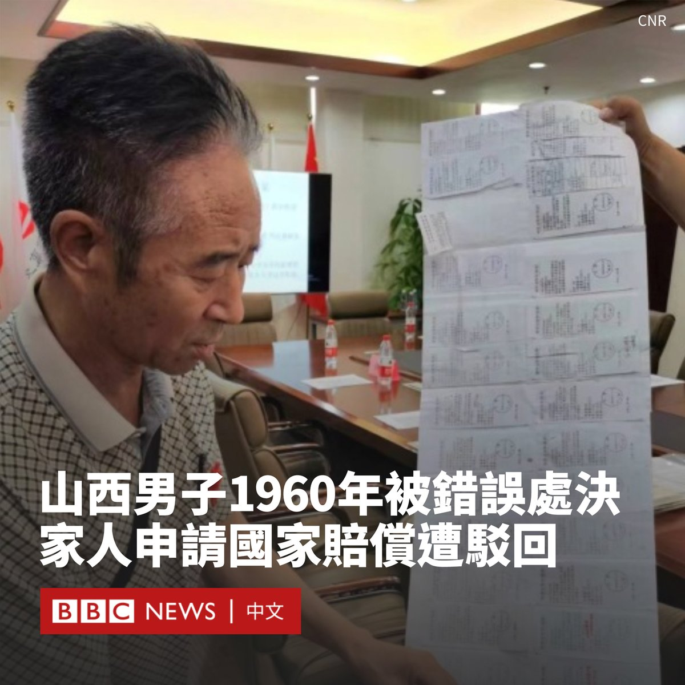

D英国广播公司BBC 北京时间 2023-09-07T14:35:51Z 1699672812300960221 在香港实施《国安法》后，大量香港人选择移民英国，但很多人因没有BNO护照，无法通过英国政府的BNO签证计划申请居留，只能选择申请政治庇护，这对于许多人来说是一场长期煎熬的开始。https://t.co/R7d34bRRfl   D英国广播公司BBC 北京时间 2023-09-07T16:03:44Z 1699694930019717385 中国山西省的一名男子在1960年代被法院错误地处决后，其家人近年申请国家赔偿时遭到驳回。这个家庭的经历在近日被中国媒体报道后，引发关注。

据官方媒体“央广网”周三（9月6日）报道，1960年7月，山西省运城市万荣县村民刘忠武被当地法院以投毒罪判处死刑，一个多月后，他即被处决。

当时，31岁的刘忠武是一名公社大队食堂事务长。法院当时认定他为报复同事，将毒药投入食堂水缸里，致五人饮水中毒，经抢救脱险。

然而，刘忠武的家人认为该案疑点重重，甚至其中一名“被害人”也亲口否认自己中毒。在家人不断伸冤之下，1987年法院承认判决错误，宣告刘忠武无罪。

尽管被平反昭雪，但刘忠武的家人表示当局仅给了他们一份改判后的判决书，未得到任何国家赔偿。

2021年9月，刘忠武的儿子和女儿四人向万荣县法院申请国家赔偿，但一个多月后他们遭到了法院的拒绝。

据报道，万荣县法院称，中国的《国家赔偿法》于1995年起施行，不溯及既往，而该案发生在该日期以前，不适用《国家赔偿法》的规定。

2022年，山西省高院再次驳回了刘忠武家属的诉求。但刘忠武的家属对该结果不能接受，他们表示当局“连一声赔礼道歉都没有”。

该家庭的代理律师对中国媒体说，法院不应简单以《国家赔偿法》没有施行便驳回赔偿请求，因为即便1995年之前没有该法律，但因为导致了实质性伤害，也有其他规定可以适用。

该事件经报道后获得很多人关注，在微博上的点击量超过400万。有网民表示，如果不能有金钱赔偿，也应该公开追究当时错判者的责任。

山西省高级人民法院和万荣县法院没有回应BBC的置评请求。   D英国广播公司BBC 北京时间 2023-09-07T12:22:20Z 1699639211010449629 在有报道称中国一些政府部门已要求员工不得在工作中使用苹果的iPhone手机后，苹果股价周三（9月6日）大幅下挫。

《华尔街日报》最早报道了该消息。该报援引知情人士表示，北京在最近几周要求中央政府机构官员不得在工作中使用iPhone和其它外国品牌的设备，也不得将它们带入办公室。

报道称，政府工作人员是在工作聊天群或会议上接到上级的上述指示。

《南华早报》也援引五名知情人士表示，要求停用iPhone的命令在8月被下达给主要负责投资、贸易和国际事务的部委人员，理由是在中美地缘政治紧张局势加剧的情况下，存在国家安全风险。

据报道，这些部门的员工必须在本月底之前转用其他手机品牌以供工作使用。

受该消息影响，苹果公司周三股价大跌3.58%，创下一个月来最大跌幅。不过，今年以来苹果累计涨幅仍超过40%。

中国是苹果最大的市场之一，创造了其近五分之一的收入。iPhone在中国高端智能手机市场占据主导地位。

近年来，中国部分政府机构和涉密敏感单位一直实施类似禁令，但最新的指示可能意味着范围的扩大。尽管官方尚未公开发布指引文件，但此举可能对包括苹果公司在内的外国手机品牌的销售产生影响。   D英国广播公司BBC 北京时间 2023-09-07T10:02:51Z 1699604109555605619 中国总理李强周三（9月6日）在印尼试乘了两国合建的雅万高铁项目，其是印尼和东南亚的首条高铁线。在多次延误后，该高铁最早将于10月开始投入商业运营。 https://t.co/TmoLpIKvef   