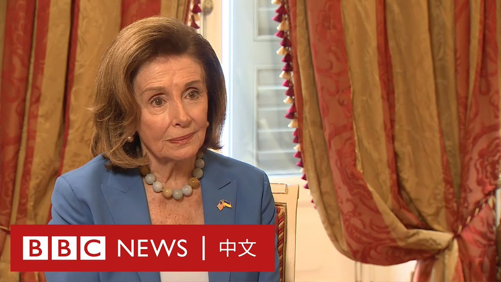
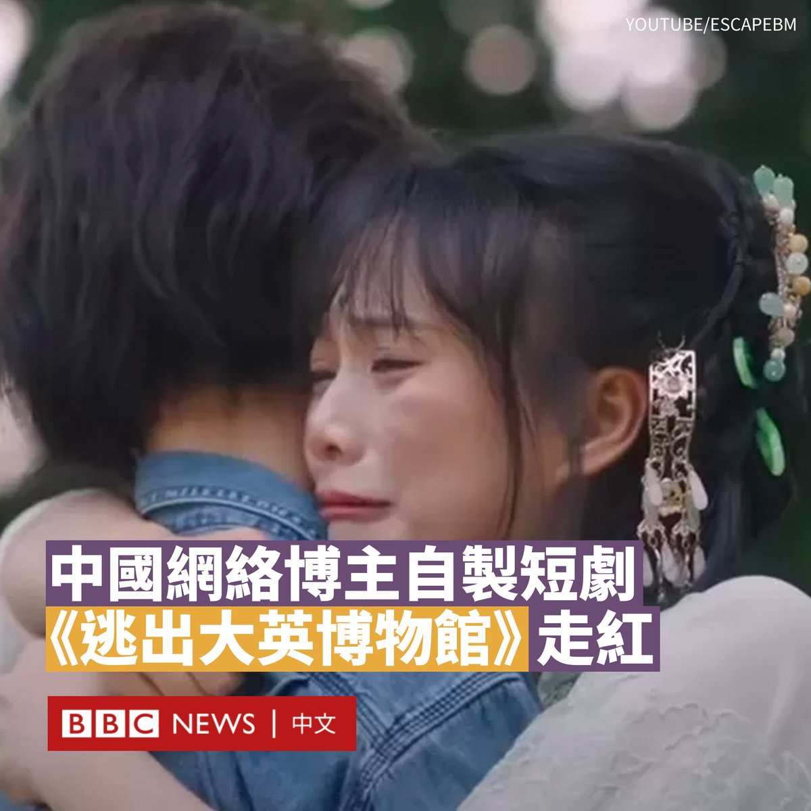

D英国广播公司BBC 北京时间 2023-09-07T19:25:02Z 1699745589464895845 这是中国17年来首次对公共治安的处罚条例作出全面修改，当中涉及多个领域，但引发最大争议的是关于“民族精神”和“民族感情”的部分。https://t.co/Ov96M4nSe6   D英国广播公司BBC 北京时间 2023-09-07T21:41:46Z 1699779996267819335 美国是台湾问题的“挑事者”吗？

美国前众议院议长南希·佩洛西（Nancy Pelosi）做客BBC节目回应质疑。 https://t.co/Kj7Ulpky9C   D英国广播公司BBC 北京时间 2023-09-07T20:01:03Z 1699754653255147767 吴侃臻（Kaoru Ng）是一名独立的战地摄影记者，自2019年起，他便拿着相机到不同冲突地带拍摄，包括在香港、白罗斯（白俄罗斯）、乌克兰等冲突地带拍摄，把悲壮与苦笑的画面传送到世界各地。原来是一名科学技术人员的他，为何会“半途出家”呢？
https://t.co/FGDjpkPC8k   D英国广播公司BBC 北京时间 2023-09-07T18:08:54Z 1699726427925676282 一个名为《逃出大英博物馆》的短视频系列在中国走红，在一周内就吸引了3亿次观看，增强了要求大英博物馆归还文物的呼声。

这个共三集的短剧讲述了一把玉壶在逃离博物馆时化作年轻女子，寻求中国记者帮助以回国的故事。

该影片的制作者是两名中国网络博主“夏天妹妹”和“煎饼果仔”。他们实地前往英国，用三个月制作了这部短剧。

作为主角的玉壶是大英博物馆真实存在的藏品，名为中华缠枝纹薄胎玉壶。它是2011年由一位专门研究复杂玉雕技艺的中国艺术家制作的。

虽然原型不完全算文物，但它采用的独有技艺仍引起中国民众的共鸣。他们指责大英博物馆至今未归还掠夺的文物。

“也许大英博物馆里的中国文物现在也想家了，但它们只能挤在拥挤的展位里。当它们看到那些来往的中国面孔时，会不会想说‘带我回家’？”

该剧也得到了官方媒体的大力支持，中央电视台对其大加赞赏称：“我们很欣慰的看到当下中国年轻人对历史和传统的热情……我们也期待着流失海外的中国文物都能够早日回家。”

上个月，大英博物馆有约2000件文物被报告“失踪、被盗或损坏”，这让该博物馆一直面临质疑。

该博物馆的一名员工被解雇，博物馆馆长哈特维格·费舍尔（Hartwig Fischer）也宣布辞职。

这一丑闻促使希腊和尼日利亚等国要求该博物馆归还珍宝。中国官方媒体《环球时报》也发表社评，敦促大英博物馆无偿归还中国文物。

“只要英国不能证明哪一件藏品来自合法、干净的渠道，那么这件藏品的母国就有权利去追索。”社评写道。   D英国广播公司BBC 北京时间 2023-09-07T14:35:51Z 1699672812300960221 在香港实施《国安法》后，大量香港人选择移民英国，但很多人因没有BNO护照，无法通过英国政府的BNO签证计划申请居留，只能选择申请政治庇护，这对于许多人来说是一场长期煎熬的开始。https://t.co/R7d34bRRfl   D英国广播公司BBC 北京时间 2023-09-07T16:03:44Z 1699694930019717385 中国山西省的一名男子在1960年代被法院错误地处决后，其家人近年申请国家赔偿时遭到驳回。这个家庭的经历在近日被中国媒体报道后，引发关注。

据官方媒体“央广网”周三（9月6日）报道，1960年7月，山西省运城市万荣县村民刘忠武被当地法院以投毒罪判处死刑，一个多月后，他即被处决。

当时，31岁的刘忠武是一名公社大队食堂事务长。法院当时认定他为报复同事，将毒药投入食堂水缸里，致五人饮水中毒，经抢救脱险。

然而，刘忠武的家人认为该案疑点重重，甚至其中一名“被害人”也亲口否认自己中毒。在家人不断伸冤之下，1987年法院承认判决错误，宣告刘忠武无罪。

尽管被平反昭雪，但刘忠武的家人表示当局仅给了他们一份改判后的判决书，未得到任何国家赔偿。

2021年9月，刘忠武的儿子和女儿四人向万荣县法院申请国家赔偿，但一个多月后他们遭到了法院的拒绝。

据报道，万荣县法院称，中国的《国家赔偿法》于1995年起施行，不溯及既往，而该案发生在该日期以前，不适用《国家赔偿法》的规定。

2022年，山西省高院再次驳回了刘忠武家属的诉求。但刘忠武的家属对该结果不能接受，他们表示当局“连一声赔礼道歉都没有”。

该家庭的代理律师对中国媒体说，法院不应简单以《国家赔偿法》没有施行便驳回赔偿请求，因为即便1995年之前没有该法律，但因为导致了实质性伤害，也有其他规定可以适用。

该事件经报道后获得很多人关注，在微博上的点击量超过400万。有网民表示，如果不能有金钱赔偿，也应该公开追究当时错判者的责任。

山西省高级人民法院和万荣县法院没有回应BBC的置评请求。   D英国广播公司BBC 北京时间 2023-09-07T12:22:20Z 1699639211010449629 在有报道称中国一些政府部门已要求员工不得在工作中使用苹果的iPhone手机后，苹果股价周三（9月6日）大幅下挫。

《华尔街日报》最早报道了该消息。该报援引知情人士表示，北京在最近几周要求中央政府机构官员不得在工作中使用iPhone和其它外国品牌的设备，也不得将它们带入办公室。

报道称，政府工作人员是在工作聊天群或会议上接到上级的上述指示。

《南华早报》也援引五名知情人士表示，要求停用iPhone的命令在8月被下达给主要负责投资、贸易和国际事务的部委人员，理由是在中美地缘政治紧张局势加剧的情况下，存在国家安全风险。

据报道，这些部门的员工必须在本月底之前转用其他手机品牌以供工作使用。

受该消息影响，苹果公司周三股价大跌3.58%，创下一个月来最大跌幅。不过，今年以来苹果累计涨幅仍超过40%。

中国是苹果最大的市场之一，创造了其近五分之一的收入。iPhone在中国高端智能手机市场占据主导地位。

近年来，中国部分政府机构和涉密敏感单位一直实施类似禁令，但最新的指示可能意味着范围的扩大。尽管官方尚未公开发布指引文件，但此举可能对包括苹果公司在内的外国手机品牌的销售产生影响。   D英国广播公司BBC 北京时间 2023-09-07T10:02:51Z 1699604109555605619 中国总理李强周三（9月6日）在印尼试乘了两国合建的雅万高铁项目，其是印尼和东南亚的首条高铁线。在多次延误后，该高铁最早将于10月开始投入商业运营。 https://t.co/TmoLpIKvef   