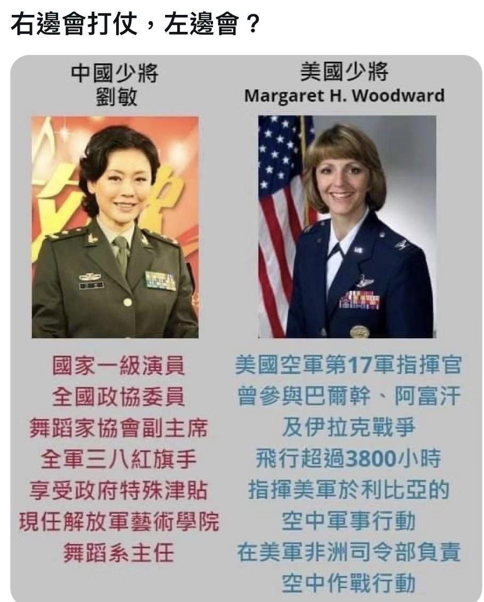
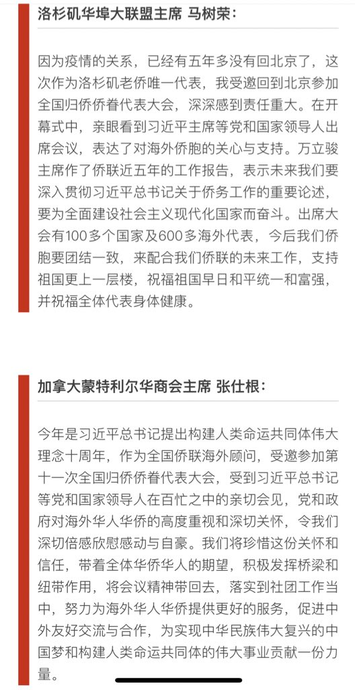
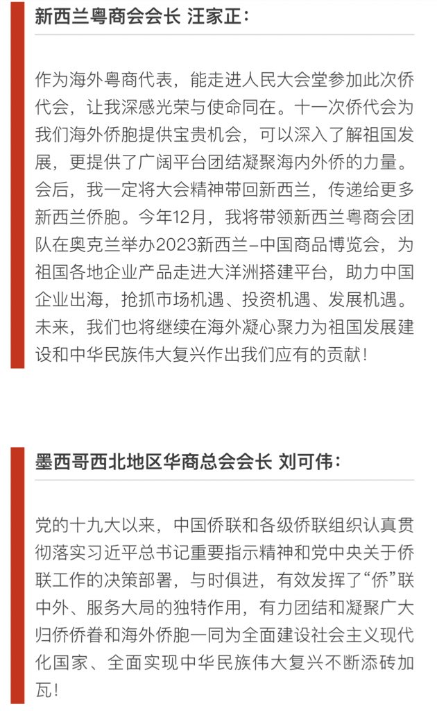
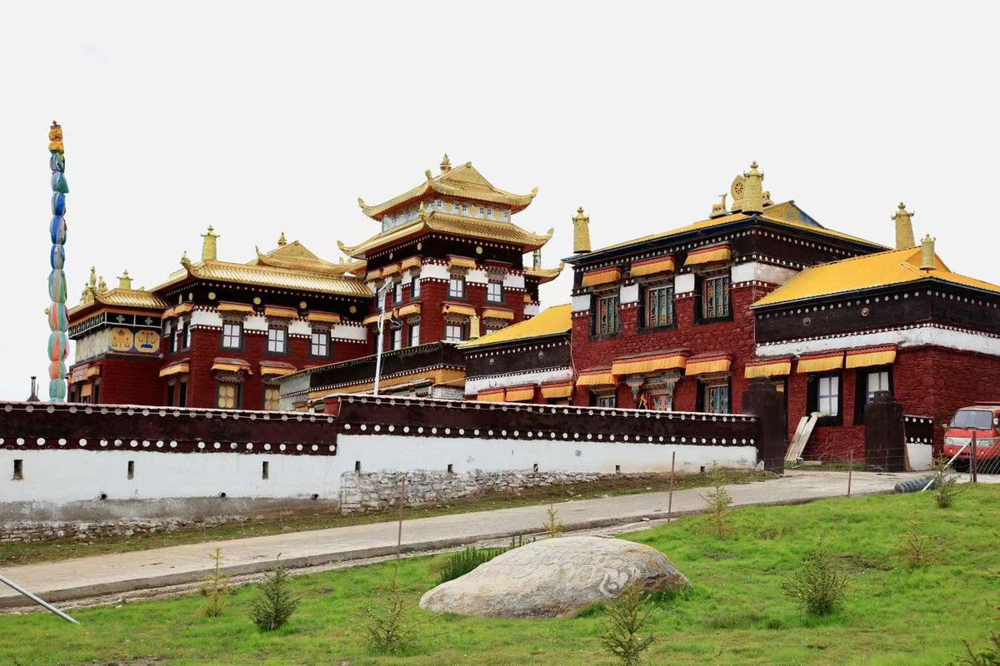
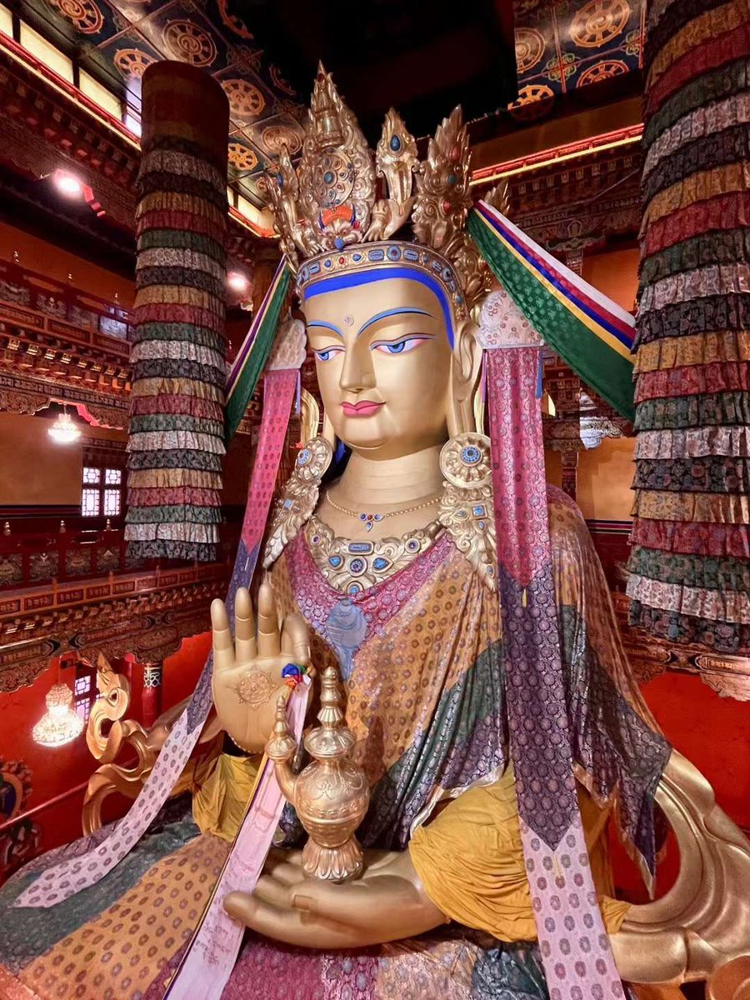
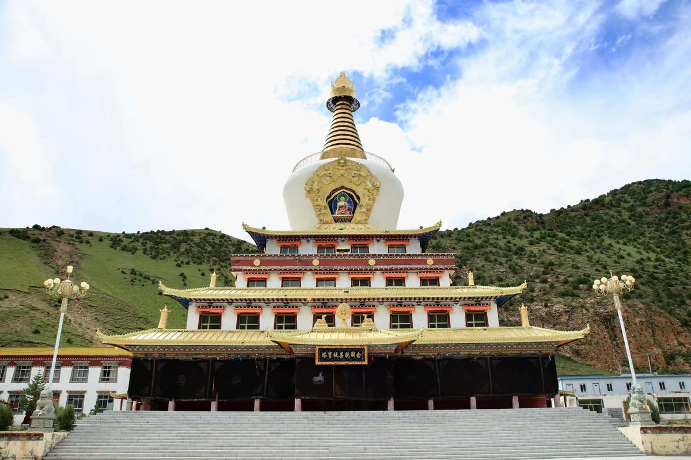
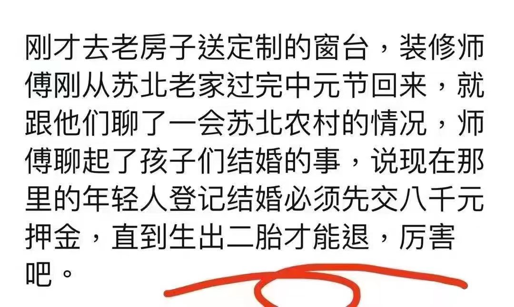

Petrichor 北京时间 2023-09-07T21:15:05Z 1699773281060921599 都是握枪打炮的。 https://t.co/zZZ7YpIh3Q   Petrichor 北京时间 2023-09-07T20:04:43Z 1699755574743695596 这个太深刻了。与医疗界类似就是党了。
反腐，亡党（做领导绝大多数是腐败分子）。不反腐，亡国。所以，只能有针对性的反腐，或者说，选择性反腐。 https://t.co/IIJtjP3AUH   Petrichor 北京时间 2023-09-07T10:40:58Z 1699613702838718961 海外的所谓侨领，不是海外华人选举出来的，而是中领馆“封”的，他们的作用就是执行中领馆指示，干一些中领馆不便于亲自出面做的事情。这些侨领并不能代表海外华人的利益，他们的所作所为反而被当地华人反感和厌恶。 https://t.co/TySQZWesBS   Petrichor 北京时间 2023-09-07T10:34:32Z 1699612080897188139 西藏的寺庙 https://t.co/By2mpG8mj3   Petrichor 北京时间 2023-09-07T10:48:27Z 1699615587184382085 警察国家不是法治国家。法治国家保护人民不受不义侵犯，尊重个人自由。然而，警察国家则以人民福祉为借口，侵犯个人自由。警察国家的政府，认为自己是无知人民的监护人，为了保护人民，他们有义务纠正人民的错误，指导人民应该如何做，以维持正当的社会秩序，即使这些作为违反了人民的意愿。
警察国家具有集权主义和社会控制的要素，通常很少或没有区分法律和行政部门对政治权力的履行，对人民的社会、经济和政治生活实行严密和镇压性的控制。表达或沟通政治观点或其他的观点的限制，这些观点都受警察监督或强制。政治控制可以由在宪政国家一般强制的边界之外运作的秘密警察部队的手段来加以执行。   Petrichor 北京时间 2023-09-07T09:34:50Z 1699597059353981230 科普：姓氏名字号。
Petrichor是我的网名，翻译成中文就是：久旱馨露。 https://t.co/Vz3RZQHPUE   Petrichor 北京时间 2023-09-07T06:24:17Z 1699549106698424587 转发一个医疗影像检查的科普，或许对有些网友有用。 https://t.co/nqSOgf8Drp   Petrichor 北京时间 2023-09-07T06:50:02Z 1699555585144803361 等级制度，是奴隶社会和封建社会中统治阶级按血缘关系、财产关系、政治地位等将人划分为不同的社会集团，用以维护其统治地位的制度。
生产资料所有制是等级划分的基础，等级关系是阶级关系的表现形式。
等级制度用政治、法律、宗教、职业以至婚姻等关系把人们的社会地位固定下来，各等级之间界限森严。等级身份一般都是世代相承。   Petrichor 北京时间 2023-09-07T08:50:06Z 1699585800697004114 蠢才是自恃學博才高、实则愚蠢而喜乱折腾之人。蠢才不是废物，废物是没有破坏作用的。但蠢才有着巨大的破坏作用，因为蠢才往往自认为是个英雄，所以特别喜欢折腾，折腾多了就把前几朝积累的国库搞空虚、外国人不敢来不愿来、国内有门路的人要逃出国、国外都是敌人、国内都是“反贼”，就把王朝搞成了乱世，直至王朝灭亡。西晋“八王之乱”导致灭亡的历史就证明了: 蠢才造就乱世! 乱世人口下降、苦日子难过。   Petrichor 北京时间 2023-09-07T05:40:54Z 1699538185972269229 不会吧？不敢相信。谁能亮一亮8000元收据？否则我才不相信呢。 https://t.co/NrjEtYl8Gn   Petrichor 北京时间 2023-09-07T03:07:08Z 1699499489122247126 借古讽今，恰到好处。 https://t.co/c9AJCfa9Hc   Petrichor 北京时间 2023-09-07T01:16:41Z 1699471694455304518 华为新手机发布会，这是什么神翻译？语音机器翻译？彻底不懂了。老外听了费劲吧。 https://t.co/ubJzGTmETp   