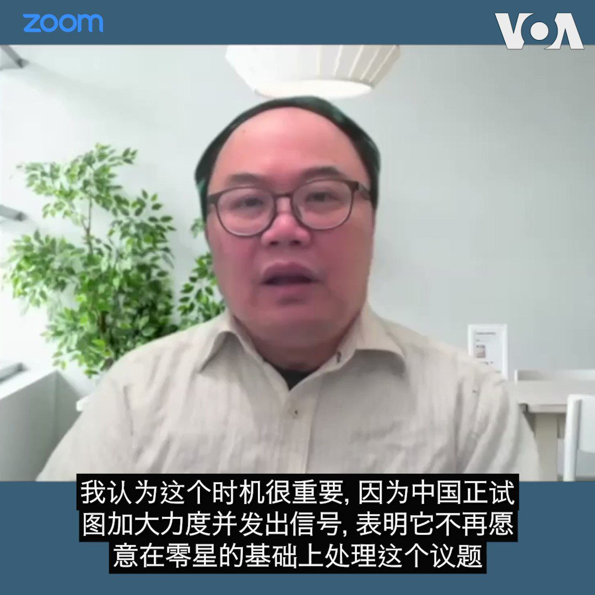
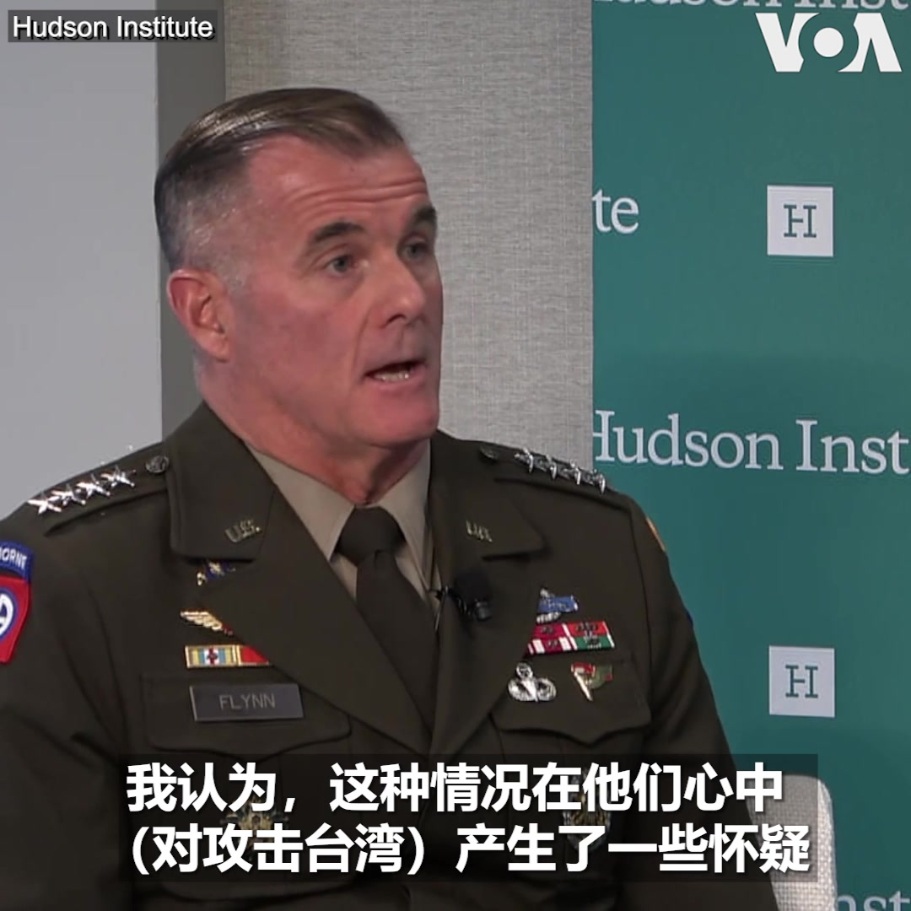

美国之音中文网 北京时间 2023-09-07T13:57:33Z 1699663173367062670 中国副总理访问朝鲜 继续为平壤撑腰壮胆 https://t.co/nzzbEfPSgw   美国之音中文网 北京时间 2023-09-07T14:13:04Z 1699667077123228126 共同威慑中国挑战 五角大楼称在印太地区取得进展 https://t.co/wQKbvrXvWk   美国之音中文网 北京时间 2023-09-07T12:02:20Z 1699634180160696449 澳中高阶对话9月7日将于北京召开。这是双边关系自2020年恶化以来，产官学界代表首度恢复对谈。分析人士指出，澳中关系处于“适度改善的轨道”上，但这类介乎官方和民间智库的1.5轨交流旨在扩大对话基础，难达成突破性进展。报道: https://t.co/yRRrWYUnQB https://t.co/0UXOWrhWDY   美国之音中文网 北京时间 2023-09-07T07:41:33Z 1699568548568588436 无惧俄空袭，布林肯国务卿在基辅过夜；美国宣布再援乌10亿美元 https://t.co/ZqXbI8wltr   美国之音中文网 北京时间 2023-09-07T09:59:03Z 1699603152289636795 陪审团将决定特朗普性侵案中的损害赔偿，法官裁决事实部分已经定谳不得再辩 https://t.co/SrfYq6Eivc   美国之音中文网 北京时间 2023-09-07T06:30:11Z 1699550592123973651 东盟轮值主席国印尼于9月5日至8日于雅加达举办第43届东盟峰会，美国、中国、印度等20多国领导人或代表应邀出席。观察人士分析，中国刻意选在峰会前公布具争议的新版地图，凸显未来东盟各国所面临的中国灰色地带威胁恐愈来愈多，但此举也将促使印度与东盟深化安全与经济关系。https://t.co/OPANPSRNdg https://t.co/bykiUDQmNJ   美国之音中文网 北京时间 2023-09-07T06:49:34Z 1699555467268444342 中国近日公示《治安管理处罚法》修订草案，当中有关禁止穿着“伤害中华民族感情”服饰的新条例引微博热议。有人质疑其可操作性，“谁来定义哪些感情属于‘中华民族感情’？谁来判断什么服装会‘伤害中华民族感情’？” 您怎么看？ https://t.co/LlP5UoQI7W   美国之音中文网 北京时间 2023-09-07T07:00:01Z 1699558100099858567 华为在美国商务部长雷蒙多访华期间推出了搭载麒麟芯片的新款手机，中国舆论热炒“麒麟归来”，称这标志着华为突破了美国的“封锁”，重返5G。事实如何？中国国家“大基金”计划再募3000亿元，主投芯片制造设备。钱能否砸开芯片自由的大门？请留言参与9/7时事大家谈。 https://t.co/n33WXJjiqu   美国之音中文网 北京时间 2023-09-07T08:11:02Z 1699575970850885652 哈里斯与维多多会面后，印尼官员骚扰身为白宫记者团代表的VOA记者 https://t.co/mpX3jlrzBk   美国之音中文网 北京时间 2023-09-07T08:15:00Z 1699576967010701783 【家事国事天下事，你有何见解】近两天国际媒体图文并茂的中国新闻之一——有人在中国用掘土机扒掉一段长城。在中国，文物和古建筑持续以各种理由被毁，广为人知。与此同时，中国官方媒体近日高声呼吁大英博物馆归还中国文物。这种呼吁怎样能在中国的特色国情中令外界感觉不可笑，不孩子气，不残忍？ https://t.co/a49h6RpRe0   美国之音中文网 北京时间 2023-09-07T08:38:57Z 1699582995966140693 俄乌战争的僵持是否会使中国领导人对攻击台湾望而却步？美国在太平洋的陆军如何遏阻中国对台湾发动攻击？一旦爆发台海战争，他们又如何防止中国速战速决呢？美国太平洋司令部陆军司令查尔斯·弗林(Charles Flynn)上将 9 月 6 日在哈德逊研究所的一次对话中就这些问题发表了看法。 https://t.co/MxoVpfnF9k   美国之音中文网 北京时间 2023-09-07T08:42:02Z 1699583772491190748 美国商业代表团首次访问塔利班统治的阿富汗 https://t.co/gys12dFUHV   美国之音中文网 北京时间 2023-09-07T09:00:01Z 1699588297675149608 一键解锁 #美国热搜 榜1、日媒爆料曾庆红训斥习近平，习近平认怂2、习近平为什么逃课G20？3、全国民众抗议成燎原之势4、习近平开了推特账号？5、核辐射检测仪反转大陆家庭辐射环境6、华为新手机掀爱国热潮7、孩子开学家长宣誓8、教室里的荒诞  https://t.co/yQ1spmUuQr https://t.co/gpCSevT3By   美国之音中文网 北京时间 2023-09-07T09:13:33Z 1699591703513231704 经济和战略担忧使越南向美国靠拢 https://t.co/4OtzxOA36X   美国之音中文网 北京时间 2023-09-07T02:56:14Z 1699496748681482697 中国 #华为 公司最近推出新款Mate 60 Pro智能手机，中国舆论立刻得出华为“不畏美国打压”、重返5G手机行业的结论。但移动通讯技术专家理查德·温莎 @rhswindsor  认为，华为这款旗舰产品存在众多疑点，可能根本不支持5G，其内置的中芯国际7纳米芯片也很难量产。报道内容：https://t.co/QyYn7LKk2M https://t.co/e2Nt1l8WPN   美国之音中文网 北京时间 2023-09-07T04:42:04Z 1699523380763070648 泽连斯基的新国防部长是娴熟而坚定的谈判者 https://t.co/GIr5cpmR3N   美国之音中文网 北京时间 2023-09-07T04:58:03Z 1699527404618920242 副总统哈里斯向东盟领导人发表讲话，缅甸席位空着 https://t.co/LtrkSMe6ex   美国之音中文网 北京时间 2023-09-07T04:58:05Z 1699527412286210364 西班牙女足明星埃尔莫索指控鲁维亚莱斯性侵犯 https://t.co/P6tiODVALk   美国之音中文网 北京时间 2023-09-07T05:14:03Z 1699531430022570177 东盟峰会前中国秀地图 逼迫东盟与印度走得更近 https://t.co/YEZkrOie8z   美国之音中文网 北京时间 2023-09-07T05:30:34Z 1699535588926558244 东盟峰会前中国秀地图 逼迫东盟与印度走得更近 https://t.co/nbLdkJyZqs   美国之音中文网 北京时间 2023-09-07T02:44:34Z 1699493810089386039 普京访华: 向东寻找根据地? https://t.co/NuQq1nawQP   美国之音中文网 北京时间 2023-09-07T02:53:06Z 1699495960357765304 正在印尼雅加达出席东盟峰会的美国副总统卡马拉·哈里斯9月6日重申美国致力于强化与东盟国家的外交、经贸和军事关系。她说，东盟仍是解决地区问题的重要平台。哈里斯是在峰会期间接受美联社专访时作出上述表态的。 https://t.co/pAkfeaeiMb   美国之音中文网 北京时间 2023-09-07T02:53:51Z 1699496148329807997 “我一如既往地被乌克兰士兵、乌克兰人民和乌克兰领导人的勇气、力量和韧性所震撼，”美国国务卿布林肯9月6日在基辅与乌克兰总统泽连斯基举行会谈时说。这是自俄罗斯入侵乌克兰以来布林肯第四次访问乌克兰。 https://t.co/4s1nR23XCW   美国之音中文网 北京时间 2023-09-07T03:04:11Z 1699498746738856406 日本上个月开始将福岛第一核电站的废水排放入海，为了平息人们对安全问题的担忧，日本海洋生物研究所每天都在对福岛海岸捕获的鱼进行检测。日本海洋生物研究所研究员松本晃说：“全面披露检测结果会让人们感到安全。我们想让国内外的人都知道日本有很多美味的鱼，并品尝。” https://t.co/IqGopKvhGO   美国之音中文网 北京时间 2023-09-07T03:28:03Z 1699504756715376949 印中关系因习近平不出席G20峰会而更加冰冷 https://t.co/NionQB94ZO   美国之音中文网 北京时间 2023-09-07T04:04:04Z 1699513818265591843 正当美国国务卿布林肯访问基辅之时，拜登政府9月6日宣布向乌克兰提供额外安全援助，以满足乌克兰的关键安全和国防需求。 https://t.co/ME3MJl95TQ   美国之音中文网 北京时间 2023-09-07T04:13:34Z 1699516211342741959 撤离中国？加拿大基金的新选择 https://t.co/SgiZxinJWE   美国之音中文网 北京时间 2023-09-07T00:48:04Z 1699464494747906485 【家事国事天下事，你有何见解】近两天国际媒体图文并茂的中国新闻之一——有人在中国用掘土机扒掉一段长城。在中国，文物和古建筑持续以各种理由被毁，广为人知。与此同时，中国官方媒体近日高声呼吁大英博物馆归还中国文物。这种呼吁怎样能在中国的特色国情中令外界感觉不可笑，不孩子气，不残忍？ https://t.co/HZfrNREIO8   美国之音中文网 北京时间 2023-09-07T01:04:03Z 1699468514338447822 中澳重启半官方高阶对话，分析:关系会改善但难有重大突破 https://t.co/xWqa4UBpmA   美国之音中文网 北京时间 2023-09-07T01:04:04Z 1699468521699434760 李强面见东盟首脑淡化地图风波，中共大员去河内与拜登展开争夺 https://t.co/QWgowUy9PR   美国之音中文网 北京时间 2023-09-07T01:19:08Z 1699472313618686329 中国房地产股票强劲反弹，观察人士：具有明显投机性 不会持久 https://t.co/hrcKUz1kux   美国之音中文网 北京时间 2023-09-07T01:19:10Z 1699472321059381700 日本加入印菲越台行列抗议中国新版地图 https://t.co/6RlyZnBNqp   美国之音中文网 北京时间 2023-09-07T00:18:03Z 1699456940211142990 经济不稳动摇地方财政，中国多地民众维权抗议 https://t.co/4QjcxoiQt5   