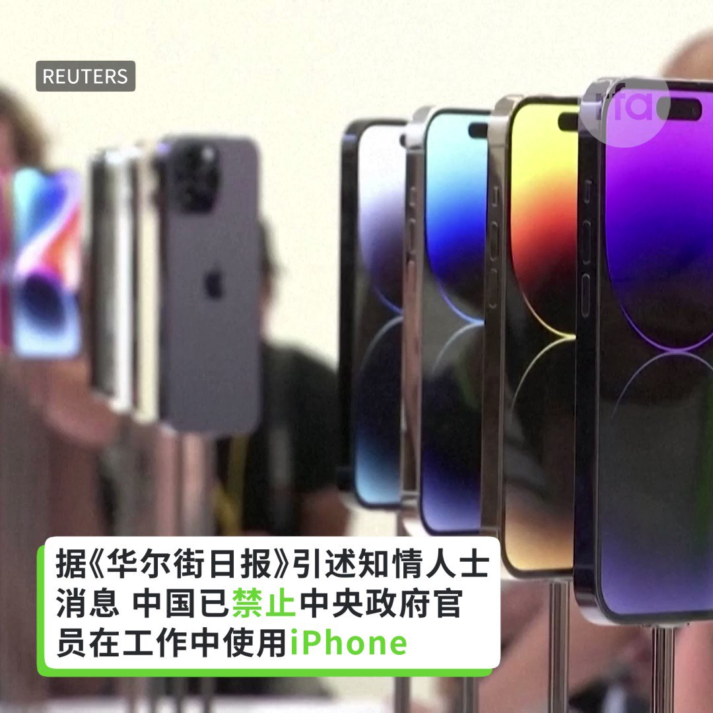

自由亚洲电台 北京时间 2023-09-07T03:22:58Z 1699503473606418525 “我们并不在战争中，我们也不希望进入战争，但是 #美国国防部 必须像在战时一样快速移动，因为中国并不会等待我们。”
美国国防部副部长Kathleen Hicks本周三指出，五角大厦计划近期划拨数亿美元预算来开发数千个陆海空 #人工智能 系统，着重于“小型、智能、低成本”。

 https://t.co/jrOWwOBRY1   自由亚洲电台 北京时间 2023-09-07T03:49:19Z 1699510104922706196 第78届联合国大会9月5日在纽约召开。在“#台湾入联”问题上，台北与北京隔空互呛，激烈交锋。
 https://t.co/tQJOoLRSbs   自由亚洲电台 北京时间 2023-09-07T04:16:43Z 1699517002304696555 专栏 | #网络博弈：关于 #普里戈任 之死，这些被微信屏蔽文章有共同特点
 https://t.co/orizbrHOKR   自由亚洲电台 北京时间 2023-09-07T00:26:06Z 1699458965057532005 中国6日公布9月份 #中国零售业景气指数  为50.8%，零售业比上个月缓步回温。然而，对于即将公布的 #进出口 数据，国内外的分析都认为可能持续走弱，压力仍在，难以乐观。

 https://t.co/cxZ5zkTh5j   自由亚洲电台 北京时间 2023-09-07T01:43:46Z 1699478511818531183 日本首相 #岸田文雄 和中国国务院总理 #李强 在东盟与中日韩首脑会议前，站在一起进行了短暂交谈。岸田文雄强调构筑建设性且稳定的日中关系的重要性，还就福岛第一核电站处理水表明日方立场。 https://t.co/MoSn1QwKWv   自由亚洲电台 北京时间 2023-09-07T02:14:40Z 1699486287752057095 据《华尔街日报》周三（9 月 6 日）援引知情人士消息报道，中国已命令中央政府机构官员不得使用苹果 iPhone 和其他外国品牌设备进行工作，也不得将其带入办公室。 https://t.co/TMfb78xHJZ   自由亚洲电台 北京时间 2023-09-07T00:14:16Z 1699455989651751039 中国粉丝爆料，台湾歌手 #蔡依林 演唱会必唱名曲“#玫瑰少年”，但在广州演唱会后被砍掉现场彩虹灯，到长沙直接在节目单“被消失”。为什么会这样？

 https://t.co/H6BHtrx67I   