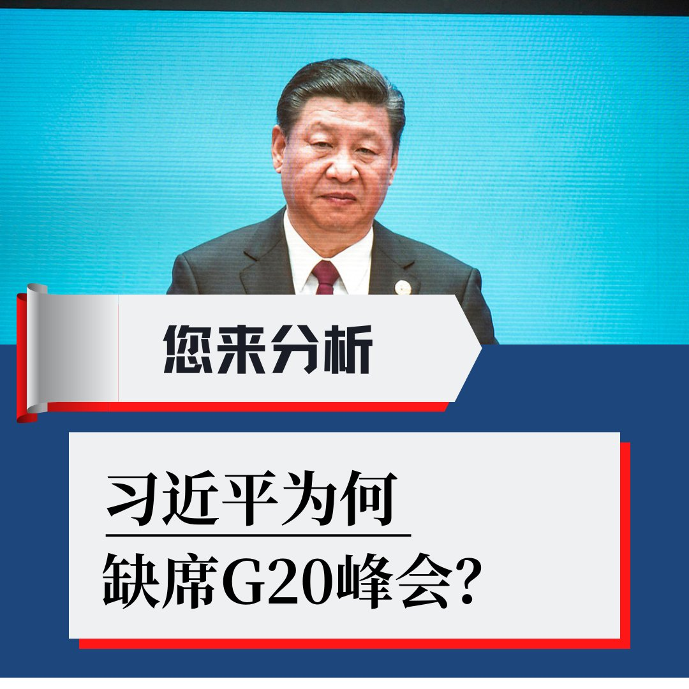
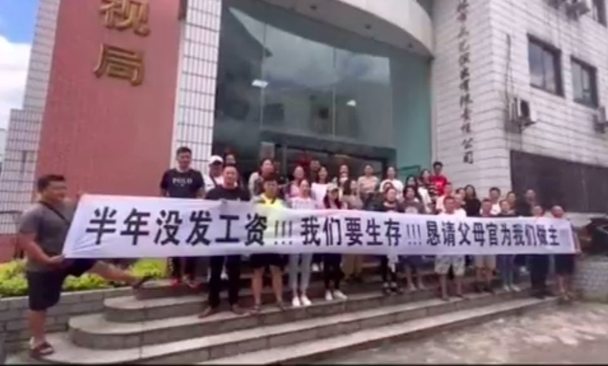
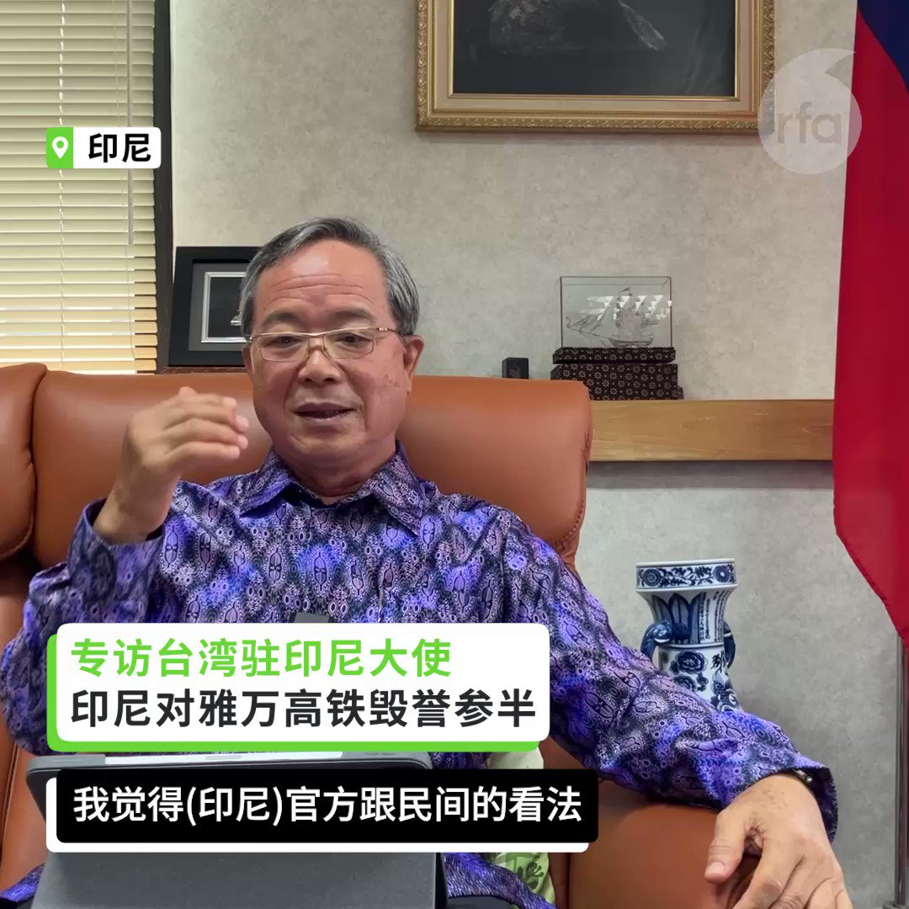
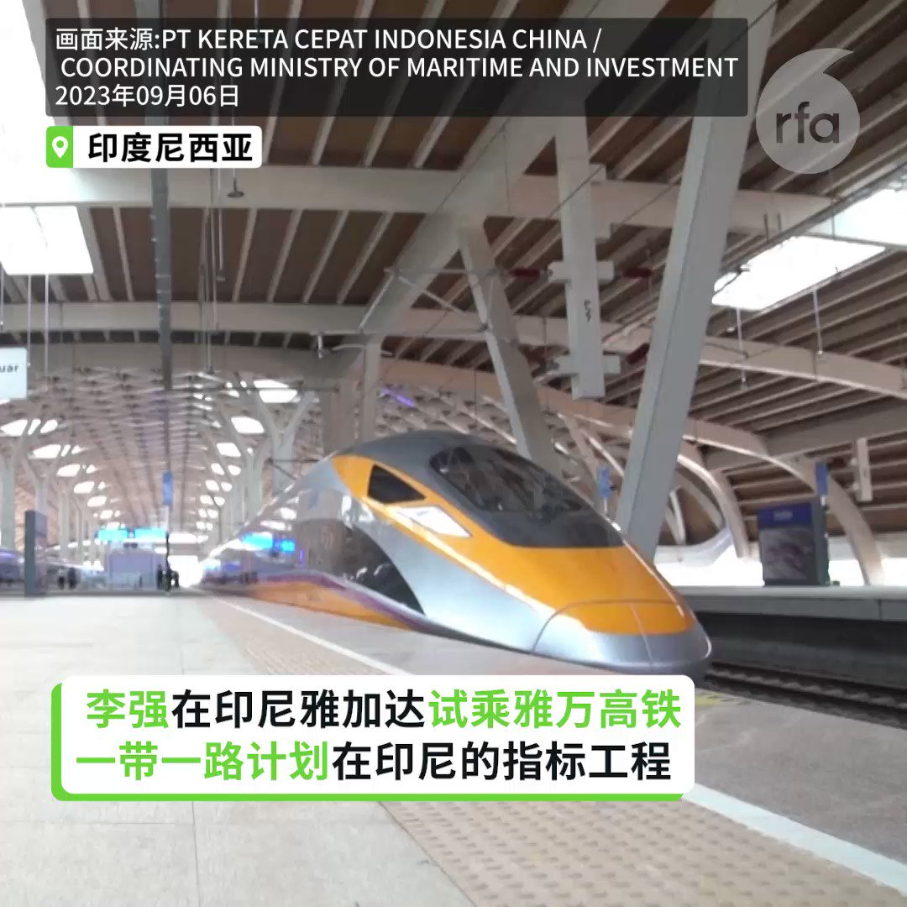
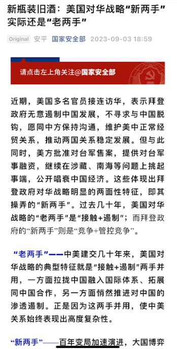

自由亚洲电台 北京时间 2023-09-07T20:08:51Z 1699756615937761665 RT @RFA_Chinese: 【#您怎么看】
中国官方日前宣布，总理李强将出席在印度新德里举行的二十国集团（G20)… https://t.co/NDpC9FNX1s   自由亚洲电台 北京时间 2023-09-07T14:31:11Z 1699671639695495391 【多地公务员及慈善机构被欠薪】
 【天津区政府向寺院借钱】
中国政府财政吃紧，南京、天津以及山东等地的政府公务员，继去年被 #降薪 之后，又被 #拖薪。吉林就连退休金也被停发。甚至有政府向寺院借钱，武汉有慈善机构人员披露，上级叫他们做好自谋出路的准备。https://t.co/FbPt52ACBg https://t.co/okwtSpUNYL   自由亚洲电台 北京时间 2023-09-07T11:53:55Z 1699632061232119899 【雅万高铁毁誉参半】
【数度延宕 超出预算20多亿美元】
【专访台湾驻印尼代表】 
中国在印度尼西亚具有标志性的“一带一路”项目雅万高铁即将通车，雅万高铁连接首都雅加达及第4大城万隆，全长142公里，工程数度延宕，超出预算20多亿美元，预估要营运40年后才能回收。台湾驻印尼代表处的代表陈忠谈到印尼官方和民间对于雅万高铁的讨论，毁誉参半。
#雅万高铁  #李强 #一带一路 #陈忠   自由亚洲电台 北京时间 2023-09-07T13:16:58Z 1699652959351841143 【李强试乘雅万高铁】 【李强与印尼官员讨论将雅万高铁延伸到泗水】 中国总理李强6日在印度尼西亚首都雅加达考察中国与印尼的合作项目雅万高铁，并且试乘了一段高铁路线。这是“一带一路”计划在印尼的指标工程，全长142公里，最高时速350公里，全线采用中国技术与标准。雅万高铁工程数度延宕，又超出20多亿美元的经费，尽管多项承诺跳票，李强与印尼官员讨论了将雅万高铁延伸到第二大城市泗水的项目。 #雅万高铁 #李强 #一带一路   自由亚洲电台 北京时间 2023-09-07T11:19:13Z 1699623327684551007 【李强试乘雅万高铁】
【李强与印尼官员讨论将雅万高铁延伸到泗水】
中国总理李强6日在印度尼西亚首都雅加达考察中国与印尼的合作项目雅万高铁，并且试乘了一段高铁路线。这是“一带一路”计划在印尼的指标工程，全长142公里，最高时速350公里，全线采用中国技术与标准。雅万高铁工程数度延宕，又超出20多亿美元的经费，尽管多项承诺跳票，李强与印尼官员讨论了将雅万高铁延伸到第二大城市泗水的项目。
#雅万高铁 #李强 #一带一路   自由亚洲电台 北京时间 2023-09-07T12:06:50Z 1699635311247229153 今年8月 #中国进出口 5013.8亿美元，下降8.2%。其中， #出口 2848.7亿美元，下降8.8%；#进口 2165.1亿美元，下降7.3%.
https://t.co/YxKJ1bioC1   自由亚洲电台 北京时间 2023-09-07T06:21:11Z 1699548325685412036 【#您怎么看】
中国官方日前宣布，总理李强将出席在印度新德里举行的二十国集团（G20) 领导人峰会。而中共领导人习近平与俄罗斯总统普京将共同缺席本届峰会。有评论认为，习近平的缺席理由往往不透明，但他的缺席可能是为了抗议不断加剧的边境紧张局势以及与印度日益加剧的地缘政治焦虑，甚至可能是出于对中国房地产市场危机的内部经济担忧。
您分析，习近平为何缺席G20峰会？这反映出什么信号？   自由亚洲电台 北京时间 2023-09-07T07:00:07Z 1699558123659493547 【#亚太报道（2023-9-6）】
欢迎收听和订阅播客【亚太报道】 https://t.co/MjLNSvVMqc
#习近平 #北戴河 疑遭元老斥责 / #大外宣 倡导习思想遭负评 / #蔡依林“#玫瑰少年”在长沙演唱会被消失 / 政府 #禁用苹果手机办公 恐起寒蝉效应 / 美国将发展强大AI战力应对中国 https://t.co/fv0yKOQXDu   自由亚洲电台 北京时间 2023-09-07T02:37:07Z 1699491936212791483 许多人在社群平台上表示，#瑞幸 的 #酱香拿铁 让他们喝到“人生第一口 #茅台”，这样的评价也意外引发了外界对于中国“#消费降级”的讨论。 https://t.co/CwhB45ccSt   自由亚洲电台 北京时间 2023-09-07T04:35:52Z 1699521821404783042 马聚把 @XisMoments  这种账号称为“喇叭”，“它不和别人讨论，它就是一个喇叭，它没有收音的功能，它拒绝收音，只做到喇叭就行了。”
详见本台记者王允 @Jeff23Wang 报道。 https://t.co/IU4OJpnzhv   自由亚洲电台 北京时间 2023-09-07T04:53:55Z 1699526365865759197 【#您怎么看？】
中国国家安全部9月3日在官方微信公众号上发表文章《新瓶装旧酒：美国对华战略“新两手”实际还是“老两手”》，分析拜登政府对华战略的两面性特征，指点中美博弈，明确警告美国政府：“要真正实现‘从巴厘岛到旧金山’，美国需要拿出足够的诚意。”

国安部给外交部指明方向，它是否了解或能影响习近平对外交活动的考量？习近平听谁的？

本属隐蔽战线的国安部近来频繁高调议论热点事务，这是新任国安部部长陈一新“捞过界”，还是习近平“新安全观”赋予的新使命？   自由亚洲电台 北京时间 2023-09-07T05:30:01Z 1699535450376200674 英国第二大城市 #伯明翰破产  的消息在中国网络引起热议。除了中国官媒大肆报道，不少中国网民也对此冷嘲热讽，更扬言"中国一定会赢到最后"。然而当下中国地方政府的经济情况是否真的如此乐观，足以让中国网民有底气嘲笑别国吗？

 https://t.co/lPhFCYMBlC   自由亚洲电台 北京时间 2023-09-07T02:26:59Z 1699489388709961984 专栏 | #纵横大历史：#文革 系列 第六十二讲  #毛泽东 武汉游长江
 https://t.co/3SXglk576o   自由亚洲电台 北京时间 2023-09-07T03:22:58Z 1699503473606418525 “我们并不在战争中，我们也不希望进入战争，但是 #美国国防部 必须像在战时一样快速移动，因为中国并不会等待我们。”
美国国防部副部长Kathleen Hicks本周三指出，五角大厦计划近期划拨数亿美元预算来开发数千个陆海空 #人工智能 系统，着重于“小型、智能、低成本”。

 https://t.co/jrOWwOBRY1   自由亚洲电台 北京时间 2023-09-07T03:49:19Z 1699510104922706196 第78届联合国大会9月5日在纽约召开。在“#台湾入联”问题上，台北与北京隔空互呛，激烈交锋。
 https://t.co/tQJOoLRSbs   自由亚洲电台 北京时间 2023-09-07T04:16:43Z 1699517002304696555 专栏 | #网络博弈：关于 #普里戈任 之死，这些被微信屏蔽文章有共同特点
 https://t.co/orizbrHOKR   自由亚洲电台 北京时间 2023-09-07T00:26:06Z 1699458965057532005 中国6日公布9月份 #中国零售业景气指数  为50.8%，零售业比上个月缓步回温。然而，对于即将公布的 #进出口 数据，国内外的分析都认为可能持续走弱，压力仍在，难以乐观。

 https://t.co/cxZ5zkTh5j   自由亚洲电台 北京时间 2023-09-07T01:43:46Z 1699478511818531183 日本首相 #岸田文雄 和中国国务院总理 #李强 在东盟与中日韩首脑会议前，站在一起进行了短暂交谈。岸田文雄强调构筑建设性且稳定的日中关系的重要性，还就福岛第一核电站处理水表明日方立场。 https://t.co/MoSn1QwKWv   自由亚洲电台 北京时间 2023-09-07T02:14:40Z 1699486287752057095 据《华尔街日报》周三（9 月 6 日）援引知情人士消息报道，中国已命令中央政府机构官员不得使用苹果 iPhone 和其他外国品牌设备进行工作，也不得将其带入办公室。 https://t.co/TMfb78xHJZ   自由亚洲电台 北京时间 2023-09-07T00:14:16Z 1699455989651751039 中国粉丝爆料，台湾歌手 #蔡依林 演唱会必唱名曲“#玫瑰少年”，但在广州演唱会后被砍掉现场彩虹灯，到长沙直接在节目单“被消失”。为什么会这样？

 https://t.co/H6BHtrx67I   