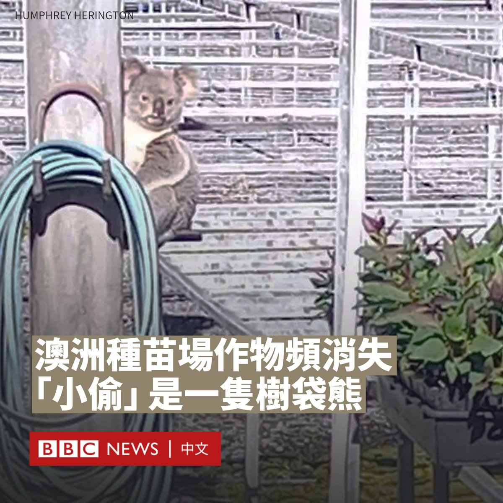
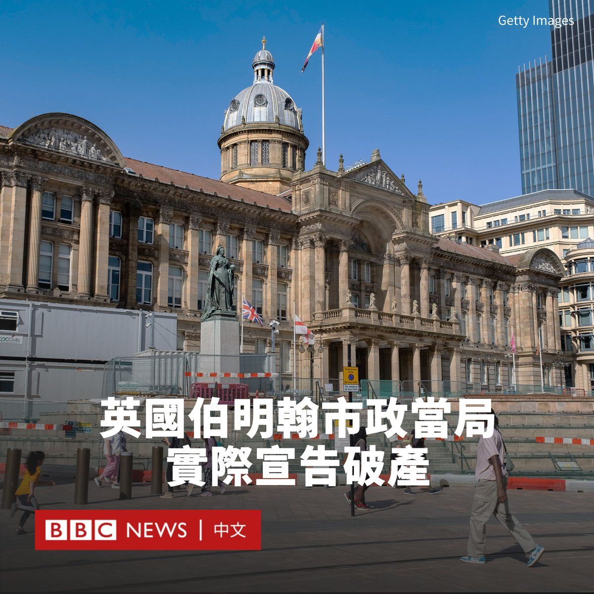
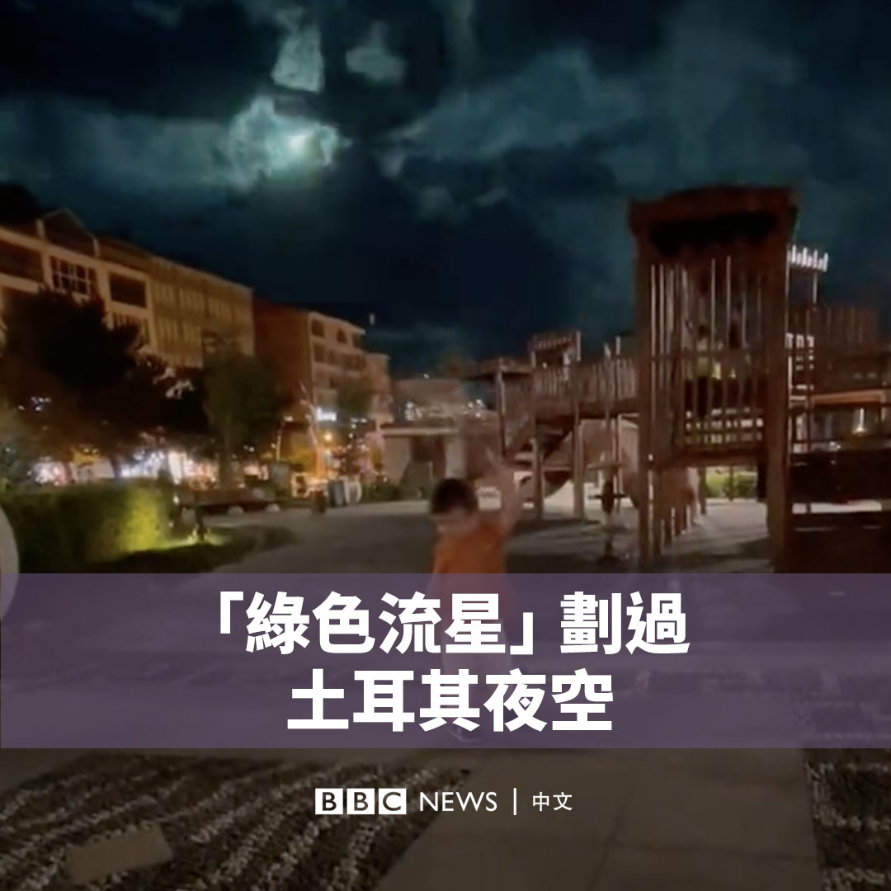

D英国广播公司BBC 北京时间 2023-09-06T22:54:24Z 1699435890341199931 过去几周，澳大利亚一处专门培育植物幼苗的种苗场频繁“遭贼”，老板遭受损失之余还苦恼着该如何找出凶手，没想到某天这名神秘“小偷”自投罗网，竟是一只树袋熊。

这只树袋熊吃掉了该种苗场的数千棵植物，损失达到3000英镑，而它贪吃的植物本来即是为了增加该地区树袋熊栖息地面积而种植的。

这家种苗场位于新南威尔士州北部，负责人汉弗莱·赫林顿（Humphrey Herington）曾以为是山羊或负鼠偷吃了幼苗，设下了陷阱但没有收获。

直到有一天他走进苗圃，发现一只树袋熊在被剥光皮的桉树中不知所措。他说：“那天早上有很多植物消失了……我想那天它一定吃得很多，太累了，没力气回树上去。”

“它看起来吃饱了，非常满足。”赫林顿说。他表示此前二十多年都未出现这种情况。

树袋熊的“小偷”身份被揭穿后，赫林顿用毛巾轻轻将其包裹，转移到种苗场外约300米的树上。

他补充说，这只树袋熊几天后又闯入种苗场，而他并没有生气，反而对其生存条件感到担忧。

2022年，树袋熊在澳大利亚东海岸的大部分地区数量急剧下降，被列为濒危物种，原因包括森林大火、干旱、土地开发和疾病等。

2021年，新南威尔士州的一项调查发现，如果不采取紧急行动，树袋熊到2050年便会在该地区灭绝。一些保育组织说，目前野生树袋熊的数量可能只剩下五万只。   D英国广播公司BBC 北京时间 2023-09-06T16:31:42Z 1699339580263035380 俄罗斯迫切需要武器，特别是子弹和炮弹，以支援在乌克兰的战争，而朝鲜在这方面有充足的供应。两国潜在的密切合作令美国和盟友感到担忧。https://t.co/pCScTG1E11   D英国广播公司BBC 北京时间 2023-09-06T18:17:23Z 1699366174470152327 中国当局计划将“伤害中华民族感情”的行为列入治安拘留范围，在互联网上引发争议。

正在修订的《治安管理处罚法》草案已经过该国立法机关全国人大常委会一次审议，正在征求公众意见。

根据公开发布的草案，第34条规定：“在公共场所或者强制他人在公共场所穿着、佩戴有损中华民族精神、伤害中华民族感情的服饰、标志的”，可以最多被处以15日拘留，并处5000元人民币（685美元）罚款。

“制作、传播、宣扬、散布有损中华民族精神、伤害中华民族感情的物品或者言论”，也同样可能遭到拘留或罚款处罚。

然而，修订草案并未对何谓“有损中华民族精神”做出具体定义，这导致很多法律人士和网民质疑其可能演变成新的“口袋罪”。

清华大学刑法学教授劳东燕认为，由于该法律处罚标准模糊，“势必导致行政权力的选择性执法”，而国家权力直接干预公民个人的日常穿着领域，“明显有过度干预之嫌”。

“这样的立法规定可能会刺激民粹主义或极端民族主义情绪的肆意蔓延，进一步恶化公共领域的舆论环境，不当压制个人在日常穿衣与言论的自由空间。”她在微博上写道。

华东政法大学宪法学教授童之伟也对该法律持批评态度，他表示“中华民族精神”由谁和按什么程序确认，是“几乎无法循法治原则操作”的问题。

“若全国人大常委会按现在的草案通过该条，执法司法上必造成循长官意志抓人、定罪的实际后果，会贻害无穷。”他在社交媒体上写道。

2022年8月，一名中国女子身穿和服在东部城市苏州的日式风情街拍照，被警方以涉嫌寻衅滋事为由带走，质疑其穿和服是“煽动民族仇恨”。当时该事件引发轩然大波。

不过，也有一些人对该修订表示支持，认为这些条文有助于打击“为军国主义罪行洗地”的行为，有利于弘扬爱国情感。

最早于2005年颁布的《治安管理处罚法》规定如何处罚不构成犯罪的轻微违法行为，前身是1987年实施的《治安管理处罚条例》。中国媒体报道称，此次修订是该法实施17年来的一次大修。

除了上述引发争议的条款，修订草案还新增了数种可以处罚的行为，包括考试作弊、组织领导传销、以抢夺方向盘等方式妨碍公共交通工具驾驶、升放携带明火的孔明灯、无人机在未获许可情况下飞行等。   D英国广播公司BBC 北京时间 2023-09-06T15:12:32Z 1699319657558331851 英国第二大城市伯明翰（Birmingham）实际宣布破产，将停止所有非必要开支，只保留基本服务支出。

为超过100万人提供服务的伯明翰市议会在周二（9月5日）根据1988年《地方政府财政法》发布第114条通知，该通知通常在地方议会首席财务官认为当局无法用其收入履行其支出承诺时发布。

在英国，地方当局没有官方的“破产”一说，但该通知的发布通常被描述为“实际上破产”，这意味着任何非必要的新支出将停止，以先履行现有承诺。

市议会领袖约翰·科顿（John Cotton）表示，议会将做出“艰难而有力的决定”。

伯明翰市议会本年度的预算缺口高达8700万英镑。当局将原因归咎于Oracle IT系统的采用。

该系统旨在简化议会支付和人力资源系统，但该工程延误三年导致支出猛增，由1900万英镑升至1亿英镑。

工党主导的议会还需要解决“同工同酬索赔案”带来的大笔赔偿。

2012年，英国最高法院一项裁决支持了一群以女性为主的伯明翰市政员工提起的诉讼，原告称自己未获得与男性相等的奖金。

十多年来，市议会已支付了近11亿英镑的赔偿金，但仍有7.6亿英镑有待支付。

该消息宣布后，人们担心资金削减可能会影响道路、公园、图书馆和文化项目的施建。2026年欧洲田径锦标赛将在伯明翰亚历山大体育场举办，其是否会受影响也留下问号。   D英国广播公司BBC 北京时间 2023-09-06T13:37:33Z 1699295752189866137 这是一颗流星划过土耳其东部夜空的景象。🌠

当地居民记录了这一画面，这颗流星照亮了夜空，发出绿色的光芒。 https://t.co/VuzR83j3hb   D英国广播公司BBC 北京时间 2023-09-06T11:10:03Z 1699258632570106136 在俄罗斯入侵乌克兰后，被称作“Z博主”（Z-Blogger）的网红们在网络上不断涌现。他们经常随俄罗斯军队出行，发布前线的影片，呼吁俄罗斯年轻人入伍。 https://t.co/o2zfpw33dw   D英国广播公司BBC 北京时间 2023-09-06T09:54:49Z 1699239702082273780 印度🇮🇳的国名是“India”还是“Bharat”？这个问题在印度掀起了一场巨大争论。

事件源于印度政府在发出的二十国集团（G20）峰会正式邀请函中，将总统穆尔穆（Droupadi Murmu）的头衔写为“President of Bharat”（婆罗多总统）。

“Bharat”（婆罗多）是印度的印地语名称，可以追溯到梵文书写的古代印度教经文，在印度国内被广为使用。

“India”（印度）则拥有更高的国际知名度，它源自印度河。

印度执政党人民党的几位部长为此举欢呼，但反对党领导人质疑此举的目的。反对党在两个月前曾组成一个联盟，名称缩写也为“INDIA”。

此前有报道称，印度政府将向议会建议修改国名为“婆罗多”，但尚未得到证实。

印度政府所有官方网站仍然使用“印度”一词，穆尔穆总统的社交媒体简介上也继续使用“印度”。

不过，BBC记者乌芒·波达（Umang Poddar）报道说，这并不是印度政府在G20峰会材料中使用“婆罗多”的唯一案例。该国还在一本给外国代表团的手册中使用了该名称——“婆罗多，民主之母”。

此外，印度的宪法开篇写道：“印度，即婆罗多，应为联邦制。”

多年来，印度各届政府一直试图通过重新命名道路或地名来消除英国殖民时代的痕迹，莫迪政府加速推进这一进程，其呼吁民众摒弃殖民心态。

目前尚不清楚印度是否将正式更名，也不清楚更名之举仅限于英语，还是会要求其他一些语言也进行相应更改。

在中国，自古以来对印度亦有多种称呼。《后汉书》将其称为“天竺”。七世纪的唐代高僧玄奘在《大唐西域记》中建议定名“印度”。   