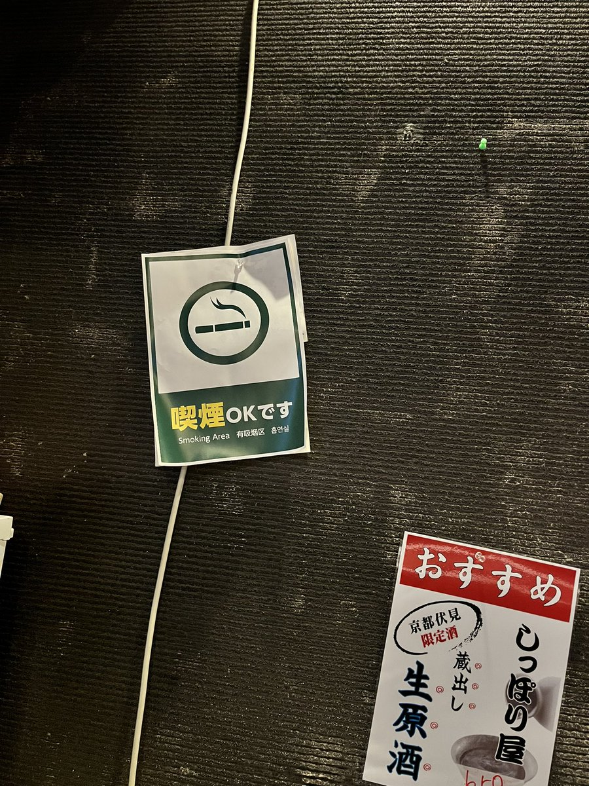
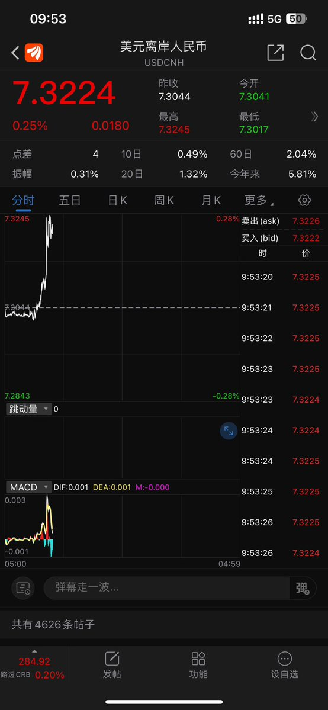
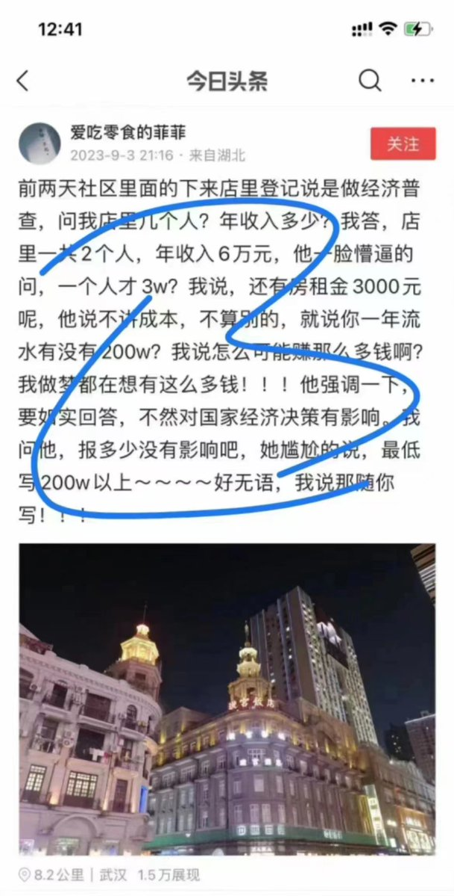
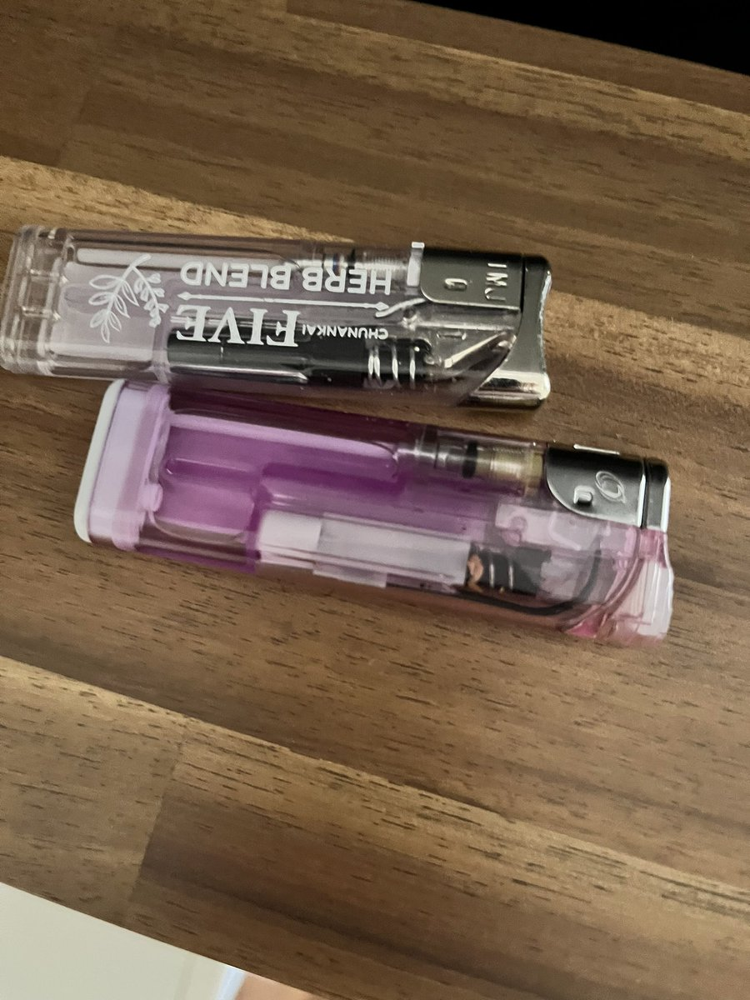

王歪嘴 北京时间 2023-09-06T19:59:57Z 1699391984870605093 我儿子说这俩大爷真讲究（局气）   王歪嘴 北京时间 2023-09-06T18:17:49Z 1699366285275242630 在京都找到一家可以吸烟的居酒屋，好爽😄 https://t.co/n4BMfjHOuX   王歪嘴 北京时间 2023-09-06T10:34:15Z 1699249624413045199 到九月底，汇率的棺材板能按住吗？要是按不住的话，我们所担心的一切灾难都将成为现实 https://t.co/JmVFXfO6mW   王歪嘴 北京时间 2023-09-06T06:26:40Z 1699187319478399256 日本真好，日本大爷更好，随便带儿子喝个酒，喊两声大爷就纯收人40万，喝懵逼了还有超豪华民宿兜底 https://t.co/DgsyDUput2   王歪嘴 北京时间 2023-09-06T06:33:40Z 1699189077692866769 目前的状态是：昨晚都跟谁喝的？喝了几种酒儿？聊了什么事儿？我现在在哪儿？我老婆呢？我儿子呢？
目前唯一能确定的就是，贞操还在！ https://t.co/yq2ypd5k4w   王歪嘴 北京时间 2023-09-06T07:54:37Z 1699209451054784982 想当年，农民的亩产96800多斤也是这样“写”出来的，当年上报完亩产万斤十万斤之后国家的征粮政策就下发了，于是有了大饥荒。
到如今，如此上报完民企流水的下一步就是国家就按照这个营业额来计算税率。年流水200万，按照17%的增值稅来计算，年纳税低于34万的民企老板就触犯了偷税漏税罪（跟当年的农民私藏粮食同罪），所以没能足额缴纳的民营企业老板都将被处以三年以上有期徒刑、无期徒刑以及死缓和死刑……
当然，唯一的解决方案就是“认清形势放弃幻想”，要么足额缴纳，要么放弃经营，你会怎么选？   王歪嘴 北京时间 2023-09-06T08:38:27Z 1699220480270745790 一摸，发现口袋里三个打火机，一个肯定是我自己的，另外两个是谁的？很欣慰，完美贯彻落实并执行了物流从业者的基本原则：做事不占便宜算吃亏，出门不捡东西就算丢 https://t.co/BvQqzFyVAC   王歪嘴 北京时间 2023-09-06T08:54:50Z 1699224604345245979 物流业是三种发票，普通发票6%，增值税发票11%，仓储租赁发票17%，在连续几次降低民企税负的“惠民政策”发布之后，进项抵扣几乎没有了……   