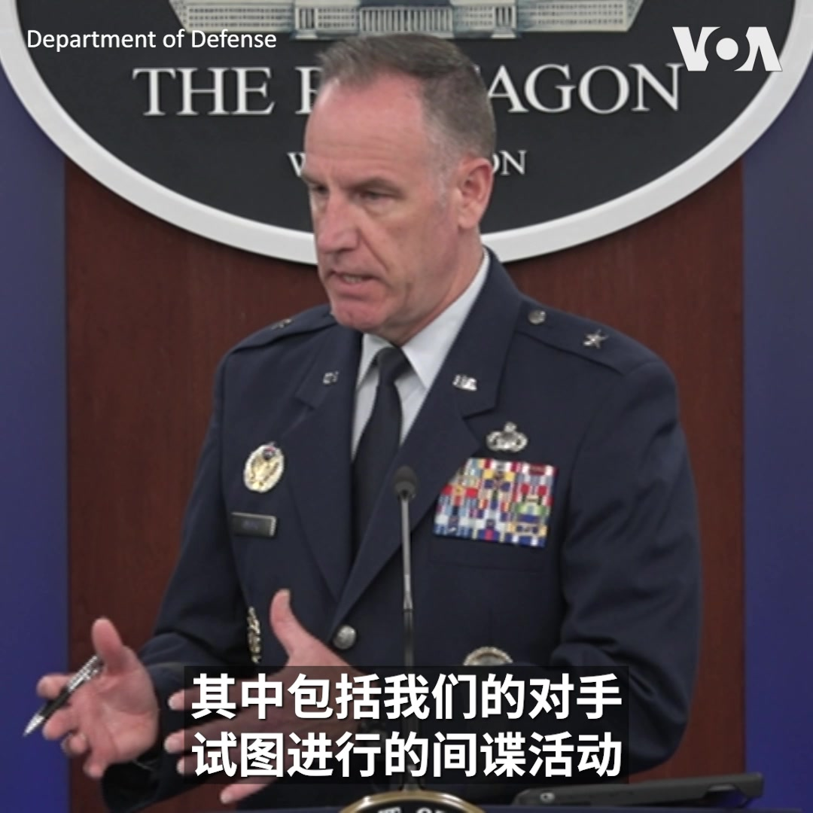
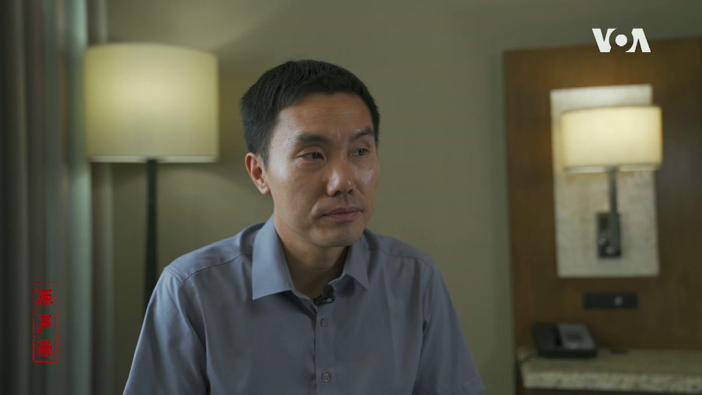
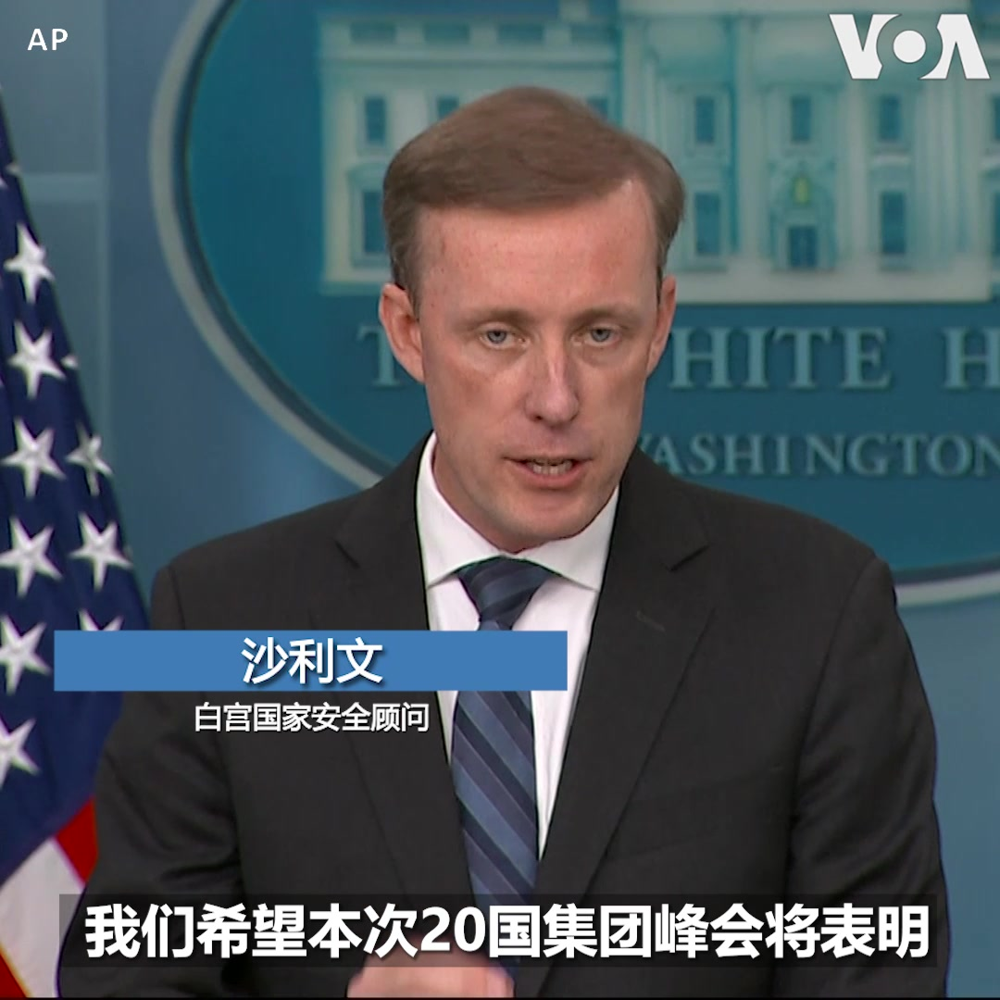
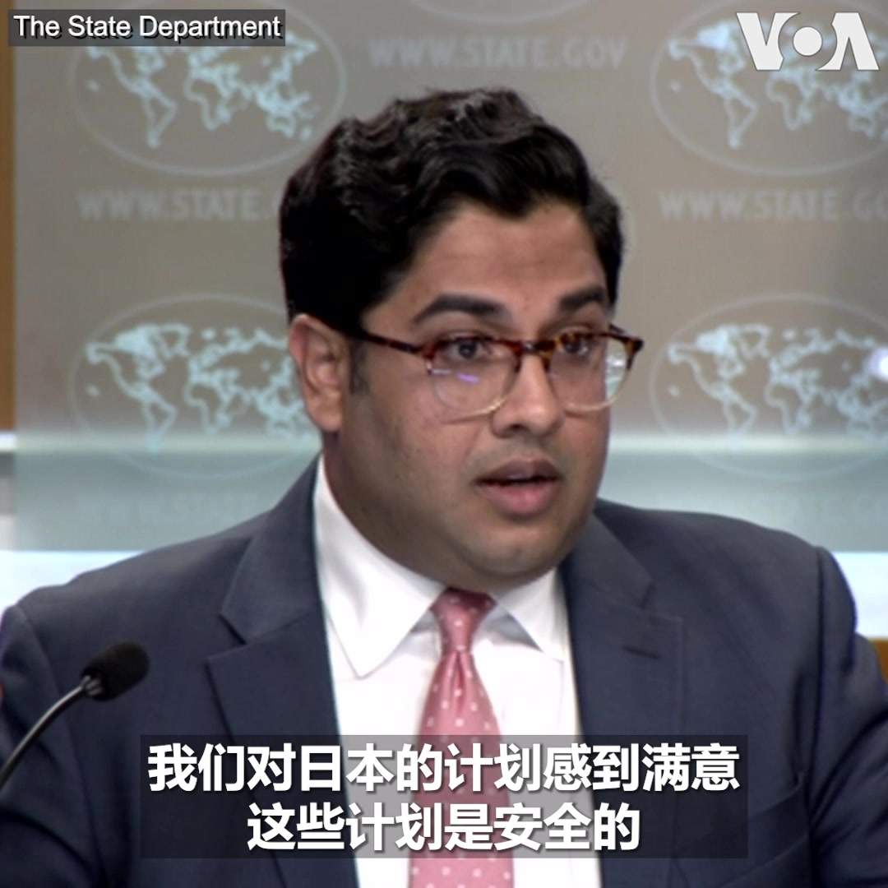
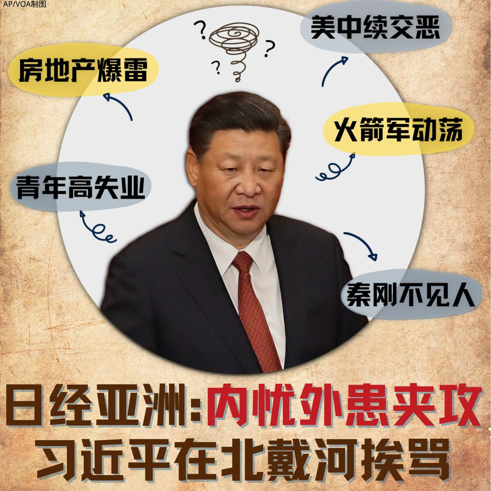

美国之音中文网 北京时间 2023-09-06T06:28:03Z 1699187665248321913 缅甸将无缘担任2026年东南亚国家联盟主席国 https://t.co/tTAoYNH21k   美国之音中文网 北京时间 2023-09-06T06:59:04Z 1699195472785912116 联邦法官裁定阿拉巴马州国会选区划分歧视黑人选民 https://t.co/XMWU82qlTW   美国之音中文网 北京时间 2023-09-06T07:25:54Z 1699202224042262732 华尔街日报9月4日援引美国官员的话报道说，近年来中国公民企图闯入美军基地和敏感设施的事件频繁发生，可能构成间谍威胁。对此，五角大楼发言人莱德准将9月5日表示，国防部每天对来到美国在全球一千多个设施入口处的人进行一万多次遣回，目前为止没有一起事件显示是间谍活动。 https://t.co/bHuaMaHPU6   美国之音中文网 北京时间 2023-09-06T07:30:41Z 1699203427459350859 【#原声带 出品】《“二大爷”邓海燕：从工具人到党国反贼，我自由了》为党国工作17年后，邓海燕因言获罪被双开。对于那个吞噬人的体制，他没有丝毫留恋。“开店的如果是武大郎，高过武大郎的都可能被辞退。你如果表现得比习近平更英明伟大，你可能死无葬身之地。”视频完整版：https://t.co/4xnbqgTEks https://t.co/eu5PAfFgHb   美国之音中文网 北京时间 2023-09-06T08:11:33Z 1699213712882864514 原声带·“二大爷”邓海燕：从工具人到党国反贼，我自由了 https://t.co/tsCiNU0bDm   美国之音中文网 北京时间 2023-09-06T08:11:35Z 1699213720474566849 布基纳法索反叛分子杀死了50多名战士 https://t.co/LzAghlQNo4   美国之音中文网 北京时间 2023-09-06T08:11:37Z 1699213728129192399 活动人士发警报：2022年集束炸弹伤亡人数增加了近八倍 https://t.co/PT406ycrs0   美国之音中文网 北京时间 2023-09-06T09:00:00Z 1699225904604704963 【家事国事天下事，你有何见解】中国当局持续宣传习近平英明睿智，高瞻远瞩，乐于并善于为世界发展、为“人类命运共同体”指明方向。在当今世界面临战争与和平、环境、经济发展等方面严重挑战之际，习缺席G20峰会，无法亲临指明方向，中国当局及官媒会认为这是对G20各国的严重损失吗？ https://t.co/C5SCO9CGyU   美国之音中文网 北京时间 2023-09-06T04:22:12Z 1699155992271864070 美国总统拜登将在本周四前往印度参加本周末在新德里举行的20国集团峰会，并在周五与印度总理莫迪举行双边会谈。白宫国安顾问沙利文周二在例行记者会上强调，美国对G20的承诺不会动摇。他在回答记者提问时表示，目前没有关于拜习会的安排。 https://t.co/m0iN4FhQOu   美国之音中文网 北京时间 2023-09-06T05:02:03Z 1699166024321376751 韩国将免除中国游客签证费，并增加两国间的航班 https://t.co/SKs4jf83Ep   美国之音中文网 北京时间 2023-09-06T05:40:46Z 1699175765013901436 中国因日本把福岛核废水排放入海而禁止进口日本海产品的做法是否构成经济胁迫？美国国务院副发言人帕特尔(Verdant Patel) 9月5日在例行记者会上在回答这个问题时重申，美国对日本的排放计划感到满意。他还表示，美国与其他很多国家一样，不接受中国新版地图所显示的领土与海洋主张。 https://t.co/gK5MVnV9Uo   美国之音中文网 北京时间 2023-09-06T05:44:33Z 1699176717905215686 国际劳工组织代表团在强迫劳动指控争议中会见新疆官员 https://t.co/Bs6hejrUoA   美国之音中文网 北京时间 2023-09-06T05:58:34Z 1699180246619357568 美国说朝鲜将为向俄罗斯提供的任何武器付出代价 https://t.co/UUT6vQ51Qk   美国之音中文网 北京时间 2023-09-06T05:58:36Z 1699180254303236113 美国国会有11个工作日的时间来提供避免政府停摆的资金 https://t.co/YtfuzEYTkq   美国之音中文网 北京时间 2023-09-06T01:01:06Z 1699105385188372856 台湾支持教宗方济各通过对话改善中国的宗教自由 https://t.co/8jfJk3nSQ9   美国之音中文网 北京时间 2023-09-06T01:46:32Z 1699116819066544147 核处理水引东盟担忧，日首相出席东盟峰会解释 https://t.co/54rhzYTvBN   美国之音中文网 北京时间 2023-09-06T03:11:25Z 1699138182732775559 【家事国事天下事，你有何见解】中国当局持续宣传习近平英明睿智，高瞻远瞩，乐于并善于为世界发展、为“人类命运共同体”指明方向。在当今世界面临战争与和平、环境、经济发展等方面严重挑战之际，习缺席G20峰会，无法亲临指明方向，中国当局及官媒会认为这是对G20各国的严重损失吗？ https://t.co/XEivfiNws5   美国之音中文网 北京时间 2023-09-06T03:15:35Z 1699139229882933482 被误当作习近平个人推特账号的“Xi's Moments”究竟什么来头？ https://t.co/G5s1p382Yt   美国之音中文网 北京时间 2023-09-06T03:59:33Z 1699150294826057878 意大利外长访华谈合作，一带一路退出机制受关注 https://t.co/4WPTqYa0ho   美国之音中文网 北京时间 2023-09-06T03:59:35Z 1699150302644240610 西班牙足协在鲁维亚莱斯的争议中开除国家女足教练维尔达 https://t.co/KY0PiICjWW   美国之音中文网 北京时间 2023-09-06T04:02:19Z 1699150989788676149 美国副总统哈里斯9月5日抵达印尼首都雅加达，出席在那里举行的东盟峰会。分析人士指出，缅甸混乱的政局和中国更为强硬的战略姿态为本届峰会能否取得实质成果增添了变数。详细：https://t.co/uDspSRc0X7 https://t.co/pWMBGc7NZv   美国之音中文网 北京时间 2023-09-06T01:01:04Z 1699105377349165166 香港商业房地产市场低迷，持有者急于出售资产 https://t.co/si201uFfCZ   美国之音中文网 北京时间 2023-09-06T01:30:10Z 1699112701920764323 《纽约时报》9月4日报道说，朝鲜领导人金正恩计划本月在俄罗斯会晤俄罗斯总统普京，讨论向俄军提供武器等问题。据报道，金正恩将从平壤乘专列前往符拉迪沃斯托克(中国称海参崴)，并在那里与普京见面。详细：https://t.co/BsBBrY254C https://t.co/m4lWzhiOXZ   美国之音中文网 北京时间 2023-09-06T01:55:01Z 1699118954227114407 房地产爆雷、青年高失业、火箭军动荡、秦刚不见人、美中续交恶。日经亚洲援引消息人士报道说，习近平今年北戴河会议上遭曾庆红等中共元老责备。文中称，习在会后向助手喊冤：前任们留下的问题都在我肩上，过去十年我一直在解决，现在还没解决，怪我吗？您说习近平冤吗？报道：https://t.co/W06LappnVj https://t.co/0xNl9KLer8   美国之音中文网 北京时间 2023-09-06T00:02:33Z 1699090651458285951 世界贸易格局大变：东南亚取代欧美成为中国最大出口市场 https://t.co/YlK8pPB07Q   美国之音中文网 北京时间 2023-09-06T00:09:57Z 1699092515498938406 欧洲汽车制造商的高管们日前在慕尼黑国际汽车展上表示，他们正在努力生产低成本电车。雷诺首席执行官德梅奥说：“我们必须缩小与一些更早一代开始生产电动汽车的中国汽车制造商在成本上的差距。” https://t.co/ZgsD9CoMyo   