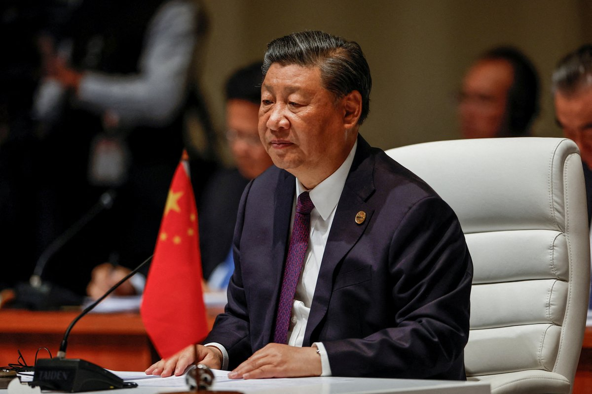
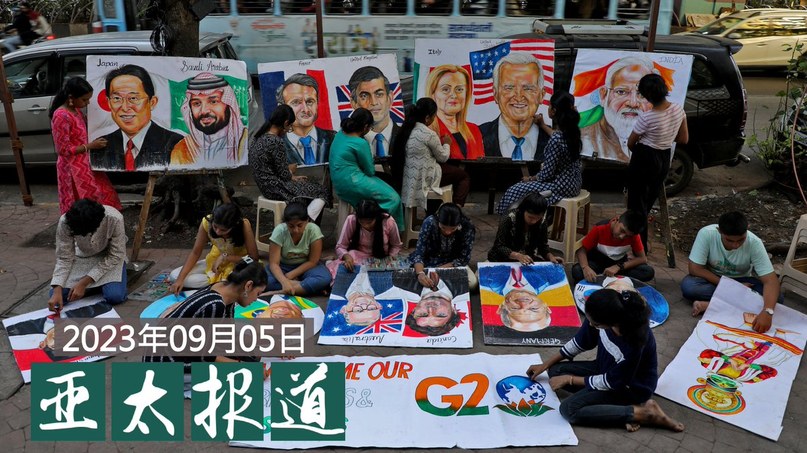
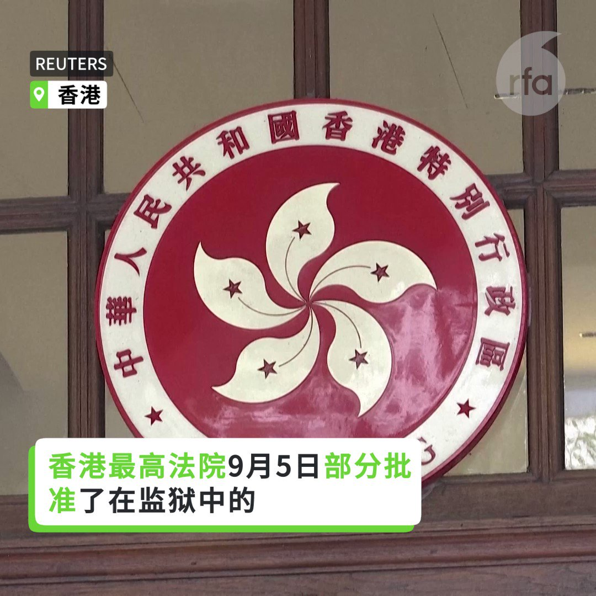
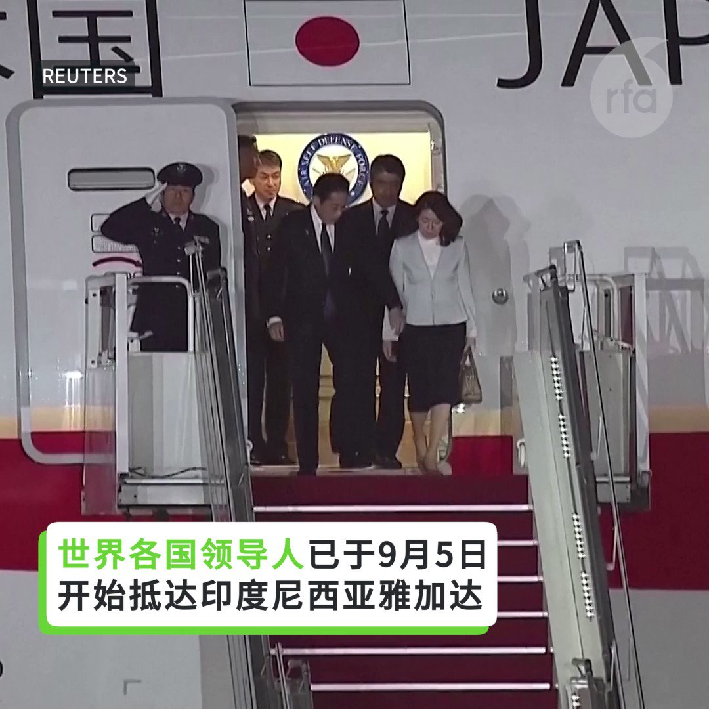

自由亚洲电台 北京时间 2023-09-06T22:09:26Z 1699424572443893934 RT @RFA_Chinese: 【都来了！】
世界各国领导人已于9月5日开始抵达雅加达出席东盟领导人峰会，中国国务院总理李强出席峰会，中国的新版“#十段线”地图再次成热点。 https://t.co/vnnPo9BEdv   自由亚洲电台 北京时间 2023-09-06T22:58:33Z 1699436931812306971 中国一直强调，在 #福岛核废水排放 问题上，中国会切实维护人民健康，不过，日本媒体报道，日本政府曾就 #核废水排海 向中国政府建议加入 #国际原子能机构（IAEA）的评估机制，却被中方拒绝。 有专业人士批评北京以政治凌驾科学。

 https://t.co/AXhRJuRCDr   自由亚洲电台 北京时间 2023-09-06T20:09:51Z 1699394479013445882 RT @RFA_Chinese: 【从抗争到白纸 为自由而舞】
#白纸运动 在中国迅速烟灭灰烬，火苗持续在墙外迸出新火花，台湾独立编舞家 #张可扬 将白纸革命转化为当代舞蹈，透过反抗的身体，传达新世代的反思。90后的他不断透过舞蹈创作为社会、政治议题发声，从香港抗争、新疆人权，…   自由亚洲电台 北京时间 2023-09-06T16:39:06Z 1699341440709726244 【日经：习近平在北戴河会议遭元老斥责】
【分析：元老遭看管妄议中央难度高】
“#日经亚洲”(Nikkei Asia)社论撰稿人中泽克二发文称，中国领导人 #习近平 在今夏 #北戴河会议，因国家方向而受到元老们的斥责。有分析认为，习近平从金砖会议返国直奔新疆，大谈“维护社会稳定”可以看出端倪；另一方面，也有评论认为，中共元老们已经被严加看管，不可能有机会聚在一起 #妄议中央。
https://t.co/nucxEhaGoL   自由亚洲电台 北京时间 2023-09-06T13:43:41Z 1699297295572099179 【台风海葵登陆福建】
【福州福清永泰闽侯暴雨成灾】
台风 #海葵 周二清晨5時20分在 #福建 東山登陸后，於上午6時45分在廣東省饒平縣沿海再次登陸。造成多地持續暴雨。#福清、永泰、闽侯等县市的24小时降雨量超300毫米，达到特大暴雨量级。
#福州 市永泰县消防大队一辆消防车出勤救援途中，在塘前乡赤鲤村被洪水冲走，有4人失联。   自由亚洲电台 北京时间 2023-09-06T10:37:53Z 1699250536632238386 RT @RFA_Chinese: 【#您怎么看】… https://t.co/zCCSX44tUa   自由亚洲电台 北京时间 2023-09-06T04:39:40Z 1699160391857946876 据中国财经媒体“东方财富网”披露，中国A股市场今年头八个月宣布退市的企业有44家，已经接近去年全年的数量（46）。尤其是近两个月，宣布7月摘牌的有20家，八月也有7家。
 https://t.co/jaD0ERdIDj   自由亚洲电台 北京时间 2023-09-06T07:00:09Z 1699195745340109298 【#亚太报道（2023-9-5）】
欢迎收听和订阅播客【亚太报道】 https://t.co/MjLNSvVMqc

#李强 出席 #东盟峰会 / #习近平缺席G20 / 发改委为民营经济设“局” / 《#治安管理处罚法》入罪“#损害民族感情” / 调查发现 #中国碳排放 污染严重 https://t.co/hZab6AIHAd   自由亚洲电台 北京时间 2023-09-06T04:42:29Z 1699161097188917256 加拿大警方正在调查 #加拿大皇家空军 顶级飞行员涉嫌与其他北约成员国的前军事飞行员，#培训中国空军飞行员 的事件。
  https://t.co/eXF8Tpxwhg   自由亚洲电台 北京时间 2023-09-06T02:32:22Z 1699128355239366676 【#您怎么看】
近日，抖音拥有粉丝1200万的主播“秀才”账号被封。“秀才”被称“中老年女性收割机”，是短视频领域的“顶流”网红博主。有网友根据其表演风格，提炼了几个关键词：惊讶、羞涩笑、握拳捂嘴、放下手、舔唇笑、挑眉、歪头笑。还有网友概括为，“秀才三件套”是吐舌、拳头捂嘴、摸头发。这被年轻人“看不上”的“浮夸造作式”表演却深受中老年女性欢迎。
您分析，“秀才”为何在中国爆火？   自由亚洲电台 北京时间 2023-09-06T02:48:22Z 1699132379691114870 路透社本周二引述多位消息人士披露，中国政府即将推出一项新的投资基金，目标是募集高达3000亿元人民币资金投入 #半导体产业。
 https://t.co/zcfnSCqtKB   自由亚洲电台 北京时间 2023-09-06T03:02:31Z 1699135940659421521 【里程碑！香港终审法院裁定承认同性民事结合】
香港终审法院9月5日裁定，政府应承认包括“民事结合”（civil union）等同性伴侣关系。尽管终院仍未授予 #同性伴侣 完整婚姻权利，香港LGBTQ族群仍将此视为部分胜利。 https://t.co/yYaYXYsgJh   自由亚洲电台 北京时间 2023-09-06T03:30:09Z 1699142895943704924 【#变态辣椒：引发紧张关系的地图】
中国最新版本的 #领土地图 引起印度、印度尼西亚、马来西亚、菲律宾、台湾和越南的强烈不满，该地图在有争议的南中国海划定了新的边界，远至这些邻国声称拥有主权的海域。 https://t.co/NPf3KMf2VW   自由亚洲电台 北京时间 2023-09-06T03:34:30Z 1699143989482364961 评论 | #陈光诚 @iguangcheng：看受中共挑动被允许作恶的奴民丑恶表演
 https://t.co/OvX1z71Onr   自由亚洲电台 北京时间 2023-09-06T04:09:10Z 1699152714373235030 本周二（5日），中国总理 #李强 抵达印度尼西亚，出席 #东盟 系列会议。
美国方面，则由副总统 #贺锦丽（又译哈里斯）出席东盟和东亚峰会。
那么，围绕 #中国新版地图 及南海主权争议，本届东盟峰会将出现哪些热点？美中两国在印太地区的竞争又会呈现怎样的趋势呢？ https://t.co/kzo7U1KnnE   自由亚洲电台 北京时间 2023-09-06T04:16:56Z 1699154668268781571 【都来了！】
世界各国领导人已于9月5日开始抵达雅加达出席东盟领导人峰会，中国国务院总理李强出席峰会，中国的新版“#十段线”地图再次成热点。 https://t.co/vnnPo9BEdv   自由亚洲电台 北京时间 2023-09-06T00:30:46Z 1699097753484435845 有网民呼吁别送孩子参加 #军训夏令营，因为“后劲太大”：
“有网友说孩子军训回来以后，天天玩手机，如果父母说他两句，他指父母侮辱军人，有小学生回家后和同学吵架，都不愿意老师调解，非上军事法庭，他们在高铁站，要走军人专属通道，去医院也不去儿科，非去解放军总医院.”
 https://t.co/9SbCvw29IA   自由亚洲电台 北京时间 2023-09-06T00:32:34Z 1699098206771282274 近日，中国全国人大就《#治安管理处罚法（修订草案）》公开向社会征求意见。该草案有关严禁"#伤害中华民族精神和感情的物品或言论"等内容，引发民间舆论热议。
“谁来界定？一个人受伤就算，还是得十亿人？谁来定义有损？”

 https://t.co/5qKlkPQ7VY   自由亚洲电台 北京时间 2023-09-06T01:11:17Z 1699107947421524096 据本台英语组报道，总部位于伦敦的全球能源研究机构安珀（Ember）本周二发布的最新报告显示，中国目前仍是全世界 #污染 最严重的国家之一，在2015至2022年间，中国的 #人均煤电二氧化碳排放量 增加了30%。

 https://t.co/3SXDdIjJKQ   自由亚洲电台 北京时间 2023-09-06T01:38:36Z 1699114821608956419 中国官方日前宣布，总理李强将出席在印度新德里举行的二十国集团（G20) 领导人峰会。而中共领导人 #习近平 与俄罗斯总统 #普京 将共同缺席本届峰会。那么，习近平的姿态是否意味着中国的外交重心正在发生转变呢？

 https://t.co/7adgE2dQCc   自由亚洲电台 北京时间 2023-09-06T02:14:23Z 1699123828390256646 中国对 #东盟（ASEAN）国家的月度出口额已经飙升至接近6000亿美元，这是依据汇丰银行编制的12个月移动平均指标，这个数额已经超过了美国和欧盟。
 专家指出，对东南亚出口上升也证实了 #全球产业链重组，越来越多中国零部件出口到东南亚组装，然后再出口到世界其他地方。
  https://t.co/FPznprJTKR   自由亚洲电台 北京时间 2023-09-06T02:19:08Z 1699125023624290351 专栏 | #有问有答：挑战跨境迫害：海外华人营救人权律师 #卢思位
 https://t.co/NZ9vq4C7dd   自由亚洲电台 北京时间 2023-09-06T00:06:10Z 1699091562180059391 民主党主席罗健熙透露，为了举办晚宴，上月曾先后向香港接近60家餐馆发电邮，其中超过10家一度愿意承办，直到晚宴临近，才突然以奇怪原因，甚至不提原因而拒绝提供场地。
背后有什么蹊跷？ https://t.co/PAZjM2uDwJ   自由亚洲电台 北京时间 2023-09-06T00:09:55Z 1699092506275705321 有网民在抖音发视频，呼吁家长不要送孩子参加 #军训夏令营，因为“后劲太大”：
“孩子参加14天夏令营后，见到到父母就要200元，说是和战友聚一聚，而这不是个例，有网友说孩子军训回来以后，天天玩手机，如果父母说他两句，他指父母侮辱军人，甚至有小学生回家后和同学吵架，都不愿意老师调解，非要上军事法庭才行，他们在高铁站，要走军人专属通道，去医院也不去儿科，非要去解放军总医院......”
https://t.co/Rj32ofGVFE   