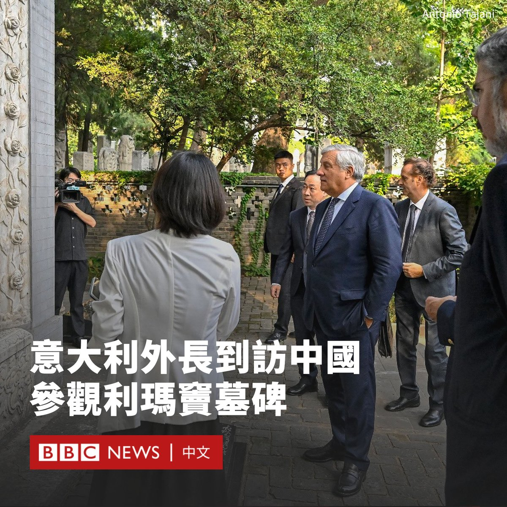
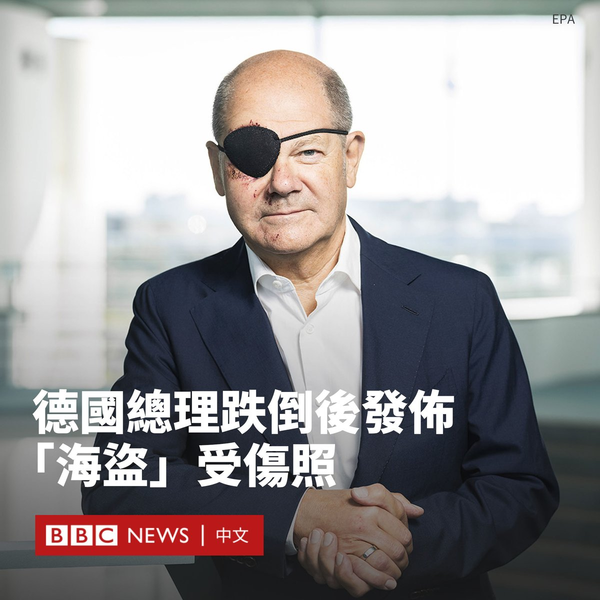

D英国广播公司BBC 北京时间 2023-09-05T20:49:25Z 1699042047460884493 中国中部山西省的一段长城遭到严重破坏。警方称，有两名建筑工人涉嫌为节省施工路程而使用挖掘机破坏长城，他们被刑事拘留。

被破坏的“三十二长城”是明长城的一段，位于山西省右玉县的一座山上。

警方表示，两名嫌疑人用挖掘机将古长城原有豁口开挖成一个大缺口，以便于挖掘机从该缺口处通行。

警方表示，该行为对长城的完整性和文物安全造成了“不可逆的破坏”。该案件正在进一步调查中。

两名嫌犯分别是38岁的男子和55岁的女子。

据报导，“三十二长城”有现存较完整的边墙和烽火台，属于省级文物保护单位。警方于8月24日接到报警，称长城上出现了一个巨大的缺口。

长城始建于2700多年前的春秋战国时期，在不断的翻修和重建后，目前遗留的长城遗迹主要是500多年前的明代修建的，因此被称为明长城。   D英国广播公司BBC 北京时间 2023-09-05T17:50:58Z 1698997138326430189 意大利副总理兼外长安东尼奥·塔亚尼（Antonio Tajani）访问中国，周日（9月3日）在北京访问了意大利传教士利玛窦（Matteo Ricci）的墓碑。

塔亚尼写道：“我参观了纪念传教士和学者利玛窦神父的石碑，向这位伟大的意大利人致敬，他前往中国拉近了我们两国人民和文化之间的距离。”

利玛窦是16世纪天主教耶稣会的传教士，在明神宗万历年间前往明朝，是中国最早的传教士之一。他广交中国士大夫，传播西方自然科学知识。

他在1610年病逝于北京，享年58岁，其墓碑位于现中共北京市委党校内。

教宗方济各在2022年批准新法令，宣布利玛窦为“可敬者”。

在意大利政府释放退出中国“一带一路”项目的信号之际，塔亚尼此次访华受到外界关注。

在塔亚尼与中共中央政治局委员兼外交部长王毅会晤后，中国外交部发文称，王毅“高度评价”两国各领域的合作成果。

“过去5年，中意贸易额从500亿美元增长至近800亿美元，意大利对华出口增长约30%……各类意大利优质商品走进中国千家万户。”中国外交部援引王毅的话说。

2019年，意大利与中国签署了“一带一路”协议，成为唯一加入该倡议的西方大国，该协议将于2024年3月到期，现在执政的梅洛尼（Giorgia Meloni）政府对续签该协议并不积极。

“‘一带一路’没有带来我们预期的结果。”塔亚尼在启程前往中国之前说道。“我们必须进行评估，议会将决定是否续签该协议。”

在王毅与塔亚尼会晤的新闻稿中，王毅强调双方“共建‘一带一路’合作硕果累累”。他称，中方愿同意方坚持开放共赢，推动中意全面战略伙伴关系实现更大发展。

塔亚尼在X（推特）上写道：“我们与王毅外长讨论了如何合作应对当前的国际形势，特别是非洲的稳定与发展。在乌克兰问题上，我鼓励中国利用影响力实现公正和平。”   D英国广播公司BBC 北京时间 2023-09-05T16:20:37Z 1698974402929668368 中国香港终审法院周二（9月5日）就一项涉及海外同性婚姻的上诉作出裁决，认定香港法律在不允许同性婚姻的同时，亦未提供任何替代途径来承认同性伴侣关系，属于侵害人权行为。

2013年在纽约与同性伴侣结婚的香港前“民间人权阵线”召集人岑子杰在2018年提出司法覆核，指责不承认同性婚姻的香港法律有违香港《基本法》中的“平等权利”。

但他的案件此前遭到高等法院驳回。原审法官认为，《基本法》中规定的婚姻自由只适用于男女之间的婚姻。

终审法院认定，政府并未履行其“积极义务”确立替代框架，让同性伴侣关系获法律承认，以免令他们觉得自己低人一等，这侵犯了原告根据《香港人权法案》享有的权利。

不过，法院否决了岑子杰的另外两项法律挑战，包括质疑香港将同性伴侣排除在婚姻制度之外是否违宪，以及不承认外地同性婚姻是否违宪。

香港婚姻平权协会在一份声明中称，该裁决是一次“重要的胜利”和“迈进一大步”，呼吁政府尽快制定一个健全制度承认同性伴侣的法律地位。

36岁的岑子杰是一名知名活动人士。他因参加2020年的立法会民主派非官方初选，涉嫌中国《香港国安法》下的串谋颠覆国家政权罪而被收押。他此前已认罪。   D英国广播公司BBC 北京时间 2023-09-05T11:11:06Z 1698896509410955645 中国过去的惊人增长由基建所推动，从道路、桥梁、火车线到机场和楼房，无所不包，但一些经济学家认为，随着基建的饱和，中国需要另辟为民众创造繁荣的方式。

虽然西方经济体倾向于通过消费拉动经济，北京却认为消费主义是一种浪费。习近平想要增长，但不是为了增长而增长。https://t.co/I2i41sc97E   D英国广播公司BBC 北京时间 2023-09-05T12:37:03Z 1698918140749676572 苹果计划于9月12日发布新的iPhone，预计其充电接口将改为USB-C制式。

与包括三星在内的竞争对手不同，iPhone手机目前使用其专有的Lightning适配器。

但欧盟法律要求手机制造商需在2024年12月前转为采用统一的充电接口，以降低消费者花销并减少浪费。

大多数苹果新产品，如最新的iPad，已开始使用USB-C，但苹果公司反对欧盟的规定。

苹果公司的一位代表此前表示：“只强制要求一种接口的严格监管扼杀了创新，而不是鼓励创新，这反过来会伤害欧洲和世界各地的消费者。”

鉴于目前的iPhone 14很可能是最后一款采用Lightning接口的苹果手机设备，这可能标志着以后将不再需要Lightning转USB-C适配器——它在苹果商店的零售价为19英镑。

目前尚不清楚这一产品的改变是否会用于苹果在其他地区的产品，但分析人士认为这家科技巨头不太可能单独为欧洲市场生产不同版本的手机。

欧盟的统一充电接口规定涵盖了一系列电子产品，包括手机、平板电脑、键盘、麦克风、耳机和数码相机等。

欧盟称，这将为消费者“每年节省高达2.5亿欧元购买不必要的充电器的费用”，并在每年减少11,000吨垃圾。

预计新款iPhone 15和iPhone 15 Pro将于下周在苹果公司的秋季发布会上亮相。   D英国广播公司BBC 北京时间 2023-09-05T14:15:44Z 1698942975315783870 据美国官员透露，朝鲜领导人金正恩可能在本月前往俄罗斯与普京总统会晤。两位领导人将讨论朝鲜是否有可能向莫斯科提供武器，以支持其在乌克兰的战争。https://t.co/u4LPB1x1vq   D英国广播公司BBC 北京时间 2023-09-05T09:33:05Z 1698871843200102755 德国总理肖尔茨（Olaf Scholz）在慢跑时摔倒受伤，他发布了一张自己戴着黑色眼罩的照片。

该事件发生在上周六（9月2日），当时肖尔茨正在距柏林不远的城市波茨坦的家附近锻炼。

在摔倒后，他取消参加周日的助选活动，但本周行程不会受影响，包括在未来几日发表多次公开演讲。

肖尔茨在X（推特）上的一篇帖子中写道：“实际情况比看起来要好”。

他的伤势并不严重，但照片显示他的眼睛周围、鼻子和下巴都有淤青。

他的发言人表示，总理“心情很好”，但看起来明显有伤，肖尔茨发布了这张照片，以使人们可以习惯他在未来几周的样子。

肖尔茨还在帖子中调侃称，他“期待看到表情包”。

肖尔茨的照片在德国引发关注，有人留言祝愿他早日康复。网友还制作了很多表情包，包括把他戴眼罩的形象改编成挥舞着弯刀的海盗造型。   