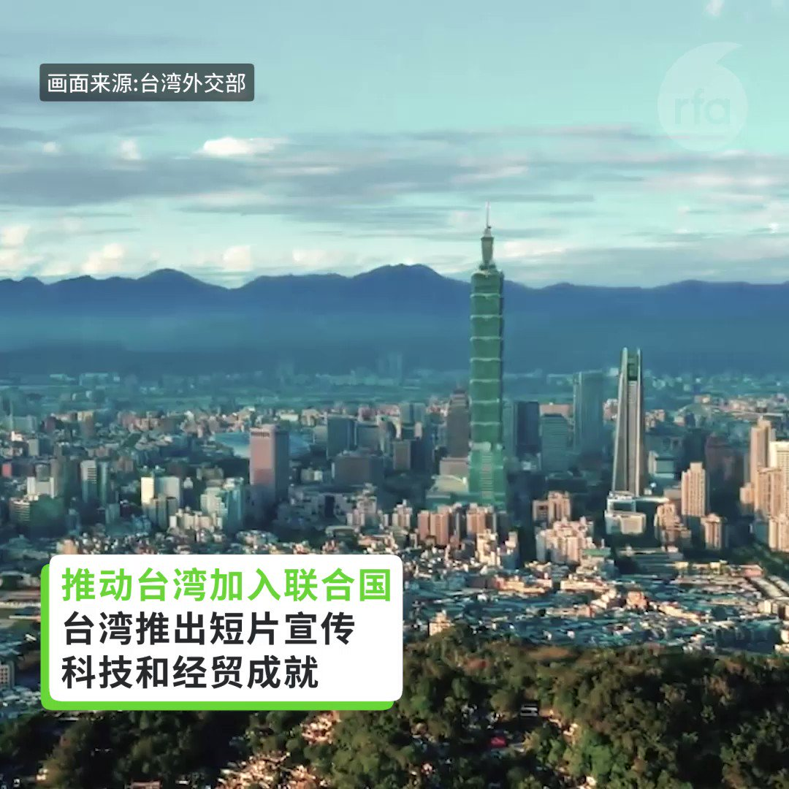
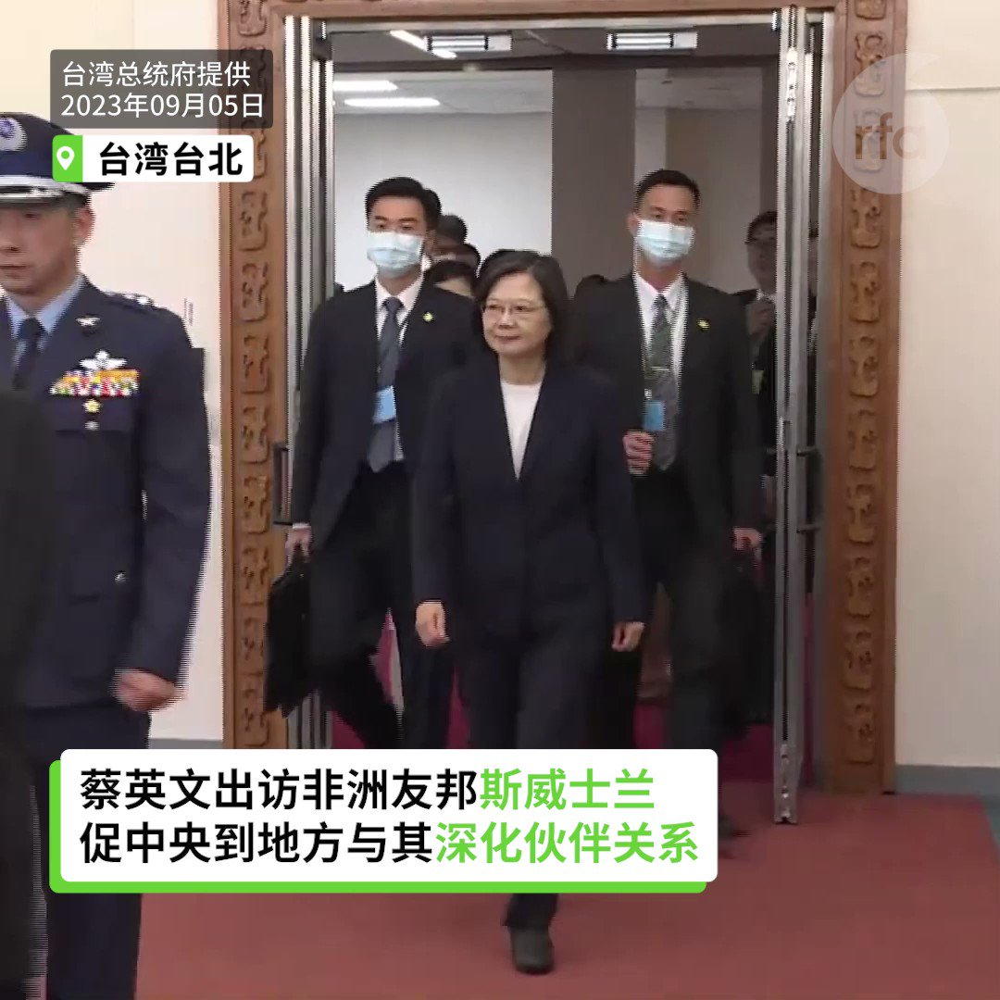
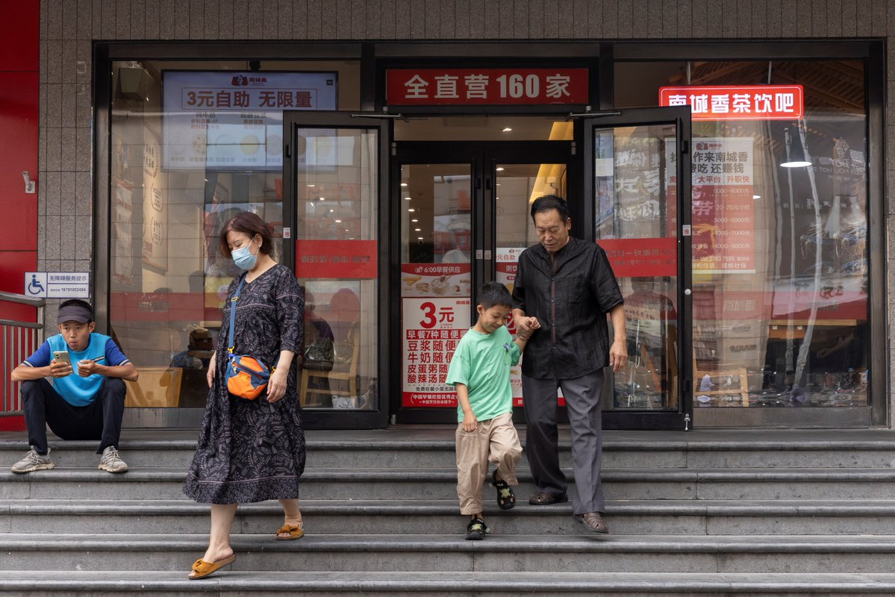
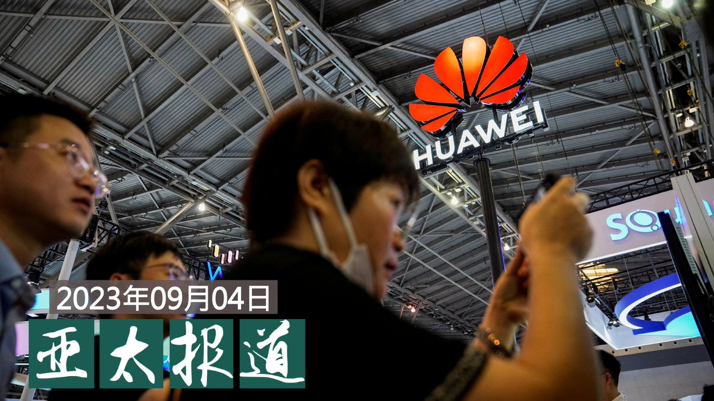
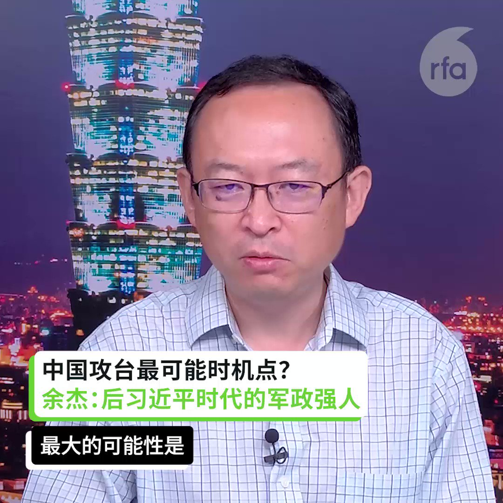

自由亚洲电台 北京时间 2023-09-05T22:44:26Z 1699070994047193289 中国经济近期持续下行，引发多地 #民众维权抗议。有评论认为，伴随房企爆雷、公务员欠薪、教师罢课等事件频发，当局的维稳成本也在升高。

 https://t.co/aB9VnZO5FD   自由亚洲电台 北京时间 2023-09-05T22:16:46Z 1699064031116718309 RT @RFA_Chinese: #澳大利亚藏人 周一（4日）向澳大利亚国会议员游说六大诉求，包括以马格尼茨基法制裁侵害西藏的中国人权官员、保护 #达赖喇嘛转世 传承、禁止进口来自西藏的强制劳动产品等，并要求即将出席二十国峰会（G20）的澳大利亚总理能公开呼吁关注 #藏族学童遭…   自由亚洲电台 北京时间 2023-09-05T18:50:08Z 1699012028030197788 【联合国大会开议 台湾续推动参与联合国】
【台诉求正确理解2758号决议：与台湾无关】
【中国外交部花4分钟长篇累牍反驳】

#台湾 今年推动 #参与联合国 的活动，强调“联合国长期屈服中国压力错误解读联大 #2758号决议”，“联大第2758号决议与台湾无关，也没有授权中华人民共和国在联合国体系代表台湾。#两岸互不隶属 是台海的客观现状，也是无可否认的事实，只有台湾民选政府才能在联合国体系代表台湾人民。台湾呼吁解决台湾2300万人被排除在联合国体系外的问题。
除了发布文宣影片，台湾外交部长 #吴钊燮 也在联大5日开会前，投书日、韩等各国媒体，呼吁为解决全球规模的课题及维护国际社会和平及稳定，应支持台湾参与联合国及其专门机构。让台湾有意义地参与联合国，让中国意识到全球问责的决心不容质疑。
中国外交部发言人 #毛宁 则是在5日的新闻发布会中，以长达4分钟的回答，朗读事先准备好的说辞，反驳台湾就2758号决议提出的说法。
在这之前，美国联邦众议院于7月25日，通过“#台湾国际团结法案”（Taiwan International Solidarity Act），法案强调，联合国大会2758号决议仅处理 #中国代表权 问题，不涉及台湾。   自由亚洲电台 北京时间 2023-09-05T12:29:13Z 1698916168550306233 【蔡英文启程访问台湾非洲友邦史瓦帝尼】
台湾的 #蔡英文 总统5日清晨启程前往非洲唯一友邦 #史瓦帝尼（又称 #斯威士兰），进行4天3夜的访问。今年是双方建交55周年，也是史瓦帝尼王国独立建国55周年。此行设下“同庆两国邦谊”和“促进永续合作”两个目标。

https://t.co/bnvrML16W9 https://t.co/rRnsnPvpAT   自由亚洲电台 北京时间 2023-09-05T13:19:34Z 1698928841312661989 【中国发改委为民营经济设局】
【评论：管控太多恐使经济失去活力】
中国国家发改委近期将设立“#民营经济发展局”。官方解释是为“促进民营经济发展壮大”。不过评论认为，管控太多恐怕使民营经济失去活力。日前广州一家民营餐厅因出售的盒饭低于13元遭到罚款，被网民批评。详细报道：https://t.co/tWJ47PAWZQ   自由亚洲电台 北京时间 2023-09-05T08:14:44Z 1698852126259392830 #东京电力 #福岛 第一核电站处理水排放入海开始后，疑似从中国等地打到县内的骚扰电话合计约有9200通。其中，市町村政府合计接到了约3000通骚扰电话，学校和团体合计约为2500通。县政府总机截至9月4日早晨约为3700通。 https://t.co/KFHQc6eggw   自由亚洲电台 北京时间 2023-09-05T08:34:46Z 1698857167913414958 【#亚太报道（2023-9-4）】
欢迎收听和订阅播客【亚太报道】 https://t.co/MjLNSvVMqc

#中国新地图 引发多国抗议 / 意大利外长访华 / #华为 新手机引发热议 / 澳洲藏人提六大诉求 / 台湾军人参与美国民卫队演练 / #世界香港论坛 多伦多闭幕 https://t.co/Gzrj2hdkWN   自由亚洲电台 北京时间 2023-09-05T02:39:45Z 1698767823441662101 全球二十五个国家超过五十位议员日前齐集布拉格，参与一连两日的“#对华政策跨国议会联盟”（Inter-Parliamentary Alliance on China，IPAC）年度会议，并宣布加入新成员的好消息─菲律宾，肯尼亚和巴拉圭三个国家，各有两位议员加入联盟。 https://t.co/R65k5maklu   自由亚洲电台 北京时间 2023-09-05T02:49:01Z 1698770154933690454 中国外交部发言人 #毛宁 在本周一的例行记者会上，多次回避媒体询问 #习近平缺席二十国集团峰会 的原因。毛宁仅表示，“二十国集团是国际经济合作主要论坛，中方历来高度重视并积极参与相关活动。”

 https://t.co/cggQxkX6Hr   自由亚洲电台 北京时间 2023-09-05T03:03:19Z 1698773755005383087 第二届 #世界香港论坛于 9月1日至3日在多伦多举行，邀请了来自全球各地二十多名讲者，包括香港前立法会议员 #许智峰、前铜锣湾书店负责人 #林荣基、中国民运人士王丹、香港壹传媒前董事祈福德(Mark Clifford)、国殇之柱创作者高志活(Jens Galschiøt)等人。

 https://t.co/quuwdQ9r5F   自由亚洲电台 北京时间 2023-09-05T03:53:27Z 1698786373275398622 专栏 | #夜话中南海：贵州省委前书记 #孙志刚 突然被查的前因后果
 https://t.co/TfpOSfOJTm   自由亚洲电台 北京时间 2023-09-05T00:27:36Z 1698734567514161561 #澳大利亚藏人 周一（4日）向澳大利亚国会议员游说六大诉求，包括以马格尼茨基法制裁侵害西藏的中国人权官员、保护 #达赖喇嘛转世 传承、禁止进口来自西藏的强制劳动产品等，并要求即将出席二十国峰会（G20）的澳大利亚总理能公开呼吁关注 #藏族学童遭强制寄宿 问题。 

 https://t.co/1ZmBkiAceN   自由亚洲电台 北京时间 2023-09-05T01:34:05Z 1698751299653980560 据日本媒体报导，台湾军队参加本月美国国民卫队主导的军演，而台湾的国防部对此即未否认也未证实。
台军事专家分析，#台军参与美方训练 不是第一次，但此次赴美参演人数提升至营级，规模更大。如果此次参与 #多国联合演习，等于创下先例。

 https://t.co/HPhcAKfdGU   自由亚洲电台 北京时间 2023-09-05T00:10:28Z 1698730255043948736 #意大利 为何要退“#一带一路”？
意大利退出是否会掀起骨牌效应？ https://t.co/jEOMG34JHV   自由亚洲电台 北京时间 2023-09-05T00:16:19Z 1698731729379323959 RT @RFA_Chinese: 【中国何时最可能攻台？】
【余杰：后习近平时代的夺权者】
【黃澎孝：中国民粹驱动战争不可小觑】
#亚洲很想聊 完整视频：https://t.co/eDVyhQhd4P https://t.co/d0lVQSE9Si   