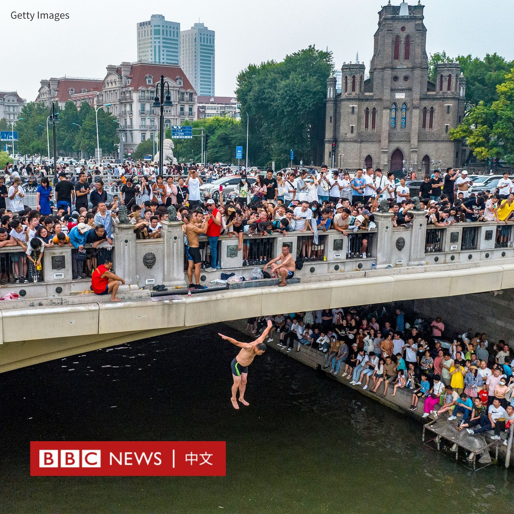
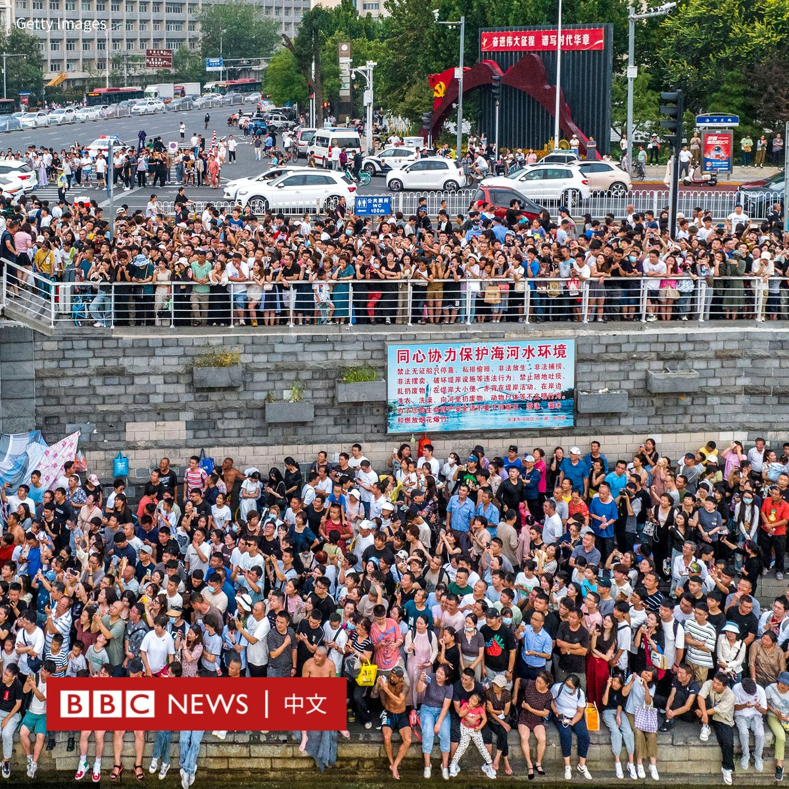
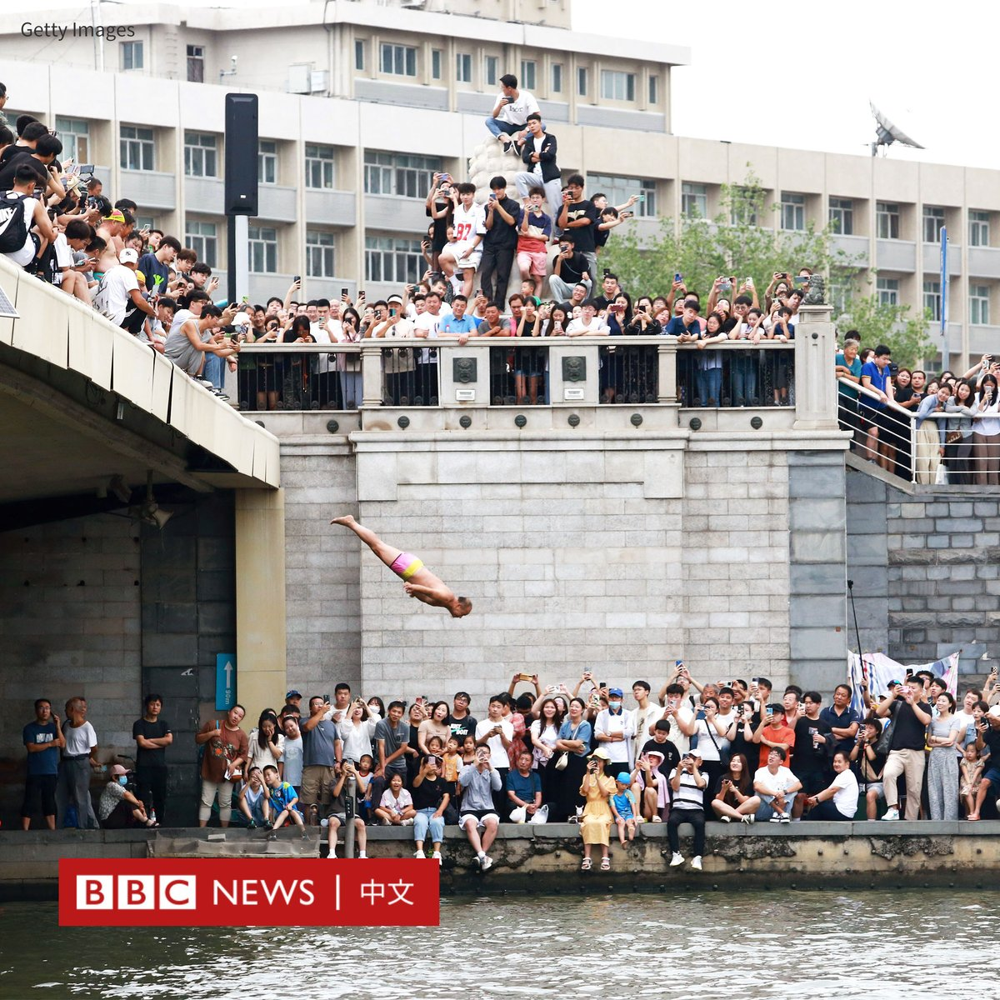
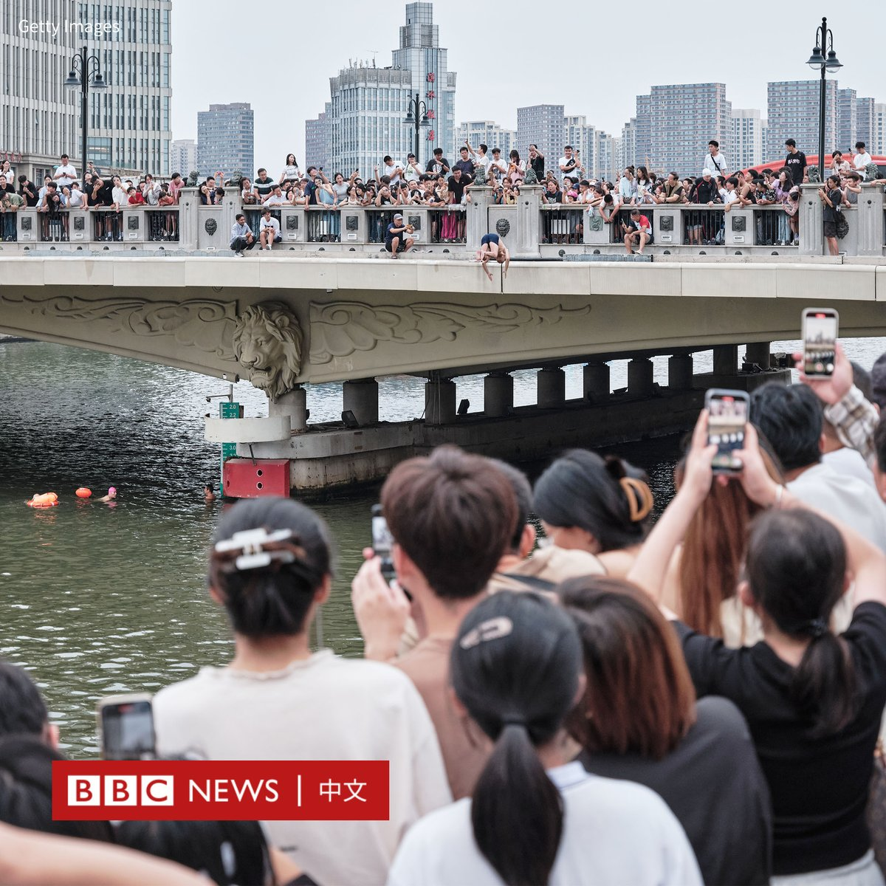
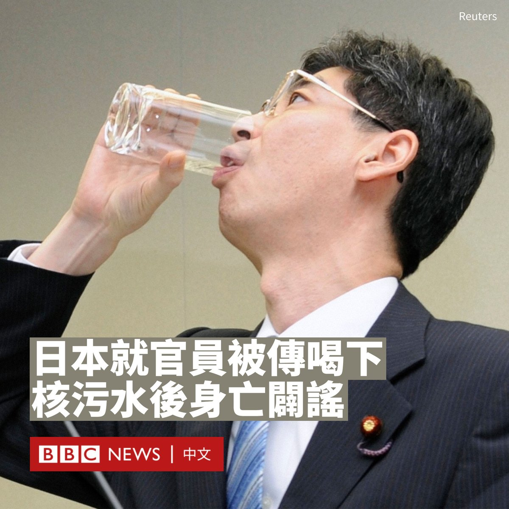
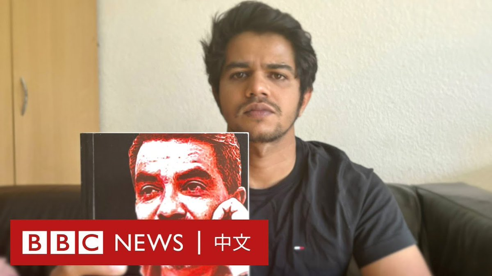

D英国广播公司BBC 北京时间 2023-09-04T15:14:46Z 1698595441297039408 【最新消息】中国外交部宣布，中国国家主席习近平将缺席9月9日至10日在印度新德里举行的二十国集团（G20）峰会，总理李强将率团赴会。这是习近平自2013年上任以来，首次缺席G20会议。 https://t.co/4neTwVwk30   D英国广播公司BBC 北京时间 2023-09-04T14:21:39Z 1698582074419192279 中国北方城市天津的一座大桥近日突然在社交网络上蹿红，原因是有很多跳水爱好者定期聚集在这座大桥上表演跳水。

横跨海河的狮子林桥位于天津市核心地带，长约百米，连接着南开区与河北区。

据中国媒体报道，很多大爷们穿着五颜六色的短裤站在桥边，在跳水前与周边游客“搞怪”互动，有的朗诵诗歌，有的高喊励志语，或倒立或比“耶”。

在抖音等社交媒体上，“天津大爷跳水”相关的影片广为流传。这里迅速成为新的明星景点，周边地区从早到晚都聚满了慕名而来的游客。

走红后，一些年轻人专门穿着泳衣来到这里“打卡”，在观众的掌声中纵身一跃。人们还在参与者中发现了北京奥运会跳水冠军何冲。

在微博上，狮子林桥被形容为天津的“8A级景点”。

不过，据官方媒体报道，由于许多参与者并没有跳水经验，当地政府呼吁参与者冷静。

据报道，当地部署了城市管理执法人员、交警和救援人员在现场巡逻。有志愿者警告，由于桥高六米，如果没有经验很容易受伤。

得益于社交媒体的推动，近年来中国有很多地方都出人意料地成为“打卡”点和拍照“圣地”。

今年上半年，山东小城淄博因烧烤而成为很多国内游客趋之若鹜的目的地。

河北秦皇岛一个十多年前还无人问津的地产项目阿那亚，在近年成为很多文艺青年的聚集地，甚至吸引了路易威登（Louis Vuitton）在那里举办时装秀。

在东南部小城福建霞浦，数以千计的游客和摄影师专程而来，只为拍摄头戴斗笠、牵着牛的农夫在灌木丛中择路而行的田园牧歌景象。   D英国广播公司BBC 北京时间 2023-09-04T11:58:15Z 1698545988057919832 在中国网络上广为流传日本一名曾喝下福岛经过滤的放射性污染水的官员死亡后，日本驻华大使馆周一（9月4日）称其“纯粹是谣言”。

2011年10月，日本时任内阁政务官园田康博在东京电力公司总部受访时，当着媒体记者的面将半杯号称是来自福岛第一核电站5号、6号机组的经过处理的核污染水一饮而尽。

但日本于上个月开始向大海排放核污染水后，园田康博的下落突然成为了中国网民关注的焦点。

由官媒《四川日报》主持的微博话题#日本官员喝下核污染水4年后隐退消失#登上热搜话题第一，《中国青年报》等官媒也转发报道，称他“没有再出现在公众面前”。

一些民间自媒体账号则发布了更加耸人听闻的内容。新浪网上的一篇8月29日发布的自媒体报道称：“破案了！12年前喝下核污水的日本官员已离世：骨髓癌、全身腐烂”。

日本驻华大使馆在微博的帖子里写道：“这纯粹是谣言。园田已于9月2日接受日本媒体采访，亲自辟谣。”

大使馆还附上了日本共同社的报道页面，内文称园田康博在9月2日接受了共同社电话采访。他表示，对于引发谣言传播，“我想再次向地震受害者和福岛县人民表示歉意”。

共同社报道称，园田当时在记者会上被部分记者追问“如果说对环境和健康没有影响，为何不喝呢”，所以才喝下核处理水。

日本于8月24日开始向太平洋排放经处理的核污染水。中国政府强烈反对该排放，并随即暂停进口来自日本全境的水产品。这也点燃了中国国内的“反日”情绪。

英国专门分析虚假信息的公司Logically在一份报告中称，自今年1月以来，中国政府和官方媒体一直在针对核污水排放开展协调一致的虚假信息宣传。

在日本排海计划开始后，许多恐慌的民众前往超市抢购食盐，一些餐馆甚至推出没有科学依据的“防辐射”套餐。   D英国广播公司BBC 北京时间 2023-09-04T09:07:40Z 1698503059893277072 “没有尸体，墓地里甚至没有可以献花的墓碑。”

13年前，哈里斯的父亲普拉杰斯于斯里兰卡总统大选的前两天，被报告失踪。普拉杰斯是一名记者和人权活动人士，斯里兰卡政府和军队否认与他的失踪有关。

哈里斯表示，他从未放弃寻找父亲的下落，只是“很遗憾从未对爸爸说过我爱你”。 https://t.co/T5mM3xPc3Y   