Petrichor 北京时间 2023-09-04T12:02:22Z 1698547022855393745 大家都不是傻子 https://t.co/ZOPAWZDtBF 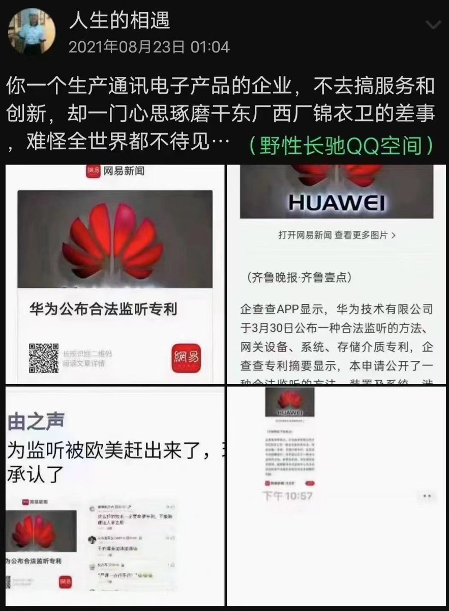  Petrichor 北京时间 2023-09-04T11:52:03Z 1698544429068439868 这个小女孩把刀郎的歌唱得有板有眼的，只是不知道她是否能理解歌词的真实含义。如果年纪轻轻就知道社会这么虚伪，不免过于残酷。我还是希望她唱着天真烂漫的儿歌，对未来充满憧憬。 https://t.co/RSqU1lqG5j   Petrichor 北京时间 2023-09-04T09:34:20Z 1698509769718284296 1. 发达国家里没有一个是马克思主义指导、共产党执政的社会主义国家。
2. 发达国家的国家领导人没有一个自称人民领袖、出版一百多本书，让自己人民学习的，搞个人崇拜的。
3.发达国家的百姓有言论自由、出版自由、集会自由的。
4. 发达国家的军队是国家的，不是某个政党的。
5.发达国家里没有政党是国家纳税人供养的。 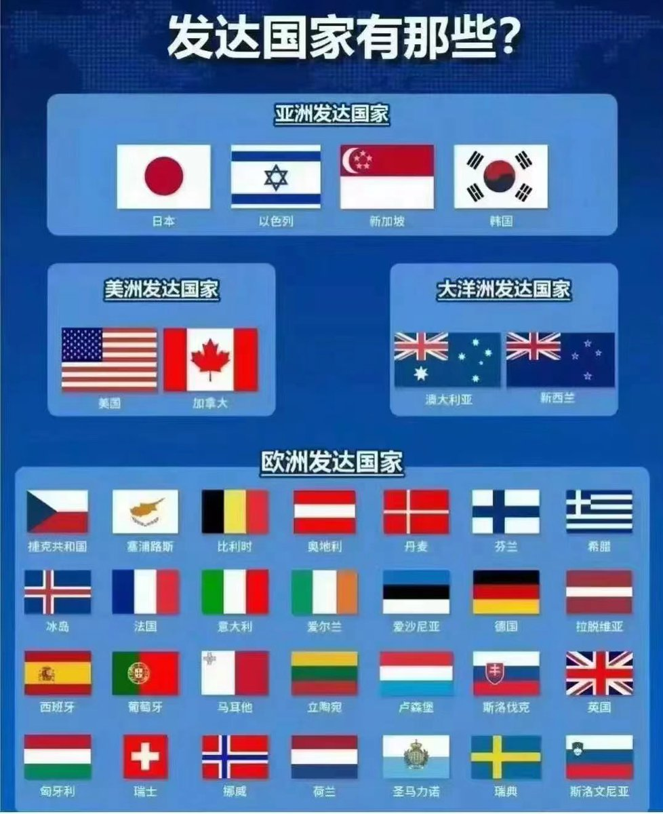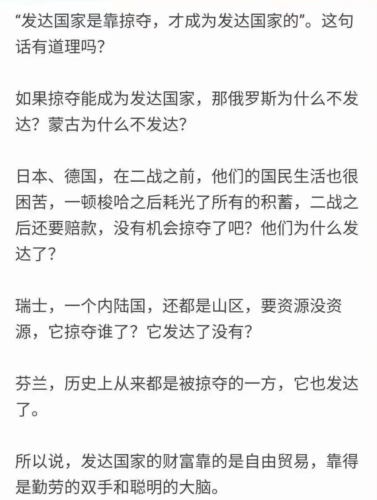  Petrichor 北京时间 2023-09-04T06:19:29Z 1698460735393734710 失去自由，方知道自由的宝贵。

李孟居出生于1972年，是台湾新竹人，是台湾的信达光电科技有限公司代表人、台湾屏东县枋寮乡乡政顾问。2019年8月20日，李孟居从香港入境深圳，见到中国解放军集结在边境，拍了一些照片发给台湾的朋友陈亚麟，后者把照片放到媒体。中国公安以“为境外刺探、非法提供国家秘密罪”逮捕李孟居，被央视广泛报道，称之为李孟居案件是台湾‘台独’势力干预香港事务的一个非常典型的行为。”2021年李孟居服刑期满，但需继续服“剥夺政治权利”的附加刑期，又逢疫情未能返台。在海内外引起广泛的寒蝉效应。 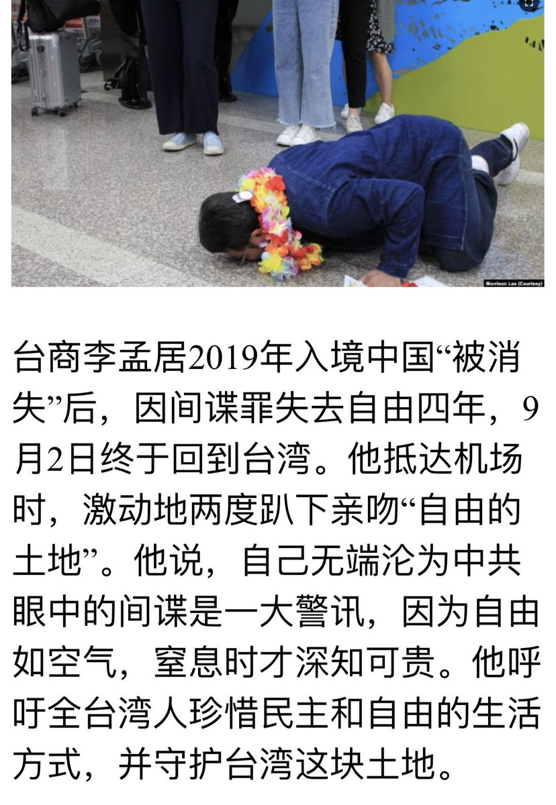  Petrichor 北京时间 2023-09-04T08:58:19Z 1698500705416335435 普京即使去中国访问，习近平也不会逮捕他，交国际法庭审判。中俄合作无上限，携手搞起百年未有之大变局。习近平若有雄才大略，现在是跟俄罗斯要侵占中国领土的好机会。 https://t.co/cOaDMFahoL 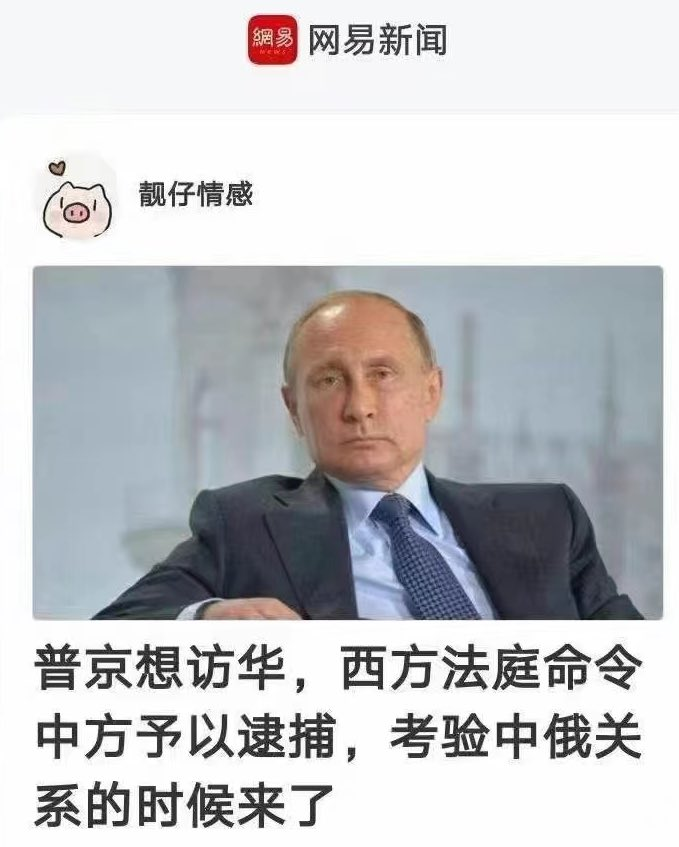  Petrichor 北京时间 2023-09-04T09:14:55Z 1698504884792816057 这平比那平，不是一个水平。 https://t.co/QcbJtLn2nB 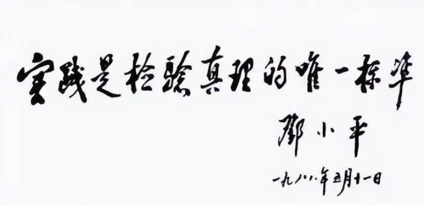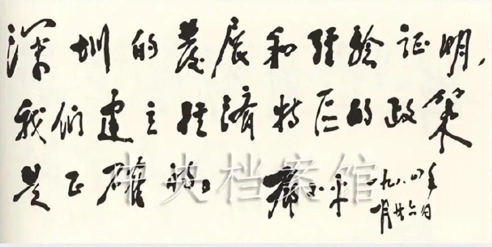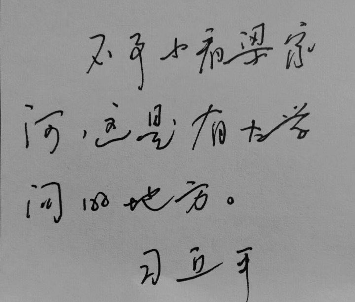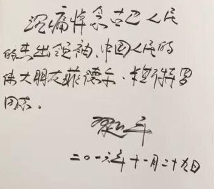  Petrichor 北京时间 2023-09-04T03:41:02Z 1698420859042406718 修车行的广告：馬上就滾。
滾當然是汽車輪子。 https://t.co/ANGhTusMh7 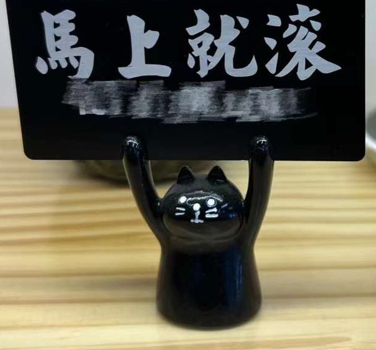  Petrichor 北京时间 2023-09-04T03:43:22Z 1698421444584079461 黃黃的燒餅，好吃 https://t.co/A8FLHYNilJ 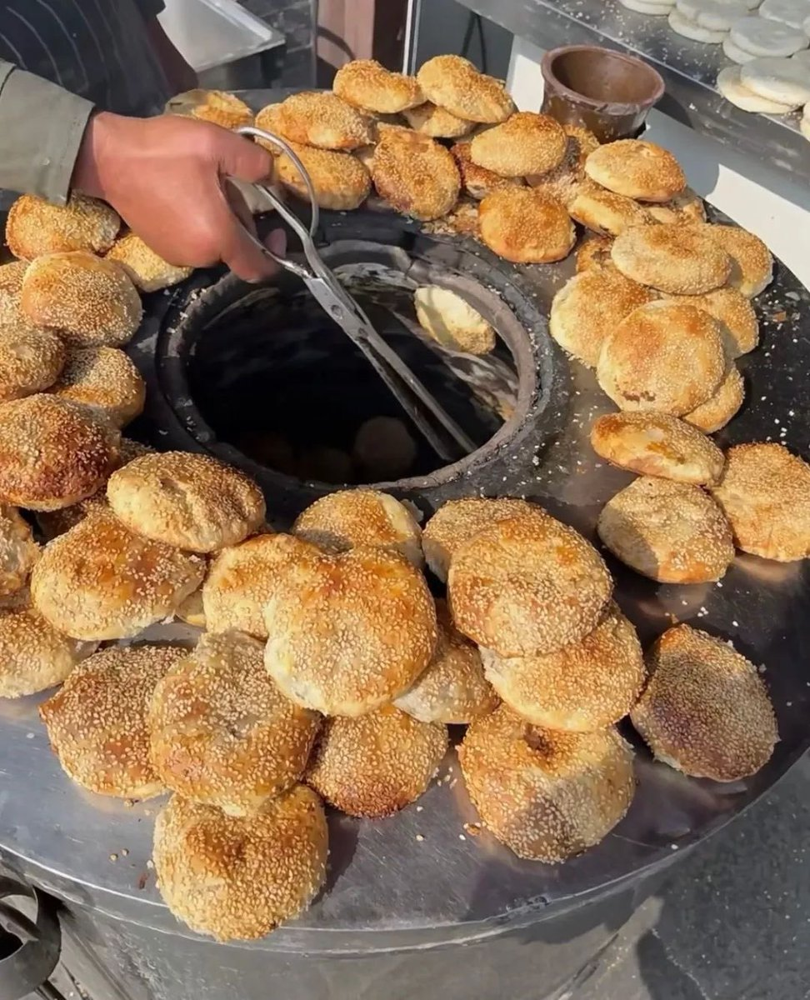  Petrichor 北京时间 2023-09-04T03:57:16Z 1698424944760107042 共产党国家经济为什么搞不好？东徳相比西德、朝鲜相比韩国，都说明这一点。现在通过这个视频，再增加些中国证据，证明共产党主政的社会主义国家里企业如何银行借债而肥了个人的，而这些个人又可能是极权家庭的白手套。企业从国有银行借钱，然后企业破产，亏空转移给百姓。这一切，没有人为之负责。从头到尾，没有法制，只有权钱交易。 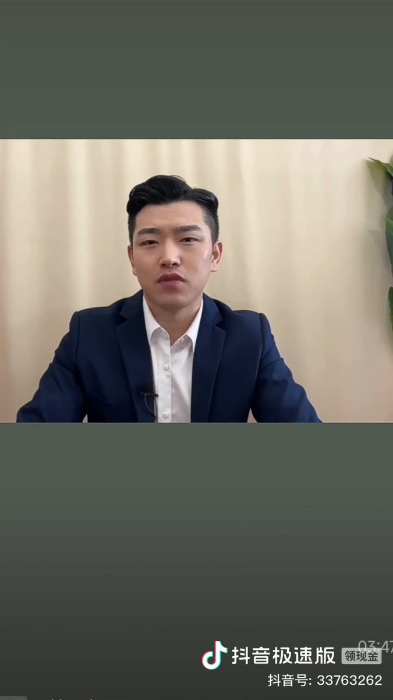  Petrichor 北京时间 2023-09-04T02:07:15Z 1698397256502640874 这个视频是否是华为以自媒体的名义为自己产品做虚假呢？打爱国牌销售技术不那么先进的产品？先不说华为这款手机用的是哪个国家的芯片、是否具有真正的5G功能？是否能躲避美国情报部门的跟踪？根据中国相关法律，中国企业和个人都有为国家搜集情报的义务，华为手机是否为中国国安留有后门？可以肯定欧洲国家领导人及世界商界领袖出于国家安全和商业秘密也绝不会使用华为手机。

小粉红太能自嗨了，全不凭事实。 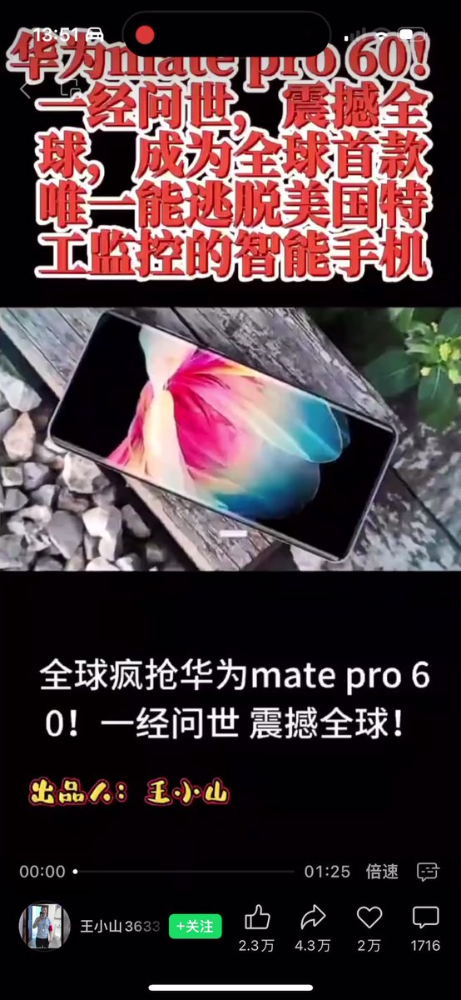  