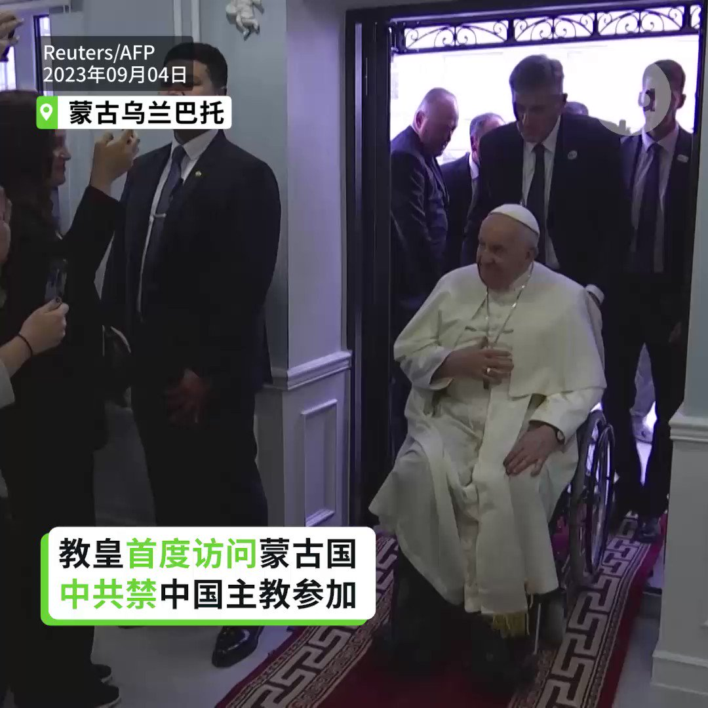

自由亚洲电台 北京时间 2023-09-04T15:37:17Z 1698601108183355862 【中国天主教徒泪喊想见教皇】
【流泪唱圣诗守候教皇座车致意】
教皇方济各在蒙古访问时，有中国教友无法进入会场，在户外守候，流泪唱圣诗向教皇致意。有人试图接近教皇，遭警察拦下。教皇周日弥撒结束时表示“对高尚的中国人民传达热情问候。”他并要求中国天主教徒要当“好基督徒和好公民”。他使用“好基督徒和好公民”的说法，是希望说服中共给予天主教徒较多自由有助国家社会经济进步时常用的说词。#教皇 #方济各   自由亚洲电台 北京时间 2023-09-04T06:38:36Z 1698465545136288158 结束了对中国访问的 #美国商务部长雷蒙多 本周日公开警告说，美国企业的在华营商耐心正“逐渐消失”。 https://t.co/U3MxbwUTpB   自由亚洲电台 北京时间 2023-09-04T06:39:37Z 1698465798593941548 据维权网发布的消息，中国公民记者张展9月2日在狱中度过40岁生日，但她的身体健康状况持续恶化。目前，张展的体重仅有37公斤，是她被捕之前的一半。 https://t.co/MjBhgCrKic   自由亚洲电台 北京时间 2023-09-04T06:39:55Z 1698465877866184863 据日本共同社9月3日报道，中国网络近日传言日本内阁府前政务官园田康博因在2011年10月喝下东京电力福岛第一核电站低浓度污染净化水后，已因癌症去世的消息。就此，园田康博接受电话采访辟谣。 https://t.co/BNzCpARVxE   自由亚洲电台 北京时间 2023-09-04T00:29:30Z 1698372658943996175 “#海葵”登陆台湾后强度减弱 中国东南遇双台风威胁https://t.co/m6fzqTzrkW   