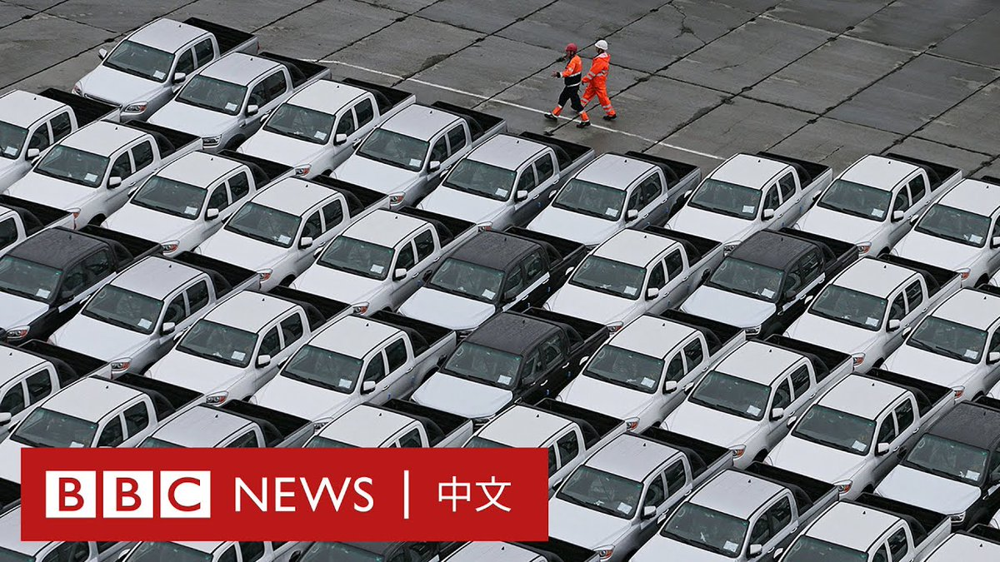

D英国广播公司BBC 北京时间 2023-09-03T19:26:37Z 1698296434439655821 俄罗斯外交官曾是普京团队的重要组成部分，他们协助解决了与中国和挪威的领土争端，领导与欧洲国家深化合作的会谈，并确保格鲁吉亚革命后的和平过渡。

随着莫斯科入侵乌克兰，俄罗斯的外交官开始机械地紧跟普京日益强调的反西方观点，甚至用侮辱性语言回应来自他国的批评。https://t.co/SeosreYHDO   D英国广播公司BBC 北京时间 2023-09-03T14:33:09Z 1698222580854132752 俄罗斯入侵乌克兰后，西方汽车品牌纷纷退出俄罗斯市场，促使中国制汽车在俄罗斯流行。数据显示，出口到俄罗斯的中国车从战前的7%市占率上升到现在几乎占据半壁江山。

一名参加莫斯科车展的中国品牌代表表示，十年前是中国手机成功打进外国市场的重要时刻，而“我们现在就在同样的历史性十字路口上”。 https://t.co/sLcaJczAhP   