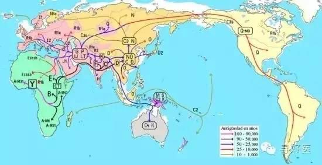

Petrichor 北京时间 2023-09-03T02:47:59Z 1698045119922933974 “和服”的字面意义为“大和民族的服装”，据说是唐朝是的吴服（江浙）传到日本的。体型好的女人穿着它到哪个国家，大家都觉得是美，除了一个特殊的国家，哪里相当一部分人憎恨和服，这些人有个特殊的名字：小粉红。
和服最凸出的特征是其交领右衽、方形剪裁、腋下开衩、材质厚重、穿著繁琐，带有浓厚又独立的大和民族风格。其女性礼服大多使用绘羽模样的装饰方式，可如同画一样水平展开，其纹样和色彩的设计均绚烂豪华，形成不对称之美感。这种纹样和世界其它国家的纹样大不相同，并非单纯的在大面积的衣料上使用同一种重复图案，也不是在衣物的边缘线上贴入卷曲的植物型花纹，而是将好几种纹样几何化、抽象化的纹样层层叠套，塑造出平面中的立体感。于此相对，使用重复图案装饰的布料称为小纹，是常见的女性便服材料；亦有男女通用的色无地（即纯色）和服，但男性往往使用绀色、茶色、灰色等素朴的颜色，而女性会使用相对较明亮的色系。   Petrichor 北京时间 2023-09-03T01:32:28Z 1698026114130608571 10万年前，地球处于冰川期，大部分陆地被冰川覆盖。整个海平面比现在低120米左右，许多海床裸露在地面。在东非，各个部落拥挤在这块炙热的土地上，抢夺着有限的食物。或许是频繁发生类似于现在的卢旺达种族清洗事件，一部分人开始走出非洲。

“又过了几千几万年，现代人在Y染色体基因突变M168基础上又出现了2个突变类型，M130和M89.前者发生在8万年前，后者发生在4万5千年前，人类已通过北非进入了欧亚大陆。”李辉说，最早出来的是棕色人。他们主要是在海边捕鱼为生，并捡食滩涂上的高蛋白食物。他们拿着旧石器和尖木叉，在印度洋岸边走着。公元5万年前，他们已占领了南亚和东南亚的陆地和岛屿。在之后的几万年里，散漫的捕捞捡食生活让他们沿着无边的海岸线，一路走到东亚，之后可能穿过白令海峡到达北美和南美洲。

黄种人走出非洲的时间要比棕色人晚了近5万年。但他们的扩散速度很快。他们只用了棕色人1/5的时间就到达东南亚。柯越海取样的1万2千个中国人的样本中有11311个样本在M89的位点上发生突变。而这个突变标记在黄种人到达东南亚时就已形成，并且一直在这里做了很长久的活动，之后他们将要进入中国，分化出现在的汉族。   